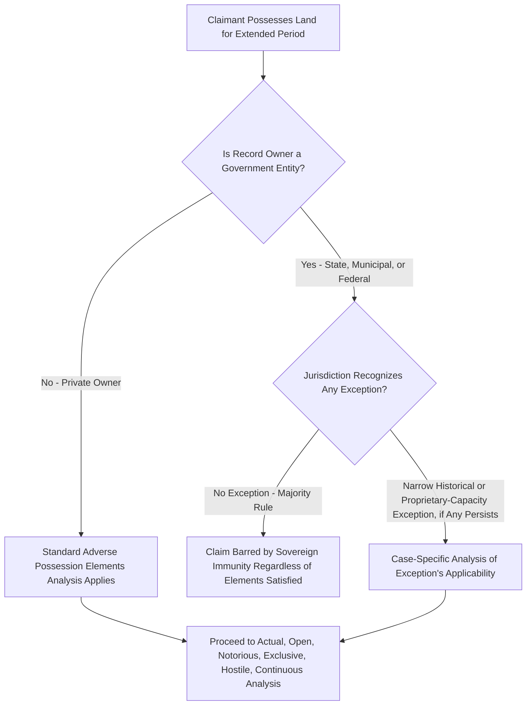

## Adverse Possession Against Government Land

### Overview

Adverse possession against government-owned land presents a fundamental doctrinal tension: the general common law rule is that adverse possession **cannot** run against sovereign or governmental land, a principle rooted in the maxim *nullum tempus occurrit regi* ("no time runs against the king") and codified through sovereign immunity doctrine. This immunity is nearly universal in American jurisdictions today, though its scope, exceptions, and historical development vary, and understanding it requires distinguishing between different categories of government land and different eras of American property law.

### The General Rule of Governmental Immunity

**Key Points**

- The overwhelming majority of U.S. states, by statute, explicitly exempt land owned by the state, its political subdivisions (counties, municipalities), and the federal government from adverse possession claims, regardless of how long, open, or notorious the private possession has been.
- This immunity typically applies broadly to all categories of public land — parks, streets, government buildings, public school property, conservation land, and land held in the public trust — without regard to whether the land is being actively used by the public or lies functionally vacant and unmonitored.
- The policy rationale rests on protecting the public fisc and public resources from being eroded through private encroachment that government agencies, often under-resourced for constant monitoring of vast landholdings, might fail to detect or challenge within an ordinary limitations period; the doctrine treats government land as categorically different from private land for this purpose rather than applying a case-by-case reasonableness analysis.
- Because this immunity is typically **statutory** rather than purely a common law holdover, the precise scope, exceptions, and applicability to specific types of quasi-governmental entities (special districts, public authorities) depends on the specific statutory text in each jurisdiction. [Unverified] The exact statutory language and any codified exceptions vary considerably across states and should be confirmed against the current text of the applicable state code for any specific matter.

### Historical Background and Evolution

**Key Points**

- At early common law, the sovereign immunity rule against adverse possession was largely absolute, reflecting broader sovereign immunity principles that shielded the Crown, and later the state, from a range of claims that could be asserted against private landowners.
- Some American jurisdictions historically permitted adverse possession against government land in certain circumstances (particularly against land held by government in a **proprietary** rather than **governmental** capacity, an old distinction some courts drew between government acting as a private commercial actor versus performing sovereign public functions), but this proprietary/governmental distinction has been substantially abandoned or narrowed by modern statutory reform in most states in favor of blanket immunity regardless of capacity.
- [Inference] The trend across the twentieth and twenty-first centuries has been toward legislatures closing whatever gaps existed in governmental immunity from adverse possession, responding to concerns about encroachment on public lands, though the precise timeline and scope of reform differs by state and specific historical instances should be researched jurisdiction by jurisdiction.

### Federal Land

**Key Points**

- Federal public lands — including land managed by the Bureau of Land Management, U.S. Forest Service, National Park Service, and other federal agencies — are generally immune from adverse possession under both federal common law principles and the practical reality that federal land management statutes do not provide for private acquisition through unauthorized possession.
- Claims against federal land involving long-term unauthorized occupation are typically addressed through separate federal statutory frameworks (such as grazing permits, rights-of-way statutes, or land patent processes) rather than through state adverse possession doctrine, since state law adverse possession statutes generally do not operate to divest the federal government of title to federal property.
- Historical exceptions existed under specific federal statutes governing homesteading and land patents in earlier eras of American westward expansion, but these were statutory land-disposition programs operating on their own terms rather than instances of common law adverse possession running against the sovereign, and most such programs have long since been repealed or closed to new claims.

### Practical Implications for Claimants

**Key Points**

- A claimant possessing land that is, or later turns out to be, government-owned generally cannot successfully assert adverse possession regardless of how thoroughly the other elements (actual, open, notorious, exclusive, hostile, continuous possession) would otherwise be satisfied — the governmental ownership status is typically a threshold bar that forecloses the claim entirely.
- This creates practical due diligence significance: a claimant relying on long possession to establish or quiet title should verify that the record owner is not, and was not during the relevant period, a government entity, since discovering governmental ownership late in litigation can be fatal to an otherwise well-documented claim.
- Encroachment onto adjacent government land (for example, a private landowner's fence, driveway, or structure that has for decades extended onto an adjoining strip of municipal or state-owned land) typically cannot be resolved through adverse possession; affected parties in such situations often must instead pursue purchase, lease, license, or other negotiated resolution with the government entity, since the passage of time alone will not vest title.
- Some jurisdictions provide narrow statutory mechanisms allowing government entities to **convey or quitclaim** disputed strips of land to long-term private occupants through legislative or administrative processes, which achieves a similar practical outcome to adverse possession but operates as a voluntary governmental conveyance rather than an involuntary divestment through the running of a limitations period.

### Immunity Analysis Flow

### Illustrative Example

A rural homeowner's driveway and a small storage shed have, unbeknownst to him, encroached approximately twelve feet onto an adjoining parcel for over thirty years — well beyond his state's twenty-year adverse possession statute. He later discovers, upon reviewing a new survey, that the adjoining parcel is not privately owned as he assumed but is instead an undeveloped strip owned by the county for a future road-widening project. Despite satisfying every element of adverse possession — actual use of the driveway and shed, open and notorious visibility, exclusive use, use without permission, and continuous possession for well over the statutory period — his claim fails entirely because the county's governmental ownership renders the land categorically immune from adverse possession under the state's sovereign immunity statute. His only realistic paths forward are negotiating a purchase, easement, or license from the county, or relocating the encroaching improvements, since the passage of time that would have vested title against a private neighbor provides no remedy against the county.

### Related Topics

- Elements of Adverse Possession
- Sovereign Immunity Doctrine in Property and Tort Law
- Public Trust Doctrine and Public Land Management
- Rights-of-Way and Easements Across Federal Land
- Quiet Title Actions Following Adverse Possession Claims
- Disabilities and Tolling of the Statutory Period
- Encroachment Disputes and Negotiated Resolutions