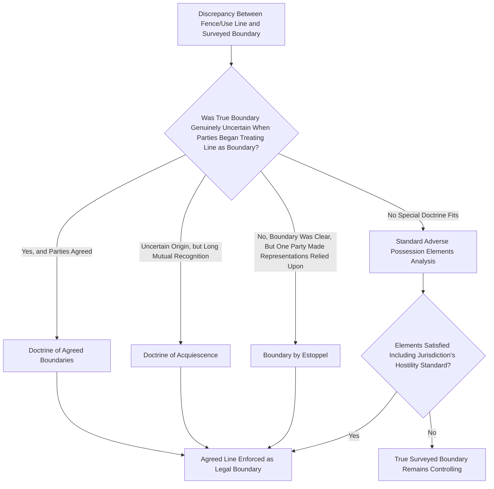

## Boundary Disputes and Adverse Possession Claims

### Overview

Boundary disputes are among the most common practical applications of adverse possession doctrine, arising when a landowner's actual use of property — through fences, structures, landscaping, or cultivation — diverges from the true record boundary line established by surveys and legal descriptions. This chapter examines the specialized doctrines that have developed specifically around boundary-line adverse possession, including the doctrine of agreed boundaries, acquiescence, and the distinctive treatment courts give to mistaken-boundary cases as compared to adverse possession of an entire, clearly distinct parcel.

### Why Boundary Cases Are Distinct

**Key Points**

- Unlike classic adverse possession scenarios involving a stranger occupying an entire separately-identifiable parcel, boundary disputes typically involve **neighbors** who each believe they are using their own land, with the disputed strip usually narrow relative to either party's overall holding.
- This context significantly affects the **hostility** analysis: because boundary encroachments frequently arise from good-faith surveying errors, ambiguous historical markers (old fence lines, tree rows, stone walls), or simple mistake rather than any intent to claim a neighbor's land, boundary cases are the primary setting in which the jurisdictional split on hostility's state-of-mind requirement (objective versus good-faith-mistake standards) matters most in practice.
- Courts handling boundary disputes have developed several doctrines that overlap with, but are analytically distinct from, standard adverse possession, allowing resolution even where full adverse possession elements might not cleanly apply.

### The Doctrine of Agreed Boundaries

**Key Points**

- Where the true boundary line is **uncertain or disputed**, and adjoining landowners **expressly or impliedly agree** on a boundary line, and then occupy their respective sides in accordance with that agreed line for a period sufficient to give rise to reasonable reliance (in many jurisdictions tied to or shorter than the standard adverse possession period), courts may enforce the agreed line even if it does not match the technically correct surveyed boundary.
- Agreed boundaries doctrine requires **genuine uncertainty** about the true line at the time of the agreement; it is not intended to allow neighbors to informally redraw a boundary they both actually know to be different from their agreement (though some jurisdictions treat subsequent long acquiescence as curing even a known discrepancy, blurring this distinction with the acquiescence doctrine below).
- The doctrine is typically justified independently of adverse possession's hostility and statutory-period requirements — it rests instead on contract-like reasoning (the parties' mutual agreement) combined with reliance, making it available in some cases where full adverse possession elements are harder to establish.

### The Doctrine of Acquiescence

**Key Points**

- Acquiescence, sometimes called "boundary by acquiescence," focuses on the parties' **long-standing conduct and mutual recognition** of a boundary line (commonly evidenced by a fence, wall, hedge, or other monument) over an extended period, rather than requiring proof of an actual express or implied agreement at a specific point in time.
- Where neighbors have treated a particular line as the boundary — building up to it, maintaining respective sides, and neither objecting — for a period the jurisdiction deems sufficient (often the general statute of limitations period, though some states apply a shorter specific period for acquiescence claims), courts may recognize that line as the legal boundary.
- Acquiescence and agreed boundaries overlap substantially and are treated as the same doctrine in some jurisdictions and as distinct doctrines with different elements in others; practitioners should consult jurisdiction-specific case law rather than assuming uniform treatment. [Inference] The degree of doctrinal separation between these theories varies meaningfully by state and is not uniformly settled, so specific claims should be analyzed under the controlling jurisdiction's precedent rather than general principles alone.

### Estoppel-Based Boundary Theories

**Key Points**

- A related theory, **boundary by estoppel**, applies where one neighbor makes representations (express or through conduct) about the boundary location, and the other neighbor reasonably and detrimentally relies on those representations — for instance, building a permanent structure based on a neighbor's assurance about where the line falls.
- Unlike acquiescence, which emphasizes mutual long-term conduct, estoppel theories can arise from a single clear representation followed by detrimental reliance, without necessarily requiring the extended time period central to acquiescence or standard adverse possession.

### Interaction with Standard Adverse Possession Elements

**Key Points**

- Boundary-dispute claimants can, and often do, proceed under ordinary adverse possession doctrine in addition to or instead of agreed-boundary or acquiescence theories, particularly where the specialized boundary doctrines are unavailable (e.g., no evidence of genuine uncertainty for agreed boundaries, or an insufficiently long period of mutual recognition for acquiescence).
- Because boundary encroachments are often small strips maintained through ordinary yard use — mowing, planting, fencing — courts scrutinize whether such use is sufficiently "actual" and "exclusive" compared to more substantial improvements, though a fence enclosing the disputed strip is frequently treated as strong evidence of both exclusivity and the open-and-notorious element.
- **Innocent improver / betterment statutes** in some jurisdictions provide an alternative remedy distinct from title transfer: rather than awarding title to the encroaching party, courts may order compensation to the true owner or force a sale of the disputed strip at fair value, particularly where a costly structure (part of a house, garage) straddles the boundary line and outright ejectment or removal would be highly disproportionate.

### Boundary Dispute Resolution Pathways

### Illustrative Example

Two neighbors' properties are separated by an old stone wall that has stood for over fifty years, long predating either family's ownership. Both families have consistently treated the wall as the boundary, mowing and gardening up to it, without ever obtaining a survey. A new survey commissioned when one neighbor sells reveals the wall sits nine feet onto the other party's platted lot. Because both families have long acquiesced in treating the wall as the boundary, and the discrepancy from the platted line was unknown to either party until the survey, a court applying acquiescence or agreed-boundary doctrine would likely enforce the wall as the legal boundary rather than requiring full adverse possession analysis (state of mind, statutory period tacking, etc.), since the extended mutual recognition itself, tied to a fixed and long-standing monument, supplies the doctrinal basis for relief independent of standard adverse possession's more demanding hostility inquiry.

### Related Topics

- Elements of Adverse Possession
- Color of Title and Constructive Possession
- Tacking and Privity Among Successive Possessors
- Prescriptive Easements Compared to Adverse Possession
- Innocent Improver and Betterment Statutes
- Quiet Title Actions Following Adverse Possession Claims
- Survey Standards and Legal Descriptions in Land Conveyancing