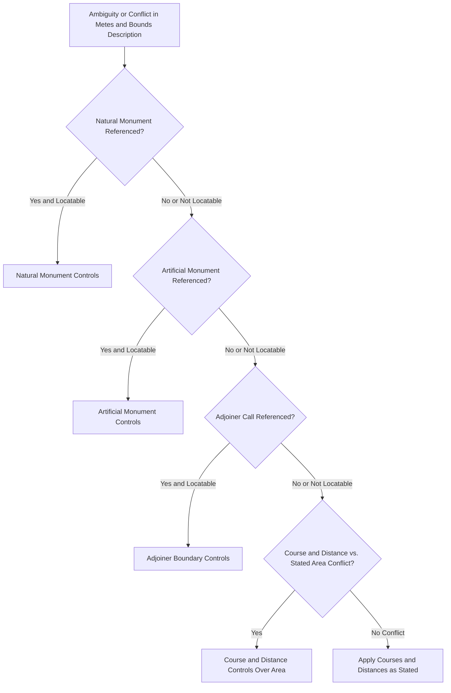

## Metes and Bounds Descriptions

### Overview

Metes and bounds is the oldest system of legal land description used in the United States, tracing a parcel's boundary through a sequence of directional courses and distances, anchored to a defined starting point and often referencing natural or artificial monuments along the way. It remains the dominant description method in the original thirteen colonies and other states settled before the federal rectangular survey system, and continues to be used for irregular parcels and in supplemental boundary descriptions even within jurisdictions that primarily rely on other systems.

### Core Structure of a Metes and Bounds Description

**Key Points**

- **Point of Beginning (POB)**: Every metes and bounds description starts by fixing an identifiable starting point, ideally tied to a permanent, unambiguous monument or a documented tie to a known reference point (such as a section corner or a recorded benchmark).
- **Metes**: The distances and directions ("courses") of each boundary segment, traditionally expressed as a **bearing** (compass direction, e.g., "North 45 degrees East") and a **distance** (e.g., "200.00 feet"), proceeding sequentially around the parcel's perimeter.
- **Bounds**: References to monuments, adjoiners, or natural features that mark or corroborate each boundary segment or corner — a stone wall, a specific tree, a stream centerline, an adjoining owner's fence, or a previously set iron pin.
- **Closure**: A properly drafted metes and bounds description must mathematically "close," meaning the sequence of courses and distances, taken together, returns precisely to the point of beginning, forming a closed polygon.

### Bearing and Distance Notation

**Key Points**

- Bearings are conventionally expressed using the **quadrant system**: a reference to North or South, followed by an angle (0 to 90 degrees) measured from that reference toward East or West — for example, "S 30° 15' 00" E" describes a course running 30 degrees, 15 minutes east of due south.
- Distances are traditionally expressed in feet (and often in surveyor's chains and links in older historical descriptions, particularly pre-20th-century documents, where one chain equals 66 feet), with modern surveys typically expressed in decimal feet to two decimal places for precision.
- Curved boundary segments (following a road curve or a winding natural feature) require additional data beyond simple bearing and distance: **radius, arc length, chord bearing and distance, and central angle**, since a simple straight-line course cannot describe a curve.

### The Monument Hierarchy in Interpretation

**Key Points**

- When ambiguities or conflicts arise within a metes and bounds description — for example, where the stated distance and the reference to a physical monument do not perfectly align due to surveying imprecision or monument movement over time — courts apply a well-established hierarchy of interpretive priority, generally in this descending order:
  1. **Natural monuments** (rivers, large trees, rock outcroppings) — given the highest priority, on the theory that they are the most durable and least likely to be inaccurately recorded or subsequently disturbed.
  2. **Artificial monuments** (stakes, pins, fences, walls actually set or built pursuant to the original survey).
  3. **Adjoiners' calls** (references to the boundary of a neighboring parcel).
  4. **Courses and distances** (the bearing and distance figures themselves).
  5. **Area** (the stated acreage) — given the lowest priority, since acreage figures in older deeds were frequently estimated rather than precisely surveyed.
- This hierarchy reflects the general interpretive principle that **monuments control over courses and distances**, and that more durable, objectively verifiable evidence of the original survey intent should prevail over descriptive figures that are more prone to transcription error, measurement imprecision, or subsequent land movement.

### Common Sources of Ambiguity and Error

**Key Points**

- **Monument disappearance**: Natural or artificial monuments referenced in old descriptions may no longer exist (a tree died and was removed, a stream shifted course), requiring resurveying and historical reconstruction to locate the original intended point.
- **Closure errors**: Mathematical errors in the original survey (or in transcription over generations of deeds) can cause the described courses and distances to fail to close properly, requiring professional resurvey and often litigation or reformation to resolve.
- **Overlapping and gap descriptions**: Because metes and bounds descriptions are drafted independently for each parcel over time, adjoining descriptions can inadvertently overlap (double-conveyed land) or leave gaps (unconveyed slivers), particularly in areas with a long, complex chain of historical subdivisions.
- **Scrivener's errors**: Simple drafting mistakes — a transposed bearing, an incorrect distance, an omitted course — are common in historical instruments and are typically addressed through deed reformation actions when the parties' original intent can be established through extrinsic evidence.

### Comparison to Other Description Systems

**Key Points**

- Metes and bounds contrasts with the **rectangular (government) survey system**, used predominantly in states admitted to the Union after the original colonies, which describes land by reference to townships, ranges, and sections within a standardized grid anchored to principal meridians and base lines.
- It also contrasts with the **plat/lot and block system**, common in modern platted subdivisions, which describes a parcel simply by reference to a recorded subdivision plat (e.g., "Lot 14, Block 3, Sunny Acres Subdivision"), incorporating by reference the metes and bounds or survey data already recorded on that plat rather than restating it in each deed.
- Metes and bounds remains essential even in rectangular-survey and platted-subdivision states for describing irregular parcels that do not conform to section lines or subdivision lots, and it frequently appears as a supplemental description method layered onto the other systems.

### Description Interpretation Priority

### Sample Description Diagram

### Illustrative Example

A deed describes a parcel as: "Beginning at an iron pin set at the intersection of County Road 12 and Miller Lane; thence North 10 degrees East, 150.00 feet to an iron pin; thence South 80 degrees East, 200.00 feet to a large oak tree; thence South 10 degrees West, 150.00 feet to a fence corner marking the adjoiner's boundary; thence North 80 degrees West, 200.00 feet to the Point of Beginning, containing 0.69 acres, more or less." A modern survey finds the described distances do not perfectly return to the point of beginning, and finds the oak tree still standing but located 4 feet further east than the stated 200.00-foot course would place it. Applying the monument hierarchy, the surveyor and, if litigated, the court would generally treat the oak tree's actual physical location as controlling over the stated course and distance figure, adjusting the boundary to run to the tree's actual position rather than mechanically applying the numeric distance — consistent with the principle that natural monuments take precedence over courses and distances when the two conflict.

### Related Topics

- Rectangular (Government) Survey System
- Plat and Lot-and-Block Description Systems
- Boundary Disputes and the Doctrine of Agreed Boundaries
- Deed Reformation for Mutual Mistake or Scrivener's Error
- Riparian and Littoral Boundaries Along Water Bodies
- Survey Standards and Professional Licensing
- Title Insurance and Survey Exceptions