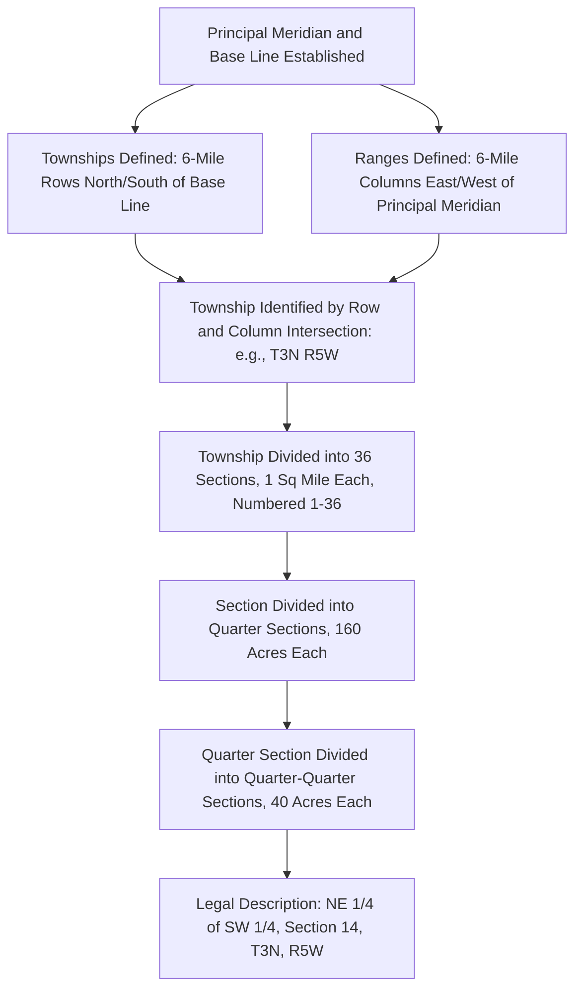

## Government Survey and Plat Systems

### Overview

The government (rectangular) survey system and the plat (lot-and-block) system are the two dominant alternatives to metes and bounds for describing land in the United States. The rectangular survey system, established by the Land Ordinance of 1785, imposed a standardized grid across most public land states to enable orderly, efficient disposal of federal land, while the plat system emerged later as a practical tool for describing individual parcels within subdivided developments by reference to a single recorded map rather than restating boundary data in every deed.

### The Rectangular (Government) Survey System

#### Historical Origins and Coverage

**Key Points**

- Established under the **Land Ordinance of 1785**, the system was designed to survey and divide the vast federal public domain into uniform, saleable units prior to settlement, in contrast to the metes and bounds approach used in the original thirteen colonies where settlement generally preceded systematic surveying.
- The system covers most states admitted to the Union after the original states — generally the Midwest, South-Central, Western, and parts of the Southern states — though notable exceptions exist, including Texas (which retained its own land grant and survey history from its period as an independent republic) and the original thirteen colonies plus a handful of other early states that continued using metes and bounds as their primary system.

#### Grid Structure

**Key Points**

- **Principal Meridians and Base Lines**: The grid for each surveyed region is anchored to a north-south **principal meridian** and an east-west **base line**, from which all subsequent measurements in that region are referenced.
- **Townships and Ranges**: Measuring north or south from the base line in six-mile increments defines **township** rows (labeled Township 1 North, Township 2 North, etc., or South); measuring east or west from the principal meridian in six-mile increments defines **range** columns (Range 1 East, Range 2 East, etc., or West). The intersection of a township row and range column identifies a specific six-mile-by-six-mile **township** (36 square miles).
- **Sections**: Each township is subdivided into 36 **sections**, each nominally one square mile (640 acres), numbered in a standardized boustrophedon (back-and-forth, snake-like) pattern beginning with Section 1 in the northeast corner and proceeding west then south in alternating rows.
- **Subdivisions of Sections**: Individual sections are further divided using fractional and quarter descriptions — a "quarter section" (160 acres, e.g., the "Northeast Quarter" or "NE 1/4"), a "quarter-quarter section" (40 acres, e.g., "NE 1/4 of the SW 1/4"), and further fractional subdivisions as needed for smaller parcels.

#### Correction for Earth's Curvature

**Key Points**

- Because the earth is curved and meridians converge toward the poles, a perfectly uniform grid of six-mile squares is not geometrically possible over large distances; the system corrects for this using **correction lines** (also called "standard parallels," typically every 24 miles) and **guide meridians**, which periodically re-establish the grid's east-west dimensions to prevent cumulative distortion.
- This produces occasional irregular ("fractional") sections and townships along correction lines and at the outer edges of surveyed ranges, which surveyors and title examiners must account for when working with land in these transition zones.

#### Legal Description Format

**Key Points**

- A standard rectangular survey description reads in a nested, most-specific-to-least-specific order, for example: "The Northwest Quarter of the Southeast Quarter of Section 14, Township 3 North, Range 5 West of the [Name] Principal Meridian" — describing a 40-acre parcel.
- These descriptions are highly standardized and machine-parseable, which is part of why the system remains dominant for rural and agricultural land in covered states, in contrast to the narrative, monument-dependent character of metes and bounds descriptions.

### The Plat (Lot-and-Block) System

#### Purpose and Structure

**Key Points**

- The plat system describes individual parcels by reference to a **recorded subdivision plat** — a map, prepared by a licensed surveyor and recorded in the local land records office, showing the subdivision's overall boundary, individual lot lines, block designations, streets, easements, and often utility rights-of-way.
- Once a plat is recorded, individual deeds can describe a lot simply as, for example, "Lot 7, Block 2, Meadowbrook Estates Subdivision, as recorded in Plat Book 14, Page 22" — incorporating by reference all the detailed metes and bounds or coordinate data already established on the recorded plat, without restating it.
- This system dramatically simplifies conveyancing in developed areas: rather than each deed containing a lengthy, error-prone narrative description, the plat itself serves as the authoritative source of boundary data for every lot within it.

#### Platting Process

**Key Points**

- A developer typically must submit a **preliminary plat** to the local planning authority for review against zoning, subdivision, and infrastructure requirements, followed by a **final plat** incorporating any required revisions, which is then recorded once approved.
- Recorded plats typically also serve as the instrument by which the developer **dedicates** certain areas (streets, easements, sometimes park land) to public or association use, meaning the platting process often accomplishes several legal functions simultaneously: establishing lot boundaries, creating easements, and effecting dedications.
- Amendment or **vacation** of a recorded plat (to combine lots, adjust boundaries, or eliminate a dedicated area) generally requires a formal replatting process and government approval, reflecting the public and third-party reliance interests (utility companies, adjoining owners, future purchasers) that attach once a plat is recorded.

### Comparative Overview

| Feature | Rectangular Survey | Plat System | Metes and Bounds |
| --- | --- | --- | --- |
| Primary use context | Rural/agricultural land in public-land states | Platted subdivisions | Irregular parcels, original colonies |
| Description format | Section/township/range fractions | Reference to recorded plat (lot/block) | Sequential courses and distances |
| Underlying data source | Federal survey grid | Recorded subdivision map | Individual deed narrative |
| Precision for irregular shapes | Limited (grid-based) | High (plat can show any shape) | High (any shape describable) |
| Historical origin | Land Ordinance of 1785 | Modern subdivision practice | Colonial-era English tradition |

### Rectangular Survey Grid Structure

### Illustrative Example

A farm is described as "the East Half of the Northeast Quarter of Section 22, Township 7 North, Range 12 East of the Fifth Principal Meridian," identifying a specific 80-acre parcel through the rectangular survey system. When the farm's owner later sells five acres along the road frontage for residential development, the buyer's surveyor prepares and records a subdivision plat showing three new lots carved from that five-acre strip. All future deeds for those three lots simply reference "Lot 2, Block 1, Roadside Estates, as recorded in Plat Book 9, Page 47" rather than restating the underlying section-township-range data or drafting a new metes and bounds description for each lot — illustrating how the plat system layers on top of, and simplifies conveyancing within, land originally described under the rectangular survey system.

### Related Topics

- Metes and Bounds Descriptions
- Subdivision Approval and Platting Procedures
- Dedication of Streets and Public Areas Through Platting
- Correction Lines and Fractional Sections
- Title Insurance and Survey Exceptions
- Riparian and Littoral Boundaries Along Water Bodies
- Vacation and Amendment of Recorded Plats