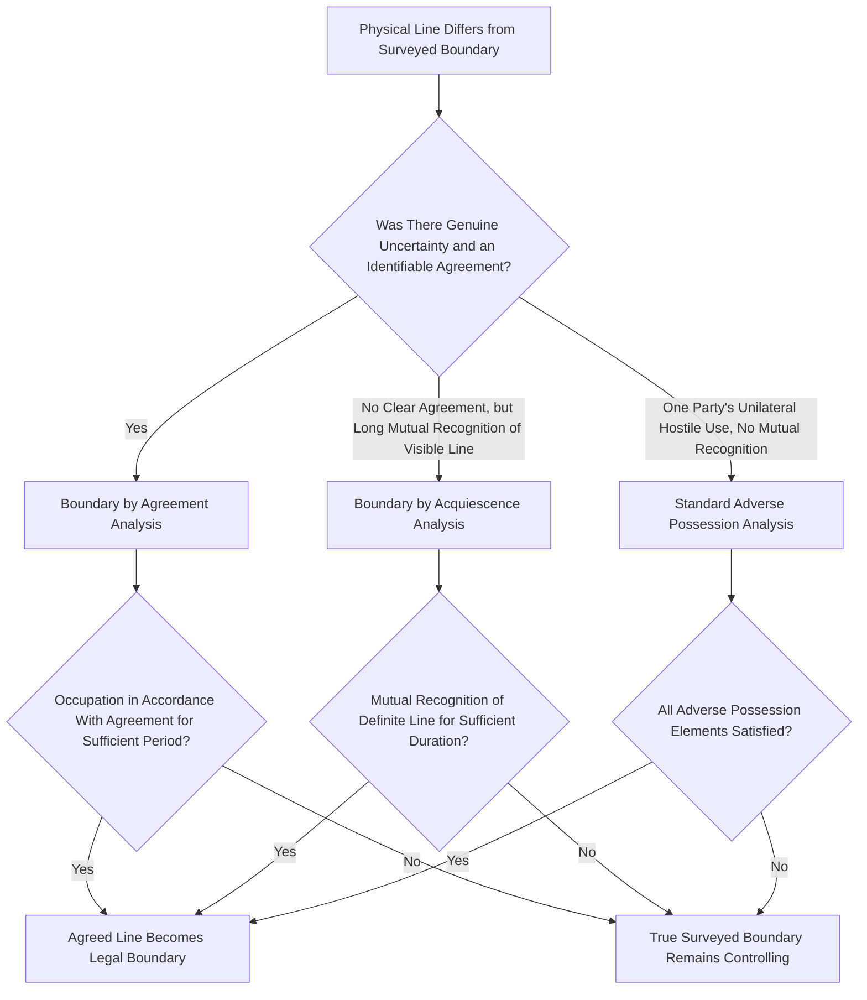

## Boundary by Acquiescence and Agreement

### Overview

Boundary by acquiescence and boundary by agreement are related but analytically distinct doctrines that allow a practically established boundary line — one recognized and relied upon by adjoining landowners — to be treated as the legal boundary even where it diverges from the technically correct line derived from the original survey or legal description. These doctrines provide resolution mechanisms that are often more readily available than standard adverse possession, since they rest on different theoretical foundations (mutual recognition and reliance, or contract-like agreement) rather than adverse possession's demanding requirement of hostile, exclusive possession for a full statutory period.

### Boundary by Agreement

#### Elements

**Key Points**

- **Genuine uncertainty or dispute** about the true boundary location at the time the neighbors reach their agreement — this doctrine is not available where the correct boundary is clear and ascertainable and the parties simply prefer a different line.
- **An agreement**, express or implied, between the adjoining owners fixing the boundary at a specific location — this can arise from an explicit conversation and mutual marking of a line, or be inferred from conduct strongly suggesting mutual assent (for example, both parties jointly commissioning and accepting a survey, or both participating in erecting a fence at an agreed location).
- **Occupation in accordance with the agreed line** for a period sufficient to demonstrate the parties actually adopted and relied upon it — many jurisdictions look for a period comparable to, though sometimes shorter than, the general adverse possession statute, reflecting the agreement's independent evidentiary weight.
- Some jurisdictions require that the agreement be supported by adequate **consideration** or otherwise satisfy general contract formation principles, treating the doctrine as fundamentally an oral or implied contract modifying the boundary, while others treat it as a distinct property doctrine not strictly bound by contract law formalities.

#### Rationale

**Key Points**

- The doctrine reflects a policy preference for **stability and finality** in boundary lines once neighbors have resolved a genuine uncertainty and built their subsequent conduct — fences, plantings, sometimes structures — around the agreed line; unwinding such reliance after years or decades would generate significant hardship disproportionate to the interest in strict technical accuracy.
- Because the doctrine requires genuine antecedent uncertainty, it is doctrinally distinguishable from a scenario where neighbors, both aware of the true line, simply agree informally to deviate from it for convenience; some jurisdictions treat the latter scenario as ineffective to shift legal title absent compliance with the formalities required for a conveyance (a deed), though long-continued adherence to even a knowingly incorrect line can independently ripen into a boundary by acquiescence.

### Boundary by Acquiescence

#### Elements

**Key Points**

- **A definite, visible line or monument** — most commonly a fence, but also potentially a wall, hedge row, tree line, or other observable demarcation — that has been treated by both parties as the boundary.
- **Mutual recognition and acceptance** of that line as the boundary by both adjoining owners (and, typically, their successors in title) over an extended period, without one party's silent tolerance while privately disputing the line internally — genuine, outwardly manifested acceptance is generally required, not mere passive inaction alone.
- **Duration** sufficient under the jurisdiction's specific rule — some states apply the general adverse possession statutory period, others apply a distinct, sometimes shorter, statutorily or judicially established acquiescence period.
- Unlike boundary by agreement, acquiescence does **not** necessarily require proof of an actual originating agreement or genuine uncertainty at the outset; the doctrine can apply even where the line's origin is unknown or lost to history, so long as the required mutual recognition and duration are shown.

#ully#### Distinguishing Acquiescence from Adverse Possession

**Key Points**

- Acquiescence focuses on **mutual recognition** by both parties that a particular line is the boundary, whereas adverse possession focuses on **one party's unilateral, hostile possession** without regard to the other party's acceptance or acknowledgment.
- Because acquiescence rests on mutual recognition rather than one-sided hostile intent, it sidesteps the jurisdictional split over adverse possession's state-of-mind requirement (objective versus good-faith standards) that often complicates boundary-related adverse possession claims.
- Some jurisdictions treat proof of long mutual acquiescence in a fence line as also independently satisfying adverse possession's elements (since maintaining and using up to a fence line for the statutory period typically demonstrates actual, open, exclusive, and — under the majority objective standard — hostile possession), meaning a successful boundary case may be pleaded and proven under either or both theories depending on the facts and the jurisdiction's specific doctrinal requirements.

### Successors in Title

**Key Points**

- An established boundary by acquiescence or agreement generally **runs with the land**, binding subsequent purchasers who take title from the original parties to the boundary line, on the theory that the established line has become the actual legal boundary rather than remaining a personal arrangement between the original neighbors.
- A subsequent purchaser unaware of the discrepancy between the recorded legal description and the physically established line may nonetheless be bound by the established boundary, particularly where the line is visibly marked (a fence, wall) that a reasonable buyer's inspection would have revealed, underscoring the importance of physical inspection and survey review during real estate due diligence.

### Comparative Framework

| Feature | Boundary by Agreement | Boundary by Acquiescence | Standard Adverse Possession |
| --- | --- | --- | --- |
| Core requirement | Express/implied agreement amid genuine uncertainty | Mutual recognition of a visible line over time | Unilateral hostile possession, all elements |
| Requires prior uncertainty | Yes | Not necessarily | No |
| Requires hostility/adversity | No | No | Yes |
| Typical duration | Often shorter than adverse possession period | Statutory or judicially set period | Full statutory period |
| Theoretical basis | Contract-like agreement and reliance | Mutual conduct and recognition | Possessory divestment of title |

### Doctrine Selection Flow

### Illustrative Example

Two adjoining ranch owners, uncertain of their exact common boundary in an era before affordable precision surveying, jointly walk the property with a hired surveyor in the 1960s, agree on a line, and build a shared fence along it. Both families and their successors maintain, repair, and respect that fence line for the next sixty years, with cattle grazing and crop planting consistently observing the fence as the boundary on each side. A modern GPS survey commissioned decades later, when one ranch is sold, reveals the fence sits eleven feet from the technically correct boundary described in the original deeds. Under boundary by agreement, the 1960s survey-and-fence-building episode reflects a genuine resolution of prior uncertainty, and the subsequent decades of occupation in accordance with that agreed line would likely support enforcing the fence as the legal boundary. Independently, even without direct evidence of the original 1960s agreement (if, for instance, those details were lost to history and only the fence and decades of mutual use could be proven), the same result would likely follow under boundary by acquiescence, since both families' successors visibly and mutually treated the fence as the boundary for a period well exceeding the state's acquiescence or adverse possession period.

### Related Topics

- Elements of Adverse Possession
- Boundary Disputes and the Doctrine of Agreed Boundaries
- Metes and Bounds Descriptions
- Quiet Title Actions Following Adverse Possession Claims
- Deed Reformation for Mutual Mistake or Scrivener's Error
- Survey Standards and Professional Licensing
- Innocent Improver and Betterment Statutes