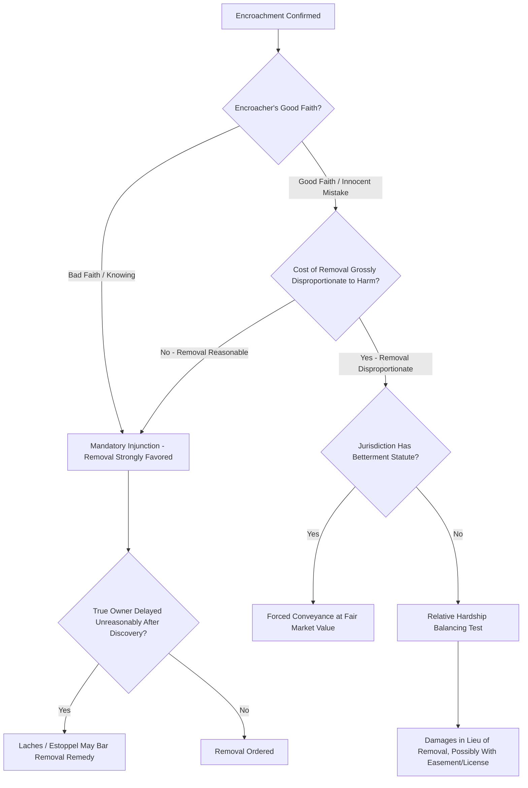

## Encroachments and Available Remedies

### Overview

An encroachment occurs when a structure, improvement, or use extends across a property boundary onto a neighboring owner's land without permission — a fence built over the line, a roof eave overhanging an adjoining lot, a driveway or garage partially built on the wrong parcel, or tree roots and branches crossing onto adjacent property. Encroachment disputes sit at the intersection of trespass, nuisance, and property law, and courts have developed a range of remedies calibrated to the encroachment's severity, the parties' good or bad faith, and the practical consequences of different remedial options.

### Nature of the Legal Claim

**Key Points**

- An encroachment is fundamentally a form of **continuing trespass** — the unauthorized physical intrusion onto another's land — distinguishable from a one-time trespass by its ongoing character, which affects both the statute of limitations analysis (continuing trespasses may not be fully time-barred merely because the intrusion began long ago) and remedy selection.
- Where the encroachment involves interference falling short of physical intrusion (e.g., a structure that blocks light, air, or view without physically crossing the line), the claim typically sounds in **nuisance** rather than trespass, though many jurisdictions and many fact patterns implicate both theories simultaneously.
- Encroachment claims are conceptually distinct from **boundary disputes** resolved through acquiescence or agreement doctrines (covered separately): a boundary dispute concerns where the true line actually is, whereas an encroachment claim generally presumes the true boundary is known and undisputed, with the question being what remedy follows from a structure crossing that known line.

### Available Remedies

#### Injunctive Relief (Mandatory Removal)

**Key Points**

- Traditionally, the default remedy for a proven encroachment is a **mandatory injunction** ordering the encroaching party to remove the offending structure or improvement, reflecting the classical property law principle that the true owner is entitled to the exclusive use of their land without judicial second-guessing of how much that exclusivity is "worth" to them.
- Courts have increasingly recognized that strict, automatic removal can produce **grossly disproportionate results** — particularly where the encroachment is minor (a few inches), the cost of removal is very high relative to the harm (removing part of a house foundation), and the encroaching party acted in good faith without knowledge of the boundary problem.

#### Damages in Lieu of Removal (the "Relative Hardship" Approach)

**Key Points**

- A substantial body of modern case law applies a **relative hardship** or **balancing** test, weighing the hardship removal would impose on the encroaching party against the harm the true owner suffers from the continued encroachment, and awarding money damages instead of removal where removal's hardship is grossly disproportionate to the harm.
- Courts applying this approach commonly consider: the encroacher's good or bad faith (deliberate, knowing encroachment is treated far less sympathetically than an innocent mistake), the extent and permanence of the encroachment, the cost of removal versus the value of the land occupied, and whether the true owner unreasonably delayed in objecting after discovering the encroachment.
- Where damages are awarded in lieu of removal, courts may calculate the amount based on the fair market value of the land occupied, sometimes coupled with an ongoing easement or license recognizing the encroacher's right to maintain the structure in place, functioning similarly to a forced sale of the encroached-upon strip.

#### Forced Conveyance / Betterment Statutes

**Key Points**

- Some states have enacted **betterment** or **innocent improver** statutes that provide a structured alternative to case-by-case relative hardship balancing: where a good-faith encroacher has made substantial improvements believing the land was their own, the statute may allow the court to order a forced sale of the encroached strip to the encroacher at fair market value, rather than ordering removal.
- These statutes typically require genuine good faith (the encroacher must not have known, or had reason to know, of the boundary problem) and are usually unavailable to a party who encroached knowingly or through obvious carelessness in verifying the boundary before building.

#### Prescriptive Rights Arising from Long-Standing Encroachments

**Key Points**

- A long-standing encroachment left unaddressed by the true owner for the full statutory period can itself ripen into a permanent property right in the encroacher — either through **adverse possession** (if the elements are satisfied, yielding title to the occupied strip) or through a **prescriptive easement** (yielding merely a right to maintain the encroachment, without full title), depending on the nature of the intrusion and jurisdictional doctrine.
- This creates a practical urgency for owners who discover an encroachment: unreasonable delay in objecting risks not only equitable defenses (laches, estoppel) to an eventual removal claim, but potentially the outright loss of removal as a remedy altogether once the statutory period runs.

### Self-Help Considerations

**Key Points**

- Self-help removal of encroaching structures or vegetation by the affected owner (e.g., cutting back overhanging branches at the property line) is generally permitted for minor, non-structural encroachments like tree branches and roots, up to the boundary line, though the affected owner typically may not enter the encroaching owner's land to perform the trimming without consent.
- Self-help removal of substantial structural encroachments (fences, buildings) is generally **not** advisable and can expose the self-helping party to liability for property damage or trespass if they enter the encroaching structure's footprint or damage property beyond the immediate boundary line; judicial remedies are the standard path for structural encroachments.

### Remedy Selection Framework

### Illustrative Example

A homeowner discovers, after commissioning a survey to refinance her mortgage, that her neighbor's garage — built fifteen years earlier — extends two feet onto her property, and that her neighbor built it in good faith reliance on an inaccurate older survey. Removing the garage would require demolishing a significant structural portion of the building at substantial cost, while the harm to the homeowner from the two-foot strip's continued occupation is comparatively modest. A court applying the relative hardship approach would likely decline to order removal and instead award the homeowner damages reflecting the fair market value of the occupied strip, potentially coupled with a recognized easement or license permitting the garage to remain — a markedly different outcome from a scenario where the neighbor had knowingly built over the surveyed line despite a clear, recent survey showing the true boundary, which would likely support a stronger claim for mandatory removal given the neighbor's bad faith.

### Related Topics

- Boundary Disputes and the Doctrine of Agreed Boundaries
- Boundary by Acquiescence and Agreement
- Elements of Adverse Possession
- Prescriptive Easements Compared to Adverse Possession
- Nuisance Doctrine and Interference with Land Use
- Innocent Improver and Betterment Statutes
- Metes and Bounds Descriptions