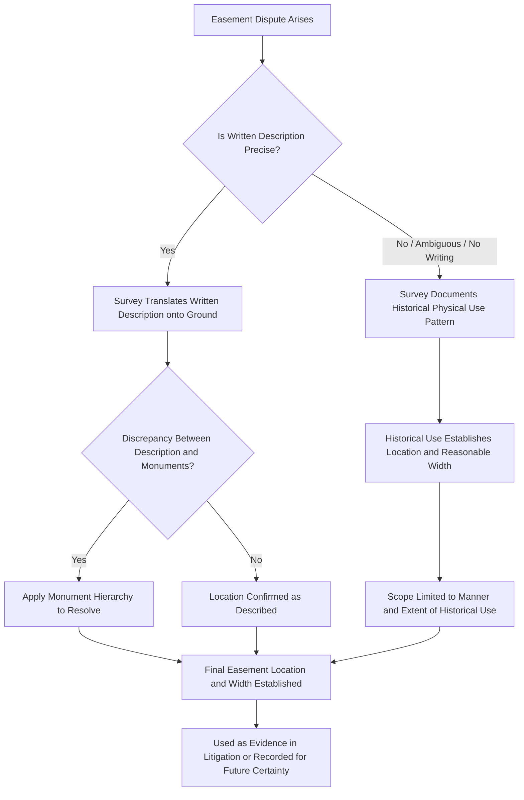

## Role of Surveys in Resolving Easement Disputes

### Overview

Professional land surveys play a central evidentiary and practical role in easement disputes, providing the factual foundation courts and parties rely upon to determine an easement's existence, precise location, width, and whether a given use falls within or exceeds its scope. Because easements frequently involve imprecise historical descriptions, unrecorded or informally created rights, and physical use patterns that drift over time, surveys often supply the objective, professionally certified evidence necessary to resolve disputes that would otherwise turn on competing lay testimony and ambiguous documents.

### Surveys and Easement Location

**Key Points**

- Where an easement's granting instrument describes its location with precision (a metes and bounds description of the easement strip, or reference to a recorded plat), a survey's primary role is to **translate that written description onto the ground**, physically marking the easement's boundaries so the parties can identify what area is actually subject to the right.
- Where an easement is described **imprecisely** (e.g., "a right of way along the existing dirt road" without further metes and bounds detail) or was created without any written description at all (implied easements, easements by necessity, or many prescriptive easements), a survey documenting the **actual historical path of use** — often combined with aerial photography, historical records, and witness testimony — becomes critical evidence for establishing where the easement is legally located.
- Once an easement's location is fixed — whether by the original grant, by survey-documented historical use, or by subsequent agreement — most jurisdictions hold that the location **cannot be unilaterally relocated** by either the servient or dominant estate owner without the other's consent, absent a specific reserved relocation right in the granting instrument or applicable statute; this makes the initial survey-based determination of location significant and durable.

### Surveys and Easement Width and Scope

**Key Points**

- Where an easement's width is not expressly stated in the granting instrument, courts often rely on survey evidence of the **historically used width** (the width of an actual roadway, path, or utility corridor as it has existed and been used) to establish a **reasonable width** consistent with the easement's purpose, applying the general principle that an ambiguous grant is construed according to what is reasonably necessary for the intended use.
- Surveys documenting the physical footprint of existing improvements (utility lines, drainage structures, road surfaces) within a described easement area help establish whether a proposed new use or expansion **exceeds the originally granted scope** — a recurring issue where, for example, a right of way originally used for occasional agricultural access is later claimed to support heavy commercial truck traffic.
- For **prescriptive easements**, which by definition arise from actual historical use rather than a written grant, survey documentation of the precise historical use pattern is often the single most important evidentiary component of the claim, since the prescriptive right's scope is generally limited to the manner and extent of the use that actually occurred during the prescriptive period.

### Surveys in Boundary-Adjacent Easement Disputes

**Key Points**

- Because many easements run along or near property boundaries (shared driveways, boundary-line utility corridors, party walls), disputes over an easement's exact location frequently intertwine with boundary disputes proper, requiring the surveyor to resolve both the underlying property line and the easement's position relative to it.
- Discrepancies between a recorded easement description and physical monuments on the ground are generally resolved using the same **monument hierarchy** principles applied to boundary descriptions generally (natural monuments, then artificial monuments, then courses and distances), since easement descriptions are typically drafted using the same metes and bounds conventions as fee boundary descriptions.

### Surveys, Title Insurance, and Due Diligence

**Key Points**

- An **ALTA/NSPS Land Title Survey** (a standardized survey product incorporating both boundary and title-related detail, including visible easements, encroachments, and improvements) is commonly obtained in commercial real estate transactions specifically to identify existing easements, verify their location against the recorded description, and disclose unrecorded easements evidenced by visible use (a worn path, above-ground utility lines) that a title search alone would not reveal.
- Title insurance policies typically except from coverage matters that an accurate survey would disclose, meaning a buyer who forgoes a current survey in reliance on an older or nonexistent survey risks bearing the loss if an undisclosed easement or discrepancy later emerges, since the "survey exception" in the title policy shifts that risk to the insured.
- Survey review is also central to identifying **overlapping claims** — where an easement's described location overlaps another recorded interest, or where physical use has drifted from the originally granted corridor over years of informal practice, both of which surface primarily through careful survey comparison against the chain of title.

### Expert Testimony and Litigation Role

**Key Points**

- In contested easement litigation, the surveyor frequently testifies as an **expert witness**, explaining the methodology used to establish the easement's location, addressing any discrepancies between the written description and physical conditions, and offering a professional opinion on the boundaries of the disputed area.
- Courts generally give substantial weight to a licensed surveyor's findings when the methodology is sound and consistent with accepted surveying standards, though competing surveys prepared by opposing parties' experts are common in contested cases, requiring the court to weigh the credibility and methodology of each.
- Because surveying involves professional licensing and liability standards, a surveyor's failure to properly identify or disclose an existing easement can itself give rise to professional negligence claims against the surveyor, separate from the underlying easement dispute between the landowners.

### Survey's Role in Dispute Resolution

### Illustrative Example

Two neighboring landowners dispute the width of a shared gravel driveway easement, the original 1970s grant stating only "a right of way for ingress and egress over the existing driveway" without specifying dimensions. A current survey, cross-referenced against historical aerial photographs spanning several decades, documents that the driveway's traveled surface has consistently measured approximately fourteen feet wide since its creation, occasionally used for two-way passage. When one owner later attempts to restrict use to a narrower eight-foot corridor by planting landscaping along part of the historical width, the survey evidence documenting the consistent fourteen-foot historical footprint becomes the central evidence establishing the easement's true, legally protected width — illustrating how a survey converts an ambiguous, undimensioned written grant into a concrete, defensible boundary supported by objective historical evidence rather than competing recollections.

### Related Topics

- Metes and Bounds Descriptions
- Prescriptive Easements Compared to Adverse Possession
- Implied Easements and Easements by Necessity
- Relocation of Easements by Servient Estate Owners
- Title Insurance and Survey Exceptions
- Boundary Disputes and the Doctrine of Agreed Boundaries
- Professional Negligence Claims Against Surveyors