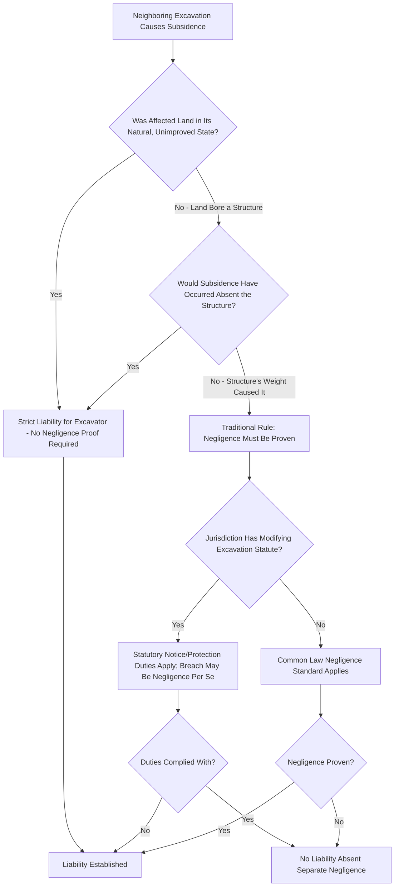

## Right to Lateral Support of Land

### Overview

The right to lateral support is a common law property right entitling a landowner to have their land supported in its natural state by the adjoining land on all sides. It is one of the most fundamental incidents of land ownership, arising automatically without need for express grant, and it addresses the risk that excavation or other activity on neighboring property will cause an owner's land to subside, slip, or collapse. The doctrine is traditionally analyzed separately from subjacent support (support from below, typically implicated by subsurface mining or tunneling) and from the distinct question of support for structures built upon the land.

### The Basic Right

**Key Points**

- Every parcel of land is entitled, as an incident of ownership rather than as an easement that must be separately granted, to **lateral support** from adjoining land — meaning a neighboring owner may not excavate, remove soil, or otherwise alter their land in a way that causes the adjoining parcel's land, **in its natural, unimproved condition**, to subside, slide, or collapse.
- This right exists automatically for all landowners as a "natural right" incident to land ownership, analogous to riparian rights in water law, distinguishing it from servitudes like easements that require an act of creation (grant, prescription, necessity, or implication).
- The right protects land in its **natural state** — meaning the traditional common law rule imposes **strict liability** (liability without proof of negligence) on an excavating neighbor whose activity causes adjoining land to subside, so long as the affected land would have remained stable but for the excavation, even absent any structures on the affected parcel.

### Lateral Support for Land Bearing Structures

**Key Points**

- The common law drew a sharp distinction between support owed to **unimproved land** (strict liability, as described above) and support owed to land **bearing structures** (such as a building), for which the traditional rule required the plaintiff to prove **negligence** on the part of the excavating party, since the added weight and pressure from a structure is not something the adjoining landowner is presumed to have anticipated when the natural-support right was first recognized.
- Under this traditional framework, if excavation on Lot B causes land on Lot A to subside, and Lot A's subsidence would have occurred even without any building on it (the natural land itself was insufficiently supported), the excavator faces strict liability; but if the subsidence occurred only because of the additional weight of a structure on Lot A that natural, unimproved land would have withstood, the excavator is liable only upon a showing of negligence in how the excavation was conducted.
- Many jurisdictions have modified this distinction by statute, imposing a duty of reasonable care (a negligence-based standard, sometimes coupled with specific procedural requirements like advance notice to the neighboring owner before excavating) applicable to excavation generally, somewhat narrowing the traditional strict-liability-for-land / negligence-for-structures dichotomy, though the underlying analytical distinction between natural land support and structural support often persists in how courts frame the inquiry.

### Excavation Duties and Statutory Modifications

**Key Points**

- Many states have enacted **excavation statutes** imposing specific duties on a party planning deep excavation near a property line — commonly requiring advance written notice to adjoining owners, and sometimes requiring the excavating party to take reasonable protective measures (shoring, underpinning) to protect adjoining structures, particularly where the excavation reaches a specified depth.
- These statutes often shift or clarify the cost allocation for protective measures: some require the excavating party to bear the cost of protecting adjoining structures up to a certain depth, while placing responsibility on the adjoining owner to protect their own structure's foundation below that depth if it was built without adequate foundation depth relative to the property line.
- Failure to comply with statutory notice and protective-measure requirements is frequently treated as negligence per se, providing a more straightforward path to liability than proving common law negligence de novo where a specific statute applies.

### Relationship to Nuisance and Trespass

**Key Points**

- Lateral support claims are analytically distinct from **nuisance** (which concerns interference with use and enjoyment generally, such as vibration, noise, or dust from excavation activity) and from **trespass** (which requires physical intrusion onto the plaintiff's land), though a single excavation project can potentially give rise to claims under all three theories depending on the specific harm alleged.
- Subsidence caused by excavation is treated as a direct invasion of the right of support itself, making lateral support a freestanding cause of action with its own liability standard (as described above), rather than merely a subset of general negligence or nuisance law, though many of the same practical evidentiary issues (causation, foreseeability, the reasonableness of precautions taken) recur across all three theories.

### Waiver and Contractual Modification

**Key Points**

- The right to lateral support, being a natural incident of ownership rather than a servitude, can nonetheless be **modified or waived** by express agreement between adjoining owners (for example, a party wall agreement or a recorded covenant addressing excavation rights), and such agreements are generally enforced according to their terms.
- Courts generally construe purported waivers of the lateral support right narrowly, given the significant risk to the waiving party's land, and require clear language before finding that a landowner has surrendered this fundamental protection.

### Liability Framework

### Illustrative Example

A developer excavates a deep foundation for a new commercial building immediately adjacent to a residential lot. The excavation removes lateral support from the soil beneath the residential lot, causing the ground itself to slump and crack even in the yard area away from the house, independent of the house's weight. Because this portion of the harm reflects subsidence of the land in its natural condition, the developer faces strict liability regardless of how carefully the excavation was performed. Separately, cracks also appear in the house's foundation itself; if the jurisdiction follows the traditional common law rule, the homeowner must additionally prove the developer was negligent (for example, failing to properly shore the excavation site) to recover for the structural damage specifically, though if the jurisdiction has adopted a modern excavation statute requiring advance notice and protective shoring, the developer's failure to comply with those statutory duties may establish negligence per se, simplifying the homeowner's structural-damage claim considerably.

### Related Topics

- Subjacent Support and Mineral Rights
- Party Wall Agreements and Shared Structural Support
- Nuisance Doctrine and Interference with Land Use
- Excavation Notice Statutes and Protective Measures
- Negligence Per Se in Property Law Contexts
- Encroachments and Available Remedies
- Riparian and Littoral Boundaries Along Water Bodies