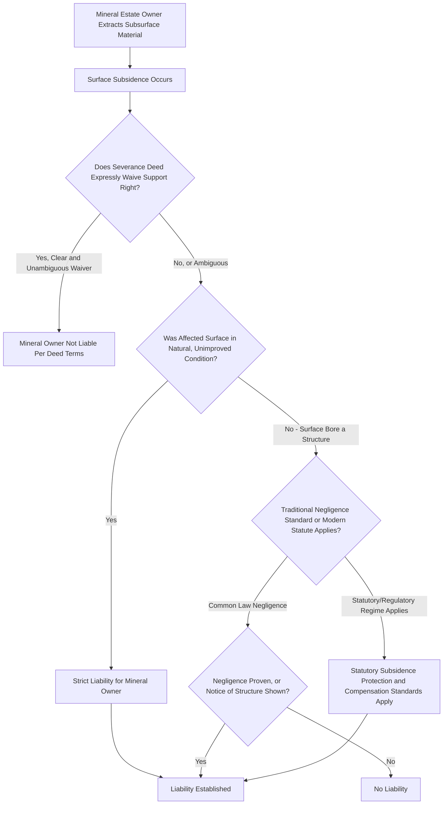

## Right to Subjacent Support

### Overview

The right to subjacent support entitles a landowner to have their land supported from **below** — most commonly implicated where subsurface mineral or mining rights have been severed from surface ownership, such that a different party owns the right to remove coal, minerals, or other subsurface materials beneath the surface owner's land. Unlike lateral support (support from adjoining land on the sides), subjacent support concerns the vertical relationship between a severed subsurface estate and the surface estate sitting above it, and the doctrine has been shaped significantly by the historical prevalence of mineral severance and underground mining.

### The Basic Right and Severed Estates

**Key Points**

- Subjacent support becomes legally significant specifically in the context of a **severed mineral estate** — where the right to extract subsurface minerals has been sold or reserved separately from the surface estate, creating two distinct ownership interests (surface estate and mineral/mining estate) in what was originally a single unified fee.
- The surface owner is entitled, as an incident of the surface estate, to have the surface **supported** by the subsurface material, meaning the mineral estate owner's extraction activity (particularly underground mining that removes substantial subsurface material) cannot be conducted in a manner that causes the surface to subside or collapse, absent an express waiver of this right.
- As with lateral support of unimproved land, the traditional common law rule imposes something close to **strict liability** on the mineral owner for surface subsidence caused by extraction, at least with respect to the land in its natural condition, reflecting the same underlying policy that a landowner should not have to prove negligence to be protected against a neighbor's (here, a vertically adjacent estate holder's) activity causing their land to physically collapse.

### Support for Structures on the Surface

**Key Points**

- As with lateral support, courts have historically distinguished the surface owner's right to support for **unimproved land** (strict liability standard) from support owed to land bearing **structures** built on the surface, which under the traditional rule required proof of negligence unless the mineral owner had actual or constructive notice of the structures and could reasonably have adjusted extraction methods to avoid the additional harm.
- This distinction has been substantially modified by statute in major mining states, particularly with respect to coal mining, where legislatures and regulatory agencies have imposed more protective standards for surface structures, dwellings, and infrastructure (roads, water sources, cemeteries) regardless of the traditional structure/unimproved-land liability split.

### Waiver Through Express Reservation

**Key Points**

- Because subjacent support most commonly arises in the context of a mineral severance, the deed or instrument effecting that severance frequently contains **express language addressing support rights** — some severance deeds expressly reserve to the mineral owner the right to remove "all" of the mineral without liability for resulting surface subsidence, effectively waiving the surface owner's subjacent support right as part of the original transaction.
- Courts generally enforce clear, express waivers of subjacent support rights contained in severance instruments, but apply strict construction principles requiring unambiguous language before finding that a surface owner has surrendered this significant protection — general or vague references to mining rights are typically insufficient to waive subjacent support absent specific language addressing subsidence liability.
- Where a severance deed is silent on support rights, the majority rule presumes the surface owner retains the right to subjacent support, placing the burden on the mineral owner to establish a clear waiver if one is claimed.

### Statutory and Regulatory Modification (Mining Contexts)

**Key Points**

- Federal and state statutes regulating underground coal mining, most notably the **Surface Mining Control and Reclamation Act (SMRCA)** framework and associated state regulatory programs, impose extensive requirements addressing subsidence — including permitting conditions, subsidence monitoring, repair and compensation obligations for damaged structures, and restrictions on mining beneath certain protected surface features (occupied dwellings, cemeteries, public buildings, and water sources).
- These statutory and regulatory regimes often operate independently of, and in addition to, the common law subjacent support doctrine, meaning a surface owner harmed by subsidence may have both a common law claim (subject to any contractual waiver in the severance deed) and separate statutory or regulatory remedies through mining regulatory agencies.
- [Inference] The specific balance between common law subjacent support rights, contractual waivers in historical severance deeds (many dating from the 19th and early 20th centuries), and modern regulatory subsidence protections varies considerably by state and by the specific mining context, and the applicable framework for any given parcel should be verified against the actual severance instrument and current state mining regulations rather than assumed from general principles.

### Comparison to Lateral Support

**Key Points**

- Both doctrines share the core structure of imposing something close to strict liability for damage to land in its natural condition, with a traditional negligence standard applied to structures, and both can be modified by express agreement or statute.
- The key structural difference is that lateral support is a **natural right existing automatically** between any adjoining surface parcels without regard to any prior common ownership, whereas subjacent support typically arises specifically from the **severance of a previously unified estate** into surface and mineral components, making the terms of that severance instrument central to the subjacent support analysis in a way that has no direct analog in ordinary lateral support disputes between neighboring surface owners.

### Subjacent Support Liability Framework

### Illustrative Example

A century-old deed severs the coal beneath a farm from the surface estate, granting the coal company "the right to mine and remove all coal" without any express language addressing subsidence or support. Decades later, longwall mining beneath the farm causes significant surface subsidence, cracking the farmhouse foundation and creating sinkholes in an unimproved pasture. Because the severance deed is silent on support rights rather than containing a clear waiver, the majority rule presumption favors the surface owner's retained right to subjacent support. The pasture subsidence, affecting land in its natural condition, likely supports a strict liability claim against the coal company regardless of negligence. The farmhouse damage may additionally be addressed through modern state mining subsidence regulations enacted after the original severance, which frequently impose repair and compensation obligations for damaged structures irrespective of the older common law structure/unimproved-land distinction, providing the surface owner a regulatory remedy that may be more straightforward than proving common law negligence under the traditional rule.

### Related Topics

- Right to Lateral Support of Land
- Severance of Mineral Estates from Surface Estates
- Surface Mining Control and Reclamation Act Framework
- Party Wall Agreements and Shared Structural Support
- Nuisance Doctrine and Interference with Land Use
- Deed Construction and Strict Construction of Waivers
- Riparian and Littoral Boundaries Along Water Bodies