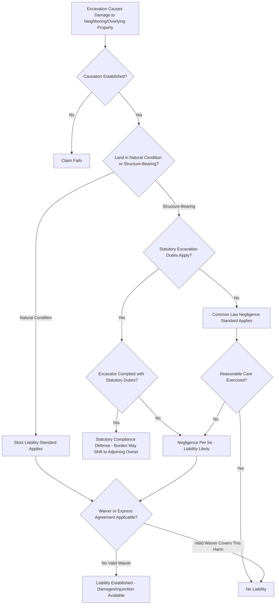

## Liability for Excavation and Support Damage

### Overview

Liability for excavation and support damage synthesizes the standards of care, causation principles, and available defenses governing claims arising when excavation activity — whether lateral (adjacent surface excavation) or subjacent (subsurface mineral extraction) — damages neighboring or overlying property. This topic draws together the substantive support-right doctrines with the procedural and evidentiary framework courts apply to actually litigate and resolve excavation damage claims, including the interplay between common law liability standards, statutory excavation duties, and the practical allocation of responsibility between excavating and affected parties.

### Standards of Liability

**Key Points**

- **Strict liability** applies under the traditional common law rule where excavation removes lateral or subjacent support from land in its **natural, unimproved condition**, requiring no showing of negligence — the plaintiff need only prove that the excavation caused the subsidence and that the land would have remained stable but for the defendant's activity.
- **Negligence-based liability** applies under the traditional rule where the damage is to land **bearing structures** whose additional weight contributed to the subsidence, requiring the plaintiff to establish the excavator failed to exercise reasonable care under the circumstances (inadequate shoring, excessive excavation depth without protective measures, failure to account for known soil conditions).
- **Statutory negligence per se** frameworks apply in many jurisdictions where excavation statutes impose specific duties (notice, shoring, depth-based protective measures), and violation of those statutory duties, if the statute is found to protect against the type of harm suffered by the class of persons the plaintiff belongs to, can establish liability without the plaintiff needing to independently prove common law negligence elements.
- **Nuisance and trespass** theories may run parallel to support-right claims where the excavation activity itself (vibration, noise, dust, unauthorized entry) causes separate compensable harm beyond the physical subsidence itself.

### Causation Issues

**Key Points**

- Excavation damage litigation frequently turns on **causation disputes** — particularly whether subsidence or structural cracking was actually caused by the defendant's excavation as opposed to pre-existing soil conditions, prior settlement, age-related structural deterioration, or an unrelated cause (drought-related soil shrinkage, a separate construction project, natural geological processes).
- Expert testimony from geotechnical engineers, structural engineers, and sometimes geologists is standard in contested excavation damage cases, addressing soil mechanics, the timing and progression of observed damage relative to the excavation timeline, and whether the excavation methodology used was consistent with the standard of care applicable in the jurisdiction.
- **Pre-excavation condition surveys** (photographic and sometimes instrumented documentation of neighboring structures' condition before excavation begins) are a common risk-management practice among excavating parties precisely because they simplify the causation inquiry if damage is later alleged, allowing before-and-after comparison rather than reliance on contested recollection.

### Defenses

**Key Points**

- **Compliance with statutory duties**: Where a jurisdiction's excavation statute specifies protective measures and the excavator complied, this often shifts responsibility (particularly for deep foundations below a specified depth) to the adjoining owner to protect their own structure, providing a significant defense against liability.
- **Pre-existing defects**: Evidence that the claimed damage existed, or the underlying structural vulnerability existed, before the excavation began, undermining the causation element of the plaintiff's claim.
- **Express waiver or agreement**: A party wall agreement, recorded covenant, or (in the subjacent support context) a severance deed's express waiver language can bar or limit a support-right claim according to its terms, subject to strict construction against the party claiming the waiver.
- **Comparative or contributory fault**: In negligence-based claims (as opposed to strict liability claims for damage to unimproved land), general tort defenses such as the plaintiff's own contributory negligence (for example, building an inadequately founded structure unreasonably close to a known property line) may reduce or bar recovery depending on the jurisdiction's fault-allocation rules.
- **Statute of limitations**: Claims must generally be brought within the applicable limitations period, with courts divided on whether the period begins running from the excavation activity itself or from the discovery of resulting damage (a "discovery rule" approach), which matters significantly for slow-developing subsidence that may not manifest visible damage until years after the excavation occurred.

### Damages and Remedies

**Key Points**

- Available remedies typically include **compensatory damages** for the cost of repair or, where repair is impractical or the property's value is diminished beyond repair cost, the diminution in property value caused by the subsidence.
- **Injunctive relief** may be available to halt ongoing or imminent excavation activity that threatens support rights, particularly where monetary damages after the fact would be an inadequate remedy given the risk of catastrophic structural failure.
- In the subjacent support and mining context specifically, statutory and regulatory frameworks (such as state mining subsidence programs) frequently provide **structured compensation mechanisms** — sometimes including dedicated subsidence insurance funds or mandatory repair obligations — operating alongside or instead of traditional tort litigation.

### Liability Determination Framework

### Illustrative Example

A general contractor excavates for a new building's foundation adjacent to an existing office building, without commissioning a pre-excavation condition survey and without complying with a state statute requiring 30 days' advance written notice to adjoining owners before excavation below a specified depth. Weeks later, the adjoining office building develops significant foundation cracking. Because the contractor failed to comply with the statutory notice requirement, the adjoining owner benefits from a strong negligence-per-se argument, sidestepping the more difficult task of independently proving the common law negligence elements from scratch. The contractor's defense strategy would likely focus on causation — attempting to show the cracking resulted from pre-existing structural issues or unrelated settlement rather than the excavation — precisely because no pre-excavation survey exists to definitively establish the building's prior condition, illustrating why such surveys are standard risk-management practice for excavating parties seeking to limit their exposure in exactly this kind of dispute.

### Related Topics

- Right to Lateral Support of Land
- Right to Subjacent Support
- Excavation Notice Statutes and Protective Measures
- Nuisance Doctrine and Interference with Land Use
- Party Wall Agreements and Shared Structural Support
- Professional Negligence Claims Against Surveyors and Engineers
- Statute of Limitations and the Discovery Rule in Property Damage Claims