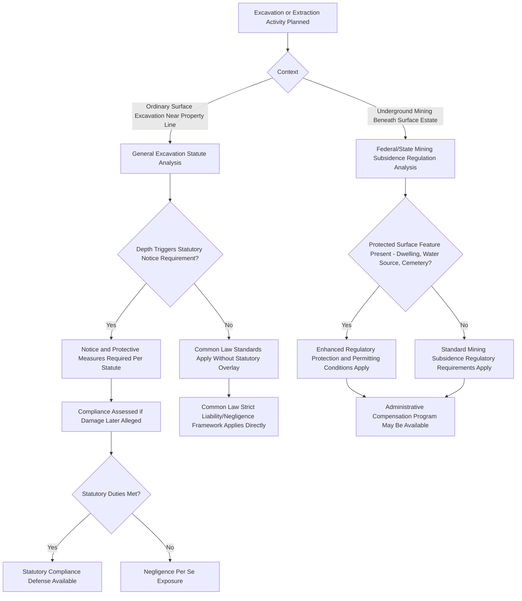

## Statutory Modification of Support Rights

### Overview

While the common law lateral and subjacent support doctrines developed through judicial decisions, legislatures across the United States have substantially modified, supplemented, and in some contexts superseded these common law rules through statutes and regulations. This chapter surveys the principal categories of statutory modification — general excavation statutes, mining-specific subsidence legislation, and building code integration — examining how legislative intervention has reshaped the practical allocation of risk and responsibility between adjoining landowners and between surface and mineral estate holders.

### Rationale for Statutory Intervention

**Key Points**

- The common law's structure/unimproved-land distinction (strict liability for natural land, negligence for structures) developed in an era of lower-density development and less sophisticated construction and excavation technology; as urban and suburban development intensified, legislatures increasingly viewed the common law framework as producing insufficiently predictable or protective outcomes, particularly for adjoining structures whose owners had no practical ability to prevent a neighbor's excavation decisions.
- Statutory intervention also reflects a shift toward **ex ante** risk prevention (notice requirements, mandatory protective measures before excavation begins) rather than relying solely on **ex post** litigation after damage has already occurred, reflecting a policy judgment that preventing subsidence damage is generally more efficient than compensating for it after the fact.
- In the mining context specifically, statutory intervention responds to the scale and public significance of subsidence risk — affecting entire communities, water supplies, and infrastructure — in ways that individualized common law litigation between a single mineral owner and a single surface owner was not well suited to address comprehensively.

### General Excavation Statutes

**Key Points**

- Many states and municipalities have enacted excavation statutes imposing **notice requirements** — typically requiring an excavating party to provide adjoining owners with advance written notice (commonly 10 to 30 days, varying by jurisdiction) before beginning excavation below a specified depth near a shared property line.
- These statutes frequently impose **protective measure obligations**, sometimes allocating responsibility based on excavation depth: the excavating party may be required to protect adjoining structures at the excavator's own expense up to a certain depth (often tied to the depth of a standard foundation), while placing responsibility on the adjoining owner to protect their own structure below that depth if their foundation extends unusually deep or was inadequately constructed relative to the property line.
- Some jurisdictions grant the excavating party a **right of entry** onto the adjoining property, subject to conditions (notice, reasonable hours, liability for damage caused during entry), to install shoring, underpinning, or other protective measures necessary to comply with statutory protective obligations.
- Violation of these statutory duties is commonly treated as **negligence per se** in resulting litigation, as discussed in the liability framework for excavation damage, providing plaintiffs a more direct path to establishing liability than common law negligence proof alone.

### Mining and Subsidence-Specific Legislation

**Key Points**

- Federal legislation, most significantly the **Surface Mining Control and Reclamation Act (SMCRA)**, establishes a regulatory framework for surface and underground coal mining that includes permitting requirements, subsidence control and monitoring obligations, and repair or compensation mandates for damage to protected surface structures and features.
- State mining regulatory programs, often operating under federal approval as the primary regulatory authority for coal mining within the state (a "primacy" arrangement under SMCRA), implement and sometimes exceed federal minimum subsidence protection standards, including restrictions on mining beneath occupied dwellings, public buildings, cemeteries, and water sources without specific protective measures or compensation arrangements.
- Some states maintain **subsidence insurance funds** or mandatory compensation programs specifically for mining-related surface damage, providing surface owners a structured administrative remedy that can operate independently of, and sometimes more efficiently than, common law tort litigation against the mineral owner.
- [Unverified] The specific scope, funding mechanisms, and eligibility requirements of state subsidence compensation programs vary considerably and change over time through legislative and regulatory action; current program details for any specific state should be verified against that state's mining regulatory agency rather than assumed from general principles.

### Interaction with Building Codes and Zoning

**Key Points**

- Modern building codes frequently incorporate foundation depth, soil-bearing capacity, and geotechnical investigation requirements that indirectly affect support-right disputes by establishing baseline construction standards a structure's owner was required to meet, which can bear on causation and comparative fault analysis in excavation damage litigation.
- Some jurisdictions integrate excavation notice and protective-measure requirements directly into local building and zoning codes rather than (or in addition to) freestanding excavation statutes, meaning practitioners must review both state statutory law and applicable local code provisions to identify the full scope of statutory obligations relevant to a given excavation project.

### Preservation of Common Law Remedies

**Key Points**

- Most statutory excavation and subsidence frameworks are understood as **supplementing** rather than wholly displacing common law lateral and subjacent support doctrines, meaning a plaintiff may often plead both a statutory violation claim and an independent common law claim (strict liability for natural land subsidence, or negligence for structural damage) arising from the same excavation event.
- Where a statute expressly provides an exclusive remedy or preempts common law claims for a specific category of harm (occasionally seen in some comprehensive mining subsidence compensation programs), courts will enforce that exclusivity according to the statute's terms, but such express preemption is not the default assumption absent clear statutory language to that effect.

### Statutory Modification Landscape

### Illustrative Example

A mid-sized city's building code incorporates a state excavation statute requiring 20 days' written notice to adjoining owners and mandatory shoring for excavations exceeding 12 feet in depth within 10 feet of a property line. A developer excavating a 15-foot foundation provides proper notice and installs code-compliant shoring, fully satisfying the statutory framework. Despite full compliance, minor cracking nonetheless appears in the adjoining building's older, unusually shallow foundation. Because the statute allocates responsibility for protecting inadequately founded adjoining structures below the standard protective depth to the adjoining owner, and the developer complied with all applicable statutory duties, the developer likely has a strong statutory compliance defense, shifting the practical burden of the shallow foundation's vulnerability onto the adjoining owner — a markedly different outcome than would apply under the unmodified common law framework, where the developer's compliance with a reasonable-care standard would need to be litigated from scratch without the benefit of a clear statutory safe harbor.

### Related Topics

- Right to Lateral Support of Land
- Right to Subjacent Support
- Liability for Excavation and Support Damage
- Surface Mining Control and Reclamation Act Framework
- Building Codes and Foundation Requirements
- Negligence Per Se in Property Law Contexts
- Subsidence Insurance and Compensation Funds