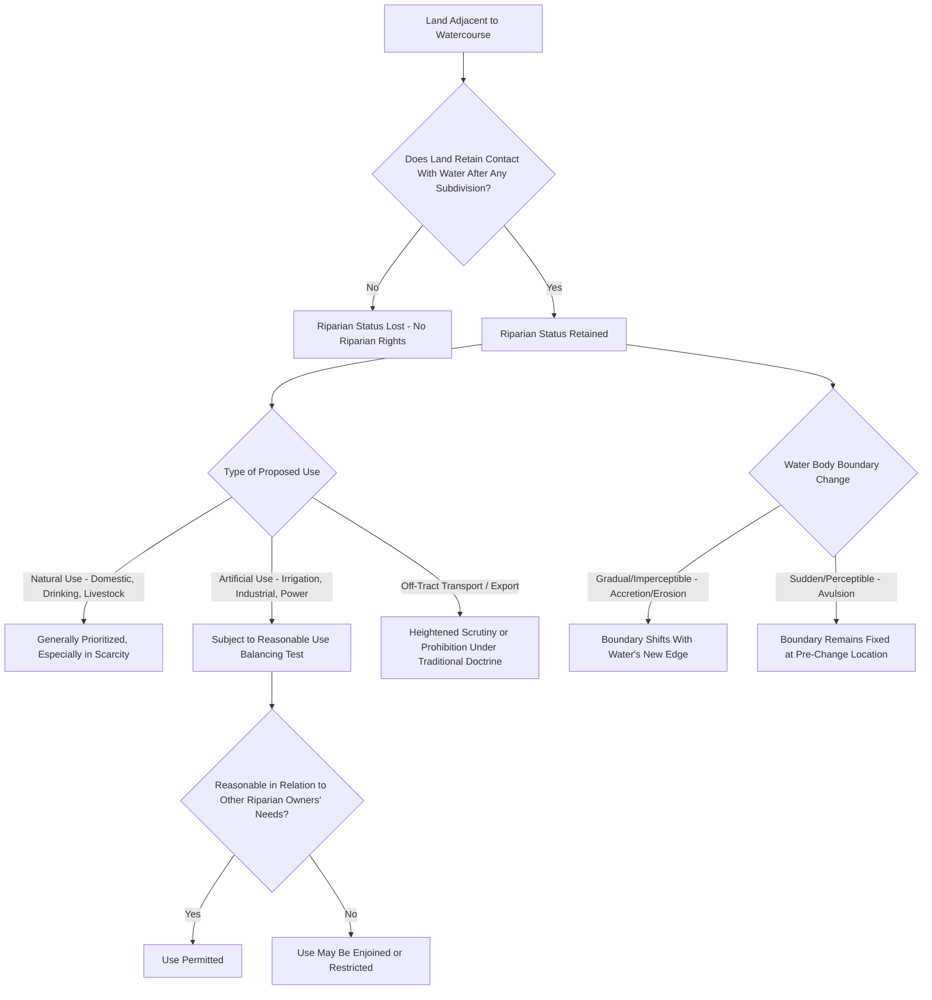

## Riparian Rights Doctrine

### Overview

The riparian rights doctrine governs water use rights for landowners whose property is adjacent to a watercourse — a river, stream, or lake. Rooted in English common law and adopted broadly throughout the eastern and midwestern United States, the doctrine ties water use rights to land ownership along the water body, in contrast to the prior appropriation doctrine prevalent in the arid western states, which allocates water rights based on the timing of first beneficial use independent of land adjacency. Riparian rights doctrine addresses both the entitlement to use adjacent water and the boundary-related consequences of a water body's location and movement.

### Core Principles of Riparian Status

**Key Points**

- Riparian rights attach to land that is **contiguous to a watercourse** — the land's proximity and adjacency to the water body, not any separate act of appropriation or permit, is what creates the right, meaning riparian rights are inherently tied to the parcel and generally cannot be severed from the land and transferred independently to a non-riparian owner under traditional doctrine.
- The classic riparian right is **usufructuary** — a right to reasonable use of the water while it passes by or through the riparian land, rather than ownership of the water itself, which under most formulations remains a shared resource among all riparian owners along the watercourse.
- Riparian status is generally limited to the **smallest tract held under one title** that touches the water; when a larger tract with water frontage is subdivided, only the portion(s) retaining actual contact with the watercourse generally retain riparian status under the traditional rule, meaning landlocked parcels created by subdivision typically lose riparian rights even if they were once part of a larger riparian tract.

### The Reasonable Use Doctrine

**Key Points**

- Most American riparian jurisdictions have moved from the older, more rigid **natural flow theory** (which restricted each riparian owner to uses that did not materially diminish the quantity or quality of water available to downstream riparian owners) to the modern **reasonable use doctrine**, which permits each riparian owner to make reasonable use of the water, judged in relation to the reasonable needs of other riparian owners on the same watercourse.
- Reasonableness is evaluated through a multi-factor balancing analysis, commonly considering: the purpose and suitability of the use, the economic and social value of the use, the harm caused to other riparian owners, the practicality of avoiding harm, the extent of the use relative to the watercourse's total flow, and the protection of existing values and investments made in reliance on established uses.
- Courts applying the reasonable use doctrine engage in case-by-case adjudication rather than applying a bright-line quantitative allocation formula, which provides flexibility to address changing conditions and competing uses but correspondingly produces less ex ante certainty than the prior appropriation system's "first in time, first in right" priority structure.

### Categories of Riparian Use

**Key Points**

- **Natural uses**: Uses satisfying basic human and household needs (drinking water, domestic use, watering livestock in reasonable numbers) are traditionally given priority over other uses, and in times of scarcity, natural uses may be preferred even at the expense of otherwise-reasonable artificial uses by other riparian owners.
- **Artificial uses**: Uses beyond basic natural needs, including irrigation, manufacturing, power generation, and commercial or industrial water use, which must be reasonable in relation to other riparian owners' rights and are more readily subject to restriction during periods of water scarcity or competing demand.
- Some jurisdictions further distinguish uses **on** the riparian land from proposed uses that would transport water **off** the riparian tract entirely (for use on non-riparian land or for sale/export), with the latter subject to heightened scrutiny or outright prohibition under traditional riparian doctrine, since diverting water away from the watercourse and the riparian corridor altogether conflicts with the doctrine's fundamental premise that water rights are tied to and shared among the land bordering the watercourse.

### Riparian Boundaries and Water Body Movement

**Key Points**

- **Accretion**: The gradual, imperceptible addition of soil to riparian land through natural water action (sediment deposit) belongs to the riparian owner, and the property boundary shifts to follow the new water's edge — reflecting the policy that riparian owners should retain access to the water regardless of gradual natural changes in the shoreline.
- **Erosion**: The gradual, imperceptible loss of riparian land through natural water action results in a corresponding loss of land to the riparian owner, with the boundary similarly shifting to follow the water's new edge.
- **Avulsion**: A sudden, perceptible change in a watercourse's course (such as a flood-driven channel shift) does **not** change the property boundary, which remains fixed at its pre-avulsion location, distinguishing this from the gradual accretion/erosion rule — the key distinguishing factor is the suddenness and perceptibility of the change rather than its ultimate magnitude.
- **Reliction**: The gradual recession of water exposing previously submerged land, which similarly accrues to the riparian owner under principles analogous to accretion.

### Riparian Rights in Navigable vs. Non-Navigable Waters

**Key Points**

- For **navigable** waters, ownership of the underlying streambed or lakebed is generally vested in the state under the **public trust doctrine**, with riparian owners holding rights of access, wharfage, and reasonable use but not ownership of the bed itself; the state holds the bed in trust for public uses including navigation, fishing, and commerce.
- For **non-navigable** watercourses, riparian owners typically own the streambed to the **thread** (center line) of the stream, or, for non-navigable lakes, riparian owners commonly hold rights extending to the center point or according to a proportional formula, subject to jurisdiction-specific rules.
- Determining navigability for these purposes is itself a body of doctrine (often distinguishing "navigable in fact" for commercial purposes from broader recreational navigability standards used in some states), and the applicable test varies by jurisdiction and by the specific legal question at issue (title to the bed versus public access rights).

### Riparian Rights Framework

### Illustrative Example

A landowner with frontage on a non-navigable river operates a small orchard and wishes to significantly expand irrigation withdrawals during a drought year, while a downstream riparian neighbor relies on the same river for household drinking water and modest livestock watering. Applying the reasonable use doctrine, a court would likely prioritize the downstream neighbor's natural domestic and livestock uses over the orchard owner's expanded artificial irrigation use during the scarcity period, even though both uses might be considered reasonable in times of abundant flow — illustrating how the reasonable use doctrine's case-by-case, priority-sensitive balancing differs from a strict proportional allocation that would simply divide available water equally regardless of use type. If a subsequent flood suddenly shifts the river's channel entirely around the orchard property, the boundary between the two parcels would remain fixed at its pre-flood location under the avulsion doctrine, even though the river itself now flows through what was previously the orchard owner's neighbor's land.

### Related Topics

- Prior Appropriation Doctrine in Western Water Law
- Public Trust Doctrine and Navigable Waters
- Accretion, Erosion, and Avulsion Boundary Rules
- Groundwater Rights and Aquifer Regulation
- Riparian and Littoral Boundaries Along Water Bodies
- Interstate Water Allocation Compacts
- Wetlands Regulation and Clean Water Act Jurisdiction