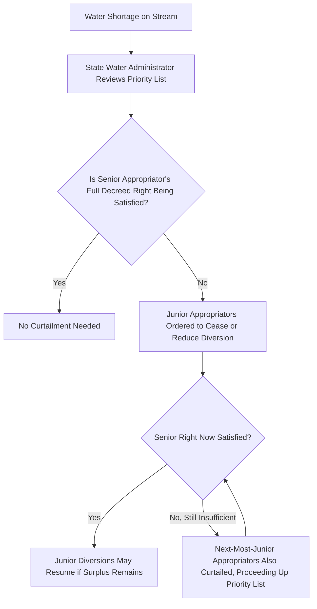

## Prior Appropriation Doctrine

### Overview

The prior appropriation doctrine is the dominant water rights allocation system in the arid and semi-arid western United States, allocating water use rights based on the chronological priority of beneficial use rather than land adjacency to a watercourse. Summarized by the maxim "first in time, first in right," the doctrine emerged from the practical realities of mining camps and irrigation-dependent agriculture in the 19th-century American West, where water scarcity and the need to transport water away from its natural course to distant points of use made the riparian doctrine's land-adjacency requirement poorly suited to the region's water management needs.

### Historical and Policy Origins

**Key Points**

- The doctrine developed informally among miners and settlers in California and other western territories during the mid-19th century, who established customary rules recognizing the first person to divert and beneficially use water from a stream as having a superior right to that water, later formalized into state constitutional provisions, statutes, and administrative permitting systems.
- Unlike riparian doctrine's premise that water rights are inherently tied to land bordering the watercourse, prior appropriation doctrine explicitly permits diverting water **away from its natural source** for use on non-adjacent land, reflecting the practical necessity of transporting water to mining operations, distant farmland, and growing settlements that were frequently not located directly along a water body.
- Most western states adopted prior appropriation as their exclusive water rights system, while a smaller group of states (sometimes called "hybrid" states, including states like California, Texas, and others) recognize elements of both riparian and prior appropriation doctrines, creating more complex dual systems requiring careful jurisdiction-specific analysis.

### Elements of a Valid Appropriative Right

**Key Points**

- **Intent to appropriate**: The claimant must demonstrate an intention to apply water to a beneficial use, typically evidenced by taking the initial steps toward diversion and use.
- **Diversion**: Traditional doctrine requires an actual physical diversion of water from its natural course (through a ditch, canal, pipe, or similar structure), distinguishing appropriative rights from in-stream or non-diversionary uses, though many modern state statutes have created specific exceptions or separate permitting categories for certain non-diversionary uses such as instream flow rights for fish habitat or recreational purposes.
- **Beneficial use**: The water must be applied to a recognized beneficial use — historically including irrigation, mining, domestic use, livestock watering, and industrial use, with many modern statutes expanding the recognized categories to include municipal use, recreation, fish and wildlife habitat, and other environmental or public interest uses.
- **Priority date**: The right's priority relative to other appropriators on the same water source is fixed by the date the appropriation was perfected (historically, the date of first diversion and application to beneficial use, though modern permit systems generally fix priority based on the filing date of a state-issued permit application).

### The Priority System and "First in Time, First in Right"

**Key Points**

- Appropriative rights are ranked in **strict chronological priority**, meaning senior (earlier-priority) appropriators are entitled to receive their full decreed water right before any junior (later-priority) appropriator receives any water at all, in sharp contrast to riparian doctrine's proportional reasonable-use balancing among all riparian owners simultaneously.
- During times of water shortage, this priority system operates through a process often called **"calling the river"** or administrative curtailment, where a senior appropriator whose water right is not being satisfied can require junior appropriators upstream (or otherwise affecting the senior's supply) to cease diverting until the senior's full decreed right is satisfied, administered by a state water rights administrator or engineer's office.
- This all-or-nothing priority structure provides significantly greater certainty and predictability for senior right holders compared to riparian doctrine's case-by-case reasonableness balancing, but correspondingly imposes greater risk and potential total loss of water supply on junior appropriators during shortage conditions.

### Beneficial Use as the Basis and Measure of the Right

**Key Points**

- Beneficial use is not merely a requirement for initially establishing an appropriative right; it also functions as the **continuing measure and limit** of the right — an appropriator generally cannot claim or exercise a water right beyond what is actually necessary for the specific beneficial use to which the water has been applied, embodied in the frequently cited principle that "beneficial use is the basis, the measure, and the limit" of an appropriative water right.
- **Forfeiture and abandonment**: Failure to continue putting appropriated water to beneficial use for a statutorily specified period (commonly several consecutive years, varying by state) can result in forfeiture of the unused portion of the right under many state statutes, or abandonment under common law principles requiring proof of intent to permanently relinquish the right; this creates an ongoing "use it or lose it" dynamic distinct from riparian rights, which generally do not require continuous exercise to remain valid.
- **Change of use applications**: Appropriators seeking to change the point of diversion, place of use, or type of use of their water right typically must obtain administrative approval, with the change generally permitted only to the extent it does not injure other water rights holders who may have come to rely on return flows or other aspects of the original use pattern.

### Modern Permitting and Administration

**Key Points**

- Most prior appropriation states have replaced the older, purely judicial "first to divert" system with **administrative permit systems**, requiring prospective appropriators to file a permit application with a state water rights agency, which reviews the application for availability of unappropriated water, potential injury to existing rights, and compliance with beneficial use and public interest requirements before issuing a permit establishing the priority date and right.
- States generally maintain formal **water rights adjudication** processes and public records (sometimes called a "priority list" or "tabulation") documenting the relative priority, quantity, and terms of all recognized appropriative rights on a given water source, which water users and administrators rely upon during shortage administration.

### Comparison to Riparian Doctrine

| Feature | Prior Appropriation | Riparian Rights |
| --- | --- | --- |
| Basis of right | Priority of first beneficial use | Adjacency to watercourse |
| Allocation during shortage | Strict priority (senior fully satisfied first) | Proportional reasonable use balancing |
| Land adjacency required | No | Yes (traditionally) |
| Transport off-tract permitted | Yes | Generally restricted or prohibited traditionally |
| Continuous use required | Yes (use it or lose it - forfeiture/abandonment) | Generally no |
| Predictability for senior users | High | Lower (case-by-case reasonableness) |
| Predominant region | Arid Western U.S. | Eastern and Midwestern U.S. |

### Priority Administration Framework

### Illustrative Example

A rancher established an irrigation water right in 1920 with a priority date of April 1920, diverting water from a river to irrigate hayfields several miles from the river itself. A newer agricultural operation began diverting water from the same river upstream in 1985 for a different irrigation project. During a severe drought year when the river's flow is insufficient to satisfy all appropriators, the state water administrator, applying strict priority, requires the 1985 junior appropriator to cease diversion entirely until the 1920 senior appropriator's full decreed water right is satisfied — even though the junior appropriator's land is physically closer to the river and even though the junior appropriator's own crops may suffer complete loss as a result. This outcome would be foreign to a riparian jurisdiction, where a court applying the reasonable use doctrine would instead balance both parties' needs and likely require some proportional reduction affecting both users rather than imposing a complete cutoff on one party based purely on the chronological order in which the two rights were established.

### Related Topics

- Riparian Rights Doctrine
- Beneficial Use, Forfeiture, and Abandonment of Water Rights
- Groundwater Rights and Aquifer Regulation
- Interstate Water Allocation Compacts
- Public Trust Doctrine and Navigable Waters
- Change of Use and Change of Point of Diversion Applications
- Federal Reserved Water Rights Doctrine