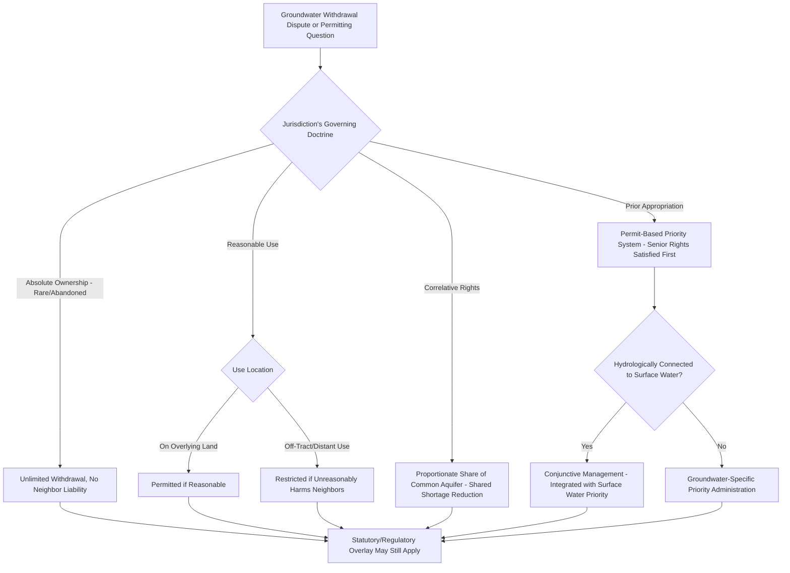

## Groundwater Rights

### Overview

Groundwater rights govern the legal entitlement to withdraw and use water located beneath the surface of land, a resource historically regulated with far less doctrinal uniformity than surface water due to the practical difficulty of observing and measuring subsurface water movement. American jurisdictions have developed several distinct doctrinal approaches to groundwater allocation, ranging from rules granting landowners nearly unrestricted extraction rights to more regulated systems resembling surface water allocation frameworks, and the doctrine has evolved significantly as scientific understanding of aquifer hydrology and the interconnection between groundwater and surface water has improved.

### Major Doctrinal Approaches

#### The Rule of Absolute Ownership (English Rule)

**Key Points**

- Under the oldest common law approach, a landowner is entitled to withdraw **unlimited quantities** of groundwater from beneath their land for any purpose, without liability to neighboring landowners even if the withdrawal depletes or interferes with their neighbors' wells, reflecting an early view that groundwater movement was too mysterious and unpredictable to support a more nuanced liability framework.
- This rule has been substantially abandoned or significantly modified in most American jurisdictions in favor of more restrictive doctrines, reflecting improved hydrological understanding and growing recognition of groundwater as a shared, finite resource subject to depletion and interference effects between wells.

#### The Reasonable Use Rule (American Rule)

**Key Points**

- A significant number of states apply a **reasonable use** standard, permitting a landowner to withdraw groundwater for reasonable use on the overlying land, but restricting or prohibiting withdrawal for use on distant, non-overlying land where such off-tract use unreasonably harms neighboring landowners' groundwater supply.
- This approach parallels riparian doctrine's reasonable use balancing for surface water, but applies specifically to groundwater and generally does not require the same degree of proximity or "riparian" status relative to any particular water body, since groundwater use rights are generally tied to ownership of the overlying land itself.

#### The Correlative Rights Doctrine

**Key Points**

- Under the correlative rights doctrine, adopted prominently in California and other states, landowners overlying a common aquifer or groundwater basin hold **proportionate, coequal rights** to the reasonable use of the groundwater, similar in structure to riparian rights among owners along a single watercourse, requiring **shared reductions** among all users during shortage rather than a strict priority-based allocation.
- This doctrine explicitly recognizes the aquifer as a shared, common resource among all overlying landowners, in contrast to the absolute ownership rule's treatment of groundwater as essentially belonging exclusively to whoever can extract it from beneath their own land regardless of the effect on neighbors.

#### The Prior Appropriation Doctrine (Applied to Groundwater)

**Key Points**

- A number of western states apply the same "first in time, first in right" priority principles used for surface water under prior appropriation doctrine to groundwater as well, particularly for larger-scale or non-domestic groundwater withdrawals, requiring permits and establishing chronological priority among groundwater appropriators.
- Some of these states apply **conjunctive management** regimes, integrating groundwater and surface water administration where the two sources are hydrologically connected, recognizing that groundwater pumping can directly reduce surface stream flows (and vice versa) and therefore should be administered under a unified priority system rather than treated as entirely separate resources.

### Statutory and Regulatory Groundwater Management

**Key Points**

- Given growing recognition of aquifer depletion risks, many states — regardless of which common law doctrine technically applies as a default rule — have layered comprehensive statutory and regulatory groundwater management systems on top of or in place of the common law framework, including permitting requirements, well spacing and metering rules, and designated **groundwater management areas** or **critical groundwater areas** subject to heightened regulatory restriction where depletion has been identified as a significant concern.
- Some states have established specialized **groundwater conservation districts** or similar local governance bodies with authority to regulate well permitting, set pumping limits, and manage aquifer resources at a sub-state regional level, reflecting the fact that aquifer boundaries often do not correspond neatly to political jurisdiction boundaries.
- [Inference] The trend across most groundwater-stressed states over recent decades has been toward increased regulatory oversight and management structure layered onto whatever common law doctrine technically governs by default, though the specific regulatory framework, permitting requirements, and management area designations vary considerably by state and should be verified against current state water code and regulatory agency guidance for any specific location.

### Interaction with Surface Water Rights

**Key Points**

- Because groundwater and surface water are frequently hydrologically connected (many streams are fed in part by groundwater discharge, and groundwater pumping can reduce nearby surface flows), a growing number of jurisdictions have moved toward **conjunctive use** or **conjunctive management** approaches that regulate groundwater and surface water together rather than under entirely separate legal regimes, particularly significant in prior appropriation states where senior surface water appropriators may seek to curtail junior groundwater pumping that is found to be depleting the surface stream the senior right depends upon.
- This hydrological interconnection has been a major driver of doctrinal evolution away from the absolute ownership rule, since unlimited, unregulated groundwater pumping can directly undermine surface water rights administered under an entirely separate legal framework, creating regulatory friction that many states have addressed through integrated management legislation.

### Doctrinal Comparison

| Doctrine | Withdrawal Limit | Off-Tract Use | Shortage Allocation |
| --- | --- | --- | --- |
| Absolute Ownership | Unlimited | Generally permitted | No restriction (rule largely abandoned) |
| Reasonable Use | Reasonable use on overlying land | Restricted if harms neighbors | Case-by-case reasonableness |
| Correlative Rights | Proportionate share of common aquifer | Restricted, shared basis | Proportional shared reduction |
| Prior Appropriation | Per permitted/decreed right | Generally permitted | Strict chronological priority |

### Groundwater Doctrine Selection Framework

### Illustrative Example

Two adjoining farms overlie the same aquifer in a correlative rights state. One farm significantly expands its groundwater-fed irrigation operation, causing measurable water level decline in the neighboring farm's wells during a dry season. Under correlative rights doctrine, both farms are treated as holding proportionate, coequal shares in the common aquifer, meaning the expanding farm cannot simply claim priority based on more intensive use or a particular pumping rate; instead, both farms would generally be required to share proportionate reductions during the shortage rather than one farm's expanded use taking precedence over the other's more modest, established use. Had the same dispute arisen in a neighboring prior appropriation state where groundwater permits are chronologically prioritized, the outcome might differ substantially, potentially protecting a senior-permitted farm's full withdrawal at the expense of a junior-permitted neighbor's supply, illustrating how the applicable groundwater doctrine can produce sharply different real-world outcomes for functionally similar factual disputes.

### Related Topics

- Riparian Rights Doctrine
- Prior Appropriation Doctrine
- Conjunctive Management of Groundwater and Surface Water
- Groundwater Conservation Districts and Regional Management
- Aquifer Depletion and Subsidence Risk
- Beneficial Use, Forfeiture, and Abandonment of Water Rights
- Interstate Water Allocation Compacts