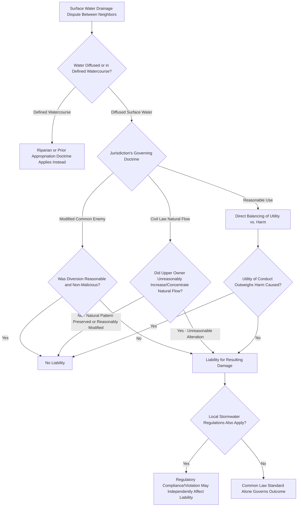

## Surface Water Drainage Rights

### Overview

Surface water drainage rights govern the legal responsibilities and entitlements of landowners with respect to diffused surface water — rainfall and snowmelt runoff that has not yet formed a defined watercourse — as it flows across and between adjoining parcels. Unlike riparian and prior appropriation doctrines, which govern water in defined streams and lakes, surface water drainage doctrine addresses the more common and geographically universal problem of stormwater and runoff management between neighboring properties, and American jurisdictions have developed three principal doctrinal approaches to allocate the resulting rights and liabilities.

### Defining Diffused Surface Water

**Key Points**

- Diffused surface water is water from rain, melting snow, or springs that spreads over the surface of the ground without following a defined channel, bed, or banks — once such water gathers into a natural, identifiable watercourse (even a small one), it generally becomes subject to the separate doctrines governing watercourses (riparian or prior appropriation) rather than diffused surface water rules.
- The distinction matters significantly because the legal rules governing a landowner's rights and liabilities differ substantially depending on whether water is still diffused across the land or has coalesced into a defined channel, and disputes frequently involve factual questions about exactly when and where diffused water transitions into a watercourse.

### The Common Enemy Doctrine

**Key Points**

- Under the common enemy doctrine, historically the majority American rule, surface water is treated as a **common enemy** that each landowner may fend off or expel from their own property by any means necessary, **without liability** to neighboring landowners for resulting damage — a landowner may grade, fill, or otherwise alter their land to protect it from surface water even if this diverts additional water onto a neighbor's property.
- The doctrine's traditional rigor has been substantially softened in most jurisdictions that retain it, through a **"reasonable use" modification** or a **"good husbandry"** limitation, requiring that the landowner's drainage or diversion measures be reasonable and not undertaken with unnecessary harm to neighboring land, effectively converging the doctrine toward something resembling the civil law rule's underlying fairness concerns while retaining nominal common enemy terminology.
- Modified common enemy jurisdictions typically still permit ordinary land development activities that incidentally alter drainage patterns (construction, grading, landscaping) so long as the landowner does not engage in unreasonable, malicious, or unnecessarily harmful diversion specifically intended to dump water onto a neighbor.

### The Civil Law (Natural Flow) Doctrine

**Key Points**

- Under the civil law doctrine, adopted in a substantial number of states, each parcel of land owes a **natural servitude** to receive surface water that naturally drains onto it from higher, upstream land, and the upper landowner is prohibited from unreasonably increasing, concentrating, or altering the natural flow of surface water onto the lower landowner's property in a way that causes damage.
- The doctrine protects the **natural drainage pattern** as it existed before development — the lower landowner must accept water that would naturally flow onto their land in its undeveloped state, but the upper landowner may not artificially concentrate diffuse natural runoff into a single discharge point, materially increase the volume or velocity of flow through impervious surface development, or otherwise alter the natural drainage pattern in ways that impose additional burden on the lower estate.
- Civil law jurisdictions generally permit **reasonable development-related changes** to drainage patterns (a landowner is not frozen into permanently unimproved land use merely because any development might alter runoff characteristics), but require that such changes not unreasonably increase the burden imposed on lower landowners, again converging in practice with a reasonableness-based standard similar to the modified common enemy approach.

### The Reasonable Use Rule (for Diffused Surface Water)

**Key Points**

- A growing number of jurisdictions, including some that have expressly rejected both the traditional common enemy and pure civil law approaches, have adopted a direct **reasonable use** rule for diffused surface water, evaluating each landowner's drainage-affecting conduct under a general reasonableness standard weighing the utility of the conduct against the gravity of harm caused to neighboring landowners, drawing on general nuisance law principles rather than either of the older categorical doctrines.
- This approach explicitly abandons the common enemy doctrine's presumption of non-liability and the civil law doctrine's presumption of an owed natural servitude, in favor of a case-by-case balancing test similar in structure to riparian reasonable use doctrine, considering factors such as the necessity and reasonableness of the drainage alteration, the foreseeability and extent of harm, and whether the harm could have been avoided at reasonable cost.
- [Inference] Given the trend across recent decades toward reasonableness-based standards even within nominally common-enemy and civil-law jurisdictions, the practical distinctions between the three doctrinal labels have narrowed considerably in many states, though the formal doctrinal label a jurisdiction applies can still affect the burden of proof and specific factors considered, and should be confirmed against current state case law for any specific matter.

### Development-Related Drainage Issues

**Key Points**

- Modern land development significantly increases **impervious surface** coverage (rooftops, pavement, compacted soil), which increases runoff volume and velocity compared to natural, vegetated conditions, making development-related drainage alteration one of the most common sources of surface water disputes regardless of which doctrinal label a jurisdiction applies.
- Many jurisdictions layer **stormwater management regulations** (municipal stormwater ordinances, state environmental permitting requirements, detention and retention pond requirements) on top of the common law drainage doctrine, requiring developers to manage post-development runoff to approximate pre-development rates and patterns, which significantly affects the practical resolution of drainage disputes involving newly developed property.
- **Artificial drainage systems** (constructed ditches, storm sewers, culverts) installed by a landowner or a government entity raise additional questions distinct from natural diffused-water doctrine, often governed by separate easement, dedication, or governmental drainage authority principles rather than the common law diffused surface water rules discussed here.

### Doctrinal Comparison

| Feature | Common Enemy (Modified) | Civil Law (Natural Flow) | Reasonable Use |
| --- | --- | --- | --- |
| Default presumption | No liability for expelling water | Lower land owes natural drainage servitude | No default presumption either way |
| Governing standard | Reasonableness limits the no-liability rule | Reasonableness limits the natural servitude | Direct case-by-case balancing |
| Development accommodation | Generally permitted if not unreasonable/malicious | Generally permitted if not unreasonably increasing burden | Weighed directly in balancing test |
| Theoretical basis | Self-defense against a "common enemy" | Natural servitude between higher/lower estates | General nuisance-law balancing |

### Drainage Dispute Analysis Framework

### Illustrative Example

An upper-elevation landowner in a civil law jurisdiction paves a large new parking lot, replacing what was previously absorbent grassland, and installs a drainage pipe that concentrates the resulting runoff into a single high-volume discharge point directed at the boundary with a lower-elevation neighbor. The lower landowner's yard, previously subject only to gently diffused natural runoff, begins experiencing significant erosion and periodic flooding from the concentrated discharge. Under civil law doctrine, while the lower landowner owes a natural servitude to accept water that would naturally flow onto the property, the upper landowner's artificial concentration of runoff into a single high-velocity discharge point represents an unreasonable alteration of the natural drainage pattern beyond what the natural servitude requires the lower owner to accept, likely supporting a claim for damages or injunctive relief requiring the upper owner to install detention or dispersal measures. The same result would likely follow under a reasonable use jurisdiction's direct balancing test, given the significant harm caused relative to the modest cost of installing reasonable stormwater management measures, though the doctrinal label and specific factors emphasized in the court's analysis would differ.

### Related Topics

- Riparian Rights Doctrine
- Nuisance Doctrine and Interference with Land Use
- Stormwater Management Regulations and Municipal Ordinances
- Accretion, Erosion, and Avulsion Boundary Rules
- Right to Lateral Support of Land
- Wetlands Regulation and Clean Water Act Jurisdiction
- Drainage Easements and Governmental Drainage Authorities