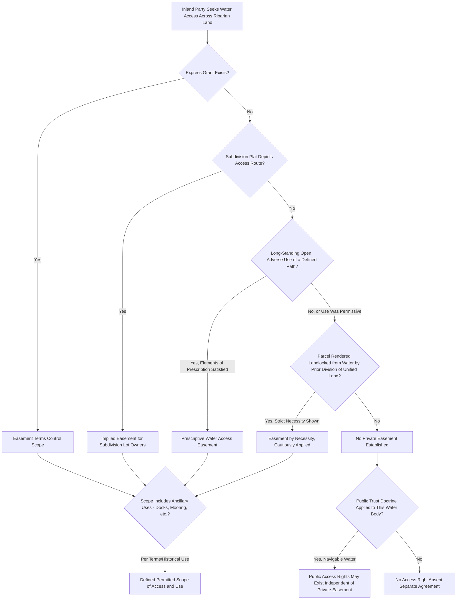

## Water Access Easements

### Overview

Water access easements grant a non-riparian or otherwise non-adjacent party the right to cross intervening land in order to reach a river, lake, or other water body — a distinct legal concept from riparian rights themselves, since riparian status alone does not guarantee that other parties can access the water body across a riparian owner's land, nor does it automatically grant a riparian owner a right to cross a neighbor's land to reach a different access point. These easements are essential in practice wherever a water body's shoreline is fragmented among multiple owners, where inland parcels seek recreational or practical access to nearby water, or where public access is sought across privately held riparian land.

### Creation of Water Access Easements

**Key Points**

- **Express grant**: The most straightforward and common method — a riparian landowner expressly grants an easement, typically by recorded deed, allowing a specified party (an inland neighbor, a subdivision's lot owners collectively, or a public entity) to cross the riparian land to reach the water, often with defined terms addressing the permitted path, width, and scope of use (foot access only, boat launching, dock construction).
- **Implication from subdivision plats**: Where a developer subdivides land near a water body and the recorded plat depicts a path, walkway, or common area leading to the water, courts frequently imply an easement benefiting the subdivision's lot owners to use that access route, applying reasoning similar to implied easements from recorded plats generally, on the theory that purchasers relied on the depicted water access when buying their lots.
- **Prescription**: Long-continued, open, notorious, and adverse use of a defined path to reach water across another's land can, where the general elements of prescriptive easements are satisfied, establish a prescriptive water access easement, though permissive historical use (common where landowners have traditionally allowed informal public or neighborly access) defeats a prescriptive claim just as it does in other prescriptive easement contexts.
- **Necessity**: In more limited circumstances, an easement by necessity may be found where a parcel was rendered landlocked from water access as a result of a division of previously unified land, applying the same strict necessity-based reasoning used for landlocked access easements generally, though courts apply this theory more cautiously for water access than for basic ingress/egress necessity given the less fundamental nature of water access compared to access to a public road.

### Scope of Water Access Easements

**Key Points**

- The permitted scope of use is defined by the easement's terms (express grant) or by the reasonably contemplated purpose at the time of creation (implied or prescriptive easements) — a right of access "to reach the lake" may or may not include ancillary rights such as constructing a dock, mooring a boat, or swimming, depending on the specific language and, for implied or prescriptive easements, the historical pattern of use that gave rise to the right.
- Many water access easement disputes center on whether ancillary structures or uses (docks, boat lifts, permanent moorings) fall within the scope of a general access easement or exceed it, requiring courts to construe the easement's language and purpose much as they would for scope disputes involving any other type of easement.
- Where multiple parties share a single water access easement (common in shared-access developments), courts apply general shared-easement principles requiring each user to exercise reasonable use that does not unreasonably interfere with other easement holders' co-equal rights to use the same access.

### Distinguishing Water Access Easements from Riparian Status

**Key Points**

- A water access easement grants a **right to reach** the water across another's land; it does not itself confer **riparian rights** (the substantive right to use the water for irrigation, domestic use, etc.) unless the easement's terms or the applicable jurisdiction's law specifically extends such rights to the easement holder.
- Some jurisdictions treat a sufficiently broad and long-established water access easement as functionally conferring quasi-riparian use rights on the easement holder (particularly for recreational uses like swimming, fishing, and boating), while other jurisdictions maintain a stricter separation, treating the easement as limited to physical access and requiring separate legal analysis (or express grant) before recognizing any broader water use rights in the easement holder.
- This distinction matters significantly in disputes where an inland lot owner with a water access easement seeks to engage in a water use (constructing a permanent dock, drawing water for irrigation) that a true riparian owner would be entitled to undertake, but which may exceed what the access easement itself was intended to convey.

### Public Access Considerations

**Key Points**

- Beyond private easements between neighboring landowners, **public trust doctrine** principles in many states establish or preserve public access rights to navigable waters even across privately owned riparian land, at least up to the ordinary high water mark, though the precise scope of public access rights (whether limited to the water itself, or extending onto the dry portion of the beach or shoreline) varies considerably by state.
- Some states have enacted specific public access statutes or programs requiring public access points to be established or preserved as a condition of shoreline development approval, operating alongside and sometimes in tension with private riparian owners' exclusive use expectations for the dry portions of their waterfront property.
- Disputes over the boundary between public trust access rights and private riparian exclusivity frequently generate significant litigation, particularly in popular coastal and lakefront recreational areas where private owners may seek to restrict what they view as trespassing public use of beach areas that public access advocates view as protected under public trust principles.

### Creation Pathway Framework

```plaintext
===syllabot_diagram_placeholder===
```



### Illustrative Example

A developer subdivides land near a lake into twenty inland lots and two lakefront lots, recording a plat that depicts a shared pathway from the inland lots' cul-de-sac down to a small common area on the lakeshore, without any express easement language in the individual lot deeds addressing the pathway. Years later, the lakefront lot owner, having purchased one of the two waterfront parcels, attempts to fence off the depicted pathway, arguing no express easement was ever granted. Because the recorded plat clearly depicted the pathway as shared lake access at the time all twenty inland lots were purchased, most jurisdictions would imply an easement benefiting those inland lot owners, reasoning that purchasers reasonably relied on the depicted access when buying property without direct lake frontage. However, if one of the inland lot owners later attempts to install a permanent dock and boat lift at the end of the shared pathway, that use would likely be found to exceed the scope of a basic access easement implied from a plat depicting a simple walking path, since the historical use and the plat's apparent purpose supported pedestrian access to the water rather than a right to construct permanent water-based structures — illustrating the important distinction between the right to reach the water and broader riparian-style use rights that were never granted.

### Related Topics

- Riparian Rights Doctrine
- Public Trust Doctrine and Navigable Waters
- Implied Easements from Recorded Plats
- Prescriptive Easements Compared to Adverse Possession
- Easements by Necessity
- Shared Amenities and Common Area Easements
- Accretion, Erosion, and Avulsion Boundary Rules