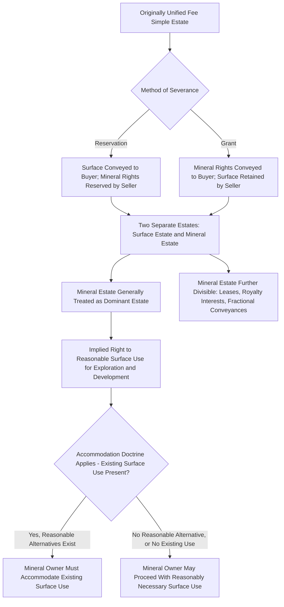

## Severance of the Mineral Estate

### Overview

Severance of the mineral estate refers to the division of what was originally a unified fee simple interest in land into two distinct estates: the **surface estate** (ownership of the surface and the right to use it for surface purposes) and the **mineral estate** (ownership of subsurface minerals and the rights necessary to explore for, develop, and extract them). Once severed, these two estates become separately alienable, separately taxable, and separately inheritable interests, and the legal relationship between the surface and mineral estate owners — particularly the mineral estate's traditionally dominant position — generates significant ongoing legal complexity in mineral-producing regions.

### Mechanisms of Severance

**Key Points**

- **Severance by reservation**: A landowner conveys the surface estate to a buyer while expressly reserving the mineral rights to themselves, retaining the mineral estate while transferring the surface estate — historically the most common method by which severed mineral estates were created, particularly during 19th and early 20th century land transactions.
- **Severance by grant**: A landowner conveys the mineral estate to a separate buyer (a mining or oil and gas company) while retaining the surface estate, achieving the same bifurcated ownership structure through the opposite transactional direction.
- **Severance by simultaneous conveyance**: Less common, but a single transaction can convey the surface to one party and the minerals to another simultaneously, achieving severance without either party being an original common owner retaining part of the estate.
- Once severance occurs, the mineral estate is generally treated as **real property** in its own right, capable of being sold, leased, mortgaged, devised by will, and subject to property tax independently of the surface estate, and title examination for mineral-producing regions requires tracing the mineral estate's chain of title separately from the surface chain.

### The Dominant Estate Doctrine

**Key Points**

- Under the traditional common law rule followed in most mineral-producing states, the mineral estate is considered the **dominant estate** relative to the surface estate, meaning the mineral owner (or their lessee) holds an implied right to use **so much of the surface as is reasonably necessary** to explore for, develop, and extract the minerals, even without express surface use language in the severance instrument.
- This implied surface use right typically includes reasonable rights to construct access roads, drilling pads, pipelines, and other infrastructure necessary for mineral development, subject to a **reasonableness** or **due regard** standard requiring the mineral owner to use only so much of the surface as is reasonably necessary and to conduct operations with reasonable regard for the surface owner's competing use of the land.
- Many jurisdictions have refined this doctrine through the **accommodation doctrine** (discussed separately in mineral rights literature), which requires mineral developers to accommodate existing surface uses where reasonable alternative means of mineral development are available that would not preclude or substantially interfere with an existing surface use.

### Bundle of Rights Within the Severed Mineral Estate

**Key Points**

- The severed mineral estate typically includes: the right to **explore** (conduct geological and geophysical surveys, drill test wells), the right to **develop and extract** minerals, the right to **reasonable surface use** as discussed above, the right to **lease** the mineral interest to a third-party operator (common in oil and gas development, where the mineral owner often leases rather than personally operates), and the right to receive **royalty** payments from production.
- Mineral estate ownership can be further subdivided: a mineral owner may sever and separately convey a portion of the mineral rights (a fractional mineral interest), retain only a **non-participating royalty interest** (a right to a share of production revenue without the accompanying right to lease or make development decisions), or create other specialized interests through subsequent conveyances, producing potentially complex layered ownership structures over time.

### What Counts as a "Mineral" for Severance Purposes

**Key Points**

- Severance instruments frequently use general terms like "minerals," "oil, gas, and other minerals," or simply "mineral rights" without precisely enumerating every substance covered, generating significant interpretive litigation over whether specific substances (coal, oil and gas, gravel, groundwater, sand, uranium, rare earth elements) fall within the granted or reserved mineral estate.
- Courts generally apply the **ordinary and natural meaning** test, asking whether the substance in question would have been commonly understood as a "mineral" by the parties at the time the severance instrument was executed, sometimes supplemented by the **surface destruction test** in a minority of jurisdictions, which excludes from the mineral estate substances whose extraction (such as certain surface or near-surface materials like sand, gravel, or limestone extracted through strip mining) would necessarily destroy or consume the surface estate itself, on the theory that the parties are unlikely to have intended the mineral grantee to have an implied right to destroy the surface owner's estate for such substances absent express language.
- [Inference] The specific substances treated as "minerals" for severance interpretation purposes, and the applicability of tests like the surface destruction rule, vary meaningfully across jurisdictions and depend heavily on the specific instrument's language and the era in which it was drafted, so any specific substance classification question should be analyzed under the controlling jurisdiction's case law rather than general principles alone.

### Severance's Effect on Subjacent Support and Related Rights

**Key Points**

- As previously discussed under subjacent support doctrine, severance instruments frequently address (or are silent on) the surface owner's right to subjacent support, with courts generally presuming the surface owner retains that right absent clear express waiver language in the severance instrument.
- Severance also raises related questions regarding **groundwater rights** (whether the mineral estate owner's operations may affect groundwater beneath the surface, and who bears responsibility for contamination or depletion), lateral support obligations where mineral operations approach a property boundary, and access rights across the surface estate to reach mineral operations, each governed by overlapping bodies of doctrine discussed elsewhere in mineral and subsurface rights law.

### Severance Structure and Rights Allocation

### Illustrative Example

A farmer sells 500 acres of farmland to a buyer in 1955, reserving "all oil, gas, and other minerals" to himself and his heirs in the deed. Decades later, his grandchildren, having inherited the reserved mineral estate, lease the mineral rights to an oil and gas company, which seeks to construct an access road and drilling pad on the surface to develop a new well. The current surface owner objects, but because the mineral estate is traditionally treated as dominant, the mineral lessee generally holds an implied right to use so much of the surface as is reasonably necessary for development, even though the 1955 deed contains no express surface use language. If, however, the surface owner can demonstrate a reasonable alternative drilling location or access route that would avoid interfering with an existing surface use (an operating irrigation system, for instance) without unreasonably increasing the mineral operator's costs, the accommodation doctrine may require the operator to adopt that alternative rather than defaulting to its preferred but more disruptive plan.

### Related Topics

- Right to Subjacent Support
- Accommodation Doctrine and Surface Use Rights
- Mineral, Oil and Gas, and Royalty Interest Conveyancing
- Statutory Modification of Support Rights
- Airspace Rights and the Ad Coelum Doctrine
- Fractional Mineral Interests and Title Examination
- Deed Construction and Strict Construction of Waivers