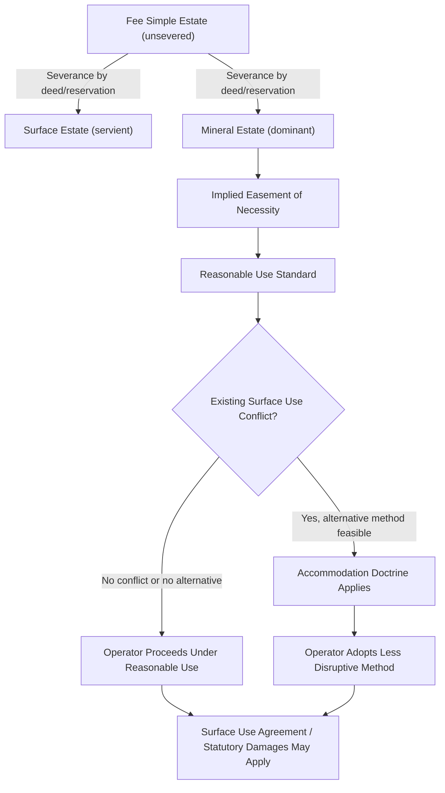

## Surface Use Rights for Mineral Extraction

### Definition and Conceptual Foundation

Surface use rights for mineral extraction refer to the legal entitlements held by a mineral estate owner (or lessee/operator) to use, occupy, and physically disturb the surface of land to the extent reasonably necessary to explore for, develop, extract, and transport subsurface minerals, even where the surface estate is owned or occupied by a different party. This body of law arises directly from the **severance of estates** doctrine: once mineral rights are separated from surface rights (by grant, reservation, lease, or statute), the law must allocate priority and reconcile competing uses of the same physical land.

The foundational common-law principle, recognized in most mineral-law jurisdictions (notably U.S. states such as Texas, Oklahoma, and Pennsylvania, and mirrored in adapted forms elsewhere), is the **"dominant estate" doctrine**: the mineral estate is dominant, and the surface estate is servient. This means the mineral owner possesses an implied easement — sometimes called the "mining easement" or "reasonable use" servitude — over the surface, without which the mineral rights would be commercially worthless.

**Key Points**

- Severance of the mineral estate from the surface estate is the triggering event for surface use rights.
- The mineral estate is generally treated as dominant; the surface estate is servient.
- The right is *implied by necessity* unless expressly granted, limited, or waived by contract, deed, or statute.
- Surface use rights are not unlimited — they are bounded by the doctrine of reasonable use and, in many jurisdictions, by the accommodation doctrine.

### Legal Basis: Implied Easement by Necessity

Where a deed or lease grants mineral rights but is silent on surface access, courts imply an easement of necessity. The rationale is straightforward: minerals cannot be extracted from beneath the earth's surface without some surface disturbance (drilling pads, access roads, pipelines, waste pits, staging areas). Denying surface access would render the mineral grant illusory.

This implied right typically includes:

- Ingress and egress (rights of way) across the surface
- Space to erect extraction infrastructure (wells, shafts, processing equipment)
- Use of surface water (in many U.S. jurisdictions, subject to separate water-rights doctrines)
- Disposal of waste or drill cuttings, within regulatory limits
- Use of *only so much of the surface as is reasonably necessary*

[Inference] The precise scope of "reasonably necessary" is fact-specific and varies by jurisdiction, extraction method, and industry custom at the time the severance occurred — this is a recurring point of litigation rather than a fixed rule.

### The Reasonable Use / Reasonably Necessary Standard

Because the dominant estate doctrine could theoretically justify extensive surface destruction, courts constrain it with a **reasonableness standard**. The mineral operator may use the surface only to the extent reasonably necessary to develop the minerals, considering:

1. **Established industry practices** at the time of use
2. **Availability of alternative methods** that would cause less surface disturbance
3. **Degree of surface damage** relative to the value of mineral development
4. **Existing surface uses** (agriculture, residential, commercial) and whether extraction can coexist with them

This standard operates as a *negligence-like balancing test* rather than a bright-line rule, meaning outcomes are decided case-by-case based on the specific facts presented.

### The Accommodation Doctrine

A significant judicial refinement — originating in Texas case law (*Getty Oil Co. v. Jones*, 1971) and adopted with variations elsewhere — is the **accommodation doctrine** (sometimes called the "due regard" or "reasonable accommodation" doctrine). It holds that where:

(a) the surface owner has an existing use of the surface,

(b) that use would be precluded or substantially impaired by the mineral operator's chosen method of extraction, and

(c) there exists an alternative, reasonable method available to the operator that would allow both uses to coexist,

then the mineral operator must adopt the alternative method, even at some additional cost, unless doing so is not commercially or technically reasonable.

**Example**

A surface owner operates an irrigated farm. The mineral lessee wants to place a well pad in the middle of the irrigated field, disrupting the pivot irrigation system. If an alternative site at the field's edge is reasonably available and technically feasible, the accommodation doctrine may require the operator to use that alternative site rather than destroy the existing agricultural operation — provided the existing use predates the proposed extraction activity and a genuine conflict exists.

[Unverified] The accommodation doctrine is not universally adopted; some jurisdictions apply only the baseline "reasonable use" standard without a formal accommodation analysis. Practitioners should verify the doctrine's status in the specific governing jurisdiction.

### Express Surface Use Agreements

Because implied rights are uncertain and litigation-prone, modern mineral leases, deeds, and separate **Surface Use Agreements (SUAs)** commonly displace the implied doctrines with negotiated terms. A well-drafted SUA typically addresses:

- **Location restrictions** — setbacks from structures, water wells, property lines
- **Compensation** — per-acre damages, per-well fees, or negotiated lump sums for surface disturbance
- **Restoration obligations** — reclamation standards and timelines post-extraction
- **Access routes** — designated roads to minimize cropland/pasture disruption
- **Timing restrictions** — seasonal limitations (e.g., avoiding planting or harvest seasons)
- **Water and waste management** — handling of produced water, drilling fluids, and cuttings
- **Indemnification and liability allocation**
- **Bonding or security** for reclamation performance

**Key Points**

- SUAs are contractual and can expand, restrict, or entirely supersede common-law implied rights.
- Absent an SUA, many U.S. states (e.g., North Dakota, Oklahoma) impose statutory surface damage compensation schemes as a backstop.
- SUAs are the primary risk-mitigation tool in modern practice, especially in split-estate (non-concurrent ownership) scenarios.

### Statutory Surface Damage Acts

Numerous jurisdictions have enacted **surface damage acts** to supplement or override pure common-law doctrines, particularly where surface and mineral estates are commonly severed (split estates). These statutes generally:

- Require the mineral operator to provide advance notice to the surface owner before entering
- Mandate negotiation (or a statutory formula) for compensating actual surface damages
- Establish dispute resolution mechanisms (mediation, arbitration, or specialized tribunals)
- Sometimes require reclamation bonds

[Inference] The exact mechanics (notice periods, damage formulas, dispute forums) differ significantly by jurisdiction and are frequently amended, so current statutory text should always be checked against the specific jurisdiction and date of the transaction.

### Limitations on Surface Use Rights

Surface use rights, while broad, are not absolute. Recognized limitations include:

1. **Negligence and wanton conduct** — operators remain liable for damage beyond what is reasonably necessary, or for negligent conduct causing avoidable harm.
2. **Subjacent and lateral support obligations** — extraction (especially subsurface mining) must not undermine surface stability without appropriate mitigation (see related topic on subsidence liability).
3. **Environmental and land-use regulation** — zoning, environmental permitting, and reclamation laws constrain how and where surface disturbance may occur, independent of private property rights.
4. **Contractual restriction** — express lease or deed language limiting surface use controls over any implied common-law right.
5. **Multiple mineral owners** — where multiple parties hold rights to different minerals or different depths, surface use rights must be apportioned or coordinated (see pooling/unitization concepts).
6. **Good faith and due regard** — operators must exercise their rights with due regard for the surface owner's interests, even absent an explicit accommodation-doctrine conflict.

### Split-Estate Conflicts and Practical Dynamics

In split-estate situations — where the surface is owned by Party A (e.g., a farmer or rancher) and minerals by Party B (e.g., an energy company or heir) — the surface owner often has **no veto power** over mineral development, only a right to reasonable accommodation and, in many jurisdictions, statutory or negotiated compensation. This asymmetry is a frequent source of real-world conflict, particularly in:

- Agricultural regions overlying shale or coal formations
- Residential subdivisions built atop severed mineral estates ("legacy" severances predating development)
- Indigenous or communal land contexts where surface and subsurface rights regimes may differ from private fee simple systems

**Example**

A residential subdivision is built on land where mineral rights were severed decades earlier and sold to an unrelated third party. A mineral lessee later seeks to drill a well near homes. Even though homeowners hold clean surface title, they generally cannot block reasonably necessary drilling absent a controlling ordinance, easement restriction, or accommodation-doctrine conflict — though local zoning, setback ordinances, and drilling permits often become the practical battleground.

### Relationship to Other Mineral & Subsurface Doctrines

Surface use rights interact closely with:

- **Rule of capture** — governs ownership of migratory minerals (oil, gas) once extracted, independent of surface boundaries
- **Correlative rights doctrine** — limits waste and protects neighboring mineral owners' interests, indirectly shaping how much surface disturbance is "necessary"
- **Pooling and unitization** — consolidates surface use across multiple tracts to minimize disturbance (fewer well pads serving larger areas)
- **Subjacent support / subsidence law** — addresses surface collapse risk from underground extraction (mining, not just oil/gas)

### Illustrative Diagram: Estate Relationship and Surface Use Flow

### SVG Diagram: Dominant/Servient Estate Cross-Section (svg_diagram)

<svg xmlns="http://www.w3.org/2000/svg" viewBox="0 0 700 380">
<rect x="0" y="0" width="700" height="380" fill="#ffffff" />
<text x="350" y="30" font-size="18" text-anchor="middle" font-family="sans-serif" font-weight="bold">Surface and Mineral Estate Cross-Section (svg_diagram)</text>

<rect x="50" y="50" width="600" height="100" fill="#dceeff" />
<text x="350" y="105" font-size="14" text-anchor="middle" font-family="sans-serif">Surface Estate (Servient) — Farming, Homes, Roads</text>

<line x1="50" y1="150" x2="650" y2="150" stroke="#333333" stroke-width="3" />

<rect x="50" y="150" width="600" height="80" fill="#c9a26a" />
<text x="350" y="195" font-size="13" text-anchor="middle" font-family="sans-serif">Soil / Overburden</text>
<rect x="50" y="230" width="600" height="80" fill="#8d6b45" />
<text x="350" y="275" font-size="13" text-anchor="middle" font-family="sans-serif" fill="#ffffff">Mineral Estate (Dominant) — Coal / Oil / Gas Deposits</text>
<rect x="50" y="310" width="600" height="50" fill="#5a4632" />
<text x="350" y="340" font-size="13" text-anchor="middle" font-family="sans-serif" fill="#ffffff">Bedrock</text>

<rect x="330" y="60" width="14" height="290" fill="#444444" />
<polygon points="300,50 375,50 355,65 320,65" fill="#666666" />
<text x="410" y="65" font-size="12" font-family="sans-serif">Well Pad / Access Structure</text>

<line x1="150" y1="150" x2="150" y2="230" stroke="#c0392b" stroke-width="2" marker-end="url(#arrow)" />
<text x="160" y="195" font-size="12" font-family="sans-serif" fill="#c0392b">Implied Easement of Necessity</text>
</svg>

### Common Disputes and Litigation Triggers

- Disagreement over whether a chosen extraction method exceeds "reasonably necessary" surface disturbance
- Failure to negotiate or pay statutory/contractual surface damages before entry
- Location disputes where the operator ignores a technically feasible, less-disruptive alternative site
- Reclamation failures after extraction concludes
- Water contamination or depletion claims tied to surface use activities
- Disputes over whether pre-existing structures (barns, wells, homes) qualify as "existing uses" triggering accommodation-doctrine protection

### Jurisdictional Variation

[Unverified] Because mineral law is heavily jurisdiction-specific, the doctrines above (dominant estate, accommodation doctrine, statutory surface damage acts) apply with meaningfully different scope and strength across jurisdictions — for example, U.S. states differ substantially from each other, and civil-law systems (which often nationalize subsurface mineral rights separately from surface land ownership) apply a fundamentally different framework than common-law severed-estate systems. Any real transaction or dispute should be analyzed under the specific controlling jurisdiction's statutes and case law rather than the general doctrines summarized here.

**Related Topics**

- Accommodation Doctrine — Detailed Elements and Burden of Proof
- Surface Damage Compensation Statutes (Comparative Survey)
- Pooling and Unitization of Mineral Interests
- Subjacent and Lateral Support Rights / Subsidence Liability
- Rule of Capture and Correlative Rights in Oil and Gas Law
- Reclamation and Post-Extraction Restoration Obligations
- Split-Estate Ownership and Legacy Mineral Severance Issues
- Water Rights Interaction with Mineral Extraction Operations
- Easements Implied by Necessity vs. Easements by Prescription