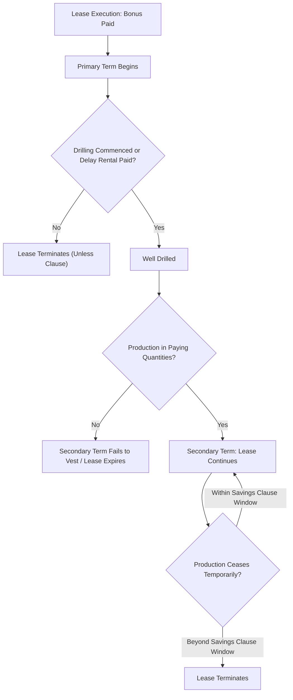

## Oil and Gas Leases and Easements

### Definition and Conceptual Foundation

An oil and gas lease is a contractual instrument by which the owner of a mineral estate (the **lessor**) conveys to an operator or company (the **lessee**) the exclusive right to explore for, drill, produce, and market oil and gas from beneath a described tract, in exchange for consideration — typically a bonus payment, royalty interest, and (where applicable) rental payments during a non-producing period. Despite the name "lease," in most common-law mineral jurisdictions this instrument is legally a **defeasible or determinable fee interest in the minerals themselves** (in "ownership-in-place" states) or a **profit-à-prendre / exclusive license** (in "non-ownership" or "exclusive right to take" states) — not a landlord-tenant lease in the traditional real property sense.

Closely related, but conceptually distinct, are **oil and gas easements** — non-possessory rights to use land for ancillary purposes connected to extraction, most commonly:

- Pipeline right-of-way easements
- Access road easements
- Well-site and tank-battery easements
- Utility and power-line easements serving production equipment

**Key Points**

- The lease grants the *right to search for and produce* minerals; the easement grants the *right to occupy specific surface areas* for supporting infrastructure.
- Leases are typically granted by the mineral owner; easements may be granted by either the mineral owner (if surface rights are included) or the surface owner directly (in split-estate scenarios).
- Both instruments are interests in real property and are typically recorded in the applicable land records/registry to provide constructive notice to subsequent purchasers.

### The Oil and Gas Lease: Core Clauses and Structure

A standard oil and gas lease, though heavily negotiated in modern practice, is built around several recurring clauses that have developed through more than a century of case law.

#### 1. Granting Clause

Defines what is conveyed — typically "oil, gas, and other minerals," though scope varies (some leases exclude coal, lignite, or specific minerals). Ambiguity here is a frequent litigation source over whether substances like coalbed methane or geothermal resources fall within the grant.

#### 2. Habendum Clause ("Term" Clause)

Establishes the lease duration, structured as a **primary term** (a fixed period, e.g., 3 or 5 years) and a **secondary term** that continues "for so long thereafter as oil or gas is produced in paying quantities." This is the mechanism that allows a lease to continue indefinitely once production begins, and it is the single most litigated clause in oil and gas law.

$$\text{Lease Continues} \iff \text{Production in Paying Quantities} = \text{Revenue} - \text{Operating Costs} > 0$$

[Inference] Courts differ on whether "paying quantities" is measured purely by a positive operating margin or also considers a reasonably prudent operator's judgment about continued profitability — this remains a fact-intensive, jurisdiction-specific inquiry.

#### 3. Delay Rental Clause

In leases with no immediate drilling obligation, requires periodic rental payments during the primary term to keep the lease alive absent production or drilling operations. Failure to pay on time can cause automatic lease termination under an "unless" lease structure, or breach liability under an "or" lease structure — a critical drafting distinction.

#### 4. Royalty Clause

Reserves to the lessor a fractional, cost-free (or "cost-borne," depending on drafting) share of production revenue — historically 1/8, now commonly 1/4 to 1/5 or higher in competitive markets. Disputes frequently arise over **post-production cost deductions** (gathering, compression, transportation, processing) from the royalty base.

#### 5. Pooling and Unitization Clause

Authorizes the lessee to combine (pool) the leased tract with adjoining tracts into a single drilling or production unit, spreading surface disturbance and allocating production proportionally. Without this clause, pooling generally requires separate consent or statutory authority.

#### 6. Shut-In Royalty Clause

Allows the lessee to maintain the lease during temporary non-production (e.g., no available pipeline connection) by paying a nominal shut-in royalty rather than losing the lease for lack of actual production.

#### 7. Surface Use / Entry Clause

Grants (or limits) the lessee's right to use the surface for drilling operations — often the sole source of the lessee's surface access rights when no separate surface use agreement exists (see related topic: Surface Use Rights for Mineral Extraction).

#### 8. Continuous Operations / Savings Clauses

Clauses such as the **continuous drilling clause**, **cessation of production clause**, and **force majeure clause** address temporary interruptions and prevent automatic termination during equipment failure, market conditions, or regulatory delay, provided the lessee resumes operations within a specified window.

**Key Points**

- The habendum clause and "paying quantities" standard are the primary drivers of lease-termination litigation.
- Royalty and post-production cost deduction disputes are the most common financial disputes between lessors and lessees.
- Pooling clauses materially reduce surface disturbance by consolidating multiple tracts under fewer well sites.

### Types of Oil and Gas Leases by Ownership Theory

| Theory | Core Principle | Representative Jurisdictions |
| --- | --- | --- |
| Ownership-in-place | Mineral owner holds a present possessory interest in oil/gas *in situ*; lease conveys a fee interest defeasible upon non-production | Texas, Pennsylvania (largely) |
| Non-ownership (exclusive right to take) | Oil/gas not owned until reduced to possession (captured); lease grants an exclusive right/license to search and produce | Oklahoma, Louisiana (civil-law influenced), California |

[Unverified] The practical consequences of this ownership-theory distinction (e.g., for abandonment, adverse possession of minerals, or tax characterization) vary and should be confirmed against the specific jurisdiction's current case law, since some states have blended or evolved their doctrinal position over time.

### Easements Supporting Oil and Gas Operations

Because a lease alone may not adequately define the *location and scope* of surface disturbance, operators frequently negotiate or exercise separate easement rights:

#### Pipeline Right-of-Way Easements

Grant the operator (or a separate pipeline company) the right to construct, maintain, inspect, and repair a pipeline across a defined corridor. Typically include:

- Defined width (e.g., 30–50 feet during construction, narrowing to a permanent easement width post-construction)
- Depth-of-burial specifications
- Restoration obligations for disturbed topsoil, drainage, and fencing
- Restrictions on the surface owner's use above the easement (e.g., no permanent structures, tree planting)

#### Access Road Easements

Grant ingress/egress rights for equipment, personnel, and transport vehicles, often including maintenance obligations and dust/erosion control requirements.

#### Well-Site and Tank-Battery Easements

Define the specific footprint occupied by drilling rigs, wellheads, separators, storage tanks, and related equipment — frequently expressed in the surface use agreement rather than the mineral lease itself.

**Example**

An operator holds an oil and gas lease on a 640-acre tract. To transport produced gas to a regional pipeline, it negotiates a separate 50-foot-wide pipeline easement across a neighboring landowner's property (who has no mineral interest in the leased tract). This easement is a distinct real property instrument, recorded separately, and survives independent of the lease's habendum clause — meaning even if the underlying lease terminates, an existing recorded pipeline easement may continue in force according to its own terms.

### Relationship Between the Lease and the Easement

| Attribute | Oil & Gas Lease | Oil & Gas Easement |
| --- | --- | --- |
| Grantor | Mineral owner | Surface owner (or mineral owner with surface rights) |
| Subject Matter | Right to explore/produce minerals | Right to occupy defined surface area |
| Duration | Primary term + secondary term (production-dependent) | Often perpetual or fixed-term, independent of production |
| Termination Trigger | Cessation of production in paying quantities (subject to savings clauses) | Expiration of stated term, abandonment, or breach of easement terms |
| Compensation | Bonus, royalty, delay rental | One-time payment, annual fee, or damages-based compensation |

### Termination, Forfeiture, and Lease Disputes

Common triggers for lease termination or litigation include:

1. **Failure to timely pay delay rentals** (automatic termination under "unless" leases)
2. **Cessation of production** beyond any applicable cessation-of-production grace period
3. **Failure to commence a well** within the primary term absent a savings clause
4. **Breach of implied covenants** — the most significant of which are:
   - Implied covenant to reasonably develop the leasehold
   - Implied covenant to protect against drainage by adjacent wells
   - Implied covenant to market production
   - Implied covenant to operate with reasonable care (avoiding waste)

[Inference] Implied covenants are judicially created gap-fillers and their exact contours differ by jurisdiction; many modern leases attempt to expressly define or disclaim them to reduce litigation uncertainty.

### Illustrative Diagram: Lease Lifecycle and Termination Triggers

### SVG Diagram: Lease and Easement Surface Footprint (svg_diagram)

<svg xmlns="http://www.w3.org/2000/svg" viewBox="0 0 700 340">
<rect x="0" y="0" width="700" height="340" fill="#ffffff" />
<text x="350" y="28" font-size="17" text-anchor="middle" font-family="sans-serif" font-weight="bold">Leased Tract with Pipeline Easement Corridor (svg_diagram)</text>

<rect x="60" y="50" width="580" height="220" fill="#eef7ee" stroke="#2e7d32" stroke-width="2" />
<text x="90" y="75" font-size="13" font-family="sans-serif" fill="#2e7d32">Leased Tract (Mineral Lease Boundary)</text>

<rect x="200" y="130" width="60" height="60" fill="#555555" />
<text x="230" y="205" font-size="11" text-anchor="middle" font-family="sans-serif">Well Pad</text>

<rect x="260" y="150" width="380" height="20" fill="#c0392b" opacity="0.6" />
<text x="450" y="145" font-size="12" text-anchor="middle" font-family="sans-serif" fill="#c0392b">Pipeline Right-of-Way Easement</text>

<line x1="230" y1="270" x2="230" y2="190" stroke="#8d6b45" stroke-width="10" />
<text x="150" y="290" font-size="11" font-family="sans-serif" fill="#8d6b45">Access Road Easement</text>

<rect x="640" y="50" width="40" height="220" fill="#f0f0f0" stroke="#999999" />
<text x="660" y="300" font-size="10" text-anchor="middle" font-family="sans-serif">Adjacent Parcel</text>
</svg>

### Interaction with Correlative Rights and the Rule of Capture

Oil and gas leases operate against the backdrop of the **rule of capture** (a landowner/lessee who lawfully drills and produces oil or gas is entitled to it, even if it migrated from beneath a neighboring tract) and the **correlative rights doctrine** (limiting waste and protecting each owner's fair opportunity to produce from a common reservoir). Pooling and unitization clauses within leases are the primary contractual mechanism for reconciling these doctrines with modern spacing and conservation regulations.

### Regulatory Overlay

Beyond the private contractual lease/easement structure, oil and gas operations are subject to state/provincial conservation commissions or equivalent regulators governing:

- Well spacing and density rules
- Permit-to-drill requirements
- Pooling force majeure and compulsory pooling statutes (allowing pooling of non-consenting owners under specified conditions)
- Plugging and abandonment (P&A) bonding requirements
- Environmental and groundwater protection standards

[Unverified] Specific regulatory bodies, permitting procedures, and compulsory pooling thresholds vary significantly by jurisdiction and are subject to frequent legislative amendment; current in-force regulations should be verified against the applicable state, provincial, or national regulator.

### Common Disputes

- Whether marginal or intermittent production qualifies as "paying quantities" to preserve the lease
- Improper or excessive post-production cost deductions from royalty payments
- Disputes over pooling designation boundaries and allocation formulas
- Trespass or easement-scope disputes where pipeline or access use exceeds the granted corridor
- Failure to restore surface conditions per easement restoration covenants
- Top leasing disputes (a new lease signed in anticipation of an existing lease's expiration)

**Related Topics**

- Habendum Clause and "Paying Quantities" Doctrine — Comparative Case Law
- Royalty Calculation and Post-Production Cost Deduction Disputes
- Pooling, Unitization, and Compulsory Pooling Statutes
- Rule of Capture and Correlative Rights Doctrine
- Surface Use Rights for Mineral Extraction
- Implied Covenants in Oil and Gas Leases
- Pipeline Right-of-Way Easements and Eminent Domain for Private Pipelines
- Top Leasing and Lease Extension Strategies
- Plugging, Abandonment, and Post-Production Reclamation Obligations