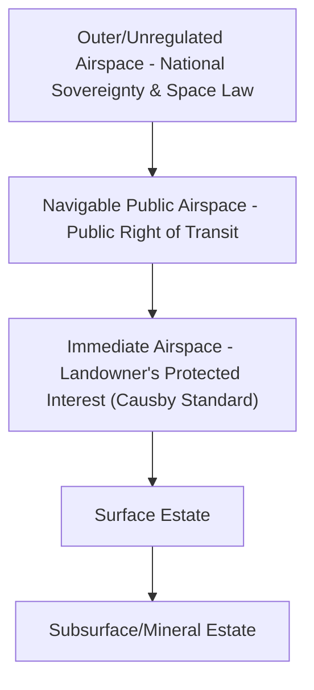

## Airspace Rights and the Ad Coelum Doctrine

### Definition and Historical Origin

The *ad coelum* doctrine — from the Latin maxim *cuius est solum, eius est usque ad coelum et ad inferos* ("whoever owns the soil owns also up to the sky and down to the depths") — is the traditional common-law principle that land ownership extends vertically without limit, both upward into the airspace above the surface and downward into the subsurface below it. Originating in Roman law and later absorbed into English common law (frequently attributed, though disputedly, to jurist Edward Coke in the 17th century), the doctrine framed the fee simple estate as a theoretically infinite vertical column.

**Key Points**

- The doctrine was formulated centuries before powered flight or high-altitude activity was conceivable.
- It historically justified a landowner's exclusive control over any structure, object, or activity occupying the space above their land, regardless of height.
- It has been substantially curtailed by modern statute and case law, particularly with the advent of aviation.

### Doctrinal Erosion: Aviation and the Rise of Public Navigable Airspace

The absolute version of *ad coelum* became untenable once heavier-than-air flight became common in the early 20th century. If landowners genuinely held unlimited rights to the airspace above their land, every commercial flight crossing private property would constitute a trespass, making air travel legally impossible.

Jurisdictions responded by carving out a **public right of navigation** in the upper airspace while preserving landowner control over the immediate airspace close to the ground. In the United States, this shift is embodied in:

- **Air Commerce Act of 1926** and its successors, which declared navigable airspace a public highway
- **United States v. Causby (1946)** — the U.S. Supreme Court held that while the U.S. government had declared navigable airspace public, a landowner retains a property interest in the immediate airspace directly above the land ("as much of the space above the ground as [the landowner] can occupy or use in connection with the land"), and that low-altitude military flights causing substantial interference with use and enjoyment of a landowner's property could constitute a compensable taking under the Fifth Amendment.

*Causby* effectively replaced the absolute *ad coelum* rule with a **functional/effective-possession test**: a landowner's airspace rights extend only as far as necessary for reasonable use and enjoyment of the land, not indefinitely upward.

$$\text{Protected Airspace} = \{ z : 0 \leq z \leq h_{\text{reasonable use}} \}$$

where $h_{\text{reasonable use}}$ is not a fixed altitude but a fact-specific threshold determined by interference with actual or reasonably anticipated use of the surface.

[Inference] *Causby* did not establish a specific altitude ceiling; later cases and FAA regulatory minimum altitudes have been used as reference points, but the "reasonable use and enjoyment" standard remains inherently case-specific rather than a bright-line rule.

### The Modern Tripartite Airspace Framework

Following *Causby* and subsequent aviation-era developments, airspace above land is generally understood in three conceptual layers, though jurisdictions differ in how explicitly they codify this structure:

| Layer | Description | Governing Rights |
| --- | --- | --- |
| Immediate/Lower Airspace | Airspace directly above the surface, up to the height reasonably necessary for use and enjoyment of the land | Landowner retains exclusive property interest; unauthorized entry may constitute trespass or a compensable taking |
| Navigable/Public Airspace | Higher-altitude airspace designated for aircraft transit under federal/national aviation regulation | Public right of navigation; landowner cannot exclude lawful overflight absent substantial interference |
| Outer/Unregulated Airspace (approaching space) | Extremely high altitude approaching the boundary with outer space | Governed increasingly by national airspace sovereignty and international space law (e.g., the Kármán line concept), largely outside private property law altogether |

**Example**

A homeowner cannot sue a commercial airliner flying at cruising altitude for trespass, because that altitude falls within navigable airspace subject to the public right of transit. However, if a drone hovers persistently at 15 feet above the same homeowner's backyard, interfering with their ability to use their property, the homeowner may have a valid trespass or nuisance claim because that altitude falls within the immediate airspace attached to the land.

### Airspace as a Severable Property Interest

Modern property law increasingly treats airspace as a **distinct, transferable estate**, separable from the surface fee much like mineral rights. This is reflected in:

- **Air rights transfers/sales** — common in dense urban environments, allowing a landowner to sell unused development airspace (often tied to zoning floor-area-ratio allowances) to an adjacent developer, enabling taller construction than the selling parcel's own zoning would otherwise permit
- **Condominium airspace units** — many condominium regimes legally define individual units as bounded volumes of airspace rather than as land, with common elements (walls, structural components) held jointly
- **Transferable Development Rights (TDRs)** — a zoning and land-use tool allowing landowners in low-density or preservation zones to sell their unused development potential (often expressed as airspace/height allowances) to developers in designated receiving zones

**Key Points**

- Air rights transactions are especially significant in real estate markets with dense vertical development (e.g., major metropolitan cores), where unused vertical development capacity has independent market value.
- Air rights easements are commonly used to protect view corridors, solar access, or preserve historic building silhouettes by permanently restricting a neighboring parcel's vertical development.

### Airspace Easements

Because airspace can be independently valuable, several specialized easement types have developed:

1. **Avigation easements** — grant an airport or aviation authority the right for aircraft to fly through airspace over adjacent land at low altitude, typically negotiated (or condemned) around airports to preempt Causby-style takings claims from noise and overflight interference.
2. **View easements / solar access easements** — restrict a servient estate's vertical construction to preserve a dominant estate's view or sunlight access.
3. **Air rights easements/leases for structural support** — allow a structure to be built spanning across or above another parcel (e.g., a building constructed over active railway tracks or highway right-of-way), while the surface/subsurface below remains under separate ownership or control.

[Unverified] The precise legal mechanism used (easement vs. lease vs. fee transfer of a defined airspace parcel) for air rights transactions varies by jurisdiction and by the specific structuring chosen by the parties; local recording and zoning practice should be verified for any given transaction.

### Illustrative Diagram: Vertical Airspace Layers

### SVG Diagram: Ad Coelum Column vs. Modern Layered Model (svg_diagram)

<svg xmlns="http://www.w3.org/2000/svg" viewBox="0 0 700 420">
<rect x="0" y="0" width="700" height="420" fill="#ffffff" />
<text x="350" y="26" font-size="16" text-anchor="middle" font-family="sans-serif" font-weight="bold">Ad Coelum Column vs. Modern Layered Airspace (svg_diagram)</text>

<text x="150" y="55" font-size="13" text-anchor="middle" font-family="sans-serif" font-weight="bold">Classical Ad Coelum</text>

<rect x="100" y="70" width="100" height="280" fill="`#dceeff`" stroke="`#2266aa`" stroke-width="2" />

<text x="150" y="200" font-size="11" text-anchor="middle" font-family="sans-serif">Unlimited Vertical Column</text>

<line x1="150" y1="70" x2="150" y2="30" stroke="`#2266aa`" stroke-width="2" stroke-dasharray="4,3" />

<text x="150" y="380" font-size="11" text-anchor="middle" font-family="sans-serif">Surface Parcel</text>

<rect x="100" y="350" width="100" height="20" fill="`#c9a26a`" />

<text x="500" y="55" font-size="13" text-anchor="middle" font-family="sans-serif" font-weight="bold">Modern Layered Model</text>

<rect x="450" y="70" width="100" height="60" fill="`#f4d6d6`" />

<text x="500" y="105" font-size="10" text-anchor="middle" font-family="sans-serif">Outer/Unregulated</text>

<rect x="450" y="130" width="100" height="100" fill="#d6e6f4" />
<text x="500" y="180" font-size="10" text-anchor="middle" font-family="sans-serif">Navigable Public Airspace</text>
<rect x="450" y="230" width="100" height="60" fill="#d6f4d6" />
<text x="500" y="265" font-size="10" text-anchor="middle" font-family="sans-serif">Immediate Airspace</text>
<rect x="450" y="290" width="100" height="60" fill="#c9a26a" />
<text x="500" y="325" font-size="10" text-anchor="middle" font-family="sans-serif">Surface Estate</text>
<line x1="500" y1="70" x2="500" y2="30" stroke="#333333" stroke-width="1" />
</svg>

### Interaction with Drone (UAS) Regulation

The proliferation of unmanned aircraft systems (drones) has revived *ad coelum*-style questions in a modern context. Key legal tensions include:

- **National aviation authority jurisdiction** (e.g., the FAA in the U.S.) typically asserts regulatory authority over navigable airspace, generally beginning at some altitude above ground level, though the exact floor is contested
- **State/local trespass, nuisance, and privacy law** governing low-altitude drone flights directly above private property
- **Absence of a settled bright-line altitude** separating "immediate airspace" (subject to landowner control) from "navigable airspace" (subject to federal/national aviation authority) specifically for drone operations

[Speculation] As commercial drone delivery and urban air mobility (e.g., low-altitude eVTOL aircraft) expand, it is plausible that legislatures or courts will eventually establish clearer statutory altitude thresholds analogous to how the Air Commerce Act resolved the ambiguity created by early manned aviation — but as of now this is an evolving and unsettled area rather than a settled doctrine.

### Airspace Rights in Non-U.S. Jurisdictions

[Unverified] While the *ad coelum* maxim and its aviation-era erosion are most extensively documented in U.S. case law, many civil-law and Commonwealth jurisdictions historically recognized similar vertical-extension principles, subsequently limited by their own aviation statutes and airspace sovereignty rules; the specific doctrinal formulation, controlling case law, and statutory framework should be verified against the applicable national legal system, as terminology and thresholds differ substantially from the U.S. framework described above.

### Practical Applications and Disputes

Common real-world contexts where airspace rights and the *ad coelum* doctrine remain legally significant:

1. **Zoning and height-restriction disputes** — variance requests, air rights transfers, and TDR programs in urban redevelopment
2. **Airport-adjacent property disputes** — noise/overflight takings claims under the *Causby* framework
3. **Encroachment disputes** — overhanging structures, cranes, tree branches, or eaves crossing a property boundary at low altitude
4. **Solar and view easement enforcement** — disputes over whether new construction impermissibly blocks protected light or view corridors
5. **Drone trespass and surveillance claims** — an emerging and largely unsettled area of litigation
6. **Subway, tunnel, and elevated structure rights-of-way** — analogous vertical-layering disputes below the surface, often resolved using reasoning parallel to airspace doctrine

**Related Topics**

- United States v. Causby and the Taking-by-Overflight Doctrine
- Transferable Development Rights (TDRs) and Air Rights Sales in Urban Development
- Avigation Easements and Airport Noise Litigation
- View Easements and Solar Access Rights
- Drone (UAS) Trespass and Emerging Low-Altitude Airspace Regulation
- Condominium Airspace Units and Common Element Ownership
- Encroachment Disputes: Overhanging Structures and Boundary Airspace
- Comparative Airspace Doctrine in Civil-Law Jurisdictions