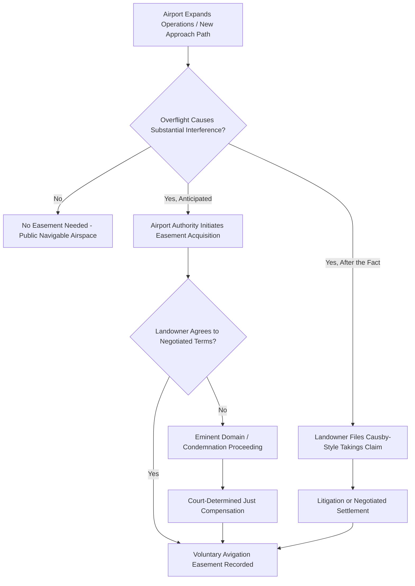

## Overflight and Aviation Easements

### Definition and Conceptual Foundation

Overflight and aviation easements are non-possessory property interests that authorize aircraft (and, increasingly, unmanned aircraft systems) to traverse the airspace above a servient landowner's property at altitudes and frequencies that would otherwise constitute trespass or give rise to a compensable taking. These easements sit at the intersection of two doctrinal bodies covered elsewhere in this chapter: the *ad coelum* doctrine's modern erosion (see Airspace Rights and the Ad Coelum Doctrine) and general easement law principles.

Unlike ordinary ground-level easements (rights-of-way, utility easements), overflight easements are defined **volumetrically** — by altitude range, lateral corridor width, and often by noise or vibration thresholds — rather than by a simple surface footprint.

**Key Points**

- Overflight easements are typically negotiated (or condemned) by airport operators, aviation authorities, or governments to preempt or resolve takings and trespass liability arising from aircraft operations near airports.
- They are distinguishable from the general public right of navigation in high-altitude navigable airspace, which requires no easement because no particular landowner's "immediate airspace" (per *Causby*) is substantially affected.
- Overflight easements are most commonly encountered in the context of airport approach and departure corridors, where aircraft routinely operate at low altitude over adjacent private land.

### Doctrinal Basis: From Causby to Negotiated Easements

*United States v. Causby* (1946) established that low-altitude government flights causing substantial interference with a landowner's use and enjoyment of their property could constitute a taking requiring just compensation, even though the government held no property interest in the airspace being used. This created two practical paths for aviation operators seeking legal certainty:

1. **Ex post compensation** — pay damages after a takings claim is litigated and proven
2. **Ex ante easement acquisition** — proactively acquire an avigation easement (by purchase, negotiation, or eminent domain) over land near an airport before overflight activity begins, thereby extinguishing future trespass or takings exposure

Modern airport development overwhelmingly favors the second path, since it provides certainty of cost and avoids piecemeal litigation as flight volume grows.

[Inference] The precise legal test for what constitutes "substantial interference" sufficient to trigger takings liability (frequency of overflights, altitude, noise levels, vibration, property value diminution) is fact-specific and has been applied inconsistently across jurisdictions since *Causby*; practitioners should expect case-by-case analysis rather than a fixed numerical threshold.

### Avigation Easements: Structure and Typical Terms

An **avigation easement** (sometimes "aviation easement" or "flight easement") is the primary instrument used to formalize overflight rights. Typical components include:

#### 1. Grant of Overflight Right

Authorizes aircraft operated by or under the authority of the grantee (typically an airport authority) to fly through the airspace above the servient estate at altitudes at or above a specified minimum, without liability for trespass.

#### 2. Noise and Nuisance Waiver

Releases the airport/grantee from liability for noise, vibration, fumes, and fear of flight resulting from lawful aircraft operations consistent with the easement's terms — a critical provision, since noise-based nuisance claims are historically the dominant cause of action in airport-adjacent litigation.

#### 3. Height Restriction / Obstruction Clause

Prohibits the servient landowner from erecting structures, trees, or other obstructions above a specified height within the easement area, protecting the approach/departure flight path (often coordinated with FAA/national aviation-authority obstruction standards, such as those governing imaginary surfaces around runways).

#### 4. Light and Glare Restrictions

May restrict lighting, reflective surfaces, or glare-producing installations on the servient estate that could interfere with pilot visibility during approach or departure.

#### 5. Compensation Clause

Establishes a one-time payment (most common) or, less frequently, periodic payments, reflecting diminished property value and use rights attributable to the easement.

#### 6. Duration and Assignability

Avigation easements are generally intended to run with the land (binding successors) and are typically perpetual, recorded against the servient parcel's title.

**Example**

An airport authority plans to extend a runway, shifting the approach path lower over a residential subdivision. Rather than wait for individual takings lawsuits as noise complaints accumulate, the authority negotiates avigation easements with affected homeowners, paying a lump sum reflecting each parcel's estimated diminution in value, in exchange for a permanent, recorded release of overflight-related noise and low-altitude trespass claims.

### Acquisition Methods

Avigation easements are acquired through one of three mechanisms:

1. **Voluntary negotiation** — direct purchase from willing landowners, often as part of airport noise-mitigation or land-use compatibility programs
2. **Eminent domain / condemnation** — compulsory acquisition where a government or authorized airport authority has statutory condemnation power, with "just compensation" determined by valuation proceedings rather than negotiation
3. **Regulatory taking litigation resolution** — an easement is sometimes acquired as the negotiated remedy following a *Causby*-style takings lawsuit, converting a one-time damages award into a permanent easement grant

[Unverified] The availability and scope of eminent domain authority for avigation easement acquisition varies by jurisdiction and by the specific statutory authority granted to the airport operator (municipal, state, federal, or private); this should be verified against the applicable enabling legislation for any specific airport authority.

### Airport Land-Use Compatibility Programs

Many aviation regulatory frameworks pair avigation easements with broader **airport land-use compatibility planning**, which may include:

- Height/obstruction zoning ordinances independent of any individual easement
- Noise contour mapping (e.g., decibel-based noise exposure zones) used to prioritize easement acquisition or mandatory disclosure requirements
- Sound insulation grant programs for homes within high-noise zones, sometimes conditioned on granting an avigation easement
- Real estate disclosure requirements notifying prospective buyers of proximity to airport noise/overflight zones

**Key Points**

- Noise contour maps are commonly used as the objective basis for deciding which parcels require avigation easement acquisition versus lesser mitigation (insulation, disclosure).
- Voluntary sale/buyout programs sometimes accompany easement acquisition in the highest-noise zones, where mitigation is not considered sufficient.

### Illustrative Diagram: Avigation Easement Acquisition Pathways

### SVG Diagram: Avigation Easement Corridor Around Runway Approach (svg_diagram)

<svg xmlns="http://www.w3.org/2000/svg" viewBox="0 0 700 380">
<rect x="0" y="0" width="700" height="380" fill="#ffffff" />
<text x="350" y="26" font-size="16" text-anchor="middle" font-family="sans-serif" font-weight="bold">Runway Approach and Avigation Easement Corridor (svg_diagram)</text>

<rect x="300" y="300" width="100" height="50" fill="#555555" />
<text x="350" y="330" font-size="11" text-anchor="middle" font-family="sans-serif" fill="#ffffff">Runway</text>

<polygon points="320,300 380,300 550,120 150,120" fill="#dceeff" opacity="0.7" stroke="#2266aa" stroke-width="1.5" />
<text x="350" y="200" font-size="12" text-anchor="middle" font-family="sans-serif" fill="#2266aa">Approach/Departure Flight Path</text>

<rect x="160" y="230" width="90" height="60" fill="#f4d6d6" stroke="#c0392b" />
<text x="205" y="265" font-size="9" text-anchor="middle" font-family="sans-serif">Parcel A - Easement</text>
<rect x="260" y="230" width="90" height="60" fill="#f4d6d6" stroke="#c0392b" />
<text x="305" y="265" font-size="9" text-anchor="middle" font-family="sans-serif">Parcel B - Easement</text>
<rect x="360" y="230" width="90" height="60" fill="#f4d6d6" stroke="#c0392b" />
<text x="405" y="265" font-size="9" text-anchor="middle" font-family="sans-serif">Parcel C - Easement</text>
<rect x="460" y="230" width="90" height="60" fill="#f4d6d6" stroke="#c0392b" />
<text x="505" y="265" font-size="9" text-anchor="middle" font-family="sans-serif">Parcel D - Easement</text>

<line x1="150" y1="120" x2="150" y2="230" stroke="#c0392b" stroke-width="2" stroke-dasharray="4,3" />
<text x="70" y="180" font-size="10" font-family="sans-serif" fill="#c0392b">Height Restriction Line</text>
</svg>

### Overflight Easements and Unmanned Aircraft Systems (UAS)

The rise of commercial drone operations introduces a parallel, still-developing category of overflight rights:

- **Corridor/route easements for drone delivery** — some jurisdictions and companies are beginning to negotiate structured low-altitude corridors analogous to avigation easements, though at present most drone overflight relies on general aviation-authority regulatory permission rather than individually negotiated private easements
- **Vertiport and urban air mobility (UAM) approach zones** — as electric vertical takeoff and landing (eVTOL) aircraft infrastructure develops, land-use and easement frameworks resembling airport avigation easements are being proposed for vertiport approach corridors

[Speculation] Given the parallel between airport approach-path easements and emerging low-altitude drone/UAM corridors, it is plausible that avigation-easement principles will be adapted into formal drone-corridor easements as the industry matures, but no widely standardized legal framework for this currently exists, and this should be treated as a forward-looking inference rather than settled practice.

### Interaction with Nuisance and Trespass Law

Even where a landowner has not granted a formal avigation easement, general tort doctrines continue to apply to unauthorized or excessive overflight:

- **Trespass** — physical intrusion into the landowner's immediate airspace (per *Causby*) without permission
- **Nuisance** — substantial and unreasonable interference with use and enjoyment of land, commonly invoked for noise, vibration, or fear-of-falling-aircraft claims even absent a physical intrusion
- **Inverse condemnation** — a landowner-initiated claim asserting that government (or government-authorized) overflight activity has effectively taken their property interest without formal condemnation proceedings, seeking compensation after the fact

**Key Points**

- A properly recorded avigation easement is the primary defense against these claims for airports and aviation authorities operating within the easement's defined terms.
- Overflight activity exceeding the easement's altitude, noise, or corridor terms may still expose the operator to trespass or nuisance liability, since the easement's protection is limited to its express scope.

### Common Disputes

1. Whether a specific flight pattern or altitude change falls within the scope of an existing avigation easement or requires renegotiation
2. Valuation disputes in eminent domain proceedings over the diminution in property value attributable to the easement
3. Claims that noise levels have exceeded what was contemplated at the time the easement was granted (particularly relevant where aircraft fleet composition or flight frequency has changed substantially since easement acquisition)
4. Obstruction violations — servient landowners constructing structures or planting trees that breach height restriction covenants
5. Disputes over whether an easement is properly recorded and binding on subsequent purchasers of the servient estate

### Jurisdictional Variation

[Unverified] The doctrinal foundation described here draws heavily on U.S. federal aviation and takings law (particularly *Causby* and its progeny). Other jurisdictions may frame overflight rights differently — through aviation-specific statutes, administrative compensation schemes, or civil-law nuisance frameworks rather than a takings-based easement model — so the specific mechanism, terminology, and compensation standard should be verified against the applicable national or regional legal system.

**Related Topics**

- United States v. Causby and the Taking-by-Overflight Doctrine
- Airport Noise Contour Mapping and Land-Use Compatibility Programs
- Eminent Domain and Just Compensation Valuation Methods
- Height/Obstruction Zoning Near Airports
- Drone (UAS) Trespass and Emerging Low-Altitude Airspace Regulation
- Nuisance Law and Aircraft Noise Litigation
- Airspace Rights and the Ad Coelum Doctrine
- Vertiport and Urban Air Mobility (UAM) Land-Use Planning