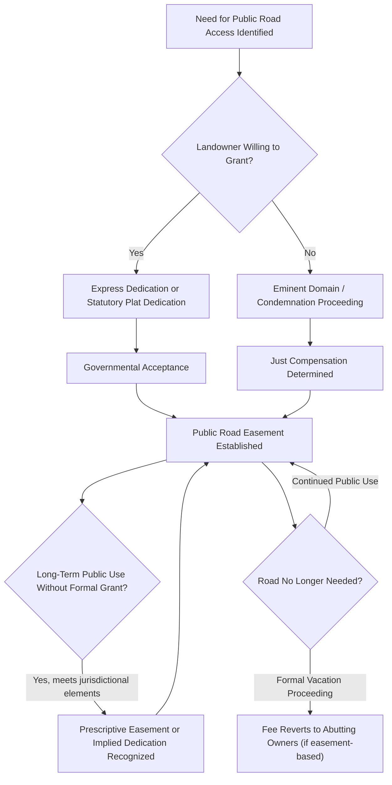

## Public Roads and Highway Easements

### Definition and Conceptual Foundation

A public road or highway easement is a non-possessory right permitting the traveling public to pass over a defined corridor of land, while fee title to the underlying soil typically remains with the abutting landowner or is held separately by a governmental authority. This structure — a public *right of use* superimposed on private or public *fee ownership* — is one of the oldest and most pervasive categories of easement in property law, distinct from mineral, subsurface, and airspace rights in that the dominant "party" is not a single neighboring landowner but the public at large, represented and administered by government.

**Key Points**

- Most public roads are legally structured as **easements for public travel** over the underlying fee, not as government ownership of the land in fee simple — though many roads are also held by government in fee, depending on how the road was originally established.
- The distinction between the fee and the easement matters critically when a road is vacated or abandoned: if the public held only an easement, the underlying fee typically reverts to the abutting owner(s); if government held fee title, different disposition rules apply.
- Highway easements are functionally similar to private easements (rights-of-way) but are subject to a distinct body of public law governing creation, maintenance, and termination.

### Methods of Creating Public Road Easements

Public road rights-of-way arise through several distinct legal mechanisms, each with different evidentiary and procedural requirements.

#### 1. Express Dedication

A landowner voluntarily grants a strip of land for public road use, typically through a recorded plat, deed, or formal dedication instrument, followed by governmental **acceptance** (formal resolution, or implied acceptance through maintenance and public use). Dedication generally requires:

- Clear intent by the landowner to dedicate the land to public use
- Acceptance by the public or a competent government authority
- [Inference] Some jurisdictions treat acceptance as capable of being implied from long-continued public use and municipal maintenance, while others require formal legislative or administrative action — this distinction should be verified against the specific jurisdiction's dedication statute.

#### 2. Statutory Dedication (Plat Approval)

Many jurisdictions provide that filing and recording an approved subdivision plat showing streets automatically dedicates those streets to public use by operation of statute, without requiring a separate deed of dedication.

#### 3. Condemnation / Eminent Domain

Government exercises its sovereign power to compulsorily acquire either a fee interest or an easement over private land for road construction, paying "just compensation" as determined by valuation proceedings. This is the primary mechanism for new highway corridors crossing land where the owner will not voluntarily dedicate or sell.

#### 4. Prescription (Public Prescriptive Easement)

Where the public has used a route openly, continuously, and adversely (without permission) for a statutorily defined period, courts may recognize a public prescriptive easement, even absent any formal grant. [Unverified] The specific elements and limitations period for public prescriptive easements vary significantly by jurisdiction, and some jurisdictions disfavor or reject public prescriptive rights altogether, requiring dedication or condemnation instead — this should be checked against controlling local authority.

#### 5. Common Law Dedication by Long Public Use

Distinct from prescription in some jurisdictions, long-continued, unobstructed public use of a route — particularly where the landowner's conduct suggests acquiescence rather than mere tolerance — may support an inference of implied dedication, especially for informal rural roads that developed organically over time.

**Example**

A rural road has been used by the public for over 40 years to access a lake, crossing land now owned by a private party who purchased with knowledge of the ongoing use. Even without a recorded deed of dedication, a court may find either an implied dedication (based on the original landowner's apparent acquiescence) or a public prescriptive easement (based on adverse, continuous public use), depending on the jurisdiction's specific doctrinal framework and the facts establishing the historical character of the use.

### Scope of the Public's Rights

A public road easement, however created, generally authorizes:

- Vehicular and pedestrian travel within the defined right-of-way
- Government construction, grading, paving, and maintenance activities
- Installation of traffic control devices, signage, and drainage infrastructure
- In many jurisdictions, **incidental use of the right-of-way by public utilities** (water, sewer, power, telecommunications) under a doctrine that utility use is a reasonably related extension of the public travel purpose — though this is sometimes separately authorized by statute or franchise rather than treated as automatically included

**Key Points**

- The right-of-way width actually granted or condemned often exceeds the paved travel surface, providing space for shoulders, drainage ditches, sidewalks, and utility placement.
- Abutting landowners retain the underlying fee (in easement-based roads) and may use the surface and subsurface for purposes not inconsistent with the public easement (e.g., driveway crossings, subject to permit requirements; sometimes limited agricultural or landscaping use of unpaved shoulder areas, depending on local rules).

### Abutting Landowner Rights: The Servient Estate Perspective

Because the public road easement is typically layered atop private fee ownership, abutting landowners retain significant residual rights and protections:

1. **Right of access** — abutting owners generally hold an independent property right of reasonable ingress/egress to the public road from their property, distinct from the general public's right of passage; unreasonable interference with this access right (e.g., from highway construction cutting off a driveway) can constitute a compensable taking in many jurisdictions.
2. **Right to underlying fee use** — subject to the easement, the abutting owner may use the surface and subsurface of the right-of-way strip in ways that do not interfere with public travel (subject to permitting).
3. **Reversionary interest upon vacation** — if the road is legally vacated/abandoned, fee title to an easement-based right-of-way typically reverts to the abutting owner(s), often split at the road centerline between owners on each side.
4. **Compensation for takings** — where a new highway easement or fee taking is condemned, the abutting owner is entitled to just compensation, including severance damages if the taking diminishes the value of the owner's remaining land.

[Inference] The scope of the "right of access" doctrine — particularly whether it protects a specific existing access point or only a general right of reasonable access to the road system — is a frequently litigated question in highway-widening and access-control (limited-access highway) contexts, and outcomes vary by jurisdiction and by the specific factual configuration of the affected parcel.

### Vacation and Abandonment of Public Roads

Public road easements can be formally terminated (vacated) or judicially found abandoned:

- **Formal vacation** — a government body follows statutory procedures (petition, hearing, resolution/ordinance) to legally discontinue a public road, after which underlying fee ownership (if held as an easement) typically reverts to abutting owners
- **Non-use abandonment** — some jurisdictions recognize that sufficiently long non-use, combined with acts inconsistent with continued public use, can extinguish a public road easement without formal vacation proceedings, though this is far less commonly recognized than formal vacation
- **Relocation** — new road construction sometimes accompanies formal vacation of the prior alignment, with disposition of the old right-of-way governed by the same reversion principles

**Key Points**

- Formal vacation procedures exist specifically to provide certainty and prevent unpredictable reversion disputes; informal abandonment claims are comparatively difficult to establish and disfavored in many jurisdictions.
- Utility easements installed within a vacated road right-of-way do not automatically terminate merely because the road easement is vacated; separate utility easement rights often survive independently unless expressly extinguished.

### Illustrative Diagram: Public Road Easement Creation and Termination

### SVG Diagram: Public Road Right-of-Way Cross-Section (svg_diagram)

<svg xmlns="http://www.w3.org/2000/svg" viewBox="0 0 700 320">
<rect x="0" y="0" width="700" height="320" fill="#ffffff" />
<text x="350" y="26" font-size="16" text-anchor="middle" font-family="sans-serif" font-weight="bold">Public Road Right-of-Way Cross-Section (svg_diagram)</text>

<rect x="40" y="120" width="180" height="120" fill="#eef7ee" stroke="#2e7d32" />
<text x="130" y="185" font-size="11" text-anchor="middle" font-family="sans-serif">Abutting Parcel A (Fee to Centerline)</text>

<rect x="220" y="120" width="260" height="120" fill="#f0f0f0" stroke="#666666" />
<text x="350" y="140" font-size="10" text-anchor="middle" font-family="sans-serif">Public Road Right-of-Way (Easement over Private Fee)</text>

<rect x="260" y="160" width="180" height="40" fill="#555555" />
<text x="350" y="185" font-size="10" text-anchor="middle" font-family="sans-serif" fill="#ffffff">Paved Travel Surface</text>

<rect x="220" y="200" width="40" height="40" fill="#d9d9a3" />
<text x="240" y="225" font-size="8" text-anchor="middle" font-family="sans-serif">Shoulder/Utility</text>
<rect x="440" y="200" width="40" height="40" fill="#d9d9a3" />
<text x="460" y="225" font-size="8" text-anchor="middle" font-family="sans-serif">Shoulder/Utility</text>

<line x1="350" y1="120" x2="350" y2="240" stroke="#c0392b" stroke-width="1.5" stroke-dasharray="6,4" />
<text x="350" y="250" font-size="9" text-anchor="middle" font-family="sans-serif" fill="#c0392b">Centerline (Reversion Split Point)</text>

<rect x="480" y="120" width="180" height="120" fill="#eef7ee" stroke="#2e7d32" />
<text x="570" y="185" font-size="11" text-anchor="middle" font-family="sans-serif">Abutting Parcel B (Fee to Centerline)</text>
</svg>

### Access Control and Limited-Access Highways

Modern highway systems frequently distinguish between ordinary public roads (where abutting owners retain a right of direct access) and **limited-access (controlled-access) highways** (freeways/motorways), where:

- Direct access is prohibited except at designated interchanges
- Abutting owners' common-law access rights are typically extinguished or restricted through separate condemnation of "access rights," compensable independently of the roadway easement/fee itself
- Frontage roads are sometimes constructed to preserve indirect access for parcels cut off from direct highway access

[Inference] Because limited-access designation typically extinguishes a previously existing right of direct access, courts in many jurisdictions treat this as a separate compensable taking distinct from the physical taking of the road surface itself — though the specific valuation methodology and whether frontage road provision offsets compensation varies by jurisdiction.

### Interaction with Utility and Private Easements Within the Right-of-Way

Public road rights-of-way commonly host overlapping private and quasi-public easements:

- Utility easements (water, sewer, gas, power, fiber) authorized by statute or franchise agreement
- Private access/driveway easements permitting specific abutting parcels to cross the right-of-way at designated points
- Drainage easements managing stormwater runoff along the corridor

These overlapping interests require careful coordination, since expansion or vacation of the public road easement can affect the continued viability of the utility and access easements layered within it.

### Common Disputes

1. Whether a specific route was validly dedicated to public use, particularly for informal rural roads lacking clear documentary history
2. Whether long-continued public use satisfies the elements of prescription or implied dedication in jurisdictions that recognize those doctrines
3. Access-rights takings claims arising from highway widening or conversion to limited-access status
4. Disputes over fee ownership and reversionary rights following formal road vacation
5. Boundary disputes where the actual right-of-way width differs from historical assumptions or informal use patterns
6. Utility easement survival disputes following road vacation

### Jurisdictional Variation

[Unverified] The mechanisms described above (dedication, statutory plat dedication, condemnation, prescription, vacation) are broadly representative of common-law jurisdictions, particularly U.S. states, but the specific statutory procedures, evidentiary standards, and reversion rules differ meaningfully across states and even more so across national legal systems; any specific transaction or dispute should be analyzed against the controlling jurisdiction's road and highway statutes and current case law.

**Related Topics**

- Eminent Domain and Just Compensation for Road Right-of-Way Acquisition
- Prescriptive Easements: Elements and Public vs. Private Application
- Implied Dedication and Common Law Dedication of Public Ways
- Limited-Access Highways and Compensable Loss of Direct Access
- Road Vacation Procedures and Reversionary Fee Interests
- Utility Easements Within Public Rights-of-Way
- Private Easements by Necessity, Prescription, and Express Grant
- Subdivision Plat Approval and Statutory Street Dedication