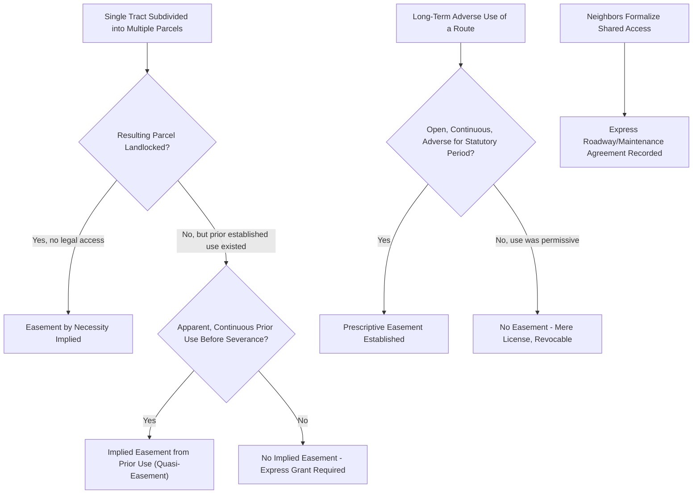

## Private Roadway Easements

### Definition and Conceptual Foundation

A private roadway easement is a non-possessory right permitting a specific, identified party (or parties) — rather than the general public — to travel across a defined corridor of another's land in order to access their own property. Unlike public road easements, which benefit the public at large and are administered by government, private roadway easements are purely private-law instruments benefiting a particular dominant estate (or, in the case of an easement in gross, a particular person or entity) and burdening a particular servient estate.

Private roadway easements are among the most litigated categories of easement law because they frequently arise from landlocked parcels, informal historical arrangements, or ambiguous deed language, rather than from carefully drafted contracts.

**Key Points**

- The land benefiting from the easement is the **dominant estate**; the land burdened by it is the **servient estate**.
- Most private roadway easements are **appurtenant** (attached to and running with the dominant estate, transferring automatically with ownership), though **easements in gross** (benefiting a specific person rather than a parcel) are also possible, particularly for utility or commercial access rights.
- The core recurring dispute categories are: (1) whether an easement exists at all, (2) its precise scope and location, and (3) maintenance/repair cost allocation among users.

### Methods of Creation

Private roadway easements arise through several distinct doctrinal pathways, each with its own elements and evidentiary requirements.

#### 1. Express Grant or Reservation

Created by explicit deed language, either as a **grant** (the grantor conveys an easement over the grantor's retained land to benefit the parcel being conveyed) or a **reservation** (the grantor conveys the parcel but reserves an easement over it for the grantor's retained land). Express easements are the most legally secure form, provided the deed language clearly identifies the location, width, and scope of use.

#### 2. Easement by Necessity

Arises when a single parcel is subdivided such that one resulting portion becomes landlocked (no legal access to a public road) — the law implies an easement over the remaining portion to prevent the landlocked parcel from becoming unusable. Generally requires:

- Common ownership at the time of severance (unity of title)
- Strict necessity for access at the time of severance (not merely convenience)
- [Inference] Courts differ on whether necessity must be absolute (no other legal access exists) or merely reasonable; this distinction affects outcomes in marginal cases and should be checked against controlling jurisdictional case law.

#### 3. Implied Easement (Quasi-Easement / Prior Use)

Arises where, before severance of a single tract into two parcels, an existing use (e.g., an established driveway) served one portion from the other. Upon severance, courts may imply the continuation of that pre-existing use as an easement, based on factors such as:

- Prior common ownership
- Apparent and continuous use before severance
- Necessity for the continued use (generally a lower threshold than strict necessity for easements by necessity)
- Whether the use was apparent to a reasonable purchaser at the time of severance

#### 4. Prescriptive Easement

Arises from open, notorious, continuous, and adverse (non-permissive) use of a roadway across another's land for the statutorily prescribed period, analogous to adverse possession but resulting in a use-right rather than title. [Unverified] The specific limitations period and whether "adverse" requires a claim of right or merely non-permissive use (as opposed to permissive/neighborly use, which generally defeats a prescriptive claim) varies by jurisdiction and is a frequent point of factual dispute.

#### 5. Express Agreement Among Neighbors (Reciprocal/Shared Driveway Agreements)

Neighbors sharing a common access driveway or private road frequently formalize their respective rights and maintenance obligations through a recorded shared-access or roadway maintenance agreement, particularly common in rural subdivisions, shared driveways, and private gated communities.

**Example**

A landowner subdivides a large parcel into two lots. Lot 1 fronts the public road; Lot 2 sits entirely behind it with no direct road frontage. If the deed conveying Lot 2 is silent on access, courts will typically imply an easement by necessity over Lot 1 to prevent Lot 2 from being landlocked — because at the moment of severance, the two lots were commonly owned and Lot 2's access necessarily depended on crossing Lot 1.

### Scope, Location, and the "Reasonable Use" Limitation

Once an easement's existence is established, disputes frequently shift to its **scope**:

1. **Express easements** — scope is generally defined by the deed language; ambiguous language (e.g., "a right of way" without specified width) is construed based on the apparent intent of the parties and reasonable necessity at the time of grant.
2. **Implied and prescriptive easements** — scope is generally limited to the manner and intensity of use established during the period giving rise to the easement (for prescriptive easements) or the manner of use apparent at severance (for implied easements from prior use).
3. **Overburdening** — the dominant estate owner may not unilaterally expand the easement's use beyond its original scope in a way that materially increases the burden on the servient estate (e.g., converting a footpath easement into a paved road for heavy truck traffic, or using a residential-access easement to serve a newly built commercial development on the dominant parcel).

$$\text{Permitted Use} \subseteq \text{Original Scope} + \text{Reasonable Evolution (e.g., normal technological change)}$$

[Inference] Many jurisdictions permit some "reasonable evolution" of use consistent with normal development of the dominant estate (e.g., allowing a dirt path easement to be paved, or accommodating a modest increase in vehicle traffic from ordinary residential growth), but the line between permissible evolution and impermissible overburdening is fact-specific and a recurring litigation issue.

**Key Points**

- Where a deed fails to specify the easement's exact location, courts often apply a "fixed by use" rule — the location becomes fixed once a specific route is selected and used, even if the original grant language was more general.
- Relocation of an established easement generally requires either mutual agreement or, in some jurisdictions, a statutory or equitable relocation remedy allowing the servient owner to propose an equally convenient alternative route.

### Maintenance and Repair Obligations

Absent an express agreement, the common-law default rule in most jurisdictions is that **the easement holder (dominant estate owner) bears the responsibility and cost of maintaining the easement area** to the extent necessary for their use, while the servient landowner generally has no affirmative duty to maintain it for the dominant owner's benefit (though the servient owner cannot obstruct or interfere with the easement).

Where multiple parties share a single private roadway easement (common in rural or shared-driveway contexts), disputes over proportional maintenance cost-sharing are common and are best resolved through an express **road maintenance agreement** specifying:

- Cost allocation formula (equal shares, proportional to use/frontage, or usage-based)
- Standards for maintenance (surface type, plowing, grading frequency)
- Dispute resolution mechanism
- Enforcement remedies for non-paying co-users

[Unverified] Some jurisdictions have enacted statutes specifically addressing private road maintenance cost-sharing among easement holders (sometimes called "private road maintenance acts") that impose default cost-sharing obligations even absent an express agreement; the existence and terms of such a statute should be verified for the specific jurisdiction involved.

### Illustrative Diagram: Private Roadway Easement Creation Pathways

### SVG Diagram: Landlocked Parcel and Easement by Necessity (svg_diagram)

<svg xmlns="http://www.w3.org/2000/svg" viewBox="0 0 700 340">
<rect x="0" y="0" width="700" height="340" fill="#ffffff" />
<text x="350" y="26" font-size="16" text-anchor="middle" font-family="sans-serif" font-weight="bold">Landlocked Parcel Requiring Easement by Necessity (svg_diagram)</text>

<rect x="40" y="280" width="620" height="30" fill="#555555" />
<text x="350" y="300" font-size="11" text-anchor="middle" font-family="sans-serif" fill="#ffffff">Public Road</text>

<rect x="150" y="140" width="200" height="140" fill="#eef7ee" stroke="#2e7d32" stroke-width="2" />
<text x="250" y="215" font-size="12" text-anchor="middle" font-family="sans-serif">Servient Estate (Lot 1 - Road Frontage)</text>

<rect x="150" y="60" width="200" height="80" fill="#f4d6d6" stroke="#c0392b" stroke-width="2" />
<text x="250" y="105" font-size="12" text-anchor="middle" font-family="sans-serif">Dominant Estate (Lot 2 - Landlocked)</text>

<rect x="230" y="140" width="40" height="140" fill="#f9e79f" opacity="0.8" />
<text x="250" y="60" font-size="10" text-anchor="middle" font-family="sans-serif" fill="#7d6608">Easement Corridor</text>
<line x1="250" y1="140" x2="250" y2="280" stroke="#c0392b" stroke-width="1" stroke-dasharray="5,3" />

<rect x="380" y="140" width="200" height="140" fill="#e8e8e8" stroke="#999999" />
<text x="480" y="215" font-size="11" text-anchor="middle" font-family="sans-serif">Unrelated Adjacent Parcel</text>
</svg>

### Termination of Private Roadway Easements

Private roadway easements may be extinguished through several mechanisms:

1. **Merger** — dominant and servient estates come under common ownership, extinguishing the easement (since one cannot hold an easement over one's own land); the easement does not automatically revive upon later re-severance unless expressly re-created.
2. **Release** — the dominant estate owner expressly releases the easement, typically by recorded deed.
3. **Abandonment** — requires both non-use and affirmative conduct demonstrating clear intent to abandon (mere non-use alone is generally insufficient in most jurisdictions).
4. **Expiration of purpose** — easements created for a specific limited purpose (e.g., construction access) may terminate once that purpose is accomplished, if so specified.
5. **Prescription by the servient owner** — in rare cases, if the servient owner obstructs the easement and the dominant owner fails to object or use the easement for the prescriptive period, the easement may be extinguished by reverse prescription.
6. **Termination clause** — express easements sometimes include conditions or a fixed term causing automatic termination.

[Inference] Abandonment claims are notoriously difficult to prove because courts generally require clear, unequivocal evidence of intent to abandon beyond mere non-use, given the significant property-right consequences of extinguishing an easement — this creates an evidentiary hurdle in most jurisdictions.

### Common Disputes

1. Whether an implied easement or easement by necessity truly exists, given ambiguous historical evidence of prior use or the availability of alternative access
2. Precise location and width of an easement where the original grant is vague ("a right of way across the property")
3. Overburdening claims where the dominant estate's use has intensified significantly since the easement's creation (e.g., agricultural land converted to a subdivision using the same access easement)
4. Maintenance cost-sharing disputes among multiple co-users of a shared private road
5. Obstruction disputes — gates, fences, locked access points, or parking that impedes the easement holder's reasonable use
6. Relocation disputes where a servient owner wants to move the easement's physical path to accommodate new construction

### Jurisdictional Variation

[Unverified] The doctrines of easement by necessity, implied easement from prior use, and prescriptive easement are broadly recognized across common-law jurisdictions, but their specific elements (strict vs. reasonable necessity, required prescriptive period, whether servient-owner relocation rights exist) vary meaningfully by jurisdiction and are subject to ongoing case law development; any specific dispute should be analyzed against the controlling jurisdiction's current statutes and precedent.

**Related Topics**

- Easements by Necessity: Strict vs. Reasonable Necessity Standards
- Implied Easements from Prior Use (Quasi-Easements)
- Prescriptive Easements: Elements, Burden of Proof, and Defenses
- Overburdening and Scope Limitations on Easement Use
- Private Road Maintenance Agreements and Cost-Sharing Statutes
- Merger, Release, and Abandonment of Easements
- Public Roads and Highway Easements
- Landlocked Parcels and Access Litigation Strategy