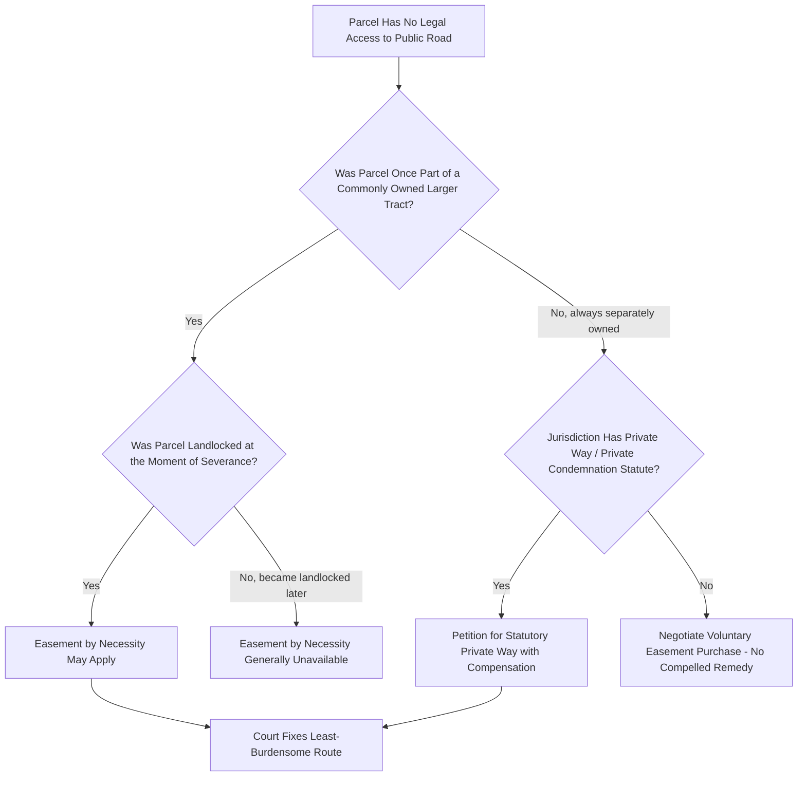

## Access Easements for Landlocked Parcels

### Definition and Conceptual Foundation

An access easement for a landlocked parcel is a non-possessory right permitting the owner of a parcel with no legal access to a public road to cross an adjoining parcel in order to reach the public road system. "Landlocked" in this context refers specifically to the absence of **legal** access — a recorded right-of-way or public road frontage — rather than merely inconvenient or informal access. A parcel can be physically walkable to a road and still be legally landlocked if no enforceable right-of-way exists over the intervening land.

This topic overlaps substantially with private roadway easements generally (see Private Roadway Easements) but merits focused treatment because landlocked-parcel disputes are governed by a specific, well-developed doctrinal framework — **easement by necessity** — along with statutory relief mechanisms in many jurisdictions that exist specifically to prevent land from becoming economically unusable.

**Key Points**

- The core policy rationale underlying all landlocked-access doctrine is that the law disfavors rendering land unusable for lack of access, since unusable land serves no productive purpose and undermines the alienability of property.
- Landlocked status most commonly arises from historical subdivision (a common grantor severing a tract without reserving or granting access to a resulting interior parcel), rather than from deliberate creation.
- Where no common-ownership history exists to support an implied easement, landlocked owners must rely on statutory private condemnation or negotiated purchase, which are less certain remedies.

### Easement by Necessity: Elements and Application

The primary common-law doctrine addressing landlocked parcels is the **easement by necessity** (sometimes called "way of necessity"), which arises automatically by operation of law under specific conditions, without requiring any express grant.

#### Required Elements (General Framework)

1. **Unity of title** — the landlocked parcel and the parcel over which access is sought were once part of a single, commonly owned tract.
2. **Severance** — the common owner (or a subsequent transferee) divided the tract, creating the landlocked condition at the moment of severance.
3. **Necessity at the time of severance** — the landlocked parcel had no other legal access to a public road immediately following severance (not merely at some later point).
4. **Continuing necessity** — in most jurisdictions, the necessity must persist at the time the easement is asserted; if alternative legal access later becomes available, the easement by necessity may terminate.

[Inference] Courts differ on whether the necessity must be absolute (literally no other way to reach a public road, even by an impractical or expensive alternative) or merely reasonable (no *practical* alternative), and this distinction is frequently the deciding factor in close cases — the applicable standard should be confirmed against controlling jurisdictional precedent.

#### Location of the Implied Easement

Because an easement by necessity arises by implication rather than express grant, its precise physical location is not automatically fixed. Courts typically:

- Select the route causing the least burden/damage to the servient estate, where multiple potential routes exist
- Consider the route historically used, if any, at the time of severance
- Allow for judicial or negotiated fixing of the exact path where the original conveyance is silent

**Example**

A landowner owns a 100-acre tract fronting a public road. She sells the rear 40 acres to a buyer, retaining the front 60 acres, and the deed is silent on access. Because the rear 40-acre parcel now has no road frontage and was severed from a commonly owned tract, courts will typically imply an easement by necessity across the retained front parcel, since the buyer's land would otherwise be inaccessible — a result the parties are presumed not to have intended, absent contrary language in the deed.

### Distinguishing Easement by Necessity from Implied Easement by Prior Use

These two doctrines are frequently confused but rest on different justifications:

| Attribute | Easement by Necessity | Implied Easement by Prior Use |
| --- | --- | --- |
| Core Requirement | Landlocked status / absolute or reasonable necessity at severance | Apparent, continuous prior use before severance |
| Necessity Threshold | Strict (in many jurisdictions) — no legal access at all | Lower — reasonable necessity for continued use, not absolute lack of alternatives |
| Applies When | Severed parcel has zero road access | Severed parcel had an established prior use (e.g., existing driveway) even if some alternative access theoretically exists |
| Termination | May terminate if alternative legal access later arises | Generally does not terminate merely because alternative access becomes available, once established |

[Unverified] Some jurisdictions merge or blur these two doctrines analytically, treating them as variants of a single "implied easement" framework rather than maintaining a strict conceptual separation; the applicable jurisdiction's case law should be consulted to determine which framework, and which specific elements, control.

### Statutory Private Condemnation ("Private Way" Statutes)

Where no common-ownership history exists to support an easement by necessity — for example, a landlocked parcel that has always been separately owned from any surrounding tract — the common law generally provides no automatic remedy. Many jurisdictions address this gap through **statutory private way** or **private condemnation** statutes, which allow a landlocked owner to petition a court or administrative body to condemn a right-of-way across a neighboring parcel, upon payment of compensation to the servient owner.

Typical statutory features include:

- A petition process (often before a local court, county commission, or specially convened panel)
- A requirement to demonstrate no other reasonable/practical access exists
- Selection of the least-damaging feasible route among available alternatives
- Compensation to the burdened landowner, determined similarly to eminent domain valuation
- Sometimes a requirement that the petitioner show the parcel is landlocked through no fault of their own (e.g., not landlocked due to their own voluntary conveyance of access rights)

**Key Points**

- Private way statutes exist because pure common-law necessity doctrine cannot help a landlocked owner whose parcel was never part of a larger commonly owned tract.
- This is a form of *private* eminent domain — an unusual mechanism allowing one private party to compel another to grant an easement, justified by the strong public policy against rendering land unusable.
- [Unverified] The availability, procedural requirements, and scope of private way statutes vary substantially by jurisdiction; some jurisdictions have no such statute at all, leaving landlocked owners without common-law necessity grounds to negotiate a purchase or easement voluntarily, which can result in significant leverage imbalance.

### Illustrative Diagram: Landlocked Access Remedy Decision Tree

### SVG Diagram: Historically Severed Landlocked Parcel (svg_diagram)

<svg xmlns="http://www.w3.org/2000/svg" viewBox="0 0 700 340">
<rect x="0" y="0" width="700" height="340" fill="#ffffff" />
<text x="350" y="26" font-size="16" text-anchor="middle" font-family="sans-serif" font-weight="bold">Severance History Creating a Landlocked Parcel (svg_diagram)</text>

<rect x="150" y="60" width="400" height="220" fill="none" stroke="#333333" stroke-width="2" stroke-dasharray="6,4" />
<text x="350" y="50" font-size="11" text-anchor="middle" font-family="sans-serif">Original Commonly Owned Tract (Before Severance)</text>

<rect x="150" y="220" width="400" height="60" fill="#eef7ee" stroke="#2e7d32" stroke-width="2" />
<text x="350" y="255" font-size="11" text-anchor="middle" font-family="sans-serif">Servient Parcel (Retains Road Frontage)</text>

<rect x="100" y="280" width="500" height="25" fill="#555555" />
<text x="350" y="298" font-size="10" text-anchor="middle" font-family="sans-serif" fill="#ffffff">Public Road</text>

<rect x="150" y="60" width="400" height="160" fill="#f4d6d6" stroke="#c0392b" stroke-width="2" />
<text x="350" y="145" font-size="12" text-anchor="middle" font-family="sans-serif">Landlocked Parcel (Severed, No Road Frontage)</text>

<rect x="330" y="60" width="40" height="220" fill="#f9e79f" opacity="0.8" />
<text x="440" y="170" font-size="10" font-family="sans-serif" fill="#7d6608">Implied Easement by Necessity</text>
<line x1="350" y1="60" x2="350" y2="280" stroke="#c0392b" stroke-width="1" stroke-dasharray="5,3" />
</svg>

### Termination and Loss of Necessity-Based Access

An easement by necessity is inherently tied to the condition that justified its creation, so it is subject to termination in circumstances that would not affect an express easement:

1. **Cessation of necessity** — if alternative legal access to a public road later becomes available (e.g., through a new road, subdivision, or acquisition of an adjoining strip), courts in many jurisdictions hold the easement by necessity terminates automatically, since its sole justification (necessity) no longer exists.
2. **Merger** — common ownership of the previously severed parcels extinguishes the easement.
3. **Express waiver or release** — the landlocked owner may expressly release the easement, though this would be an unusual and disadvantageous choice absent compensation or alternative access.

[Inference] The "automatic termination upon cessation of necessity" rule is a significant practical risk for landlocked owners relying on necessity-based access rather than an express recorded easement, since a change in surrounding land use or road development could extinguish their access right without any action on their part — this is a strong practical reason favoring conversion of an implied necessity easement into an express, recorded easement wherever possible.

### Practical and Transactional Considerations

For practitioners and landowners dealing with landlocked parcels, several practical strategies commonly arise:

- **Title examination** — reviewing the chain of title back to the last point of common ownership to determine whether an easement by necessity or implied easement from prior use can be established
- **Express easement negotiation** — even where an implied easement may exist, negotiating and recording an express easement removes uncertainty about termination-upon-cessation-of-necessity risk and clarifies scope, maintenance, and location
- **Title insurance considerations** — landlocked status or uncertain access rights is a significant title defect that title insurers scrutinize closely, sometimes requiring an access endorsement or excepting access risk from coverage
- **Statutory private way petitions** — pursued as a fallback where no common-ownership history supports an implied easement claim

### Common Disputes

1. Whether unity of title existed at the relevant historical severance point, particularly for parcels with complex or poorly documented chains of title
2. Whether necessity was "strict" or merely "reasonable" under the controlling jurisdiction's standard, especially where some difficult or expensive alternative access theoretically exists
3. Selection and location of the specific route where the implied easement's exact path was never documented
4. Whether subsequently available alternative access terminates a previously established easement by necessity
5. Availability and procedural requirements of statutory private way relief where no common-ownership history exists

### Jurisdictional Variation

[Unverified] Easement by necessity is broadly recognized across common-law jurisdictions, but private way/private condemnation statutes are not universal, and where they exist their procedural requirements, compensation standards, and eligibility criteria differ substantially; the applicable jurisdiction's specific statutory and case law framework should always be verified for any actual landlocked-parcel matter.

**Related Topics**

- Private Roadway Easements
- Implied Easements from Prior Use (Quasi-Easements)
- Private Way Statutes and Statutory Private Condemnation
- Title Examination and Chain-of-Title Analysis for Access Rights
- Termination of Easements by Necessity Upon Changed Circumstances
- Eminent Domain and Just Compensation Valuation Methods
- Subdivision Regulation and Access Requirements for New Parcels
- Title Insurance and Access Endorsements