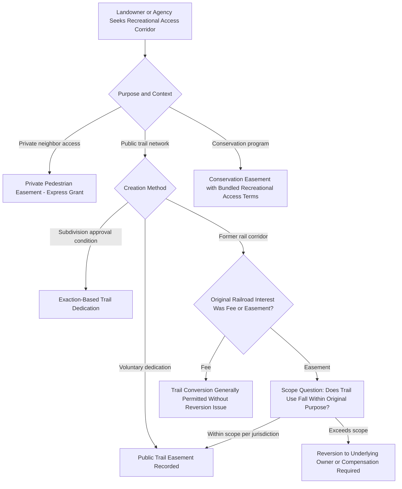

## Pedestrian and Recreational Easements

### Definition and Conceptual Foundation

A pedestrian or recreational easement is a non-possessory right permitting foot traffic, and often related non-vehicular recreational activity (biking, horseback riding, skiing, fishing access, nature observation), across a defined corridor or area of another's land. These easements differ from vehicular roadway easements in both *purpose* (recreation, connectivity, or conservation access rather than property access necessity) and *typical grantee* (frequently a public agency, land trust, or municipality holding the easement for broad public or community benefit, rather than a single adjoining landowner).

**Key Points**

- Pedestrian/recreational easements can be either **private** (benefiting a specific neighboring parcel, such as a beach-access footpath) or **public** (benefiting the general public, such as a public greenway trail), with materially different creation and enforcement rules depending on which category applies.
- Unlike necessity-driven access easements, recreational easements are rarely compelled by law; they are almost always the product of voluntary grant, dedication, statutory program, or conservation-oriented negotiation.
- This category increasingly overlaps with conservation and land trust practice, since recreational trail easements are commonly bundled with, or arise alongside, broader conservation easements restricting development.

### Categories of Pedestrian and Recreational Easements

#### 1. Private Pedestrian Access Easements

Grant a specific neighboring parcel (or specific individual) a right of foot passage across another's land — for example, a shared footpath between adjoining rural parcels, or beach/waterfront access easements allowing an inland parcel owner to reach the shoreline across a beachfront parcel.

#### 2. Public Trail and Greenway Easements

Grant the general public a right to use a defined trail corridor, typically created through:

- Voluntary dedication by a landowner (often as part of a subdivision approval or development exaction requirement)
- Purchase or donation to a public agency, municipality, or land trust
- Rail-to-trail conversions (see below)
- Statutory or regulatory public access requirements tied to shoreline, riverbank, or other resource access policy

#### 3. Rail-to-Trail (Railbanking) Easements

A specialized and heavily litigated category arising where former railroad rights-of-way are converted to public recreational trails rather than being fully abandoned. Because many historic railroad corridors were themselves established as **easements** over private land (rather than fee ownership) for the specific purpose of rail transportation, converting the corridor to trail use raises the question of whether trail use falls within the scope of the original railroad easement or constitutes an entirely new use requiring separate authorization (or triggering reversion to the underlying fee owner).

[Inference] Jurisdictions and legal systems differ significantly on whether trail conversion is treated as a permissible continuation of the "public transportation corridor" purpose (thus not exceeding the easement's scope) or as a new, unauthorized use exceeding the original railroad easement's scope (thus triggering reversion or requiring compensation to the servient landowner) — this is a genuinely unsettled and actively litigated area rather than a matter of settled doctrine, and the applicable statutory framework (e.g., specific railbanking statutes) should be checked for the relevant jurisdiction.

#### 4. Recreational Use Statutes and Landowner Liability Limitation

Many jurisdictions have enacted **recreational use statutes** that limit a landowner's tort liability to recreational users who are permitted (gratuitously) to access land for hiking, hunting, fishing, or similar activities, encouraging landowners to informally tolerate recreational access without fear of significant liability exposure. [Unverified] These statutes are distinct from formal easements — they typically apply to gratuitous permissive use rather than an easement holder's rights — but they are frequently discussed alongside recreational access easements because they shape landowners' practical willingness to grant or tolerate recreational access; the specific liability standard and covered activities vary by jurisdiction.

**Example**

A land trust negotiates a recreational trail easement across a private farm to connect two segments of a regional hiking trail network. The easement grants the public a right to walk (but not drive motor vehicles) along a defined 10-foot-wide corridor, while the farm owner retains the right to farm the surrounding land, restrict trail hours seasonally for planting/harvest, and exclude camping or overnight use — terms that are individually negotiated and recorded against the property's title.

### Creation Mechanisms Specific to Recreational Easements

#### Voluntary Grant and Conservation Bundling

Recreational access is frequently granted as part of a broader **conservation easement** (see related topic), where a landowner restricts development rights in exchange for tax benefits or conservation program participation, and a public or limited-access recreational trail right is included as one component of the overall restriction package.

#### Subdivision Exactions

Local land-use authorities frequently require developers, as a condition of subdivision or site-plan approval, to dedicate a trail or pedestrian connectivity easement — linking new developments to existing trail networks, parks, or transit access points.

#### Statutory Public Trust and Shoreline Access

In many coastal and riparian jurisdictions, the **public trust doctrine** independently guarantees public access to and along certain water bodies (tidal areas, navigable waterways) below a defined boundary (e.g., the mean high tide line), functioning similarly to an easement even though it derives from a distinct sovereign-ownership doctrine rather than a private grant. [Unverified] The precise scope of public trust shoreline access (whether it includes a right to walk along the dry sand beach above the water line, for instance) varies dramatically by jurisdiction and is a significant, actively contested area of coastal property law.

**Key Points**

- Subdivision exactions requiring trail dedication must generally satisfy a constitutional "nexus" and "rough proportionality" standard (in U.S. law, derived from *Nollan v. California Coastal Commission* and *Dolan v. City of Tigard*) — the required dedication must be roughly proportional to the impact of the specific development, or it may constitute an unconstitutional taking.
- Conservation-bundled recreational easements often include significant restrictions on the *type* of recreational use (e.g., hiking permitted, motorized vehicles prohibited) to protect the underlying conservation values.

### Illustrative Diagram: Recreational Easement Creation Pathways

### SVG Diagram: Bundled Conservation and Recreational Trail Easement (svg_diagram)

<svg xmlns="http://www.w3.org/2000/svg" viewBox="0 0 700 340">
<rect x="0" y="0" width="700" height="340" fill="#ffffff" />
<text x="350" y="26" font-size="16" text-anchor="middle" font-family="sans-serif" font-weight="bold">Farm Parcel with Bundled Trail and Conservation Easement (svg_diagram)</text>

<rect x="60" y="60" width="580" height="220" fill="#eef7ee" stroke="#2e7d32" stroke-width="2" />
<text x="90" y="85" font-size="12" font-family="sans-serif" fill="#2e7d32">Farm Parcel (Development Rights Restricted by Conservation Easement)</text>

<path d="M 90 270 Q 250 150 400 220 Q 500 260 620 100" stroke="#7d6608" stroke-width="10" fill="none" opacity="0.6" />
<text x="450" y="90" font-size="11" font-family="sans-serif" fill="#7d6608">Public Recreational Trail Easement</text>

<rect x="480" y="180" width="120" height="70" fill="#f4d6d6" opacity="0.6" stroke="#c0392b" stroke-dasharray="4,3" />
<text x="540" y="215" font-size="9" text-anchor="middle" font-family="sans-serif" fill="#c0392b">Development Restricted Zone</text>

<circle cx="90" cy="270" r="6" fill="#2266aa" />
<text x="90" y="295" font-size="9" text-anchor="middle" font-family="sans-serif" fill="#2266aa">Public Access Point</text>
</svg>

### Scope, Use Restrictions, and Enforcement

Recreational easements are typically drafted with more granular use restrictions than ordinary access easements, since the servient landowner's tolerance often depends heavily on limiting the *type and intensity* of permitted activity:

- **Permitted activities** — hiking, biking, horseback riding, fishing, hunting (each typically specified separately rather than assumed)
- **Prohibited activities** — motorized vehicles, camping, open fires, hunting (where not intended), commercial guided tours (unless separately negotiated)
- **Seasonal or time-of-day restrictions** — closures during hunting season, planting/harvest, or wildlife breeding periods
- **Maintenance responsibility** — often assigned to the holding agency or land trust rather than the servient landowner
- **Liability allocation** — indemnification clauses, insurance requirements, and reliance on recreational use statute protections
- **Signage and marking requirements** — defining the exact permitted corridor to prevent unauthorized wandering off-trail

[Inference] Because recreational easements often permit intermittent, low-intensity use rather than continuous occupation, boundary and scope enforcement (ensuring users stay within the marked corridor and comply with activity restrictions) is a practical challenge distinct from the enforcement concerns typical of vehicular access easements, and disputes often center on trespass beyond the marked corridor rather than on the easement's fundamental validity.

### Common Disputes

1. Whether a converted rail corridor's trail use exceeds the scope of the original railroad easement, triggering reversion claims by underlying fee owners
2. Whether a subdivision exaction requiring trail dedication satisfies the constitutional nexus/proportionality standard or constitutes an uncompensated taking
3. Scope disputes over permitted recreational activities (e.g., whether "pedestrian use" implicitly includes bicycles or is limited strictly to foot traffic)
4. Liability disputes where a recreational user is injured, particularly regarding whether a recreational use statute limits the landowner's exposure
5. Public trust doctrine boundary disputes over the extent of guaranteed shoreline access
6. Maintenance and encroachment disputes where adjoining development or vegetation growth narrows or obstructs a recorded trail corridor

### Jurisdictional Variation

[Unverified] Recreational use statutes, public trust doctrine scope, rail-to-trail conversion rules, and subdivision exaction standards are all significantly jurisdiction-dependent, with substantial variation not only between countries but between individual U.S. states; any specific recreational easement matter should be analyzed against the controlling jurisdiction's current statutory and case law framework rather than general principles alone.

**Related Topics**

- Conservation Easements and Development Rights Restriction
- Public Trust Doctrine and Shoreline/Waterway Access Rights
- Rail-to-Trail Conversion and Railbanking Statutes
- Recreational Use Statutes and Landowner Liability Limitation
- Subdivision Exactions and the Nollan/Dolan Nexus-Proportionality Standard
- Private Roadway Easements
- Public Roads and Highway Easements
- Trespass and Scope Enforcement in Recreational Access Corridors