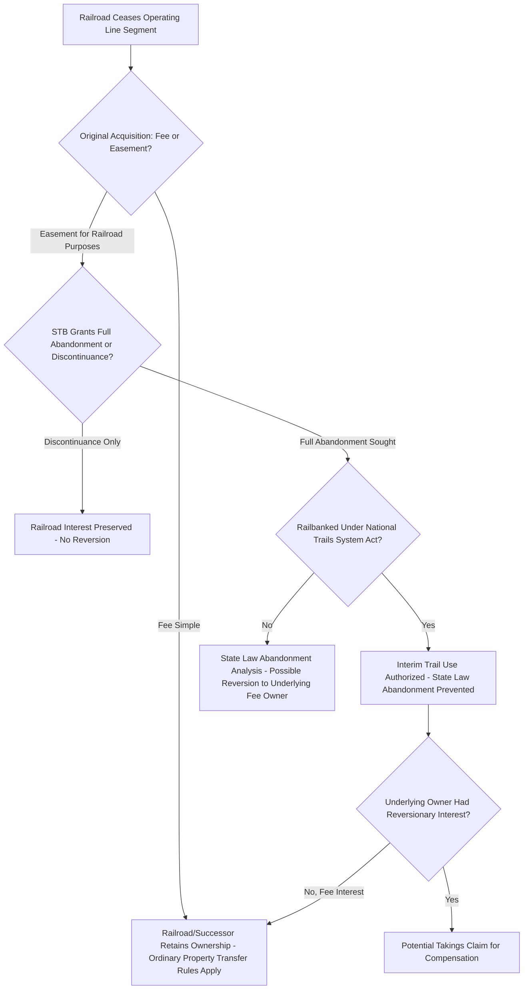

## Rail Corridors and Rail Trail Conversions

### Definition and Conceptual Foundation

Rail corridors are the linear strips of land historically acquired by railroad companies to construct and operate rail lines, typically obtained through a combination of fee purchases, easement grants, and eminent domain condemnation during the 19th and early 20th centuries. Rail trail conversion refers to the process of repurposing abandoned or underused rail corridors for public recreational trail use (walking, cycling, sometimes equestrian use) rather than allowing the corridor to be extinguished and its component parcels revert to fragmented private ownership.

This topic sits at a distinctive intersection of property law categories: it combines original railroad acquisition doctrine (fee vs. easement interests), federal or national regulatory abandonment procedures, and the scope-of-easement principles relevant to any right-of-way easement (see Public Roads and Highway Easements; Pedestrian and Recreational Easements).

**Key Points**

- Whether a given historic rail corridor segment was originally acquired in **fee simple** or as an **easement limited to railroad purposes** is the single most consequential legal question determining what can be done with the corridor after rail service ceases — and this determination often requires painstaking historical deed research on a parcel-by-parcel basis.
- Rail corridors acquired as easements are legally distinct from those acquired in fee: an easement automatically extinguishes (with the underlying fee reverting to the abutting landowner) once the railroad purpose is fully abandoned, whereas a fee interest continues in the railroad (or its successor) indefinitely, subject to ordinary property transfer rules.
- Rail-to-trail conversion is one of the most heavily litigated modern applications of scope-of-easement doctrine, because converting a "railroad easement" into a "public trail easement" raises the question of whether trail use is a permissible continuation of the original purpose or a new use exceeding the original grant.

### Historical Acquisition Methods and the Fee-vs-Easement Question

Railroads acquired their corridors through varied historical mechanisms, and the specific method used for each parcel segment determines the nature of the resulting interest:

1. **Fee simple purchase** — the railroad bought the land outright; the corridor is railroad-owned real property like any other fee estate.
2. **Federal or state land grants** — particularly in the U.S. context, extensive rights-of-way were granted to railroads by government land grants (especially in the 19th century transcontinental expansion era), with courts often construing these grants as conveying either a "limited fee" (subject to reverter if rail use ceased) or an easement, depending on the specific granting statute's language — a matter extensively litigated under U.S. federal land grant statutes.
3. **Private easement grants** — many landowners granted the railroad only an easement (a right-of-way for railroad purposes) while retaining underlying fee ownership, often because this arrangement provided tax or compensation advantages, or simply reflected the negotiating norms of the era.
4. **Condemnation (eminent domain)** — where landowners would not voluntarily convey, railroads (frequently vested with statutory condemnation power as quasi-public utilities) condemned rights-of-way, with the condemnation judgment or governing statute determining whether a fee or easement interest resulted.

[Inference] Because railroad acquisition often occurred more than a century ago under varying and sometimes ambiguous historical statutes and instruments, determining fee-versus-easement status for any specific segment frequently requires detailed archival deed and land-grant research, and reasonable legal minds can differ on the correct characterization of ambiguous historical instruments — this is a genuinely fact-intensive and sometimes irreducibly uncertain inquiry rather than a matter of applying a single clear rule.

### Abandonment and Reversion

Where a rail corridor segment was acquired as an easement (rather than fee), the critical legal question upon cessation of rail service is whether **abandonment** has occurred, because abandonment of an easement (unlike abandonment of a fee) extinguishes the interest and triggers reversion of the underlying fee to the current owner(s) of the abutting or underlying land.

In the U.S., railroad abandonment is governed by a specific federal regulatory framework:

- The **Surface Transportation Board (STB)** (successor to the Interstate Commerce Commission) has exclusive jurisdiction over the abandonment of rail lines subject to its regulatory authority
- A railroad seeking to cease service must obtain STB authorization for **abandonment** (permanent cessation) or **discontinuance** (temporary cessation of service while retaining the underlying property interest)
- Only a full abandonment authorization (as opposed to discontinuance) triggers the state-law question of whether an easement-based corridor has been abandoned for property-law purposes

[Unverified] The precise interaction between STB abandonment authorization and state property law's independent common-law abandonment analysis (courts in some jurisdictions treat STB abandonment as conclusive evidence of common-law abandonment, while others require independent proof of intent to abandon under state law) varies by jurisdiction, and current STB regulations and precedent should be verified for any actual matter.

### The National Trails System Act and Railbanking

To prevent the loss of long linear corridors to fragmented private reversion — which would make future rail reactivation or trail conversion practically impossible — Congress enacted **railbanking** provisions under the National Trails System Act, as amended (16 U.S.C. § 1247(d) in the U.S. context). Railbanking allows a railroad to transfer an otherwise-abandoned corridor to a qualified trail-operating entity (often a nonprofit, land trust, or public agency) for **interim trail use**, while preserving the corridor for potential future rail reactivation, rather than allowing state-law abandonment and reversion to occur.

$$\text{Railbanking Effect: } \text{Corridor Preserved} = \text{No State-Law Abandonment} + \text{Interim Trail Use Authorized}$$

This creates the central controversy in rail-to-trail law: because railbanking is a *federal* legal fiction designed to prevent state-law abandonment from occurring, it can defeat the reversionary interests that underlying fee owners (of easement-based corridors) would otherwise have received under ordinary state property law.

**Example**

A railroad ceases operating a line that crosses land originally acquired as easements from adjoining farm owners in the 1890s. Rather than formally abandoning the line (which would trigger state-law reversion of the easement-based segments to the farm owners' successors), the railroad transfers the corridor to a regional trail conservancy under the railbanking provision. Because the transfer is structured as an interim trail use rather than abandonment, the farm owners' successors may find that their anticipated reversionary interest never actually materializes — a result that has produced substantial litigation, including notably in U.S. Supreme Court and Court of Federal Claims takings litigation.

### Takings Litigation Arising from Railbanking

Because railbanking can prevent reversion that landowners would otherwise be legally entitled to, a substantial body of litigation has developed — particularly in the U.S. Court of Federal Claims — addressing whether railbanking constitutes a **taking** of the underlying fee owners' reversionary property interest, requiring just compensation under the Fifth Amendment.

[Unverified] The specific outcome of these takings claims depends heavily on the fee-versus-easement characterization of the original railroad conveyance (a taking claim generally requires that the underlying landowner actually held a reversionary interest, which exists only if the original conveyance was an easement rather than a fee) and on the scope of the original easement's purpose language; given the volume and fact-specificity of this litigation, current case law should be consulted directly for any jurisdiction-specific or corridor-specific analysis rather than relying on generalized summary.

**Key Points**

- Railbanking takings litigation is a paradigm example of how a federal statutory scheme (National Trails System Act) can interact with, and potentially override, state property law reversionary expectations.
- Successful takings claims result in monetary compensation to the affected landowners rather than blocking the trail conversion itself — meaning railbanking-based trail conversions generally proceed even where compensation is ultimately owed.

### Illustrative Diagram: Rail Corridor Fate Determination

### SVG Diagram: Easement-Based Rail Corridor Reversion vs. Railbanking (svg_diagram)

<svg xmlns="http://www.w3.org/2000/svg" viewBox="0 0 700 360">
<rect x="0" y="0" width="700" height="360" fill="#ffffff" />
<text x="350" y="26" font-size="16" text-anchor="middle" font-family="sans-serif" font-weight="bold">Rail Corridor Reversion vs. Railbanking Outcomes (svg_diagram)</text>

<rect x="60" y="150" width="580" height="30" fill="#555555" />
<text x="350" y="170" font-size="11" text-anchor="middle" font-family="sans-serif" fill="#ffffff">Former Rail Corridor (Easement-Based Segments)</text>

<rect x="60" y="60" width="140" height="90" fill="#eef7ee" stroke="#2e7d32" />
<text x="130" y="105" font-size="10" text-anchor="middle" font-family="sans-serif">Adjoining Parcel A</text>
<rect x="220" y="60" width="140" height="90" fill="#eef7ee" stroke="#2e7d32" />
<text x="290" y="105" font-size="10" text-anchor="middle" font-family="sans-serif">Adjoining Parcel B</text>
<rect x="60" y="200" width="140" height="90" fill="#eef7ee" stroke="#2e7d32" />
<text x="130" y="245" font-size="10" text-anchor="middle" font-family="sans-serif">Adjoining Parcel C</text>

<line x1="130" y1="150" x2="130" y2="60" stroke="#c0392b" stroke-width="2" marker-end="url(#arrowUp)" />
<text x="130" y="45" font-size="9" text-anchor="middle" font-family="sans-serif" fill="#c0392b">No Railbanking - Reverts to A</text>

<rect x="420" y="150" width="220" height="30" fill="#f9e79f" opacity="0.8" />
<text x="530" y="200" font-size="10" text-anchor="middle" font-family="sans-serif" fill="#7d6608">Railbanked - Interim Public Trail Use</text>
</svg>

### Non-U.S. Context and Comparative Note

[Unverified] The federal regulatory framework described above (Surface Transportation Board jurisdiction, National Trails System Act railbanking) is specific to the United States. Other jurisdictions with historic rail networks (e.g., the United Kingdom, Canada, Australia) have their own distinct statutory frameworks governing rail line abandonment, corridor disposition, and trail conversion, which may differ substantially in structure and in how they resolve the fee-versus-easement and reversion questions; this general framework should not be assumed to apply outside the U.S. context without independent verification.

### Practical Considerations for Trail Conversion Projects

- **Title and deed research** — essential first step to determine fee-versus-easement status parcel-by-parcel along the corridor
- **Regulatory filings** — coordination with the applicable rail regulatory authority for abandonment, discontinuance, or railbanking authorization
- **Landowner negotiation** — proactive negotiation with adjoining/underlying landowners can reduce future takings litigation exposure and improve community relations
- **Liability and maintenance planning** — trail-operating entities typically assume maintenance responsibility and should evaluate recreational use statute protections (see Pedestrian and Recreational Easements)
- **Future rail reactivation contingency** — railbanked corridors remain technically available for future rail use, which may affect trail design decisions (e.g., avoiding permanent structures that would preclude reactivation)

### Common Disputes

1. Fee-versus-easement characterization of historic railroad conveyances, particularly under ambiguous 19th-century land grant statutes
2. Whether railbanking-based trail conversion constitutes a taking of an underlying fee owner's reversionary interest
3. Whether trail use falls within the scope of an original railroad purpose easement (a scope-of-easement question independent of the railbanking/reversion issue)
4. Boundary and encroachment disputes where adjoining development has encroached onto the nominal corridor width over decades of reduced rail activity
5. Valuation disputes in takings litigation over the value of an extinguished (or would-have-been-extinguished) reversionary interest

**Related Topics**

- Pedestrian and Recreational Easements
- Public Roads and Highway Easements
- Scope-of-Easement Doctrine and Permissible Use Evolution
- Eminent Domain and Just Compensation Valuation Methods
- Federal Land Grant Statutes and Railroad Right-of-Way Characterization
- Surface Transportation Board Abandonment and Discontinuance Procedures
- Reversionary Interests and Termination of Easements
- Comparative Rail Corridor Disposition Frameworks Outside the U.S.