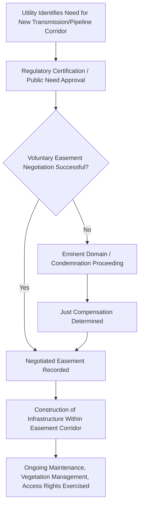

## Electric, Gas, and Pipeline Easements

### Definition and Conceptual Foundation

Electric, gas, and pipeline easements are non-possessory rights permitting a utility company, energy transporter, or infrastructure operator to construct, operate, maintain, and repair transmission or distribution infrastructure — overhead power lines, underground gas mains, liquid or gas pipelines, substations, and related facilities — across land owned by another party. These easements constitute one of the largest and most economically significant categories of infrastructure easement, given the vast linear networks required for electric transmission and hydrocarbon transport across most developed economies.

**Key Points**

- Utility easements are typically **easements in gross** (benefiting the utility company as an entity, rather than a neighboring dominant estate), which distinguishes them structurally from most roadway or access easements, which are typically appurtenant.
- Most electric and gas utilities hold statutory or franchise-based authority to condemn easements through eminent domain, reflecting their status as regulated public utilities or common carriers, though voluntary negotiation remains the predominant acquisition method in practice.
- These easements are defined with unusual technical specificity compared to ordinary access easements — width, depth of burial, clearance zones, and vegetation/structure restrictions are typically expressed in precise engineering terms tied to safety codes and industry standards.

### Categories and Typical Instruments

#### 1. Electric Transmission and Distribution Easements

Grant rights to construct and maintain overhead power lines (transmission towers, distribution poles) or underground electric cable, including:

- A defined corridor width (often substantially wider for high-voltage transmission lines than for local distribution lines, reflecting clearance and safety requirements)
- Right to trim, remove, or restrict vegetation within and adjacent to the corridor that could interfere with conductors or create fire risk
- Access rights for maintenance vehicles and personnel
- Height/structure restrictions on the servient estate beneath transmission corridors

#### 2. Natural Gas Distribution and Transmission Easements

Grant rights to bury and operate gas pipelines, ranging from small-diameter local distribution lines to large-diameter interstate transmission pipelines, including:

- Minimum depth-of-burial specifications
- A no-build/no-dig restricted zone directly above the pipeline
- Access rights for periodic inspection, corrosion monitoring, and emergency repair
- Restrictions on activities that could compromise pipeline integrity (deep excavation, tree planting with deep root systems, heavy equipment operation)

#### 3. Liquid and Multi-Product Pipeline Easements

Similar in structure to gas transmission easements but covering crude oil, refined petroleum products, or other liquid hydrocarbons, typically including additional provisions addressing spill response access, environmental remediation rights, and leak-detection infrastructure access.

#### 4. Substation, Compressor Station, and Facility Site Easements/Leases

Distinct from linear corridor easements, these grant a defined parcel or footprint for fixed infrastructure (electric substations, gas compressor stations, pump stations, metering facilities), often structured as a long-term lease or a fee purchase rather than a linear easement, given the more intensive, permanent nature of the facility.

**Example**

A regional utility negotiates a 100-foot-wide transmission line easement across several agricultural parcels to connect a new solar generation facility to the regional grid. The easement permits construction and maintenance of transmission towers and conductors, grants the utility a right to trim trees within the corridor and within a defined buffer zone outside it, and restricts the landowners from constructing any structure taller than a specified clearance height within the corridor, while permitting continued agricultural use (crop cultivation, grazing) beneath and around the towers.

### Regulatory Authority and Condemnation Power

Unlike most private roadway or access easements, utility easements are frequently backed by statutory eminent domain authority, reflecting the public-service character of electric, gas, and pipeline infrastructure:

- **Public utility commissions / regulatory bodies** typically oversee rate regulation and, in many jurisdictions, must approve or certify the public need for major transmission or pipeline projects before condemnation authority may be exercised (e.g., certificate of public convenience and necessity proceedings)
- **Federal or national pipeline regulators** (in the U.S., entities such as FERC for interstate natural gas pipelines, and PHMSA for pipeline safety standards) impose additional layers of approval and safety compliance requirements
- **Condemnation procedures** generally mirror general eminent domain law (see related topics on public roads and access easements), requiring just compensation, though the specific valuation methodology for a utility easement (reflecting partial use rather than full taking) differs from fee-simple condemnation valuation

[Inference] The degree of regulatory pre-approval required before a utility may exercise condemnation authority (and the specific administrative body responsible) varies substantially by jurisdiction, by the type of utility (electric transmission vs. local gas distribution vs. interstate pipeline), and by whether the project crosses jurisdictional boundaries — this creates a genuinely complex, multi-layered regulatory landscape that should be analyzed against the specific project's jurisdiction and infrastructure type rather than treated as a single uniform process.

### Compensation and Valuation Considerations

Utility easement compensation is typically calculated differently from fee-simple land value, since the servient owner retains substantial residual use rights (e.g., continued farming beneath a transmission line):

$$\text{Easement Value} \approx \text{Fee Value} \times \text{Diminution Factor} + \text{Severance Damages (if applicable)}$$

Common valuation components include:

- Direct compensation for the easement area itself, often calculated as a percentage of full fee value reflecting the degree of use restriction
- Severance damages where the easement divides a parcel or impairs the value/usability of the remaining land (e.g., preventing future development beneath a transmission corridor)
- Damages for temporary construction disturbance, separate from the permanent easement compensation
- In some jurisdictions, ongoing annual payments rather than a single lump sum, particularly for certain categories of easement or under specific statutory schemes

[Unverified] Specific valuation methodologies, whether lump-sum or periodic payment structures are used, and the applicable percentage-of-fee-value conventions vary significantly by jurisdiction, utility type, and even by individual condemning authority's practice; current appraisal standards and case law for the specific jurisdiction should be consulted for any actual valuation matter.

### Illustrative Diagram: Utility Easement Acquisition and Regulatory Pathway

### SVG Diagram: Transmission Line and Pipeline Easement Corridors (svg_diagram)

<svg xmlns="http://www.w3.org/2000/svg" viewBox="0 0 700 360">
<rect x="0" y="0" width="700" height="360" fill="#ffffff" />
<text x="350" y="26" font-size="16" text-anchor="middle" font-family="sans-serif" font-weight="bold">Overlapping Transmission and Pipeline Easement Corridors (svg_diagram)</text>

<rect x="40" y="200" width="620" height="120" fill="#eef7ee" stroke="#2e7d32" />
<text x="70" y="220" font-size="11" font-family="sans-serif" fill="#2e7d32">Agricultural Parcel (Continued Farming Use)</text>

<line x1="180" y1="60" x2="180" y2="200" stroke="#444444" stroke-width="6" />
<line x1="140" y1="80" x2="220" y2="80" stroke="#444444" stroke-width="3" />
<line x1="480" y1="60" x2="480" y2="200" stroke="#444444" stroke-width="6" />
<line x1="440" y1="80" x2="520" y2="80" stroke="#444444" stroke-width="3" />
<line x1="180" y1="80" x2="480" y2="80" stroke="#888888" stroke-width="1.5" />
<text x="330" y="60" font-size="10" text-anchor="middle" font-family="sans-serif">Electric Transmission Corridor</text>

<rect x="130" y="60" width="420" height="140" fill="#d6e6f4" opacity="0.4" />

<line x1="60" y1="280" x2="640" y2="280" stroke="#c0392b" stroke-width="4" stroke-dasharray="10,6" />
<text x="350" y="300" font-size="10" text-anchor="middle" font-family="sans-serif" fill="#c0392b">Buried Gas Pipeline Easement (Restricted Excavation Zone)</text>
<rect x="60" y="270" width="580" height="20" fill="#f4d6d6" opacity="0.5" />
</svg>

### Vegetation Management and Clearance Requirements

A distinctive feature of electric transmission easements is the ongoing, active **vegetation management** right, driven by safety and reliability concerns (tree contact with power lines being a leading cause of outages and wildfire ignition in many regions):

- Right-of-way clearing to a specified minimum clearance distance from conductors
- Danger-tree removal rights extending beyond the easement's nominal boundary where a tree outside the corridor poses a falling hazard to the line
- Herbicide or mechanical clearing rights, subject to increasing environmental and organic-farming compatibility negotiations in agricultural contexts

[Inference] Given the substantial wildfire liability exposure utilities have faced in various jurisdictions in recent years, vegetation management clearance standards and enforcement practices have been trending toward greater stringency, though the specific regulatory clearance standards in force for any given utility and jurisdiction should be verified directly against current utility safety codes rather than assumed static.

### Pipeline Safety and Excavation Protection ("Call Before You Dig")

Because underground pipelines pose acute safety risks if struck by excavation equipment, most jurisdictions require:

- Mandatory pre-excavation notification systems (often a centralized "one-call" or "call before you dig" service) requiring anyone planning excavation to notify utility operators for underground facility location marking before digging
- Statutory penalties for excavation damage to marked utility facilities
- Buffer zone requirements around marked pipeline locations

This excavation-protection regime operates as a regulatory overlay independent of, but functionally supporting, the pipeline operator's underlying easement rights.

### Common Disputes

1. Scope disputes over vegetation management rights, particularly danger-tree removal extending beyond the nominal easement boundary
2. Valuation disputes in condemnation proceedings, especially regarding severance damages for parcels bisected by transmission corridors
3. Compatibility disputes between continued agricultural or development use and easement restrictions (e.g., irrigation system conflicts with transmission tower placement, similar to accommodation-doctrine analysis in mineral law)
4. Excavation damage liability where third-party contractors strike unmarked or improperly marked underground facilities
5. Solar, wind, or other renewable energy development conflicts with existing utility easement restrictions on the same land
6. Disputes over whether a utility's expanded use (e.g., upgrading a distribution line to higher-voltage transmission) exceeds the original easement's granted scope

### Interaction with Other Property Doctrines

Utility easement practice draws on, and often mirrors, doctrines developed in other easement contexts covered elsewhere in this course:

- **Accommodation doctrine principles** (see Surface Use Rights for Mineral Extraction) are frequently applied by analogy where utility easements conflict with existing agricultural or development uses
- **Scope-of-easement and overburdening analysis** (see Private Roadway Easements) governs disputes over utility upgrades or expanded use
- **Eminent domain and just compensation valuation** (see Public Roads and Highway Easements) provides the compensation framework for involuntary utility easement acquisition

### Jurisdictional Variation

[Unverified] The regulatory structures governing utility condemnation authority, safety codes, and excavation protection systems described above are broadly representative of developed common-law jurisdictions (particularly the U.S. regulatory framework), but specific regulatory bodies, statutory citations, and procedural requirements vary substantially across jurisdictions and are subject to ongoing legislative and regulatory change; current in-force regulations for the specific jurisdiction and infrastructure type should always be verified directly.

**Related Topics**

- Eminent Domain and Just Compensation Valuation Methods
- Surface Use Rights for Mineral Extraction (Accommodation Doctrine Analogy)
- Scope-of-Easement Doctrine and Permissible Use Evolution
- Public Utility Commission Certification and Public Need Proceedings
- Pipeline Safety Regulation and Excavation Damage Prevention Systems
- Vegetation Management Liability and Wildfire Risk in Utility Corridors
- Renewable Energy Siting Conflicts with Existing Utility Easements
- Telecommunications and Fiber Optic Easements