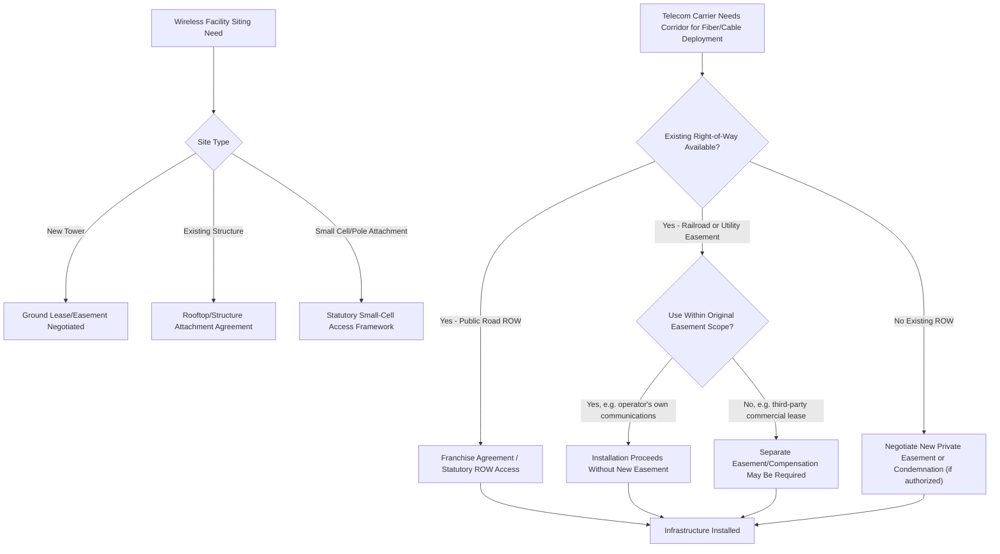

## Telecommunications and Broadband Easements

### Definition and Conceptual Foundation

Telecommunications and broadband easements are non-possessory rights permitting a telecommunications carrier, cable operator, or broadband provider to install, operate, and maintain communications infrastructure — fiber optic cable, coaxial cable, copper wireline, conduit, wireless facilities, and related equipment — across land owned by another party. This category shares substantial structural similarity with electric, gas, and pipeline easements (see prior topic), but has developed distinct doctrinal features driven by (1) the historical regulatory treatment of telecommunications as distinct from traditional utilities, (2) the frequent practice of installing telecom infrastructure within *existing* utility or road rights-of-way rather than acquiring wholly new corridors, and (3) rapidly evolving technology (fiber buildout, wireless facility siting, small-cell deployment) that continually raises new scope-of-easement questions.

**Key Points**

- Telecommunications easements are frequently **easements in gross**, similar to electric and gas utility easements, benefiting the carrier as an entity rather than a neighboring parcel.
- A substantial portion of telecom infrastructure is installed within **pre-existing rights-of-way** (public road easements, railroad corridors, electric utility easements) under separate authorization (franchise agreements, joint-use agreements, or statutory access rights) rather than through newly negotiated standalone easements — this "piggybacking" practice is a defining structural feature of the industry.
- Whether a telecommunications carrier's use of an existing right-of-way exceeds the scope of the original easement (typically granted for road, rail, or electric purposes) is one of the most frequently litigated issues in this area, closely paralleling the rail-trail scope-of-easement disputes discussed earlier in this course.

### Historical Regulatory Context

Telecommunications easement law developed against a shifting regulatory backdrop:

1. **Traditional common carrier framework** — historically, telephone companies were regulated as common carriers with statutory rights to access public rights-of-way, often codified in specific telecommunications access statutes distinct from general utility easement law.
2. **Cable television franchise regime** — cable operators historically obtained access to public rights-of-way and, in some cases, private easements through municipal franchise agreements rather than individually negotiated private easements, reflecting a regulatory model distinct from telephone common-carrier access.
3. **Post-deregulation convergence** — as telecommunications, cable, and broadband services converged technologically (a single fiber network capable of carrying voice, video, and data), the historically separate regulatory and easement-access frameworks for "telephone," "cable," and "data" providers have increasingly blurred, creating recurring questions about which legal framework (common carrier access statute, cable franchise law, or ordinary private easement law) governs a given carrier's access to a given right-of-way.

[Unverified] Because telecommunications regulation is unusually fragmented (separated across federal, state/provincial, and municipal authority layers in many jurisdictions, including notably the U.S.) and has undergone repeated legislative overhaul as technology has evolved, the specific statutory access rights applicable to any given carrier and right-of-way type should be verified directly against current governing statutes rather than assumed from historical patterns.

### Scope-of-Easement Disputes: Fiber-Optic Overbuild on Existing Corridors

The most frequently litigated telecommunications easement issue arises when a fiber-optic or broadband provider installs new infrastructure within an *existing* easement or right-of-way that was originally granted for a different purpose (a railroad corridor, an electric transmission easement, or a public road right-of-way), without separately negotiating a new easement from the underlying landowner.

The doctrinal question mirrors the rail-trail scope analysis: does installing fiber-optic cable within a railroad or utility right-of-way fall within the scope of the *original* easement's granted purpose, or does it constitute a new, unauthorized use requiring separate compensation to the underlying fee owner?

[Inference] Courts have reached varying conclusions on this question depending on (a) whether the fiber installation serves the original easement holder's own operational purposes (e.g., a railroad installing fiber for its own signaling and communications systems, which is more likely to be found within scope) versus (b) leasing right-of-way space to an unrelated third-party telecommunications carrier for commercial data transport unrelated to the original purpose (which is more likely to be found outside the original scope and to require separate compensation) — this is a genuinely unsettled and jurisdiction-dependent area, and specific case law should be consulted for the applicable jurisdiction and right-of-way type.

**Example**

A railroad holds an easement across a farmer's land, originally granted in the 1920s for "railroad purposes." Decades later, the railroad's successor leases space within the same right-of-way to a fiber-optic carrier for a commercial data transmission line unrelated to rail operations. The underlying landowner argues this exceeds the scope of the original railroad easement, since the fiber lease serves an entirely different commercial purpose than rail transportation and was never contemplated by the original grant — potentially entitling the landowner to additional compensation or an injunction, depending on the jurisdiction's scope-of-easement doctrine.

### Wireless Facility Siting Easements

Distinct from linear cable/fiber corridor easements, wireless communications infrastructure (cell towers, rooftop antennas, small-cell nodes, distributed antenna systems) typically requires **site-specific easements or leases** rather than linear rights-of-way:

- **Cell tower ground leases/easements** — grant a defined footprint (tower base, equipment shelter, access road) plus often an easement for utility service (power, fiber backhaul) to the tower site
- **Rooftop and structure-mounted easements/leases** — grant rights to install antennas and equipment on existing buildings, water towers, or other structures
- **Small-cell and public right-of-way attachment rights** — increasingly governed by specific state/provincial "small cell" statutes streamlining carrier access to public rights-of-way and utility poles for small-cell equipment deployment, reflecting the dense, decentralized infrastructure needs of modern wireless networks (4G/5G)

[Unverified] Small-cell siting statutes are a comparatively recent legislative development in many jurisdictions, driven by 5G network densification needs, and their specific procedural requirements (permit timelines, fee caps, aesthetic/design standards) vary considerably and are subject to frequent amendment; current statutory text should be verified for the applicable jurisdiction.

### Illustrative Diagram: Telecommunications Right-of-Way Access Pathways

### SVG Diagram: Fiber Overbuild Within Existing Railroad Easement (svg_diagram)

<svg xmlns="http://www.w3.org/2000/svg" viewBox="0 0 700 320">
<rect x="0" y="0" width="700" height="320" fill="#ffffff" />
<text x="350" y="26" font-size="16" text-anchor="middle" font-family="sans-serif" font-weight="bold">Fiber-Optic Overbuild Within Existing Rail Easement (svg_diagram)</text>

<rect x="60" y="60" width="580" height="200" fill="#eef7ee" stroke="#2e7d32" stroke-width="2" />
<text x="90" y="85" font-size="11" font-family="sans-serif" fill="#2e7d32">Underlying Farm Parcel (Fee Owner)</text>

<rect x="150" y="140" width="400" height="40" fill="#d9d9d9" stroke="#666666" />
<text x="350" y="165" font-size="11" text-anchor="middle" font-family="sans-serif">Original Railroad Easement Corridor</text>

<line x1="150" y1="170" x2="550" y2="170" stroke="#2266aa" stroke-width="4" stroke-dasharray="8,4" />
<text x="350" y="200" font-size="10" text-anchor="middle" font-family="sans-serif" fill="#2266aa">Fiber-Optic Cable (Scope-of-Easement Question)</text>

<circle cx="500" cy="130" r="14" fill="#f4d6d6" stroke="#c0392b" />
<text x="500" y="136" font-size="14" text-anchor="middle" font-family="sans-serif" fill="#c0392b" font-weight="bold">?</text>
</svg>

### Pole Attachment Rights and Joint Use

Where telecommunications infrastructure is attached to existing utility poles (a pervasive practice for both traditional wireline telecom and cable television deployment), a specialized regulatory regime governs **pole attachment rights**:

- Statutory or regulatory pole attachment rate formulas, determining what a telecom/cable attacher must pay the pole-owning utility for space on the pole
- Joint-use agreements between utilities and telecom/cable operators governing make-ready work, safety clearance standards, and attachment sequencing
- Access timelines and dispute resolution mechanisms, particularly relevant given the strategic importance of pole access for broadband deployment competition

[Unverified] Pole attachment regulation (rate-setting authority, applicable formula, and dispute resolution process) is typically vested in a specific regulatory body (e.g., a national telecommunications regulator or public utility commission, depending on jurisdiction) and has been subject to periodic significant reform; current regulations should be verified directly given the practical and competitive significance of this framework for broadband deployment.

### Underground Conduit and "Dig Once" Policies

Many jurisdictions and municipalities have adopted **"dig once" policies**, requiring or incentivizing the installation of shared conduit infrastructure whenever a road or utility excavation project occurs, to reduce the cumulative disruption of repeated separate excavations for different carriers over time. This policy trend affects easement practice by:

- Encouraging joint-trench agreements among multiple utility and telecom providers sharing a single excavation and easement corridor
- Creating shared conduit ownership or long-term lease arrangements among multiple carriers using the same physical infrastructure
- Reducing the need for repeated separate easement negotiations as new carriers seek access to already-disturbed corridors

### Common Disputes

1. Whether fiber-optic or cable installation within an existing railroad, utility, or road right-of-way exceeds the scope of the original easement's granted purpose
2. Pole attachment rate and access disputes between telecom/cable attachers and pole-owning utilities
3. Franchise fee and right-of-way access disputes between telecom carriers and municipalities
4. Wireless facility siting disputes, including aesthetic, health-concern-based, and zoning objections to tower or small-cell placement
5. Compensation disputes where a landowner argues a third-party commercial telecom lease within an existing easement corridor requires separate payment
6. Conflicts among multiple carriers sharing joint-trench or shared-conduit infrastructure regarding capacity allocation and maintenance responsibility

### Interaction with Other Infrastructure Easement Doctrines

- **Scope-of-easement and overburdening analysis** (see Private Roadway Easements; Rail Corridors and Rail Trail Conversions) directly governs the fiber-overbuild-on-existing-corridor question
- **Eminent domain and just compensation** principles apply where a telecom carrier holds statutory condemnation authority, though this is less universal for telecom than for traditional electric/gas utilities
- **Public roads and highway easement** doctrine governs telecom access to public rights-of-way, typically through franchise rather than condemnation

### Jurisdictional Variation

[Unverified] Telecommunications easement and right-of-way access law is unusually fragmented across regulatory layers and has been subject to substantial legislative change as technology has evolved (particularly with fiber broadband expansion and 5G/small-cell deployment); the specific statutory framework, regulatory body, and current case law governing any particular carrier, right-of-way type, or jurisdiction should be independently verified rather than assumed from general principles.

**Related Topics**

- Electric, Gas, and Pipeline Easements
- Rail Corridors and Rail Trail Conversions (Scope-of-Easement Parallel)
- Public Roads and Highway Easements
- Pole Attachment Rate Regulation and Joint-Use Agreements
- Small-Cell and Wireless Facility Siting Statutes
- Scope-of-Easement Doctrine and Permissible Use Evolution
- Municipal Franchise Agreements for Right-of-Way Access
- "Dig Once" Policies and Shared Conduit Infrastructure