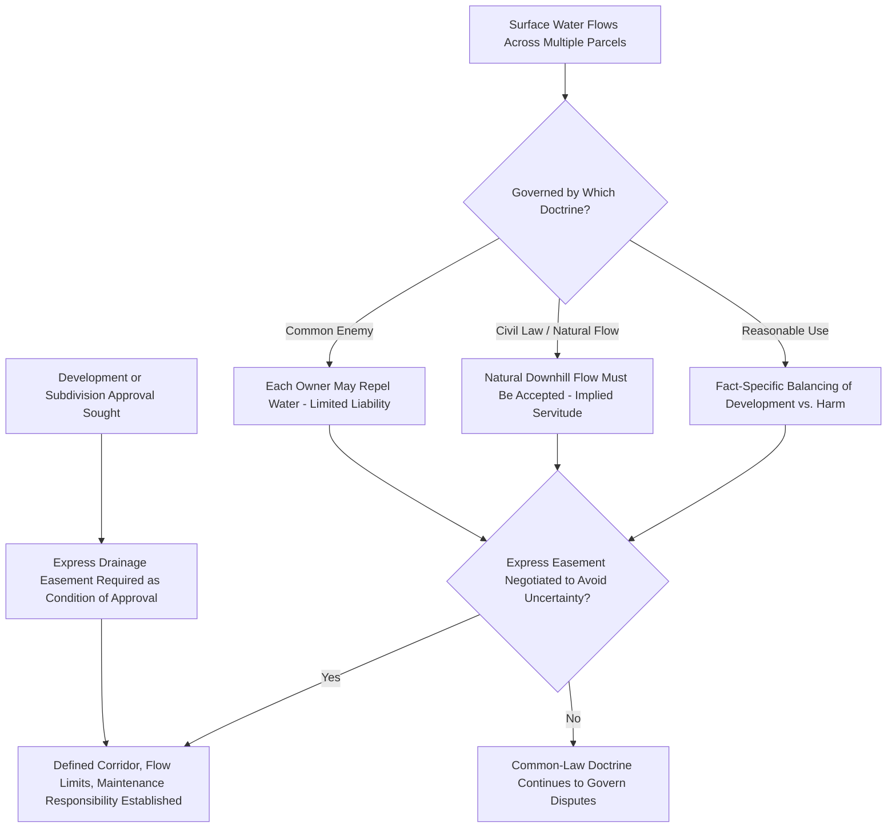

## Drainage and Sewer Easements

### Definition and Conceptual Foundation

Drainage and sewer easements are non-possessory rights permitting the flow, collection, transport, and management of stormwater runoff and wastewater across land owned by another party, along with associated rights to construct and maintain the physical infrastructure (pipes, culverts, retention basins, manholes, ditches) necessary for that purpose. Unlike most infrastructure easements, which primarily concern a *linear conduit* for a service (electricity, gas, communications), drainage and sewer easements frequently intersect with natural hydrology and pre-existing common-law water rights, creating a distinctive hybrid body of doctrine that blends easement law with the law of surface water and watercourses.

**Key Points**

- Drainage easements may be held by a **municipal or regional utility authority** (for public sanitary or storm sewer systems) or may exist as **private easements between neighboring landowners** (for natural drainage flow or private stormwater management arrangements) — the applicable rules differ significantly between these two categories.
- Many drainage easements are not the product of deliberate grant at all, but arise from the **natural flow of surface water** across land, historically governed by common-law surface water doctrines that predate, and interact with, modern easement law.
- Sewer easements (sanitary sewer, storm sewer) are typically municipal infrastructure easements structurally similar to other utility easements (see Electric, Gas, and Pipeline Easements), while natural drainage easements raise distinct doctrinal questions rooted in water law.

### Natural Surface Water Drainage: Common-Law Doctrines

Before addressing constructed sewer infrastructure, it is necessary to understand the common-law rules governing natural drainage, since these rules often determine whether an easement is implied, and shape the scope of express drainage easements layered on top of natural conditions. Three principal doctrinal approaches exist across common-law jurisdictions:

#### 1. Common Enemy Doctrine

Treats surface water as a "common enemy" that each landowner may repel or divert from their own property by any means, without liability to neighboring landowners for resulting damage, on the theory that each owner has an absolute right to protect their own land. [Unverified] Most jurisdictions that historically applied this doctrine in its pure form have since moderated it with a "reasonable use" qualification limiting purely malicious or unnecessarily damaging diversion.

#### 2. Civil Law (Natural Flow) Doctrine

Holds that each landowner must accept surface water flowing naturally from higher to lower land (following natural topography) and may not unreasonably obstruct, divert, or increase that natural flow to the detriment of neighboring land. This doctrine effectively creates an implied natural drainage servitude running with the land based on topography alone, independent of any express grant.

#### 3. Reasonable Use Doctrine

A modern, increasingly dominant middle-ground approach in many jurisdictions, balancing each landowner's right to reasonable use and development of their land against the harm caused to neighboring landowners by altered drainage patterns, using a fact-specific balancing test (similar in structure to general nuisance analysis) rather than an absolute rule.

[Inference] Because these three doctrines can produce meaningfully different outcomes for the same factual scenario (e.g., a landowner grading their property in a way that increases runoff onto a downhill neighbor), determining which doctrine governs in a specific jurisdiction is a threshold question that significantly affects both litigation strategy and the practical necessity of negotiating express drainage easements to avoid uncertainty.

**Example**

A landowner develops their property, paving a large portion of what was previously permeable farmland, which significantly increases the volume and velocity of stormwater runoff flowing onto a downhill neighbor's land, causing erosion damage. Under the civil law/natural flow doctrine, the downhill neighbor may have a strong claim that the increased flow exceeds what natural drainage would have produced; under a pure common enemy doctrine, the uphill landowner might argue they had an absolute right to develop their land as they saw fit; under the reasonable use doctrine, a court would balance the reasonableness of the development against the resulting harm.

### Express Drainage Easements

To avoid the uncertainty inherent in common-law surface water doctrine, landowners and developers frequently negotiate **express drainage easements**, particularly in the context of modern subdivision development, which typically address:

- Defined drainage corridors, retention/detention basin locations, and culvert or pipe placement
- Maximum permitted flow rates or volumes, often tied to stormwater management engineering calculations
- Maintenance responsibility (whether the benefiting party, a homeowners' association, or a municipal authority maintains the drainage infrastructure)
- Restrictions on the servient landowner's ability to obstruct, fill, or alter the drainage corridor
- Access rights for inspection and maintenance

**Key Points**

- Modern subdivision and site-plan approval processes frequently *require* dedication of drainage easements as a condition of development approval, particularly for stormwater detention facilities serving multiple lots.
- Express drainage easements are increasingly essential given increased impervious surface coverage from development, which significantly alters natural runoff patterns compared to historical undeveloped conditions.

### Sanitary and Storm Sewer Easements

Distinct from natural surface drainage, **sanitary sewer easements** and **storm sewer easements** grant a municipality or utility authority the right to install and maintain underground pipe infrastructure for wastewater collection or engineered stormwater conveyance, structurally similar to other buried utility easements:

- Defined corridor width and minimum depth-of-burial specifications
- Manhole and access point placement rights
- Restrictions on structures, deep-rooted vegetation, or excavation above the sewer line
- Access rights for inspection, cleaning (particularly for sanitary sewers prone to blockage), and emergency repair

[Unverified] Many jurisdictions impose statutory requirements for sanitary sewer connection (mandatory connection ordinances) once a public sewer system becomes available near a property, which interacts with, but is legally distinct from, the easement rights themselves; specific mandatory connection requirements should be verified against the applicable local ordinance.

### Illustrative Diagram: Drainage Doctrine and Easement Interaction

### SVG Diagram: Natural Drainage Flow vs. Engineered Detention Easement (svg_diagram)

<svg xmlns="http://www.w3.org/2000/svg" viewBox="0 0 700 340">
<rect x="0" y="0" width="700" height="340" fill="#ffffff" />
<text x="350" y="26" font-size="16" text-anchor="middle" font-family="sans-serif" font-weight="bold">Natural Drainage Flow and Engineered Detention Easement (svg_diagram)</text>

<polygon points="60,80 300,80 300,180 60,220" fill="#eef7ee" stroke="#2e7d32" stroke-width="2" />
<text x="140" y="140" font-size="11" font-family="sans-serif" fill="#2e7d32">Uphill Parcel (Higher Elevation)</text>

<polygon points="300,180 640,180 640,280 300,280" fill="#f4d6d6" stroke="#c0392b" stroke-width="2" />
<text x="470" y="230" font-size="11" font-family="sans-serif" fill="#c0392b">Downhill Parcel (Receives Natural Flow)</text>

<line x1="180" y1="150" x2="350" y2="220" stroke="#2266aa" stroke-width="3" marker-end="url(#arrowFlow)" />
<text x="230" y="170" font-size="10" font-family="sans-serif" fill="#2266aa">Natural Surface Water Flow</text>

<ellipse cx="500" cy="250" rx="70" ry="30" fill="#d6e6f4" stroke="#2266aa" stroke-width="2" />
<text x="500" y="255" font-size="9" text-anchor="middle" font-family="sans-serif">Detention Basin Easement</text>
</svg>

### Stormwater Management Facility Easements and Regional Regulation

Modern stormwater management, increasingly driven by environmental regulation addressing water quality and flood control, has generated a distinct sub-category of drainage easement centered on **engineered detention and retention facilities**:

- **Detention basin easements** — temporarily hold stormwater to control peak discharge rates into downstream systems
- **Retention pond easements** — permanently hold water, often serving both flood control and water quality treatment functions
- **Bioswale and green infrastructure easements** — increasingly common in modern low-impact development, using vegetated channels for stormwater treatment and conveyance rather than purely engineered pipe/basin systems
- **Regional/watershed-level stormwater management agreements** — in some jurisdictions, developments contribute to regional stormwater facilities under area-wide agreements rather than constructing individual on-site detention, requiring easements or fee dedications to the regional facility

[Unverified] The specific environmental regulatory framework governing stormwater management (water quality permitting requirements, regional watershed management authority structures) varies substantially by jurisdiction and has been an area of significant regulatory development in recent decades; current applicable environmental regulations should be verified for the specific jurisdiction and watershed involved.

### Maintenance Responsibility and Liability

A recurring practical issue in drainage and sewer easements is **maintenance responsibility allocation** — determining who bears the cost and obligation of maintaining drainage infrastructure over time:

- **Municipal sewer systems** — typically maintained by the municipal utility, with the easement securing access rights rather than imposing maintenance burden on the servient landowner
- **Private/HOA-maintained detention facilities** — increasingly common in modern subdivisions, where a homeowners' association or similar entity bears ongoing maintenance responsibility, which can become a significant point of dispute if the association underfunds maintenance reserves
- **Natural drainage easements** — maintenance responsibility is often ambiguous absent express agreement, since natural drainage servitudes arising from common-law doctrine typically do not specify an affirmative maintenance obligation on either party

[Inference] Deferred or underfunded maintenance of private stormwater detention facilities is a recurring practical problem in many jurisdictions, since inadequate maintenance can lead to facility failure, flooding, and disputes among affected landowners or between landowners and the responsible maintenance entity — this is a frequently observed pattern in stormwater management practice rather than a settled point of black-letter law.

### Common Disputes

1. Whether an uphill landowner's development-related increase in runoff volume or velocity violates the applicable surface water doctrine (common enemy, civil law, or reasonable use)
2. Scope and maintenance responsibility disputes for private detention/retention facility easements, particularly involving underfunded HOA maintenance reserves
3. Obstruction disputes where a servient landowner fills, grades, or builds within a natural or express drainage easement corridor
4. Access disputes for municipal sewer inspection, cleaning, and emergency repair
5. Liability disputes for property damage caused by inadequate or failed drainage/detention infrastructure
6. Mandatory sewer connection disputes where property owners resist connecting to an available public sewer system

### Jurisdictional Variation

[Unverified] Surface water drainage doctrine (common enemy, civil law, reasonable use) varies significantly by jurisdiction, and even jurisdictions nominally following the same doctrinal label may apply it with meaningfully different qualifications and exceptions; similarly, stormwater management regulatory frameworks and mandatory sewer connection requirements are heavily jurisdiction-specific and subject to ongoing regulatory change. Any specific drainage or sewer easement matter should be analyzed against the controlling jurisdiction's current common-law doctrine, statutes, and local ordinances.

**Related Topics**

- Surface Water Doctrine: Common Enemy, Civil Law, and Reasonable Use Approaches
- Electric, Gas, and Pipeline Easements (Structural Comparison for Sewer Infrastructure)
- Subdivision Exactions and Stormwater Management Facility Dedication
- Homeowners' Association Maintenance Obligations for Shared Infrastructure
- Environmental Water Quality Regulation and Stormwater Permitting
- Nuisance Law and Altered Drainage Pattern Liability
- Riparian Rights and Watercourse Law
- Low-Impact Development and Green Infrastructure Easements