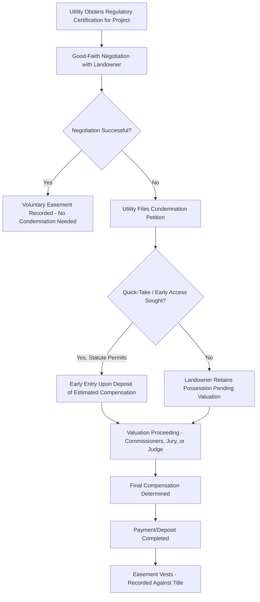

## Condemnation of Easements for Public Utilities

### Definition and Conceptual Foundation

Condemnation of easements for public utilities refers to the exercise of eminent domain power — either directly by government or by a private utility entity vested with delegated condemnation authority — to compulsorily acquire a non-possessory right-of-way interest over privately owned land for utility infrastructure purposes, upon payment of just compensation to the affected landowner. This topic synthesizes and formalizes the condemnation mechanics referenced throughout the preceding utility easement discussions (electric, gas, pipeline, telecommunications, drainage/sewer), providing the constitutional and procedural framework common to all of them.

**Key Points**

- Condemnation of an easement (a "partial taking") is legally and analytically distinct from condemnation of fee title (a "total taking"), since the landowner retains substantial residual ownership and use rights subject only to the specific easement purpose.
- The power to condemn for utility purposes is most commonly **delegated** by government to regulated private utility companies (electric, gas, water, telecommunications) recognized as serving a public purpose, rather than exercised directly by a government body itself — a distinctive feature compared to condemnation for public roads or government facilities.
- The constitutional requirement of "just compensation" (in U.S. law, under the Fifth Amendment, applied to states via the Fourteenth Amendment) is the central substantive protection for landowners, though its practical application to partial/easement takings involves distinct valuation methodology from fee takings.

### Constitutional and Legal Basis for Utility Condemnation Authority

#### Public Use / Public Purpose Requirement

Eminent domain, whether exercised directly by government or delegated to a private utility, requires that the taking serve a "public use" or "public purpose." Utility infrastructure — electric transmission, gas distribution, water and sewer systems, telecommunications — has long been recognized as satisfying this requirement given the essential public service character of these functions, even where the immediate condemning party is a privately owned, investor-held utility company rather than a government entity itself.

[Inference] The public use doctrine's application to delegated private condemnation authority has occasionally been contested (raising the broader question of whether a private, profit-motivated entity's exercise of eminent domain satisfies constitutional public use requirements), but utility condemnation specifically has generally been treated as well within established public use doctrine given the essential-service, heavily regulated nature of the utility sector — this is a comparatively well-settled area relative to more contested applications of eminent domain (such as economic development takings).

#### Statutory Delegation of Condemnation Power

Because utilities are typically privately organized corporations (even when heavily regulated as public utilities), their condemnation authority must derive from specific statutory delegation, typically requiring:

- Certification or designation as a "public utility" or "common carrier" under the applicable regulatory framework
- Often a separate regulatory approval process (e.g., certificate of public convenience and necessity, franchise certification) demonstrating the specific project serves a genuine public need, as a prerequisite to exercising condemnation authority for that specific project
- Compliance with statutory procedural requirements governing the condemnation process itself (notice, negotiation attempts, filing requirements)

### Procedural Framework: Typical Condemnation Process

While specific procedures vary by jurisdiction, utility easement condemnation generally follows a recognizable sequence:

1. **Project planning and regulatory approval** — the utility obtains necessary regulatory certification for the underlying project (transmission line, pipeline, etc.)
2. **Good-faith negotiation requirement** — most jurisdictions require the condemning utility to attempt good-faith negotiation with the landowner before initiating formal condemnation proceedings, including a bona fide offer based on an appraisal
3. **Filing of condemnation petition/complaint** — if negotiation fails, the utility files a formal condemnation action in the appropriate court
4. **Right of entry / quick-take provisions** — many jurisdictions permit the condemning utility to obtain early access to the property (for surveying, or in some cases for construction) upon depositing estimated compensation, before final valuation is completed, particularly for time-sensitive infrastructure projects
5. **Valuation proceeding** — compensation is determined either by court-appointed commissioners/appraisers, a jury, or a judge, depending on jurisdictional procedure
6. **Final judgment and easement vesting** — upon payment (or deposit) of the determined compensation, the easement formally vests in the utility, and the judgment/order is recorded against the property title

[Unverified] The specific procedural sequence, particularly the availability and mechanics of "quick-take" early-access provisions, varies considerably by jurisdiction and even by the specific type of utility or infrastructure project; the applicable jurisdiction's eminent domain procedure code should be consulted directly for any actual condemnation matter.

### Illustrative Diagram: Utility Easement Condemnation Process

### SVG Diagram: Partial Taking Valuation Components (svg_diagram)

<svg xmlns="http://www.w3.org/2000/svg" viewBox="0 0 700 340">
<rect x="0" y="0" width="700" height="340" fill="#ffffff" />
<text x="350" y="26" font-size="16" text-anchor="middle" font-family="sans-serif" font-weight="bold">Partial Taking Compensation Components (svg_diagram)</text>

<rect x="80" y="60" width="540" height="220" fill="#eef7ee" stroke="#2e7d32" stroke-width="2" />
<text x="100" y="85" font-size="11" font-family="sans-serif" fill="#2e7d32">Full Parcel Before Taking</text>

<rect x="280" y="60" width="80" height="220" fill="#f4d6d6" stroke="#c0392b" stroke-width="2" />
<text x="320" y="175" font-size="9" text-anchor="middle" font-family="sans-serif" fill="#c0392b" transform="rotate(90 320 175)">Easement Area Taken</text>

<rect x="80" y="300" width="170" height="30" fill="#d6e6f4" stroke="#2266aa" />
<text x="165" y="320" font-size="9" text-anchor="middle" font-family="sans-serif">Direct Compensation (Easement Area)</text>
<rect x="270" y="300" width="170" height="30" fill="#f9e79f" stroke="#7d6608" />
<text x="355" y="320" font-size="9" text-anchor="middle" font-family="sans-serif">Severance Damages (Remainder)</text>
<rect x="460" y="300" width="160" height="30" fill="#e8daef" stroke="#7d3c98" />
<text x="540" y="320" font-size="9" text-anchor="middle" font-family="sans-serif">Temporary Construction Damages</text>
</svg>

### Just Compensation: Valuation Methodology for Partial Takings

Because a utility easement condemnation is a partial rather than total taking, compensation methodology differs from straightforward fee-simple valuation:

$$\text{Total Compensation} = \text{Value of Easement Interest Taken} + \text{Severance Damages} - \text{Special Benefits (where offset permitted)}$$

**Components:**

1. **Value of the easement interest itself** — typically calculated as a percentage of the underlying fee value, reflecting the degree of use restriction imposed (a high-voltage transmission easement with structure and vegetation restrictions is valued differently than a narrow underground pipeline easement permitting continued surface use)
2. **Severance damages** — compensation for diminution in value to the *remainder* of the property not directly taken, where the easement impairs the usability, developability, or marketability of the remaining land (e.g., a transmission corridor bisecting a parcel and precluding future subdivision)
3. **Special benefits offset** — in some jurisdictions, if the project confers a specific, measurable benefit on the remainder property (distinct from general public benefit), that benefit may offset compensation, though many jurisdictions restrict or prohibit this offset for public-purpose severance damage calculations
4. **Temporary construction damages** — separate compensation for temporary disturbance during construction, distinct from the permanent easement valuation

[Inference] The specific percentage-of-fee-value conventions used to value easement interests, and the treatment of special benefits offsets, vary substantially by jurisdiction and are often the subject of extensive expert appraisal testimony in contested valuation proceedings rather than being governed by a fixed formula — actual compensation in any specific case depends heavily on jurisdiction-specific appraisal methodology and case-specific facts.

### Landowner Rights and Procedural Protections

Landowners facing utility easement condemnation typically retain several procedural protections:

- **Right to notice** of the proposed condemnation and an opportunity to be heard
- **Right to independent appraisal** and to contest the utility's valuation through the formal valuation proceeding
- **Right to challenge the underlying public use/necessity determination**, though courts generally afford substantial deference to legislative and regulatory public-use and necessity findings, making successful challenges to the underlying authority to condemn (as opposed to challenges to compensation amount) comparatively difficult
- **Right to recover litigation costs/attorney fees** in some jurisdictions, particularly where the final compensation award substantially exceeds the utility's original offer
- **Right to require restoration** of the property to the extent practicable following construction, where provided by statute or negotiated into the condemnation judgment

**Key Points**

- The deference courts generally afford to public use and necessity determinations means that condemnation litigation in practice is overwhelmingly focused on the *amount* of compensation rather than the *right* to condemn.
- Landowner advocacy in this area often emphasizes obtaining qualified independent appraisal expertise early in the process, given the technical complexity of partial-taking and severance damage valuation.

### Interaction with Underlying Regulatory Approval

Utility condemnation authority does not exist in isolation — it is typically contingent on, and follows from, a separate regulatory approval establishing that the underlying project serves a genuine public need:

- Electric transmission projects often require state/provincial siting approval or a certificate of public convenience and necessity before condemnation authority may be exercised for that specific project
- Interstate natural gas pipelines in the U.S. context require FERC certification, which itself triggers federal condemnation authority under the Natural Gas Act for the certified pipeline route
- Local water, sewer, and distribution utilities typically operate under more localized franchise or municipal utility authority frameworks

[Unverified] The specific relationship between regulatory project certification and condemnation authority (whether certification is a strict legal prerequisite, and what scope of judicial review applies to challenges of that certification) varies by utility type, jurisdiction, and applicable statute; current regulatory requirements for the specific utility type and jurisdiction should be verified directly.

### Common Disputes

1. Valuation disputes over the appropriate percentage-of-fee-value methodology for the specific easement type and use restriction
2. Severance damage disputes regarding the extent to which the easement impairs the remainder property's development potential or marketability
3. Challenges to the underlying public use or necessity determination (though generally difficult to sustain given judicial deference)
4. Disputes over the scope of "good faith negotiation" requirements as a procedural prerequisite to filing condemnation
5. Disputes over quick-take/early-access provisions and the adequacy of estimated compensation deposits
6. Post-condemnation disputes regarding restoration obligations or whether the utility's actual use exceeds the condemned easement's scope

### Jurisdictional Variation

[Unverified] Eminent domain procedure, delegated utility condemnation authority, valuation methodology, and landowner procedural protections vary substantially across jurisdictions, reflecting differences in state/provincial constitutions, statutes, and case law (and even more so across national legal systems); any specific utility condemnation matter should be analyzed against the controlling jurisdiction's current eminent domain statutes, utility regulatory framework, and case law rather than the general principles summarized here.

**Related Topics**

- Electric, Gas, and Pipeline Easements
- Telecommunications and Broadband Easements
- Public Roads and Highway Easements (Comparative Condemnation Framework)
- Just Compensation Valuation Methods for Partial Takings
- Public Use Doctrine and Delegated Private Condemnation Authority
- Regulatory Certification Requirements (Certificate of Public Convenience and Necessity)
- Severance Damages and Remainder Property Valuation
- Landowner Procedural Rights in Eminent Domain Proceedings