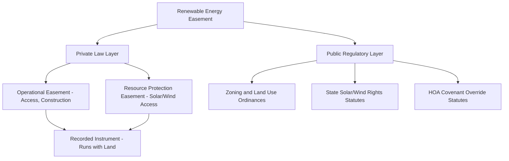

## Renewable Energy Easements for Wind and Solar

### Overview

Renewable energy easements are affirmative or negative servitudes that facilitate the siting, construction, and operation of wind turbines and solar arrays, or that protect the wind and solar resource itself from interference by neighboring land uses. Because wind and sunlight are naturally occurring, mobile, and easily obstructed, this area of easement law blends traditional affirmative-easement doctrine (access, transmission, cable-line rights) with novel negative-easement doctrine (height restrictions, shading/wake restrictions) that common law historically resisted recognizing outside a narrow set of categories. Most U.S. states have addressed this gap through targeted enabling statutes.

**Key Points**

- Two distinct easement functions exist: (1) **development/operational easements** allowing physical installation and access, and (2) **resource-protection easements** (solar access easements, wind easements) preventing obstruction of the resource by adjacent parcels.
- Common law traditionally disfavored *negative* easements outside the four historic categories (light, air, support, artificial waterflow); solar and wind access easements required statutory intervention to gain enforceability in most jurisdictions.
- These easements are typically **easements in gross**, held by a developer or utility rather than tied to a specific dominant parcel, though solar/wind access easements are often appurtenant, protecting a specific benefited parcel's collector or turbine.

---

### Taxonomy of Renewable Energy Easement Types

#### 1. Wind Easements

- **Wind lease/easement (operational)**: Grants a developer the right to construct, operate, and maintain wind turbines, access roads, and collection lines on the servient estate, typically for a term of 20–50 years including renewal options.
- **Setback/height easement**: Restricts neighboring landowners from erecting structures or vegetation within a specified radius or height that would interfere with turbine wake or wind flow ("wind rights" or "wind flow easement").
- **Non-obstruction/non-compete easement**: Prevents a neighboring landowner from installing their own competing wind infrastructure that would create wake turbulence degrading the servient turbine's output. [Inference] These non-compete provisions are typically negotiated as contractual covenants rather than pure easements, since they restrict competitive land use rather than a specific physical use, though drafters often bundle them with easement instruments for recording purposes.

#### 2. Solar Easements

- **Solar access easement**: A negative easement preventing the servient estate owner from constructing structures, planting trees, or otherwise casting shadows that would obstruct sunlight reaching a dominant estate's solar collectors during specified hours and seasons (often defined via sun-angle or "solar envelope" calculations).
- **Solar development/operational easement**: An affirmative easement granting a solar developer access, construction, and equipment-placement rights on the servient parcel, structurally similar to wind operational leases.
- **Solar collector rights statutes**: Many states created a statutory right (distinct from a negotiated easement) permitting property owners to obtain enforceable protection for existing solar collectors, subject to local ordinance frameworks.

---

### Statutory Frameworks

Because negative easements for light and air were narrowly construed at common law, most U.S. states enacted specific solar/wind easement enabling statutes beginning in the late 1970s–1980s.

| Statutory Model | Mechanism | Representative Approach |
| --- | --- | --- |
| Voluntary easement enabling acts | Authorizes parties to create a recordable solar/wind easement by express agreement | Most states (e.g., adaptations of the Uniform Solar Energy Practices Act model) |
| Solar rights/access acts | Grants statutory protections independent of a negotiated easement, sometimes via local permitting | California, several New England states |
| Restrictive covenant limitation statutes | Voids or limits HOA/covenant provisions that unreasonably restrict solar installations | California Solar Rights Act; similar acts in numerous states |
| Wind resource easement statutes | Explicitly authorizes recordable wind easements as real property interests | States with substantial wind development (e.g., Iowa, Texas, Kansas) |

[Unverified] The precise statutory text, required recording formalities, and duration limits vary significantly by state and change periodically through legislative amendment, so practitioners must verify current statutory language for the specific jurisdiction at issue rather than relying on generalized summaries.

---

### Required Elements of a Recordable Solar/Wind Easement

Under typical enabling statutes (modeled loosely on early Uniform Solar Energy Practices Act drafts), an instrument creating a solar or wind easement generally must specify:

1. **Vertical and horizontal angles** (or a defined obstruction plane/"envelope") describing the space within which obstructions are prohibited.
2. **Time periods** during which the easement applies (may vary seasonally with sun angle).
3. **Terms/conditions** under which the easement may be revised or terminated.
4. **Compensation provisions**, if any, owed for interference or for existing obstructions grandfathered at creation.
5. **Restrictions on vegetation/structures** the servient owner may plant or build, including maintenance obligations (e.g., tree-trimming duties).

**Example**

> A solar developer holds an operational easement over Parcel A to install ground-mounted panels. To protect the array's yield, the developer negotiates a separate solar access easement burdening adjacent Parcel B, prohibiting any structure or tree exceeding 15 feet within 200 feet of the northern property line, measured to maintain unobstructed sun exposure between 9:00 AM and 3:00 PM year-round.

$$\text{Solar Envelope Angle} = 90^\circ - \text{latitude} + \text{declination}$$

This is a simplified solar-altitude relationship used in envelope calculations; actual shading/obstruction analysis requires full solar path (azimuth and altitude) modeling across the relevant time-of-year window, not a single static angle.

---

### Diagram: Solar Access Easement Obstruction Envelope (svg_diagram)

<svg xmlns="http://www.w3.org/2000/svg" viewBox="0 0 520 260">
<text x="260" y="20" font-size="14" text-anchor="middle" font-weight="bold">Solar Access Easement — Obstruction Envelope (svg_diagram)</text>
<line x1="30" y1="220" x2="490" y2="220" stroke="#000" stroke-width="2" />
<rect x="60" y="150" width="80" height="70" fill="#dbeafe" stroke="#1e3a8a" stroke-width="2" />
<text x="100" y="240" text-anchor="middle" font-size="11">Servient Parcel</text>
<rect x="340" y="180" width="100" height="20" fill="#fde68a" stroke="#92400e" stroke-width="2" />
<text x="390" y="240" text-anchor="middle" font-size="11">Solar Array (Dominant)</text>
<line x1="140" y1="150" x2="340" y2="180" stroke="#dc2626" stroke-width="2" stroke-dasharray="6,4" />
<text x="240" y="150" text-anchor="middle" font-size="11" fill="#dc2626">Max obstruction height plane</text>
<line x1="500" y1="100" x2="390" y2="180" stroke="#f59e0b" stroke-width="2" marker-end="url(#sunarrow)" />
<text x="470" y="90" font-size="11">Sun path</text>
</svg>

---

### Interaction with Other Land Use Regimes

- **Zoning overlay conflicts**: Local zoning height limits, setback rules, and viewshed ordinances may independently restrict turbine height or panel placement regardless of a private easement's terms; developers must confirm the easement does not exceed what zoning permits.
- **HOA/CC&R conflicts**: Many states statutorily void or limit restrictive covenants that categorically ban solar installations, overriding private CC&Rs to a defined extent (commonly allowing only "reasonable" aesthetic restrictions, not outright prohibition).
- **Eminent domain interaction**: Some wind/solar transmission corridors are developed via a hybrid of negotiated easements and utility condemnation authority, particularly for high-voltage interconnection lines.

---

### Termination and Duration Issues Specific to Renewable Easements

- **Decommissioning obligations**: Modern wind/solar easements typically include express decommissioning covenants (bonding or escrow requirements) obligating the developer to remove infrastructure and restore the land at end of term — a feature largely absent from traditional utility easements.
- **Term structure**: Often structured as an initial term (e.g., 25 years) plus renewal options tied to the operational life of the equipment, rather than a perpetual grant.
- **Non-use/abandonment**: Turbine or array non-operation for a defined period (e.g., 12–24 consecutive months) is frequently drafted as an express termination trigger, since common-law abandonment doctrine (requiring intent) is otherwise difficult to establish against a developer maintaining nominal use.
- **Payment default**: Many agreements tie continued easement validity to ongoing royalty or lease payments to the servient landowner, with a cure period before termination.

---

### Practical Drafting Considerations

**Next Steps**

- Confirm whether the applicable state has a solar/wind easement enabling statute and whether recording under that statute is required for enforceability against subsequent purchasers, or whether a common-law negative easement analysis would otherwise fail for lack of a recognized category.
- Coordinate the easement's obstruction envelope/setback terms with local zoning height limits to avoid a servitude that purports to grant more restriction (or less) than public law allows.
- Draft explicit decommissioning, bonding, and non-use termination provisions, since these are not implied by default easement doctrine.
- Verify whether the easement is appurtenant (tied to a specific solar/wind-collecting parcel) or in gross (held by a developer/utility), as this affects transferability and divisibility analysis under Restatement (Third) §5.8.
- Check compensation and grandfathering treatment for existing obstructions (trees, structures) present at the time the easement is created.

### Related Topics

- Taxonomy of Servitudes: Negative Easements and Historical Limitations
- Restatement (Third) of Property: Servitudes §5.8 — Transferability and Divisibility of Easements in Gross
- Conservation Easements and Statutory Servitude Regimes
- Zoning Overlay Conflicts with Private Easements
- Eminent Domain and Utility Transmission Corridor Easements
- Decommissioning Bonds and End-of-Term Land Restoration Covenants