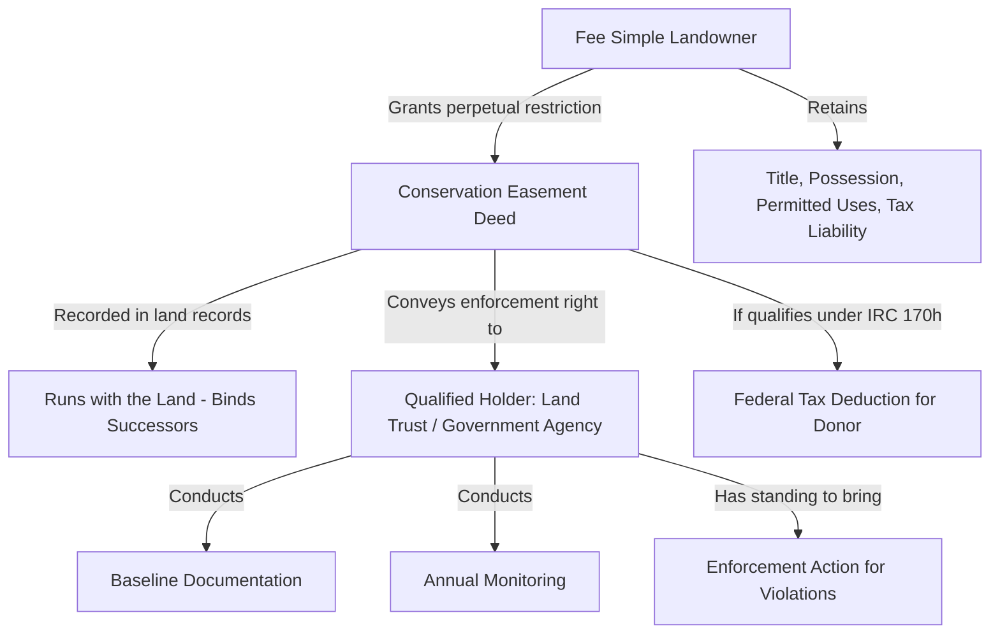

## Purpose and Legal Basis of Conservation Easements

### Definition and Core Concept

A conservation easement is a voluntary, legally binding restriction placed on the use of real property, created for the purpose of protecting the land's conservation values—such as its agricultural, scenic, forested, wetland, historical, or open-space character—in perpetuity or for a specified term. Unlike traditional easements that grant a right of physical use (e.g., a right of way), a conservation easement is a **negative easement**: it restricts what the landowner (the servient estate holder) may do with the property, rather than granting an affirmative right of use to the easement holder.

The landowner retains fee simple title, continues to hold, use, sell, or pass on the property, and remains responsible for property taxes and maintenance. What transfers to the easement holder is the enforceable right to ensure the restrictions are observed and to bring an action for their enforcement.

**Key Points**

- The easement runs with the land (binding on successors in title), not just the current owner.
- It is held by a qualified third party (a "holder"), typically a land trust, conservancy, or government agency.
- It restricts development rights, subdivision, and other uses inconsistent with the identified conservation purpose.
- It does not require public access unless the deed specifically grants it.

### Legal Basis: Overcoming Common Law Obstacles

Historically, conservation easements faced significant common law barriers because traditional easement doctrine was built around interests connected to a dominant estate benefiting from the burden on a servient estate. Conservation easements are typically "in gross"—they benefit the public interest or an organization's mission rather than an adjoining parcel of land—which common law traditionally disfavored for several reasons:

1. **The Touch and Concern Requirement**: Common law required that a covenant or easement "touch and concern" both a dominant and servient estate to run with the land. A purely conservation-purpose restriction, lacking a dominant estate, struggled to satisfy this.
2. **Easements in Gross and Assignability**: Common law negative easements in gross were traditionally not freely assignable or enforceable by successor holders.
3. **Rule Against Perpetual Restraints**: Common law disfavored restrictions on land use lasting in perpetuity without a clear benefited estate.
4. **Standing to Enforce**: Absent a dominant estate, it was unclear who had standing to sue for a violation of a purely conservation-oriented restriction.

**Statutory Resolution — Uniform Conservation Easement Act (UCEA)**

To resolve these obstacles, the Uniform Conservation Easement Act was promulgated in 1981 by the Uniform Law Commission (National Conference of Commissioners on Uniform State Laws) and has since been adopted, in whole or with modifications, by the majority of U.S. states. The UCEA:

- [Confirmed] Validates conservation easements as easements in gross, dispensing with the touch-and-concern requirement.
- [Confirmed] Permits easements to be held by governmental bodies or qualified charitable/nonprofit organizations.
- [Confirmed] Allows the easement to be unlimited in duration (perpetual) unless the instrument states otherwise.
- [Confirmed] Grants standing to enforce the easement to the holder, and in many state variants, to designated third-party "rights of enforcement" holders and, in some states, to the state attorney general or other public officials on grounds of public interest.
- [Confirmed] Removes common law defenses such as lack of privity or the "any interest in real property" doctrine, which otherwise could invalidate the restriction.

Where a state has not adopted the UCEA, conservation easements may still be validated through customized state enabling statutes, or, in a minority of instances, through general real covenant law adapted by courts—though this route is less certain and more vulnerable to challenge.

### Federal Legal Basis: Tax Code Provisions

Beyond state property law, conservation easements derive significant legal and practical force from federal tax law, particularly Internal Revenue Code § 170(h), which governs the deductibility of "qualified conservation contributions."

**Section 170(h) Requirements**

For a donated conservation easement to qualify for a federal income tax deduction, it must satisfy:

1. **Qualified Real Property Interest**: The donation must be of the entire interest of the donor (other than a qualified mineral interest), a remainder interest, or a restriction granted in perpetuity on the use of the property (i.e., the easement itself).
2. **Qualified Organization**: The holder must be a governmental unit or a charitable organization that meets public support tests and has a commitment to protect the conservation purposes of the donation, along with the resources to enforce the restrictions.
3. **Exclusively for Conservation Purposes**: The contribution must be made exclusively for one of four statutorily recognized conservation purposes:
   - Preservation of land areas for outdoor recreation by, or education of, the general public
   - Protection of a relatively natural habitat of fish, wildlife, plants, or similar ecosystems
   - Preservation of open space (including farmland and forest land) pursuant to a clearly delineated federal, state, or local governmental conservation policy, or for scenic enjoyment, yielding a significant public benefit
   - Preservation of a historically important land area or a certified historic structure
4. **Perpetuity Requirement**: The restriction must be granted in perpetuity, and the conservation purpose must be protected in perpetuity, including specific requirements for handling proceeds upon extinguishment (see below) and subordination of any prior mortgage.

**[Unverified]** IRS scrutiny of syndicated conservation easement transactions has intensified substantially in recent years, with the IRS designating certain syndicated conservation easement arrangements as "listed transactions" requiring disclosure; landowners and practitioners should verify current IRS guidance and case law, as this area is subject to frequent legislative and regulatory change (including provisions in the SECURE 2.0 Act era addressing abusive syndications).

### The Purpose Requirement: Public Benefit Rationale

The underlying policy rationale for legally sanctioning conservation easements—and for granting associated tax benefits—rests on the theory that the landowner is voluntarily forgoing development rights (and thus economic value) in exchange for a public benefit: preserved farmland, protected habitat, scenic vistas, or historic character that would otherwise be lost to development pressure.

This purpose requirement is not merely aspirational; it has binding legal consequences:

- **Extinguishment and Proceeds**: Because the restriction is meant to be perpetual, if changed conditions make the conservation purpose impossible or impractical to fulfill and a court extinguishes the easement (e.g., via cy pres-like doctrines under the UCEA framework), the holder is generally entitled to a proportionate share of proceeds from any subsequent sale or development, calculated based on the value of the easement at the time of the gift relative to the total value of the property, to be used for similar conservation purposes elsewhere.
- **Baseline Documentation**: Because the purpose must be verifiable and enforceable, holders are expected to prepare a "baseline documentation report" at the time of conveyance, cataloging the property's condition and conservation values to allow future monitoring against the restrictions.
- **Monitoring and Enforcement Obligations**: The holder assumes an affirmative, ongoing duty (often annual) to monitor the property to ensure continued compliance—an obligation increasingly funded through stewardship endowments required by land trust accreditation standards.

### Types of Conservation Purposes and Corresponding Legal Instruments

| Purpose | Typical Holder | Common Mechanism |
| --- | --- | --- |
| Agricultural preservation | State/county agricultural land preservation programs, land trusts | Purchase of Agricultural Conservation Easement (PACE) / Purchase of Development Rights (PDR) |
| Habitat/wildlife protection | Land trusts, state wildlife agencies, federal agencies (e.g., USFWS) | Donated or purchased conservation easement; mitigation banking instruments |
| Scenic/open space preservation | Local land trusts, municipalities | Donated easement, often tied to zoning overlay |
| Historic preservation | National Trust for Historic Preservation, state historic preservation offices | Facade easement (a specialized form restricting alteration of a structure's exterior) |
| Water resource/wetland protection | Land trusts, Army Corps of Engineers (mitigation context) | Conservation easement paired with wetland mitigation banking credits |

### Distinguishing Conservation Easements from Related Instruments

**Key Points**

- **Deed restrictions/restrictive covenants**: Generally enforceable only by other property owners within a common scheme (e.g., a subdivision); lack the third-party perpetual enforcement structure and tax benefits of a conservation easement.
- **Zoning**: A public regulatory tool imposed unilaterally by government, alterable through the political process; a conservation easement is a voluntary, contractual, and (typically) perpetual private restriction not subject to unilateral rezoning.
- **Fee simple acquisition (outright purchase)**: Transfers full title and all rights; a conservation easement leaves the underlying fee title and most use rights with the original owner, making it a more cost-effective conservation tool per acre for the holding organization.
- **Mitigation banking instruments**: Often use conservation easements as the legal mechanism to permanently protect mitigation bank or in-lieu fee program sites, but are driven by regulatory permit compliance (e.g., under the Clean Water Act) rather than voluntary donation.

### Illustrative Example

**Example**

A farming family owns 200 acres of productive farmland facing suburban development pressure. They wish to keep the land in agriculture permanently while realizing some financial benefit and avoiding a sale to a developer. They:

1. Contact a qualified accredited land trust with an agricultural protection mission.
2. Commission a qualified appraisal establishing the property's fair market value both with and without development rights (the difference representing the easement's value).
3. Execute a conservation easement deed granting the land trust the right to enforce restrictions against subdivision, non-agricultural commercial development, and mineral extraction, while explicitly permitting continued farming, one additional residential structure for a family member, and renewable energy infrastructure serving the farm.
4. Complete baseline documentation with the land trust, recording current land use, structures, and natural features.
5. Record the easement deed in the county land records, ensuring it is binding on all future owners.
6. Claim a federal charitable income tax deduction under IRC § 170(h) for the appraised value of the donated development rights, subject to statutory income percentage limitations and carryforward rules.

The land trust then conducts annual monitoring visits, documents continued compliance, and holds the enforceable legal right to bring an action for injunctive relief or damages if a future owner violates the restrictions (e.g., by subdividing the parcel).

### Structural Relationship Diagram

### Conclusion

Conservation easements represent a purpose-built legal hybrid: a private, voluntary property instrument engineered through statutory reform (principally the UCEA and parallel state enabling acts) to overcome common law limitations on easements in gross, and reinforced by federal tax policy (IRC § 170(h)) that incentivizes their creation in service of defined public conservation goals. Their legal durability rests on strict adherence to the statutory purpose categories, proper documentation, and the qualified holder's ongoing enforcement capacity—making the "purpose" element not just a policy justification but a continuing substantive legal requirement throughout the life of the easement.

**Related Topics**

- Perpetuity Requirements and Extinguishment/Termination of Conservation Easements
- Qualified Appraisal Standards and Valuation Methodology under IRC § 170(h)
- Land Trust Accreditation Standards and Stewardship Endowments
- Facade Easements and Historic Preservation Restrictions
- Purchase of Development Rights (PDR) Programs vs. Donated Easements
- Syndicated Conservation Easement Transactions and IRS Enforcement Actions
- Amendment and Modification of Conservation Easements (Doctrine of Changed Conditions)
- Mitigation Banking and In-Lieu Fee Programs under the Clean Water Act