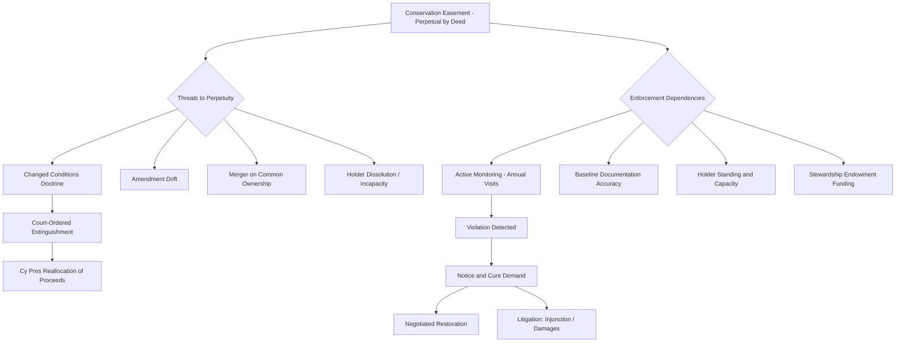

## Perpetuity and Enforcement Challenges

### Overview

Conservation easements are designed to protect land in perpetuity, but the practical, legal, and institutional mechanisms for sustaining a restriction across an unbounded time horizon create some of the most complex challenges in this area of law. Perpetuity is both a *statutory requirement* (particularly for tax-deductible easements under federal law) and a *doctrinal problem* (courts and legislatures have long been skeptical of restraints on land use that never expire). This item surveys the legal basis for the perpetuity requirement, the doctrines that threaten it over time, and the structural and litigation-based mechanisms used to enforce compliance.

**Key Points**

- Perpetuity is a precondition for the federal tax deduction under IRC § 170(h), not merely a drafting preference.
- Enforcement depends entirely on the holder's continued existence, capacity, and willingness to monitor and litigate.
- Changed conditions over decades or centuries create tension between rigid perpetuity and practical land-use realities.
- Courts have developed several doctrines (cy pres, changed circumstances, merger) that can modify or extinguish easements despite perpetuity language.

### The Legal Basis for the Perpetuity Requirement

**Statutory Sources**

1. **Uniform Conservation Easement Act (UCEA) § 2(c)**: Provides that a conservation easement is unlimited in duration unless the instrument creating it otherwise provides. This creates a default rule of perpetuity while still permitting term-limited easements if the parties so choose.
2. **IRC § 170(h)(2)(C)**: Requires that a *qualified real property interest* eligible for a charitable deduction include "a restriction (granted in perpetuity) on the use which may be made of the real property."
3. **Treasury Regulation § 1.170A-14(g)**: Elaborates the perpetuity requirement, mandating that the conservation purpose be protected in perpetuity, including specific provisions addressing:
   - Subordination of prior mortgages or liens to the easement
   - Allocation of proceeds upon judicial extinguishment
   - Remote future events that might defeat the restriction (must be "so remote as to be negligible")

**[Confirmed]** Failure to satisfy the perpetuity requirement in the deed language itself—even if the parties' practical intent is permanent protection—can result in retroactive disallowance of the tax deduction and, in syndicated transactions, substantial penalties.

### Doctrinal Threats to Perpetuity

**1. The Rule Against Perpetuities and Restraints on Alienation**

Historically, perpetual restrictions on land use without a benefited estate ran afoul of the common law's hostility to indefinite restraints on alienation and the Rule Against Perpetuities (RAP). The UCEA and parallel state statutes generally exempt conservation easements from RAP analysis, but:

- **[Unverified]** A minority of states have not clearly exempted conservation easements from RAP or restraint-on-alienation doctrines, creating residual uncertainty in those jurisdictions for easements not perfectly drafted to fit within statutory safe harbors.
- Some state statutes independently limit easement duration (e.g., requiring periodic renewal or capping certain categories at a term of years) even where the UCEA framework has been adopted with modifications.

**2. Changed Conditions Doctrine**

Adapted from the law governing equitable servitudes and restrictive covenants, this doctrine permits a court to modify or terminate a conservation easement when the surrounding circumstances have changed so substantially that the original conservation purpose can no longer be accomplished. Courts weigh:

- Whether the specific conservation purpose (not just land preservation generally) has become impossible or impracticable
- Whether the change was foreseeable at the time of the grant
- The public interest in preserving the restriction versus permitting productive use
- Availability of alternative conservation objectives on the same parcel

**3. Cy Pres and Extinguishment**

Where a court determines that changed conditions make continued enforcement of the *specific* restriction impossible or impractical, doctrines derived from charitable trust law (cy pres, "as near as possible") permit courts to redirect the property or the value of the restriction toward a similar conservation purpose rather than simply extinguishing all restrictions.

Treasury Regulation § 1.170A-14(g)(6) codifies a version of this for tax purposes: upon judicial extinguishment (e.g., through a forced sale via eminent domain or a negotiated termination followed by property sale), the holder must receive a share of proceeds proportionate to the value of the easement at the time of the gift, to be used for similar conservation purposes elsewhere. This ensures the "perpetual" value of the restriction survives even if the specific parcel restriction does not.

**4. Merger Doctrine**

Under traditional easement law, an easement is extinguished when the dominant and servient estates come under common ownership ("merger"). Because conservation easements benefit the holder organization rather than a dominant *parcel*, most state statutes and well-drafted deeds expressly negate merger doctrine—clarifying that even if the holder later acquires fee title to the burdened land, the easement is not automatically extinguished, since doing so would defeat the perpetual conservation purpose. Practitioners should confirm this negation is explicit in the deed, as reliance on statutory silence carries **[Speculation]** risk of adverse judicial interpretation in jurisdictions without clear guidance.

**5. Amendment**

Many conservation easement deeds include amendment provisions allowing the holder and landowner to modify terms by mutual agreement, provided the amendment does not violate the perpetuity requirement or diminish the overall conservation value. However:

- Land trust accreditation standards (via the Land Trust Alliance) require amendments to enhance or, at minimum, not diminish the protected conservation values.
- IRS guidance treats amendments that meaningfully alter the deducted property interest with caution, particularly where they could be viewed as partially "undoing" the original gift.
- Some state attorneys general assert supervisory authority (as guardians of charitable trusts) over amendments that could be seen as diverting charitable assets.

### Enforcement Challenges

**Standing and Capacity of the Holder**

The entire enforcement structure depends on a functioning, capable holder. Key risks include:

- **Holder dissolution or insolvency**: If a land trust dissolves, merges, or loses nonprofit status, the easement's enforceability may depend on statutory succession provisions (many UCEA-based statutes designate the state attorney general as a backstop enforcer or provide for court-ordered transfer of the easement to another qualified holder).
- **Passive/inactive holders**: A holder that fails to monitor, document, or enforce may create a practical (if not strictly legal) erosion of the restriction, especially where waiver or laches arguments could later be raised by a violating landowner.
- **Third-party enforcement rights**: Some states' UCEA variants allow the instrument to designate additional third parties (e.g., another conservation organization or a government agency) with independent standing to enforce, providing redundancy against holder default.

**Detecting and Proving Violations**

**Key Points**

- Requires periodic (typically annual) site monitoring, often via site visits, aerial/satellite imagery, and comparison against baseline documentation.
- Violations range from minor (unauthorized structures, unapproved land clearing) to severe (unauthorized subdivision, mining, or large-scale development).
- Detection lag is a significant real-world problem: with easements covering large or remote acreage, violations may persist for years before discovery.
- Successor owners may be unaware of the easement's existence or specific terms despite the deed being of record—raising notice and equitable defense issues in enforcement litigation.

**Litigation and Remedies**

When a violation is identified, holders typically pursue, in order of escalation:

1. Notice and demand for voluntary cure/restoration
2. Negotiated remediation agreement (often including restoration plans and monitoring)
3. Injunctive relief (mandatory or prohibitory) to compel restoration or cease violating activity
4. Damages, calculated based on diminution in the conservation value or cost of restoration
5. In egregious cases, forfeiture-type remedies if provided in the deed (rare, and subject to equitable limitations)

**[Inference]** Because litigation is expensive and land trusts often operate with limited budgets, enforcement in practice skews toward negotiated resolution rather than full litigation, which may create inconsistent outcomes across similarly situated violations—though this varies significantly by organization and jurisdiction, and larger or better-funded land trusts and government holders may litigate more readily.

**Funding Perpetual Enforcement: Stewardship Endowments**

Because monitoring and enforcement costs continue indefinitely, the Land Trust Alliance's accreditation standards and many state statutes now expect or require holders to maintain a dedicated stewardship endowment or defense fund calculated to generate enough return to fund:

- Annual monitoring visits
- Legal defense costs for anticipated violations
- Administrative costs of holding and defending the easement across generations of staff and board turnover

Failure to adequately fund stewardship is increasingly recognized as an institutional-level perpetuity risk distinct from any single parcel's legal status.

### Perpetuity/Enforcement Risk Map

### Illustrative Example

**Example**

A land trust holds a conservation easement on a 500-acre forest tract granted in 1995. In 2026, a successor owner (having purchased the land without fully reviewing title records) clears 15 acres for a private airstrip, violating the easement's prohibition on non-forestry land conversion. The land trust's annual aerial monitoring flight detects the clearing.

1. The land trust issues a formal notice of violation, citing the specific deed provisions breached and referencing the baseline documentation report showing forested conditions at the time of the grant.
2. The landowner claims lack of notice of the restriction despite its recordation—an equitable argument that does not excuse the violation but may affect the tone of negotiations.
3. The parties negotiate a restoration plan: native species replanting, a compliance monitoring schedule, and reimbursement of the land trust's legal and monitoring costs.
4. Because the land trust maintains a stewardship endowment as required by its Land Trust Alliance accreditation, it does not need to divert general operating funds to pursue the matter, and it retains the ability to escalate to injunctive relief if the landowner fails to comply with the restoration agreement.

### Conclusion

The perpetuity requirement is the legal backbone that gives conservation easements their distinctive power and their distinctive fragility: it is what justifies significant tax benefits and long-term public reliance, yet it depends on an ecosystem of institutional capacity, funding, documentation, and doctrine-navigation that must function continuously across generations. Enforcement is not a one-time event at the moment of grant but an open-ended institutional commitment, and the durability of any given easement is only as strong as the interplay between its drafting, its holder's capacity, and the evolving doctrines courts apply when perpetual restrictions meet changing circumstances.

**Related Topics**

- Doctrine of Changed Conditions in Restrictive Covenant and Easement Law
- Land Trust Alliance Accreditation Standards and Stewardship Best Practices
- Cy Pres Doctrine in Charitable Trust and Conservation Contexts
- Tax Court Treatment of Extinguishment and Proceeds Clauses under Treasury Reg. § 1.170A-14(g)
- Third-Party Enforcement Rights and Attorney General Oversight of Charitable Conservation Assets
- Title Examination and Constructive Notice Issues for Encumbered Successor Owners
- Drafting Techniques to Negate Merger Doctrine in Conservation Easement Deeds