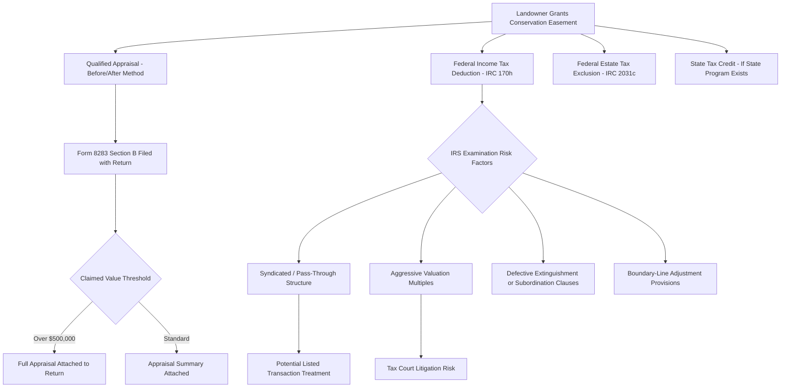

## Tax Incentives for Conservation Easements

### Overview

Tax incentives are the primary economic driver behind the widespread private adoption of conservation easements in the United States. Because a landowner who donates a conservation easement permanently forgoes development value without receiving direct compensation, federal, state, and local tax provisions are structured to offset that lost value, making conservation-minded land stewardship financially viable. This item surveys the federal income tax deduction framework, the federal estate tax exclusion, state-level tax credit programs, and the valuation and compliance mechanics that govern them.

**Key Points**

- The primary federal incentive is the charitable income tax deduction under IRC § 170(h).
- A separate federal estate tax exclusion exists under IRC § 2031(c).
- Many states layer additional transferable or refundable tax credit programs on top of the federal deduction.
- Valuation (via qualified appraisal) is the single most contested and audited element of the entire framework.

### Federal Income Tax Deduction — IRC § 170(h)

**Statutory Framework**

A donation of a conservation easement can qualify as a "qualified conservation contribution," deductible as a charitable contribution under IRC § 170(h), provided it satisfies:

1. A **qualified real property interest** is conveyed (the perpetual restriction itself, or the entire interest other than mineral rights).
2. The recipient is a **qualified organization** (governmental unit or eligible charitable organization with the commitment and resources to enforce the restriction).
3. The contribution is made **exclusively for conservation purposes** (recreation/education access, habitat protection, open space/scenic preservation under a governmental conservation policy, or historic preservation).
4. The restriction is **granted in perpetuity**, satisfying the requirements of Treasury Regulation § 1.170A-14(g), including mortgage subordination and proceeds-upon-extinguishment provisions.

**Deduction Amount and Limitations**

The deductible amount generally equals the fair market value of the easement, calculated as the difference between the property's value before the restriction and its value after the restriction is imposed (the "before-and-after" method), as established through a qualified appraisal.

Deduction limits under IRC § 170(b) depend on the taxpayer type and, since enactment of enhanced incentives originally introduced via the Farm Bill and subsequently made permanent:

| Taxpayer Type | Annual AGI/Income Limitation | Carryforward Period |
| --- | --- | --- |
| General individual taxpayer | Up to 50% of contribution base (AGI) | 15 years |
| Qualifying farmer/rancher (individual, non-corporate) | Up to 100% of AGI | 15 years |
| Qualifying farmer/rancher (C corporation) | Up to 100% of taxable income | 15 years |
| Other corporations | Up to 10% of taxable income | 15 years |

**[Confirmed]** To qualify for the enhanced farmer/rancher percentage, more than 50% of the taxpayer's gross income for the year must come from the trade or business of farming, and, for easements on land used in agriculture or livestock production, the easement must generally require the land remain available for such use (subject to exceptions in the statute).

**Qualified Appraisal Requirements**

- Must be prepared by a "qualified appraiser" under Treasury regulations and IRC § 170(f)(11).
- Must follow the "before-and-after" valuation methodology, considering the highest and best use of the property both with and without the restriction.
- Must be attached, along with Form 8283 (Section B), to the tax return for contributions where the claimed deduction exceeds statutory thresholds.
- For contributions exceeding $500,000 in value, a complete copy of the qualified appraisal itself, not merely a summary, must be attached to the return.

**[Unverified]** IRS enforcement scrutiny of aggressive or inflated appraisals—particularly in syndicated conservation easement transactions where multiple investors purchase interests in a pass-through entity specifically to generate outsized deductions relative to investment—has intensified substantially, including designation of certain arrangements as listed transactions and enactment of specific anti-abuse provisions; practitioners should verify current statutory and case law developments, as this is an active and frequently litigated area (including Tax Court decisions addressing extinguishment clause language, boundary-line adjustment provisions, and appraisal methodology).

### Federal Estate Tax Exclusion — IRC § 2031(c)

Separate from the income tax deduction, IRC § 2031(c) allows an executor to exclude a percentage of the value of land subject to a qualified conservation easement from the decedent's gross estate for federal estate tax purposes, subject to:

- A base exclusion percentage (subject to statutory caps and reduction formulas tied to the ratio of the easement's value to the land's value).
- An overall dollar cap on the exclusion amount, adjusted periodically.
- The requirement that the easement be granted by the decedent, a member of the decedent's family, the executor, or a trustee of a trust holding the land, and that it meet the same conservation purpose tests as the income tax provision (though the perpetuity and organizational requirements interact somewhat differently for estate tax purposes, including special post-mortem election procedures).

**[Speculation]** This provision is often used in combination with the income tax deduction across generations—an easement donated during life by a parent can reduce estate tax exposure at death, while an easement granted by an executor post-mortem can achieve the exclusion even if not established during the decedent's lifetime, though the interaction of these strategies requires careful sequencing and is fact-dependent.

### State-Level Tax Credit Programs

Many states supplement the federal deduction with their own income tax credits, which in some cases substantially exceed the value achievable through the federal deduction alone, particularly for landowners with limited federal tax liability.

**Common Structural Features**

- **Percentage-based credits**: A percentage (commonly in the range of 25–50%, varying by state) of the appraised easement value, up to a statutory cap.
- **Transferability**: Several states allow credits to be sold or transferred to other taxpayers, creating a secondary market that allows landowners with insufficient state tax liability to monetize the credit.
- **Refundability**: A smaller number of states offer refundable credits, paying the landowner directly for any credit amount exceeding tax liability.
- **Per-parcel or per-taxpayer caps**: Most programs impose annual or aggregate caps per donation or per taxpayer, with excess amounts carried forward over a period of years.

**[Unverified]** Because state programs vary considerably and are subject to frequent legislative amendment (including periodic sunset provisions, funding caps, and eligibility changes), practitioners should verify current state statutory provisions and administrative guidance before advising on any specific state's program rather than relying on generalized descriptions.

### Property Tax Considerations

At the local level, conservation easements can also affect property tax assessments:

- Because the easement removes development rights, the property's assessed value for ad valorem property tax purposes may decrease, reflecting the restricted highest-and-best-use.
- Some states provide additional statutory property tax relief or current-use assessment programs (often originally designed for agricultural or forest land) that interact with, but are legally distinct from, the conservation easement itself.
- **[Inference]** The magnitude of property tax reduction varies significantly by jurisdiction and assessment methodology, and is generally smaller in absolute dollar terms than the federal income tax deduction for high-value development rights, though it provides an ongoing annual benefit rather than a one-time deduction.

### Compliance and Audit Risk Framework

### Illustrative Example

**Example**

A landowner in a state with a transferable tax credit program owns land with a fair market value of $2,000,000 unrestricted, and $800,000 after a conservation easement restricting development. The easement value is therefore $1,200,000.

1. A qualified appraiser prepares a before-and-after appraisal supporting the $1,200,000 valuation.
2. On the federal return, the landowner (a non-farmer individual with substantial AGI) deducts up to 50% of contribution-base AGI in the donation year, carrying forward the unused balance for up to 15 years.
3. The state offers a 25% transferable credit on the appraised value, capped at $375,000 per donation—yielding a $300,000 state credit (25% of $1,200,000, under the cap).
4. Because the landowner's state tax liability is modest, they sell the credit through a state-approved broker to a third-party taxpayer at a negotiated discount (e.g., 85 cents on the dollar), generating immediate liquidity rather than waiting to use the credit against future state tax liability.
5. Upon the landowner's death, if the easement remains in place and other statutory requirements are met, the estate may also claim the IRC § 2031(c) exclusion for a portion of the remaining land value, subject to the applicable percentage and dollar caps.

### Conclusion

The tax incentive architecture surrounding conservation easements operates on multiple simultaneous levels—federal income tax, federal estate tax, and (in many states) state income tax credits—each with distinct qualification requirements, valuation mechanics, and compliance obligations. While these incentives have driven substantial voluntary land protection, the same valuation flexibility that makes the incentives effective has also made this an area of persistent IRS scrutiny, particularly where syndicated structures or aggressive appraisals create incentives misaligned with the underlying conservation purpose. Sound practice requires rigorous appraisal methodology, precise deed drafting consistent with Treasury regulations, and close attention to the evolving statutory and case law landscape governing both federal and state programs.

**Related Topics**

- Qualified Appraisal Standards and the Before-and-After Valuation Methodology
- Syndicated Conservation Easement Transactions and IRS Listed Transaction Rules
- Boundary-Line Adjustment and Amendment Clauses as Audit Risk Factors
- State Transferable Tax Credit Markets and Broker Mechanics
- IRC § 2031(c) Estate Tax Exclusion Election Procedures
- Form 8283 Filing Requirements and Substantiation Rules
- Tax Court Precedent on Extinguishment and Subordination Clause Sufficiency