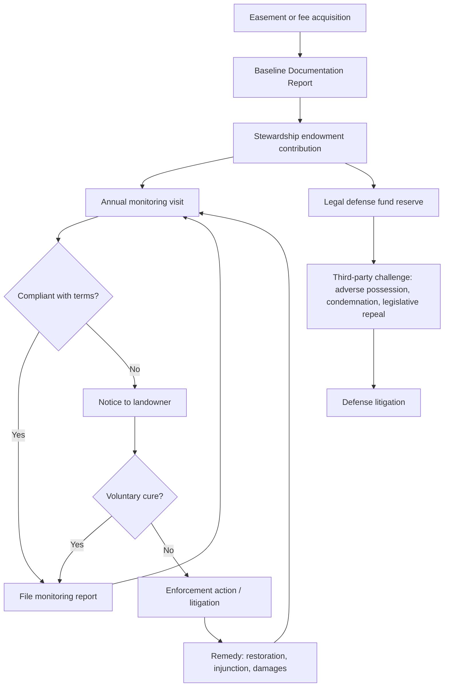

## Land Trusts and Stewardship Obligations

### Overview

A land trust is a nonprofit organization (or, less commonly, a government entity) whose mission includes acquiring, holding, and enforcing interests in land for conservation purposes. Land trusts operate primarily through two mechanisms: holding **fee simple title** to land outright, or holding **conservation easements** (non-possessory interests that restrict a landowner's use of their own property). Stewardship obligations are the ongoing, perpetual duties a land trust assumes once it accepts either type of interest — monitoring, enforcement, defense, and, where applicable, land management.

This topic sits at the intersection of nonprofit corporate governance, real property law, tax law, and environmental policy. The stewardship obligation is what transforms a one-time conservation transaction into a perpetual institutional commitment.

---

### Legal Structure of Land Trusts

**Organizational Form**

- Most land trusts in the United States are organized as 501(c)(3) nonprofit corporations under the Internal Revenue Code, which permits tax-deductible charitable contributions (including donated easements and land).
- Some are public agencies (state or local park/conservation departments) or land trusts created by statute.
- A minority operate as unincorporated associations or, rarely, as charitable trusts in the technical trust-law sense (with trustees owing fiduciary duties to beneficiaries) — though "land trust" as a term of art usually refers to the nonprofit corporate model, not a trust-law arrangement.

**National Accreditation**

- In the U.S., the **Land Trust Accreditation Commission**, an independent program affiliated with the Land Trust Alliance, accredits land trusts that meet standards for ethical and technical competence.
- Accreditation standards address organizational capacity, ethical conduct of transactions, financial planning, and — centrally — long-term stewardship funding and monitoring capacity.
- Accreditation is voluntary but increasingly expected by funders, government grant programs, and sophisticated donors as a proxy for institutional durability.

**Land Trust Standards and Practices**

- The Land Trust Alliance publishes "Land Trust Standards and Practices," a set of ethical and technical guidelines (not law, but widely adopted as an industry norm and referenced by courts and regulators as evidence of prevailing professional standards).
- These standards explicitly address stewardship: requiring baseline documentation, annual monitoring, a stewardship funding mechanism, and enforcement policies.

---

### The Two Principal Holding Models

**Fee Simple Acquisition**

- The land trust becomes outright owner of the property.
- Stewardship here resembles conventional land management: maintenance, liability exposure, property taxes (unless exempted), public access management if applicable, and habitat/resource management consistent with the trust's mission.
- The land trust may later convey the land to a public agency, retain it as a nature preserve, or place a conservation easement on it before selling to a private owner (a "buy-protect-sell" strategy).

**Conservation Easement Holding**

- The land trust does not own the land; it owns and enforces a negative or affirmative easement that restricts the underlying owner's rights (e.g., prohibiting subdivision, development, or certain agricultural practices).
- This is the dominant model quantitatively — most acreage under land trust protection nationally is easement-encumbered rather than trust-owned.
- The underlying fee owner retains possession, use, tax liability (subject to valuation adjustments), and the burden of compliance; the land trust retains only the enforcement right and the corresponding stewardship duty.

---

### Anatomy of Stewardship Obligations

**1. Baseline Documentation Report (BDR)**

- Before or at the time an easement is granted, the land trust prepares a **baseline documentation report**: a detailed factual snapshot of the property's condition — photographs, maps, ecological inventories, existing structures, and land uses — at the moment of conveyance.
- The BDR serves as the evidentiary baseline against which future compliance is measured. Without it, enforcement of a "no further development beyond what exists" restriction becomes evidentiary guesswork.
- Courts and the IRS (for donated easements claiming a charitable deduction) treat BDR quality as evidence of the easement's genuineness and enforceability. Treasury Regulation § 1.170A-14(g)(5) effectively requires documentation sufficient to establish the property's condition at the time of the gift for federal tax-deductibility purposes.

**2. Annual (or Periodic) Monitoring**

- The land trust conducts a site visit — typically annual — to compare current conditions against the baseline and confirm compliance with the easement's restrictions.
- Monitoring produces a monitoring report, ideally with photographs from the same vantage points as the baseline photos, filed and retained as part of the trust's permanent records.
- Monitoring is not discretionary housekeeping; it is the mechanism by which violations are discovered before they become irreversible or before the statute of limitations for enforcement begins to run in some jurisdictions.

**3. Enforcement**

- On discovering a violation, the land trust has a duty (both organizational-mission-based and, per its Standards and Practices commitments, quasi-fiduciary) to pursue a resolution — informal correction, negotiated remedy, or litigation.
- Enforcement may involve: notice-and-cure procedures, injunctive relief, specific performance (restoration), or damages.
- Because conservation easements are typically held "in perpetuity" as a condition of tax deductibility (IRC § 170(h)(5)(A)), the enforcement duty is not time-limited to a single generation of staff — it binds the organization indefinitely, including through leadership turnover, funding shortfalls, and changes in the underlying property's ownership.

**4. Defense of the Easement**

- Distinct from enforcing against the burdened landowner, "defense" refers to protecting the easement's own legal validity against third-party challenges, adverse possession/prescription claims, eminent domain takings, or attempts at legislative or judicial extinguishment.
- Some land trusts maintain or contribute to a **legal defense fund** — either their own dedicated reserve or participation in a shared fund (e.g., Terrafirma, a risk-pooling insurance-like program operated for accredited land trusts in the U.S.) — specifically to finance defense litigation, which can be protracted and expensive.

**5. Land Management (Fee-Owned Properties)**

- For owned land, stewardship additionally includes active management: invasive species control, prescribed burns or other habitat management, trail maintenance, boundary marking, signage, and risk management for public visitors.
- Management plans are typically written, reviewed periodically, and may be required by accreditation standards or by grant conditions if public funds financed the acquisition.

---

### Perpetuity and the Stewardship Funding Problem

**The Core Tension**

A conservation easement is usually structured to bind the land "in perpetuity" — this is a legal requirement for federal tax deductibility under IRC § 170(h) and is standard even for non-deductible or bargain-sale transactions as a matter of conservation policy. But the land trust holding the easement is a mortal institution: it can merge, dissolve, lose funding, or simply fail to maintain institutional memory over decades. The mismatch between a perpetual legal obligation and a finite, resource-constrained organization is the central structural problem of stewardship.

**Stewardship Funding Mechanisms**

- **Stewardship endowments**: Many land trusts require a cash contribution (from the donor or seller) at the time of each easement acquisition, earmarked into a dedicated, often permanently restricted, endowment fund whose investment income funds monitoring and enforcement for that property in perpetuity.
- **Land Trust Standards and Practices** and accreditation review specifically evaluate whether an organization has calculated a defensible per-easement stewardship cost and secured funding for it — a practice increasingly treated as a professional and, in some contexts, fiduciary baseline.
- Underfunded stewardship is a recognized systemic risk in the sector: land trusts that grew rapidly by accepting easements without matching endowment contributions have historically faced monitoring backlogs.

**Governmental and Institutional Backstops**

- Some states impose statutory requirements on easement holders (financial capacity, monitoring obligations) as a condition of holding an easement, particularly where state tax credits subsidize the donor's contribution (e.g., state conservation easement tax credit programs often include holder-eligibility criteria).
- Some easements name a **backup holder** or **secondary grantee** — often a government agency — with a contingent right to enforce if the primary holder dissolves or becomes unable to perform.

---

### What Happens When a Land Trust Fails or Merges

- If a land trust dissolves, well-drafted easements and organizational documents should specify successor holders (often required by the IRS deduction rules or by state nonprofit dissolution law, which typically requires charitable assets to pass to another charitable organization with a similar mission — the "cy pres" doctrine applied by analogy).
- Mergers between land trusts are common and are themselves a stewardship risk-management tool: smaller land trusts merge into larger, better-capitalized organizations partly to ensure perpetual monitoring/enforcement capacity survives beyond the smaller organization's viability.
- [Inference] Because outcomes upon dissolution depend heavily on the specific easement's successor-holder clause, the state's nonprofit dissolution statute, and any IRS/state regulatory conditions attached to the original transaction, the practical result of a failed land trust can vary significantly by jurisdiction and by how the instrument was drafted.

---

### Amendment and Termination — The "Perpetuity" Exception Points

Stewardship obligations also include gatekeeping against improper amendment or termination, since perpetuity is only as strong as the holder's willingness to enforce it against pressure to modify or release restrictions.

- **Amendment**: Land Trust Alliance guidance (and many state attorneys general) treat easement amendments with heightened scrutiny — an amendment must not convey a private benefit to the landowner disproportionate to any conservation benefit gained, and should not undermine the easement's conservation purpose.
- **Termination/Extinguishment**: Under Treasury Regulation § 1.170A-14(g)(6), a federal-tax-deductible easement may only be extinguished through a judicial proceeding upon a finding that continued use for conservation purposes has become "impossible or impractical," and the land trust must then receive a proportionate share of extinguishment proceeds (e.g., condemnation award or sale proceeds) to be used for other conservation purposes — this "proceeds" requirement is one of the more litigated and IRS-scrutinized aspects of easement stewardship.
- Some state attorneys general hold supervisory authority over charitable trust assets generally, which extends to overseeing land trust dispositions of conservation interests, functioning as an external check on stewardship failures or self-dealing.

---

### Illustration: Stewardship Lifecycle (svg_diagram)

---

### Practical Example

A land trust accepts a donated conservation easement over a 200-acre working farm. The deed restricts subdivision beyond two lots and prohibits non-agricultural commercial development, while permitting continued farming and one additional farmhouse.

- At closing, the donor contributes $15,000 to the trust's stewardship endowment (a figure the trust calculated based on its per-easement monitoring cost model).
- The trust's ecologist and attorney jointly prepare a baseline documentation report: aerial photographs, a structures inventory, soil and habitat notes, and GPS-tagged ground photos from fixed monitoring points.
- Each subsequent year, a stewardship staff member visits the property, walks the boundary, photographs the same vantage points, and compares current conditions to the baseline. The report is filed regardless of whether any issue is found.
- Fifteen years later, the farm is sold; the new owner begins grading a portion of the property for a commercial event venue not covered by the agricultural exception. The trust's monitoring visit catches this during the routine annual visit. The trust issues a notice of violation citing the specific restricted-use clause, and after the landowner fails to cure, the trust pursues injunctive relief funded partly from its legal defense reserve.

---

### Key Points

- Land trusts hold conservation interests two ways: fee ownership or conservation easements; each carries distinct but overlapping stewardship duties.
- Baseline documentation is the evidentiary foundation for all future monitoring and enforcement.
- Perpetual duration (required for federal tax deductibility under IRC § 170(h)) creates a structural mismatch with the land trust's own finite institutional capacity — addressed through stewardship endowments, accreditation standards, and successor-holder provisions.
- Amendment and extinguishment of easements are subject to heightened legal and regulatory scrutiny (Treas. Reg. § 1.170A-14(g)(6); state AG oversight) precisely because loosening stewardship at the margins can erode the perpetuity promise made to donors and the public.
- [Inference] The degree to which state law imposes independent statutory monitoring or capacity requirements on easement holders varies significantly by state; some states' conservation easement enabling statutes are largely silent on stewardship capacity, leaving it primarily to federal tax law, IRS practice, and voluntary accreditation standards to fill the gap.

---

### Related Topics

- Conservation Easement Drafting and the IRC § 170(h) Deduction Requirements
- Baseline Documentation Reports: Legal Sufficiency and Evidentiary Standards
- Extinguishment, Condemnation, and the Proceeds Requirement (Treas. Reg. § 1.170A-14(g)(6))
- Land Trust Mergers, Dissolution, and Successor-Holder Clauses
- State Attorney General Oversight of Charitable Conservation Assets
- Stewardship Endowments and Nonprofit Fiduciary Investment Duties
- Syndicated Conservation Easement Transactions and IRS Enforcement Priorities
- Working Lands Easements (Agricultural and Forestry Conservation Easements)