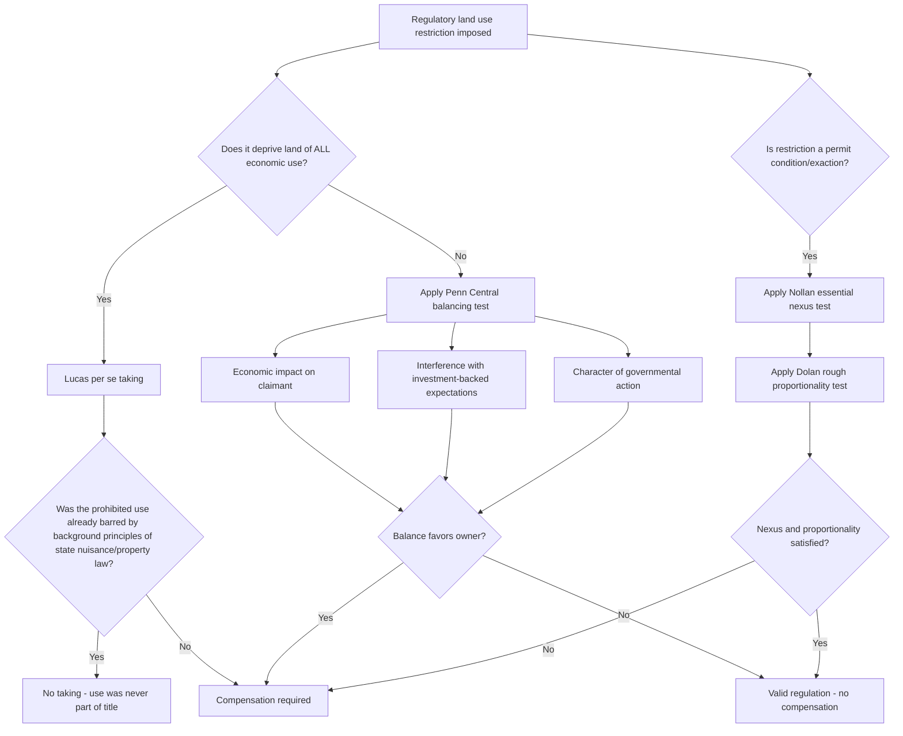

## Environmental Regulation and Land Use Restriction

### Overview

Environmental regulation and land use restriction encompass the body of federal, state, and local law that constrains how private and public land may be used in order to protect natural resources, public health, and ecological systems. Unlike a conservation easement (a voluntary, contractual restriction negotiated between a landowner and a holder), these restrictions are typically **imposed by governmental police power or statutory authority**, independent of the landowner's consent. This topic examines the doctrinal foundations, major regulatory regimes, and the point at which regulation becomes so restrictive that it triggers takings liability — an area of persistent tension between environmental protection and private property rights.

---

### Doctrinal Foundations

**Police Power as the Source of Authority**

- Land use and environmental regulation derive primarily from the states' **police power** — the inherent governmental authority to regulate for health, safety, morals, and general welfare — delegated in turn to local governments through zoning enabling acts.
- Federal environmental regulation instead typically derives from the **Commerce Clause** (regulating activities with interstate effects, such as navigable waters or interstate pollution) and, for federal lands, the **Property Clause**.

**The Takings Clause Backstop**

- The Fifth Amendment (applied to states via the Fourteenth) prohibits government from taking private property for public use without just compensation. Environmental regulation is constitutionally permissible unless it crosses into a "regulatory taking."
- *Pennsylvania Coal Co. v. Mahon* (1922) established that regulation "if it goes too far will be recognized as a taking" — the origin of regulatory takings doctrine.
- *Penn Central Transportation Co. v. New York City* (1978) created the governing multi-factor balancing test for most regulatory takings claims: (1) the economic impact of the regulation on the claimant, (2) the extent of interference with distinct investment-backed expectations, and (3) the character of the governmental action.
- *Lucas v. South Carolina Coastal Council* (1992) carved out a categorical rule: a regulation that deprives land of **all economically beneficial use** is a per se taking requiring compensation, unless the restricted use was not part of the owner's title to begin with (i.e., background principles of state property or nuisance law already prohibited it).
- *Nollan v. California Coastal Commission* (1987) and *Dolan v. City of Tigard* (1994) govern land use exactions — conditions attached to development permits (e.g., requiring dedication of a public easement in exchange for a building permit) — requiring an "essential nexus" and "rough proportionality" between the condition and the development's impact.

---

### Major Federal Regulatory Regimes

**Clean Water Act (CWA) — 33 U.S.C. § 1251 et seq.**

- Section 404 requires a permit from the U.S. Army Corps of Engineers before discharging dredged or fill material into "waters of the United States" (WOTUS), which functionally restricts development, farming, and construction activity on wetlands and adjacent water bodies.
- The scope of "waters of the United States" has been one of the most litigated jurisdictional questions in environmental law. In Sackett v. EPA (2023), the Supreme Court held that the Clean Water Act extends only to wetlands that have "a continuous surface connection" to bodies that are "waters of the United States" in their own right, narrowing the scope of federal wetlands jurisdiction from the broader "significant nexus" test used by agencies.
- Practical effect: a landowner whose parcel includes a wetland may face a categorical prohibition (absent a permit) on filling, grading, or developing that portion of the property — a direct, regulation-imposed land use restriction distinct from any private easement.

**Endangered Species Act (ESA) — 16 U.S.C. § 1531 et seq.**

- Section 9 prohibits the "take" of a listed species, defined broadly to include habitat modification that kills or injures wildlife by significantly impairing breeding, feeding, or sheltering — meaning ESA compliance can restrict land use even absent direct physical taking of a wetland or waterway.
- Section 7 requires federal agencies to consult with the Fish and Wildlife Service or NOAA Fisheries before authorizing, funding, or carrying out actions that may affect listed species — indirectly restricting private land use wherever a federal permit or funding trigger is present (e.g., a CWA § 404 permit application on habitat).
- Habitat Conservation Plans (HCPs) under Section 10 allow landowners to obtain an "incidental take" permit in exchange for mitigation commitments, functioning as a negotiated land use restriction in lieu of an outright prohibition.

**Coastal Zone Management Act (CZMA) and State Coastal Programs**

- Encourages (and through federal consistency requirements, effectively compels) states to adopt coastal zone management programs restricting development within defined coastal boundaries.
- State implementations (e.g., California Coastal Act, administered by the California Coastal Commission) impose permit requirements for development within the coastal zone, including public access dedications — the source of the *Nollan* exaction dispute above.

**National Environmental Policy Act (NEPA) — 42 U.S.C. § 4321 et seq.**

- Procedural rather than substantive: requires federal agencies to prepare an Environmental Impact Statement (EIS) or Environmental Assessment (EA) for major federal actions significantly affecting the environment.
- Does not itself restrict land use but functions as a chokepoint — delay, mitigation conditions, and alternative-siting requirements imposed through NEPA review frequently reshape how and where development proceeds on land requiring federal approval.

**Comprehensive Environmental Response, Compensation, and Liability Act (CERCLA / Superfund) — 42 U.S.C. § 9601 et seq.**

- Imposes strict, joint-and-several liability on current owners, past owners/operators, and other "potentially responsible parties" (PRPs) for contaminated sites, which indirectly restricts land use by making contaminated or historically industrial parcels commercially unattractive absent liability protection.
- **Institutional controls** — a category directly relevant to land use restriction — are non-engineering mechanisms used at contaminated sites to limit exposure: land use restrictions or **environmental covenants** recorded against the deed prohibiting residential use, groundwater extraction, or excavation below a certain depth, enforced under the Uniform Environmental Covenants Act (UECA) adopted in many states.
- These environmental covenants function similarly to conservation easements structurally (a recorded, running restriction) but serve a contamination-control rather than conservation purpose, and are typically held/enforced by a state environmental agency rather than a land trust.

---

### State and Local Land Use Restriction

**Zoning**

- The foundational local land use tool: districts (residential, commercial, industrial, agricultural, conservation) with permitted uses, density limits, setbacks, and height restrictions.
- *Village of Euclid v. Ambler Realty Co.* (1926) upheld the constitutionality of comprehensive zoning against a substantive due process challenge, establishing the rational-basis standard that still governs most zoning validity challenges.
- Environmental overlay zones (floodplain overlays, wetland buffer zones, steep-slope protection districts, wellhead protection areas) layer additional environmentally-motivated restrictions onto base zoning.

**Wetlands and Riparian Buffer Ordinances**

- Many states and localities impose buffer-strip requirements (e.g., no-disturbance zones of a fixed width from a stream bank or wetland edge) independent of federal CWA jurisdiction, often triggered at a lower threshold than federal law.

**Critical Area and Growth Management Statutes**

- State-level statutes (e.g., growth management acts) may designate "critical areas" — wetlands, aquifer recharge zones, geologically hazardous areas, fish and wildlife habitat conservation areas — requiring local governments to adopt protective ordinances as a condition of state land use planning compliance.

**Floodplain Regulation**

- Tied to participation in the National Flood Insurance Program (NFIP): communities must adopt floodplain management ordinances restricting construction in designated flood hazard areas to remain eligible for federally-backed flood insurance, creating a strong practical incentive for local adoption even though NFIP participation is nominally voluntary.

---

### Environmental Regulation vs. Conservation Easements — Structural Comparison

| Feature | Conservation Easement | Environmental Regulation |
| --- | --- | --- |
| Origin | Voluntary grant by landowner | Imposed by governmental authority |
| Legal basis | Contract/property law (real covenant or easement) | Police power, Commerce Clause, statute |
| Holder/Enforcer | Land trust or government grantee | Regulatory agency |
| Compensation to owner | Often tax deduction or purchase price | None (absent a takings finding) |
| Duration | Typically perpetual by design | Persists as long as the law remains in effect |
| Modification | Requires holder consent, subject to perpetuity constraints | Subject to legislative/regulatory change |
| Takings exposure | None (voluntary, no takings claim available) | Central legal risk if restriction goes "too far" |

---

### When Regulation Becomes a Taking: Analytical Framework (svg_diagram)

---

### Practical Example

A landowner acquires a 40-acre parcel, 15 acres of which are mapped as jurisdictional wetland under a post-*Sackett* delineation (continuous surface connection to an adjacent stream). The landowner wants to build a 200-lot subdivision across the entire parcel.

- **Federal layer**: Because the 15-acre wetland retains a continuous surface connection to the stream, it remains "waters of the United States" even after *Sackett*'s narrowing — CWA § 404 permitting is triggered for any fill in that portion.
- **ESA layer**: If a federally listed species (e.g., a freshwater mussel) uses the stream, ESA Section 7 consultation is triggered by the Corps' permitting action, potentially adding mitigation requirements or a Habitat Conservation Plan obligation.
- **Local layer**: The municipality's wetland buffer ordinance imposes an additional 50-foot no-build buffer beyond the wetland boundary itself, further reducing the buildable envelope.
- **Takings analysis**: Because the landowner can still develop the remaining 25 acres profitably, this is analyzed under *Penn Central* (partial restriction, not total wipeout), not *Lucas* — the regulation is very unlikely to be found a taking, since the owner retains substantial economically viable use of the parcel as a whole (courts generally look at the "parcel as a whole," not the restricted sub-portion in isolation, per *Penn Central* and *Tahoe-Sierra Preservation Council v. Tahoe Regional Planning Agency* (2002)).

---

### Key Points

- Regulatory land use restrictions are imposed unilaterally under police power or federal statutory authority, distinguishing them structurally from voluntary conservation easements even though both restrict land use.
- The Clean Water Act's wetlands jurisdiction was significantly narrowed by *Sackett v. EPA* (2023), reducing (but not eliminating) federal permitting exposure for landowners with wetlands lacking a continuous surface connection to other jurisdictional waters.
- Regulatory takings analysis bifurcates into the *Lucas* categorical rule (total economic wipeout) and the *Penn Central* balancing test (partial restrictions), with exactions analyzed separately under *Nollan*/*Dolan*.
- CERCLA institutional controls (environmental covenants) are a specialized, contamination-focused land use restriction mechanism, structurally similar to but legally distinct from conservation easements.
- [Inference] The practical stringency of wetlands, buffer, and critical-area regulation varies considerably between jurisdictions, since many states and localities impose restrictions more protective than the federal floor — meaning post-*Sackett* federal narrowing does not necessarily reduce overall regulatory burden in states with independent state-law wetland protection.

---

### Related Topics

- *Sackett v. EPA* and the Post-2023 Scope of "Waters of the United States"
- Regulatory Takings Doctrine: *Penn Central*, *Lucas*, and the Parcel-as-a-Whole Rule
- Exactions and the *Nollan*/*Dolan* Nexus-Proportionality Framework
- CERCLA Institutional Controls and the Uniform Environmental Covenants Act
- Endangered Species Act Section 7 Consultation and Habitat Conservation Plans
- Floodplain Regulation and National Flood Insurance Program Compliance
- Coastal Zone Management and State Coastal Commission Permitting
- Comparative Structure: Conservation Easements vs. Regulatory Land Use Restrictions