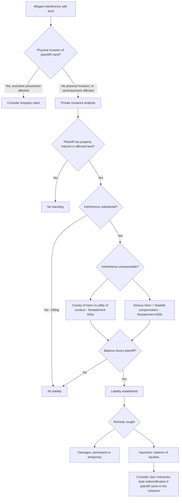

## Private Nuisance Doctrine

### Overview

Private nuisance is a common-law tort doctrine addressing non-trespassory interference with another person's use and enjoyment of land. Unlike trespass, which protects the right to exclusive possession against physical invasion, private nuisance protects the right to **use and enjoy** land free from unreasonable interference — encompassing harms like noise, odor, vibration, smoke, light, or diminished access to sunlight/view that do not involve a physical entry onto the plaintiff's property (though physical invasions like flooding or debris can also constitute nuisance). It is one of the oldest common-law property torts and remains the primary private-law tool for resolving land use conflicts between neighbors.

---

### Elements of Private Nuisance

**1. Interest Protected: Use and Enjoyment of Land**

- The plaintiff must have a property interest in the affected land — ownership, leasehold, or another possessory interest — sufficient to bring the claim. Mere visitors or those without a possessory interest generally lack standing for private nuisance (though some jurisdictions extend standing to those with a sufficient interest short of full ownership).

**2. Interference**

- The interference must be with the **use and enjoyment** of land, not merely aesthetic displeasure or subjective offense unconnected to any tangible impact — courts generally require the interference to affect the physical condition of the land or the occupants' ability to use it comfortably (noise, odors, dust, vibration, light, contamination).
- Restatement (Second) of Torts § 821D defines private nuisance as a "nontrespassory invasion of another's interest in the private use and enjoyment of land."

**3. Substantiality**

- The interference must be **substantial** — more than trifling annoyance. Courts apply an objective "normal person" standard (Restatement § 821F): would the interference be significant to a person of ordinary sensibilities in the community, not an unusually sensitive plaintiff or use.

**4. Unreasonableness**

- The interference must be **unreasonable**, assessed either by:
  - **Restatement (Second) § 826(a)**: the gravity of harm outweighs the utility of the defendant's conduct (a balancing test), or
  - **Restatement (Second) § 826(b)**: the harm is serious and the financial burden of compensating for it would not make the defendant's continued conduct infeasible (a "serious harm" prong that permits liability even when the conduct's utility exceeds the harm, provided compensation is feasible).
- This balancing distinguishes nuisance from strict liability: a defendant's conduct can be entirely lawful and even socially valuable (e.g., a factory providing jobs) and still constitute a nuisance if the balance of gravity versus utility favors the plaintiff.

**5. Intent or Fault**

- Nuisance liability can rest on: (a) intentional conduct (defendant acted knowing the interference was substantially certain to result), (b) negligent conduct, (c) reckless conduct, or (d) conduct actionable under a strict liability standard (e.g., abnormally dangerous activities under Restatement § 519–520, which independently overlaps with nuisance doctrine).
- Most private nuisance claims in practice involve intentional conduct in the sense that the defendant knows the activity (e.g., operating a facility) is producing the interference, even without any intent to harm the plaintiff specifically.

---

### Private Nuisance vs. Trespass vs. Public Nuisance

| Feature | Trespass | Private Nuisance | Public Nuisance |
| --- | --- | --- | --- |
| Interest protected | Right to exclusive possession | Right to use and enjoyment | Rights common to the general public |
| Physical invasion required | Yes (even minimal) | No (but can overlap) | No |
| Damage requirement | Not required (nominal damages available) | Substantial interference required | Substantial interference with public right |
| Standing | Possessor of land | Person with property interest in affected land | Typically government; private plaintiff needs "special injury" |
| Balancing/reasonableness inquiry | Generally not applicable | Central to liability | Central to liability |

- Some conduct (e.g., toxic runoff crossing a property line) can support both trespass and nuisance claims simultaneously, decided as alternative or cumulative theories depending on jurisdiction.
- Public nuisance addresses interference with rights common to the public generally (blocked public roads, contaminated public waterways); a private individual can sue for public nuisance only upon showing "special injury" — harm different in kind, not merely degree, from that suffered by the public at large.

---

### Defenses and Limiting Doctrines

**"Coming to the Nuisance"**

- A defense (of varying strength across jurisdictions) where the defendant argues the plaintiff moved to the area knowing of the pre-existing nuisance-generating activity.
- Restatement (Second) § 840D treats this as a factor in the reasonableness balancing rather than a complete bar — courts widely reject it as an absolute defense, since allowing it would let a first-mover "nuisance" activity permanently foreclose surrounding land uses (the doctrine most famously limited in *Spur Industries, Inc. v. Del E. Webb Development Co.*, 494 P.2d 700 (Ariz. 1972), discussed below).

**Statutory "Right to Farm" Laws**

- Nearly all U.S. states have enacted right-to-farm statutes that limit nuisance liability against agricultural operations that were established before surrounding non-agricultural development occurred, provided the operation follows reasonable/generally accepted agricultural practices and has not substantially changed.
- These statutes function as a legislative override of the common-law "coming to the nuisance" weakness, specifically protecting agricultural land uses from being nuisance-litigated into closure by newly arrived residential neighbors.

**Zoning Compliance**

- Compliance with local zoning is relevant evidence in the reasonableness balancing but is **not a complete defense** to nuisance in the majority of jurisdictions — a use can be zoning-compliant and still constitute an actionable nuisance, since zoning and nuisance serve different (public regulatory vs. private rights) functions.

**Prescription**

- In some jurisdictions, a nuisance maintained openly, continuously, and adversely for the statutory prescriptive period (analogous to adverse possession) can ripen into a prescriptive right to continue the interference — though courts apply this narrowly and it is not recognized in all states.

---

### Remedies

**Damages**

- Compensatory damages for diminished property value, loss of use and enjoyment, and in some cases personal injury or emotional distress connected to the interference.
- Damages may be assessed as a one-time award (permanent nuisance, treating the harm as fixed and ongoing) or as recurring damages (temporary/abatable nuisance, allowing successive suits if the condition continues) — the permanent/temporary characterization significantly affects both the measure of damages and the statute of limitations analysis.

**Injunctive Relief**

- Courts may order the defendant to abate (stop or modify) the nuisance-causing activity. Injunctions are an equitable remedy and remain subject to a balance-of-equities/balance-of-hardships analysis distinct from the liability-stage reasonableness balancing.
- *Boomer v. Atlantic Cement Co.*, 257 N.E.2d 870 (N.Y. 1970) — a foundational case — held that where the economic disparity between the harm to plaintiffs and the value of the defendant's operation was vast, a court could deny a traditional injunction and instead award **permanent damages** conditioned on payment, effectively allowing the nuisance to continue in exchange for compensation. This "damages in lieu of injunction" approach remains influential though not universally followed.

**The *Spur Industries* Compromise**

- In *Spur Industries, Inc. v. Del E. Webb Development Co.*, the Arizona Supreme Court held that a cattle feedlot operating in a rural area, later surrounded by an expanding residential development, constituted a nuisance to the new residents and could be enjoined — but because the developer had "come to the nuisance" and profited from creating the very population that made the feedlot a nuisance, the court required the **developer to indemnify the feedlot operator** for the reasonable cost of relocating or shutting down. This remains a leading illustration of courts blending injunctive relief with an equitable compensation adjustment to account for who "caused" the conflict.

---

### Nuisance Per Se vs. Nuisance Per Accidens (in Fact)

- **Nuisance per se**: An activity or condition that is a nuisance under any circumstances, regardless of location or manner of operation (e.g., often defined by statute or ordinance, or conduct universally recognized as harmful — certain hazardous conditions).
- **Nuisance per accidens (nuisance in fact)**: An activity that is lawful and not inherently harmful but becomes a nuisance because of its particular location, manner, or circumstances (e.g., a factory that would be unobjectionable in an industrial zone but is a nuisance next to a residential neighborhood). The overwhelming majority of private nuisance litigation involves nuisance in fact, requiring the full reasonableness balancing analysis rather than categorical liability.

---

### Analytical Framework (svg_diagram)

---

### Practical Example

A homeowner in a formerly rural county purchases a house adjacent to an existing hog farm that has operated at that location for twenty years. Within two years, the surrounding area is rezoned residential and several new subdivisions, including the homeowner's, are built nearby. The homeowner sues the hog farm for private nuisance based on persistent odor.

- **Interference and substantiality**: Odor sufficient to prevent outdoor use of the property and detectable inside the home likely satisfies substantiality under the "normal person" standard.
- **Reasonableness balancing**: The farm's long-standing operation and agricultural utility are weighed against the harm now being suffered by an expanding residential population — but the *timing* (residential development arriving after the farm) is significant.
- **Right-to-farm statute**: If the jurisdiction's right-to-farm statute protects operations predating surrounding development and the farm has not materially expanded or changed its practices, the statute may bar or limit the claim entirely, regardless of how the common-law balancing would otherwise come out.
- **If no statutory protection applies**: Courts might follow the *Spur Industries* approach — the developer(s) who built and sold homes with knowledge of the adjacent farm bear responsibility for the conflict, potentially resulting in an injunction conditioned on developer-funded relocation costs rather than an uncompensated shutdown of the farm.

---

### Key Points

- Private nuisance protects use-and-enjoyment interests, not possession — distinguishing it from trespass, and requiring a reasonableness balancing rather than categorical liability for invasion.
- Liability turns on both substantiality (objective, normal-person standard) and unreasonableness (gravity of harm vs. utility of conduct, per Restatement §§ 826(a)–(b)).
- "Coming to the nuisance" is a balancing factor in most jurisdictions, not a complete defense — right-to-farm statutes exist specifically to give agricultural operations the categorical protection the common law doctrine alone does not reliably provide.
- Remedy selection (damages vs. injunction, permanent vs. temporary) significantly shapes both compensation and ongoing legal exposure, as illustrated by the differing approaches in *Boomer* and *Spur Industries*.
- [Inference] Because private nuisance is predominantly state common law (supplemented unevenly by state right-to-farm and other statutes), the precise weight given to zoning compliance, prescriptive nuisance, and the coming-to-the-nuisance doctrine varies meaningfully by jurisdiction, and practitioners should confirm current state-specific treatment rather than assume uniform application of the Restatement position.

---

### Related Topics

- Public Nuisance Doctrine and Special Injury Standing
- Right-to-Farm Statutes and Agricultural Land Use Protection
- *Boomer v. Atlantic Cement Co.* and Damages-in-Lieu-of-Injunction
- *Spur Industries v. Del E. Webb* and Equitable Indemnification in Nuisance
- Trespass to Land vs. Nuisance: Overlapping and Alternative Theories
- Abnormally Dangerous Activities and Strict Liability Nuisance
- Zoning as Evidence (Not a Defense) in Nuisance Litigation
- Prescriptive Rights to Maintain a Nuisance