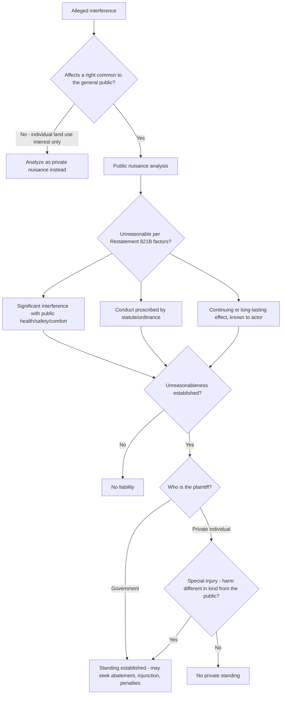

## Public Nuisance and Land Use

### Overview

Public nuisance is a common-law and statutory doctrine addressing unreasonable interference with rights common to the general public — as distinguished from private nuisance, which protects an individual's use and enjoyment of their own land. In the land use context, public nuisance doctrine has historically governed obstructions of public ways, contamination of public waters, and conditions endangering public health or safety on or affecting land accessible to or shared by the community. In recent decades it has also become a controversial vehicle for large-scale litigation (opioid manufacturing, climate change, lead paint, firearms) that stretches the doctrine well beyond its traditional land-use core — a development that is itself an important part of understanding the doctrine's current contested boundaries.

---

### Elements of Public Nuisance

**Restatement (Second) of Torts § 821B Definition**

- A public nuisance is "an unreasonable interference with a right common to the general public."
- Circumstances that may sustain a finding of unreasonableness (§ 821B(2)) include: (a) whether the conduct involves a significant interference with public health, safety, peace, comfort, or convenience; (b) whether the conduct is proscribed by a statute, ordinance, or administrative regulation; or (c) whether the conduct is of a continuing nature or has produced a permanent or long-lasting effect, and the actor knows or has reason to know it has a significant effect upon the public right.

**"Right Common to the General Public"**

- The interference must affect a right shared by the community as such, not merely a large number of individuals each suffering private harm. Classic examples in the land use context: obstructing a public highway or navigable waterway, polluting a public water supply, operating a use that endangers public health across a neighborhood (e.g., a source of disease), or maintaining conditions that interfere with public use of public land.
- This is the doctrinal feature most stretched in modern mass-tort public nuisance litigation, where plaintiffs (often state or local governments) argue that widespread private harm (e.g., opioid addiction across a population) constitutes interference with a "public right" to public health — a characterization multiple courts have rejected as an improper extension of the doctrine beyond its land-use and public-resource origins.

---

### Standing: Government vs. Private Plaintiff

**Governmental Enforcement**

- Public nuisance is traditionally enforced by public officials — state attorneys general, district/city attorneys, or through a criminal or statutory abatement proceeding — because the interest protected belongs to the public collectively, not any single private party.
- Many jurisdictions have codified public nuisance by statute, supplementing or displacing the common-law action (e.g., statutory definitions of public nuisance covering illegal drug houses, health hazards, or structural hazards, enforceable through code enforcement and abatement proceedings).

**Private Plaintiff: The "Special Injury" Requirement**

- A private individual may sue for public nuisance only upon showing **special injury** — harm different in kind, not merely in degree, from that suffered by the general public.
- Example: if a public nuisance obstructs a public road, a member of the general public who is merely inconvenienced generally cannot sue privately, but an adjacent landowner whose sole access to their property is blocked by the same obstruction has suffered a special injury (different in kind — total loss of access — not just a greater degree of the same general inconvenience) and may bring a private action.
- This special injury rule is the primary gatekeeping mechanism preventing public nuisance from becoming an unlimited private cause of action for any diffuse societal harm.

---

### Public Nuisance in the Traditional Land Use Context

**Obstruction of Public Ways and Waterways**

- Historically the paradigmatic public nuisance: blocking a public road, encroaching on a public right-of-way, or obstructing a navigable waterway used for public commerce or passage.
- Remains actionable today through both common law and specific statutory encroachment/obstruction provisions administered by transportation and waterway authorities.

**Contamination of Public Resources**

- Pollution of a public water supply, contamination of a public beach, or degradation of a public fishery historically supported public nuisance actions by the government (and, where special injury could be shown, by private plaintiffs such as commercial fishers whose livelihood was specifically and disproportionately affected).

**Health and Safety Hazards on Land**

- Conditions on private land that create a public health hazard reaching beyond the immediate neighbors — historically framed examples include keeping diseased animals, operating an unsanitary facility affecting a wide area, or maintaining a fire or structural hazard threatening a neighborhood — can constitute public nuisance, often now addressed more directly through municipal code enforcement and public health statutes rather than common-law litigation.

**Statutory "Nuisance Property" Abatement**

- Many municipalities have adopted nuisance abatement ordinances targeting specific land-use-related problems: drug activity on a property, chronic code violations, abandoned/blighted structures, or properties generating repeated law enforcement calls.
- These ordinances typically authorize administrative remedies — fines, receivership, forced repair, or in severe cases demolition — providing a faster and more predictable mechanism than common-law public nuisance litigation.

---

### The Modern Expansion: Mass-Tort Public Nuisance Litigation

**Departure from the Land Use Core**

- Beginning notably with lead paint litigation in the early 2000s and accelerating with opioid litigation in the 2010s–2020s, government plaintiffs began asserting public nuisance claims against manufacturers and distributors of products causing widespread societal harm, theorizing that the resulting public health crisis itself constitutes interference with a "public right."
- This represents a significant doctrinal departure: traditional public nuisance targeted a **condition or activity on or affecting land or a public resource**, controlled by the defendant; mass-tort public nuisance targets **product manufacture and sale**, disconnected from any specific land, water, or public right in the traditional sense.

**Judicial Pushback**

- Several state supreme courts have rejected the expanded theory. Notably, the Oklahoma Supreme Court in *State ex rel. Hunter v. Johnson & Johnson*, 499 P.3d 719 (Okla. 2021), reversed a trial-court public nuisance verdict against an opioid manufacturer, holding that Oklahoma's public nuisance statute had never before been applied to the manufacturing, marketing, and sale of a product and declining to extend it that far, citing concerns about unmanageable, limitless liability disconnected from the doctrine's property-and-public-rights origins.
- The California Court of Appeal, by contrast, in the opioid litigation against manufacturers by several California counties, allowed public nuisance claims to proceed to trial (though ultimately the trial court found the defendants not liable), reflecting some jurisdictional variation in how far courts are willing to extend the doctrine.
- Climate change public nuisance litigation against fossil fuel companies has met similarly mixed results, with the U.S. Supreme Court declining to recognize a federal common law public nuisance cause of action for interstate greenhouse gas emissions in *American Electric Power Co. v. Connecticut*, 564 U.S. 410 (2011) (holding the Clean Air Act displaces any federal common law nuisance claim for such emissions), pushing subsequent climate suits toward state law theories and procedural battles over federal vs. state forum.

**Land Use Doctrinal Significance**

- [Inference] The tension between traditional land-use-rooted public nuisance and its modern mass-tort application is significant for a land use/property law context because it raises the question of whether public nuisance remains, at its doctrinal core, a property-and-public-resource tort — with courts that reject the expansion (like Oklahoma) implicitly reaffirming that lineage, while courts that permit it arguably decouple the doctrine from land use altogether.

---

### Public Nuisance vs. Private Nuisance — Key Distinctions

| Feature | Public Nuisance | Private Nuisance |
| --- | --- | --- |
| Right protected | Rights common to the general public | Individual's use/enjoyment of land |
| Typical plaintiff | Government (AG, city/district attorney) | Private landowner or possessor |
| Private standing | Requires "special injury" (different in kind) | Ordinary standing for affected landowner |
| Connection to specific land | Traditionally yes, though modern mass-tort claims often lack this | Always — tied to plaintiff's land |
| Remedy | Abatement, injunction, civil penalties, sometimes damages | Damages, injunction |
| Codification | Frequently statutory/ordinance-based | Predominantly common law |

---

### Analytical Framework (svg_diagram)

---

### Practical Example

A company operates a scrap-metal recycling yard adjacent to a public river used for municipal water intake downstream. Runoff from the yard introduces heavy metal contaminants into the river.

- **Public nuisance (government action)**: The state attorney general or environmental agency may bring a public nuisance action (potentially alongside a Clean Water Act enforcement action) because the contamination interferes with the public's right to a clean public water resource — a right common to the general public, not particular to any one riparian owner.
- **Private nuisance (adjacent landowner)**: A landowner immediately downstream whose well is separately contaminated, or whose private frontage is fouled by the same runoff, may bring a private nuisance claim for the interference with their specific property's use and enjoyment.
- **Private public-nuisance claim (special injury)**: A commercial fishing operation that depends on the river and suffers a fish kill directly traceable to the contamination may bring a public nuisance claim privately, since the harm (loss of a specific livelihood dependent on the resource) is different in kind from the general public's shared, diffuse interest in a clean river — satisfying the special injury requirement.
- **What would likely fail**: A claim by a distant municipality's water ratepayers seeking damages for generalized rate increases attributable to treatment costs would face significant special-injury and proximate-cause hurdles, illustrating the kind of diffuse-harm theory that mass-tort-style public nuisance claims push against and that courts like Oklahoma's have resisted extending.

---

### Key Points

- Public nuisance protects rights common to the public, with government as the primary enforcer; private plaintiffs need "special injury" — harm different in kind from the general public's.
- The doctrine's traditional land-use core (obstructed public ways, contaminated public resources, land-based health hazards) is increasingly supplemented by municipal nuisance-abatement ordinances that offer faster administrative remedies than common-law litigation.
- Modern mass-tort applications (opioids, lead paint, climate change) test the doctrine's outer boundary by targeting product manufacture and sale rather than a condition on or affecting specific land or a public resource, producing a split among courts, exemplified by Oklahoma's rejection in the *Johnson & Johnson* opioid case versus other jurisdictions permitting such claims to proceed.
- Federal common law public nuisance for interstate emissions has been foreclosed by *American Electric Power v. Connecticut*, redirecting climate nuisance litigation toward state law and raising separate preemption/displacement questions.
- [Inference] Given the active and jurisdiction-specific split on mass-tort public nuisance theories, practitioners should treat the doctrine's applicability to non-land-based, product-liability-style harms as unsettled and confirm the current state of the law in the relevant jurisdiction rather than assuming either the traditional or expanded view controls.

---

### Related Topics

- Private Nuisance Doctrine and the Special-Injury Distinction
- Municipal Nuisance Abatement Ordinances and Blighted Property Receivership
- Opioid and Mass-Tort Public Nuisance Litigation (*State ex rel. Hunter v. Johnson & Johnson*)
- Climate Change Public Nuisance Litigation and Federal Preemption (*American Electric Power v. Connecticut*)
- Clean Water Act Enforcement and Overlapping Public Nuisance Theories
- Navigable Waterway and Public Right-of-Way Obstruction Claims
- Environmental Justice and Disparate-Impact Theories in Nuisance Litigation
- Abatement Remedies: Injunction, Receivership, and Civil Penalties