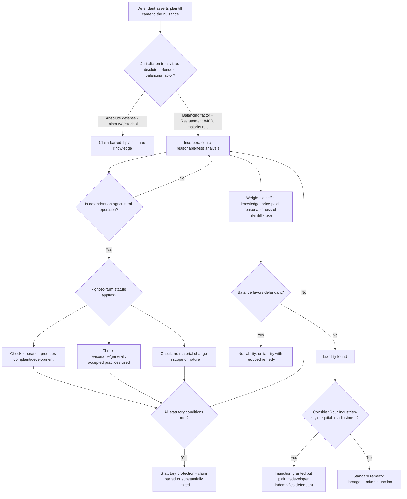

## The Coming to the Nuisance Defense

### Overview

"Coming to the nuisance" refers to a defense (or, more precisely in most modern jurisdictions, a *factor* rather than a complete defense) asserted in nuisance litigation where the defendant argues that the plaintiff acquired or moved onto their land with knowledge of a pre-existing nuisance-generating condition or activity, and therefore should not be permitted to complain about a state of affairs the plaintiff knowingly encountered. The doctrine sits at the center of a persistent tension in land use law: protecting reasonable reliance by established land uses against the ability of new arrivals to force change through litigation, weighed against the policy concern that allowing a first-mover activity to permanently immunize itself would let incompatible uses entrench indefinitely and block otherwise legitimate land use evolution.

---

### Historical Origin and Rationale

**Early Common Law Position**

- Historically, some courts treated "coming to the nuisance" as close to an absolute bar: if the plaintiff moved to the area after the defendant's activity was established, the plaintiff was deemed to have assumed the risk or waived the right to complain, because the defendant's use predated any conflicting expectation.
- The underlying policy rationale mirrors first-in-time property principles: an established, lawful land use should not be destabilized simply because someone later chooses to locate nearby and then objects to conditions that existed before their arrival.

**Modern Retreat from an Absolute Bar**

- The clear majority modern position, reflected in Restatement (Second) of Torts § 840D, treats the plaintiff's coming to the nuisance not as a complete defense but as **one factor** to be weighed in the overall reasonableness balancing that governs nuisance liability generally.
- Restatement § 840D provides that the fact the plaintiff acquired the land after the nuisance came into existence is not in itself sufficient to bar the action, but it is a factor relevant to whether the defendant's conduct is unreasonable, and specifically to whether the harm is "substantial" or the plaintiff's use of the land is reasonable given surrounding conditions.
- The primary policy concern driving this retreat: an absolute defense would allow the first land use in an area to permanently dictate what future development is possible nearby, effectively granting private parties an unreviewable power to control regional land use patterns that properly belongs to zoning authorities and evolving community judgment — undermining the ability of land to transition uses over time as areas urbanize or change character.

---

### The Leading Case: *Spur Industries, Inc. v. Del E. Webb Development Co.*

- **Citation**: 494 P.2d 700 (Ariz. 1972).
- **Facts**: Spur Industries operated a cattle feedlot in a rural area of Maricopa County, Arizona. The operation was lawful and unobjectionable when established. Del E. Webb Development Co. subsequently purchased land nearby and developed a large residential retirement community (Sun City), eventually building homes progressively closer to the feedlot as the development expanded. Residents complained of odor and flies; Webb sued for injunctive relief.
- **Holding**: The Arizona Supreme Court held that the feedlot constituted a nuisance to the residents actually affected and could be enjoined (because the interference with the residents' health and enjoyment was real and substantial, regardless of who arrived first) — but the court simultaneously held that because Webb had brought people to a previously agricultural area for profit, with full knowledge of the feedlot's presence, **Webb was required to indemnify Spur** for the reasonable costs of relocating or shutting down the feedlot operation.
- **Significance**: *Spur Industries* is the paradigmatic illustration of courts refusing to treat coming to the nuisance as either a complete bar (the feedlot was still enjoined) or an irrelevant factor (Webb still bore the cost) — instead crafting an equitable compromise that protects the *ultimate victims* (the residents, who had no control over Webb's development decisions) while still allocating the economic burden of the conflict to the party whose conduct (developing next to a known nuisance for profit) actually created it.
- The indemnification remedy is often described as a hybrid public/private nuisance approach, though the underlying claim was analyzed under nuisance principles broadly applicable to the coming-to-the-nuisance question.

---

### Statutory Override: Right-to-Farm Laws

**Legislative Response to the Doctrine's Weakness**

- Because the common-law coming-to-the-nuisance factor provides only a balancing consideration — not a guaranteed defense — agricultural operations remained vulnerable to nuisance suits from newly arrived residential neighbors even when the operation predated the residential development by decades.
- Nearly all U.S. states responded by enacting **right-to-farm statutes**, which provide agricultural operations with a more robust, often near-categorical, statutory defense against nuisance claims, specifically targeting the situation *Spur Industries* addressed at common law.

**Typical Statutory Structure**

- Protection generally requires: (1) the agricultural operation predates the nuisance complaint (and often predates surrounding non-agricultural development); (2) the operation uses generally accepted, reasonable, or "good" agricultural practices; and (3) the operation has not materially or substantially changed in scope or nature since it began (expansion or change of operation type can forfeit protection in many statutes).
- Some statutes are triggered automatically after a set period of lawful operation (e.g., one year of operation without nuisance complaint creates a presumption of protected status), converting the common-law balancing factor into something closer to a statute-of-repose mechanism.
- Right-to-farm statutes vary considerably in scope and strength between states — some provide near-absolute protection meeting constitutional challenges (occasionally litigated as an uncompensated taking of the neighboring landowner's nuisance cause of action), while others provide only a rebuttable presumption or apply narrowly to specific agricultural practices.

**Limits of Right-to-Farm Protection**

- These statutes typically do not protect operations that violate environmental or public health statutes, that have expanded significantly beyond their original scope, or that use negligent/improper practices — right-to-farm protection generally requires ongoing compliance with a "reasonable agricultural practices" standard, not a blanket immunity regardless of conduct.
- [Inference] Because "reasonable" or "generally accepted" agricultural practices language is often not exhaustively defined by statute, litigation frequently turns on expert testimony about industry-standard practices, meaning the practical strength of right-to-farm protection can vary based on the specific operation and evidentiary record even within a single state's statutory framework.

---

### Interaction with the General Nuisance Reasonableness Balancing

**Where Coming to the Nuisance Fits in the Restatement Framework**

- Under Restatement (Second) § 826, nuisance liability turns on whether the gravity of harm outweighs the utility of the defendant's conduct, or whether the harm is serious and compensation is feasible.
- Coming to the nuisance interacts with this balancing primarily through § 840D's guidance that it bears on (a) whether the plaintiff's *use* of the land is itself reasonable given the surrounding, pre-existing conditions, and (b) whether the harm to the plaintiff should be considered as severe as it would be absent the plaintiff's prior knowledge.
- A plaintiff who purchases land at a discounted price precisely because of a known nearby nuisance, then sues to enjoin that same nuisance, presents a stronger case for the factor weighing against liability (or against full damages) than a plaintiff with no meaningful opportunity to have known of or priced in the condition.

**Distinguishing "Coming to the Nuisance" from Mere Notice**

- The defense is strongest where the plaintiff had actual or constructive knowledge and a genuine opportunity to factor the condition into their purchase decision (e.g., visible, ongoing agricultural operations). It is weaker or inapplicable where the nuisance was latent, intermittent, undisclosed, or arose or intensified only after the plaintiff's acquisition — timing and disclosure matter significantly to how much weight courts give the factor.

---

### Analytical Framework (svg_diagram)

---

### Practical Example

A quarry has operated lawfully in a semi-rural area for 35 years. Ten years ago, a developer built a residential subdivision half a mile away, with home purchase disclosures noting the quarry's presence and typical blasting schedule. A homeowner who bought in that subdivision five years ago sues the quarry for nuisance based on blasting vibration and dust.

- **Coming to the nuisance factor**: The homeowner purchased with documented notice of the quarry and its operations — a strong factual basis for the coming-to-the-nuisance factor to weigh against the homeowner in the reasonableness balancing, particularly if the price reflected the quarry's proximity.
- **Not an absolute bar**: Even with clear notice, most jurisdictions will not treat this as an automatic defeat of the claim — if the quarry's dust or vibration levels have genuinely worsened, or a normal person's use and enjoyment is substantially and unreasonably interfered with, the claim can still proceed, with the plaintiff's knowledge factored into (but not dispositive of) the outcome.
- **No right-to-farm protection**: Because quarrying is not an agricultural operation, right-to-farm statutes are inapplicable regardless of how favorable their protections might otherwise be — the defendant is limited to the common-law balancing factor and any separate mining/extraction-specific statutory protections that might exist in the jurisdiction.
- **Possible *Spur*-style outcome**: If the developer, rather than the individual homeowner, were the more culpable party (e.g., failed to adequately disclose or actively marketed the area despite worsening quarry operations), a court might consider allocating remediation or relocation costs to the developer rather than either barring the claim outright or imposing full liability on the quarry with no consideration of the pre-existing, known condition.

---

### Key Points

- Coming to the nuisance is, in the majority modern rule (Restatement § 840D), a *factor* in the nuisance reasonableness balancing — not a complete, automatic defense — reflecting the policy concern that an absolute rule would let established uses permanently block surrounding land use evolution.
- *Spur Industries v. Del E. Webb* remains the leading illustration of courts declining to choose between "no injunction because plaintiff came to the nuisance" and "full liability regardless of plaintiff's knowledge," instead crafting an equitable indemnification remedy that allocates cost to the party who profited from creating the conflict.
- Right-to-farm statutes function as a legislative correction to the doctrine's weakness for agricultural operations specifically, converting a mere balancing factor into a more robust (though not absolute, and practice-compliance-dependent) statutory defense.
- The strength of the coming-to-the-nuisance factor depends heavily on the plaintiff's actual/constructive knowledge, whether the condition was disclosed or discounted into the purchase price, and whether the nuisance has since worsened or changed in character.
- [Inference] Because Restatement § 840D and right-to-farm statutes are state-specific in adoption and precise wording, and because case law applying the *Spur Industries* equitable-indemnification approach outside its original agricultural-feedlot context is not uniformly established across jurisdictions, the exact weight and remedy consequences of "coming to the nuisance" should be confirmed against the controlling state's current statutory and case law rather than assumed to track the Restatement or *Spur Industries* model precisely.

---

### Related Topics

- Private Nuisance Doctrine: Elements and Reasonableness Balancing
- *Spur Industries v. Del E. Webb* and Equitable Indemnification Remedies
- Right-to-Farm Statutes: Scope, Triggers, and Constitutional Challenges
- *Boomer v. Atlantic Cement Co.* and Damages-in-Lieu-of-Injunction
- Zoning Compliance as Evidence (Not a Defense) in Nuisance Claims
- Prescriptive Rights to Maintain a Nuisance
- Restatement (Second) of Torts §§ 821–840 Nuisance Framework
- Land Use Compatibility Buffers and Agricultural Protection Zoning