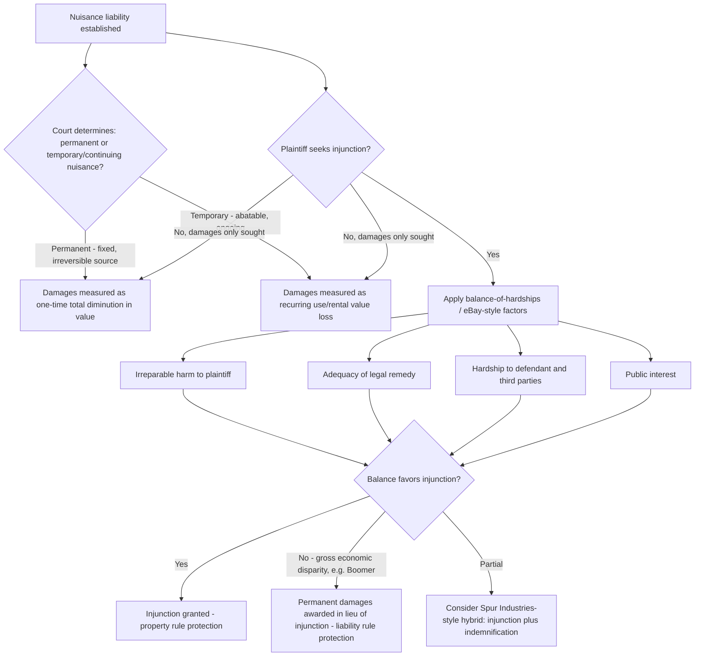

## Remedies: Injunctions and Damages

### Overview

Once liability for a nuisance (private or public) is established, courts must select a remedy from two principal categories: **injunctive relief**, an equitable order compelling the defendant to stop, modify, or abate the offending conduct, and **damages**, a legal remedy compensating the plaintiff monetarily while typically allowing the nuisance-generating activity to continue. The choice between these remedies — and the finer calibration within each category — is governed by a distinct body of equitable and remedial doctrine layered on top of the liability analysis, and is frequently the most consequential and contested phase of nuisance litigation, since it determines whether an ongoing land use conflict is resolved by stopping an activity or by pricing it.

---

### Injunctive Relief

**Nature and Availability**

- An injunction is an equitable remedy, meaning courts retain discretion to grant or withhold it even after liability is established — nuisance liability does not automatically entitle a plaintiff to injunctive relief as of right.
- Types relevant to nuisance: **prohibitory injunctions** (ordering the defendant to cease an activity), **mandatory injunctions** (ordering affirmative action, such as removing a structure or installing abatement equipment), and **permanent** vs. **preliminary/temporary** injunctions (the latter granted pending trial where irreparable harm during litigation is shown).

**Traditional Equitable Balancing (Balance of Hardships / Equities)**

- Courts weigh: (1) the plaintiff's irreparable harm absent an injunction, (2) the adequacy of a legal (damages) remedy, (3) the hardship an injunction would impose on the defendant and third parties, and (4) the public interest.
- This balance-of-hardships analysis at the *remedy* stage is analytically distinct from the gravity-of-harm-versus-utility-of-conduct balancing used at the *liability* stage (Restatement § 826) — a defendant can lose on liability (the interference is unreasonable) yet still avoid an injunction if the hardship of shutting down grossly outweighs the plaintiff's harm, with damages substituted instead.

**The eBay Framework (Patent Context, Influential Beyond It)**

- *eBay Inc. v. MercExchange, L.L.C.*, 547 U.S. 388 (2006), while a patent case, articulated a four-factor test for permanent injunctions widely cited and applied by analogy in property and nuisance contexts: (1) irreparable injury, (2) inadequacy of legal remedies, (3) balance of hardships between plaintiff and defendant, and (4) whether the public interest would be disserved by an injunction.
- [Inference] While *eBay* did not itself arise in a nuisance case, its four-factor articulation is frequently invoked by courts and commentators discussing modern injunction practice generally, including in property and nuisance disputes, though the older common-law nuisance-specific balance-of-hardships tradition (predating *eBay* by well over a century, as in *Boomer*, discussed below) remains the doctrinally primary framework in most nuisance cases.

---

### Damages

**Categories of Recoverable Damages**

- **Diminution in property value**: measured as the difference between the property's value before and after the nuisance, or between its value free of the nuisance and its value subject to the nuisance — typically applied when the harm is of a permanent or lasting character.
- **Loss of use and enjoyment**: compensation for the discomfort, annoyance, and interference with normal use during the period the nuisance existed, often measured by rental value diminution or a more subjective discomfort-based award.
- **Consequential/special damages**: lost profits (e.g., a farming or commercial operation disrupted by the nuisance), costs of mitigation or repair, and in some jurisdictions personal injury or emotional distress damages connected to the interference.
- **Punitive damages**: available in a minority of cases involving particularly egregious, willful, or malicious conduct, subject to the same constitutional due process limits (*BMW of North America v. Gore*, *State Farm v. Campbell*) applicable to punitive damages generally.

**Permanent vs. Temporary (Continuing) Nuisance — The Central Damages Classification**

- **Permanent nuisance**: treated as a single, fixed, irreversible harm to the land itself. Damages are typically assessed once, as a lump sum reflecting the total, permanent diminution in property value, and generally bar successive lawsuits for continued harm from the same condition (claim preclusion covers the "whole" injury).
- **Temporary (continuing) nuisance**: treated as an abatable, ongoing condition producing recurring, discrete harm. Damages are assessed for the actual period of interference (often measured by lost rental/use value) and successive suits remain available for continuing harm, since each recurrence is treated as a new, separately-accruing injury.
- **Significance of the classification**: This distinction critically affects (a) the *measure* of damages (one-time capital loss vs. recurring use-value loss), (b) the *statute of limitations* analysis (a permanent nuisance's limitations period generally begins running once, at the point the nuisance becomes permanent/known, while a temporary/continuing nuisance's limitations period may restart with each new occurrence, extending the practical window for suit), and (c) whether res judicata bars a later suit over continued harm from the same source.
- Courts differ on the test for permanence: some look to whether the source of harm is itself a fixed, permanent structure or condition (e.g., a permanently constructed dam or industrial facility) versus an abatable practice that could reasonably be stopped or modified.

---

### *Boomer v. Atlantic Cement Co.*: Permanent Damages in Lieu of Injunction

- **Citation**: 257 N.E.2d 870 (N.Y. 1970).
- **Facts**: A cement plant's operations produced dirt, smoke, and vibration substantially damaging neighboring properties — clear nuisance liability was established. The economic disparity was stark: the plant represented an investment of over $45 million and employed several hundred people, while the aggregate injury to the plaintiff neighbors was comparatively modest.
- **Holding**: Rather than granting a traditional injunction (which precedent arguably required once nuisance and substantial damage were shown), the New York Court of Appeals awarded **permanent damages** — a one-time payment compensating the plaintiffs for the total, permanent diminution in their property values — conditioned on the defendant's payment, effectively allowing the cement plant to continue operating indefinitely in exchange for a lump-sum buyout of the neighbors' nuisance claims.
- **Rationale**: The majority reasoned that the "gigantic disparity" between the economic consequences of an injunction (plant closure, job losses) and eliminating the harm through payment justified departing from the traditional injunction remedy, framing the decision explicitly as balancing private economic interests rather than a pure vindication of the plaintiffs' property rights.
- **Criticism and the Dissent**: Judge Jasen's dissent argued the majority's approach effectively licensed continued pollution for a price, undermining the deterrent and rights-vindicating function of nuisance law and improperly substituting a judicially-set "servitude" for what should be a legislative or negotiated solution; critics have also argued the decision effectively works a private eminent domain, transferring the plaintiffs' right to be free of the nuisance to the defendant upon payment, without the procedural protections normally attached to condemnation.
- **Enduring significance**: *Boomer* remains the canonical illustration of "damages in lieu of injunction" and is frequently paired analytically with the Calabresi–Melamed "property rule vs. liability rule" framework from law-and-economics scholarship — an injunction protects the plaintiff's entitlement with a property rule (only the plaintiff can consent to sell the right to pollute), while permanent damages protect it with a liability rule (the defendant may take the entitlement so long as it pays a court-determined price).

---

### The Property Rule / Liability Rule Framework (Calabresi–Melamed)

- Guido Calabresi and A. Douglas Melamed's influential framework ("Property Rules, Liability Rules, and Inalienability," 85 Harv. L. Rev. 1089 (1972)) characterizes injunctions as protecting an entitlement via a **property rule** (requiring voluntary, negotiated transfer at a price set by the entitlement holder) and damages as protecting it via a **liability rule** (allowing involuntary transfer at a price set by the court).
- This framework is widely used in law school and scholarly treatment of nuisance remedies to explain *why* courts like the *Boomer* majority might prefer damages over injunctions in high-transaction-cost or bilateral-monopoly scenarios (where negotiation between the parties post-injunction would be difficult, strategic, or costly), while courts like the *Spur Industries* court blend both approaches.
- [Inference] While highly influential academically and frequently referenced in remedies scholarship and some judicial opinions, the property rule/liability rule framework is an analytical lens rather than binding doctrine in most jurisdictions, and courts do not uniformly cite or apply it explicitly when selecting nuisance remedies.

---

### Comparison Table

| Factor | Injunction | Damages (Permanent) | Damages (Temporary) |
| --- | --- | --- | --- |
| Nature of remedy | Equitable | Legal | Legal |
| Effect on defendant's activity | Stops or modifies conduct | Activity continues | Activity continues |
| Entitlement protection (Calabresi-Melamed) | Property rule | Liability rule | Liability rule |
| Measurement | N/A (conduct-focused) | One-time, total diminution in value | Recurring, use-value based |
| Future suits for continued harm | Not applicable (conduct stopped) | Generally barred (claim preclusion) | Generally available |
| Typical trigger | Ongoing/threatened harm, inadequate legal remedy | Harm treated as fixed/irreversible source | Harm treated as abatable/ongoing |

---

### Analytical Framework (svg_diagram)

---

### Practical Example

A residential neighborhood sues an adjacent manufacturing facility for nuisance based on chronic noise and particulate emissions that have persisted for eight years and substantially reduced nearby property values.

- **Liability stage**: Plaintiffs establish substantial, unreasonable interference under the Restatement § 826 balancing (gravity of harm to health and property value vs. utility of the facility's operations).
- **Permanent vs. temporary characterization**: If the facility's physical plant and process are essentially fixed and unlikely to change (a large, capital-intensive, permanently sited operation), the court may treat this as a permanent nuisance, awarding a one-time diminution-in-value payment and precluding future suits over the same ongoing condition. If instead the emissions stem from an operational practice that could reasonably be modified (e.g., adding filtration, shifting hours), the court may treat it as temporary/continuing, awarding recurring use-value damages and leaving plaintiffs free to sue again if the interference continues unabated.
- **Injunction analysis**: If the facility employs a substantial workforce and represents a major capital investment (echoing *Boomer*'s facts), the court may find the balance of hardships disfavors a full shutdown injunction, particularly if a monetary remedy can make plaintiffs economically whole — leading to a *Boomer*-style permanent damages award instead of an injunction.
- **Possible middle path**: The court could grant a **conditional or modified injunction** — requiring specific abatement measures (emissions control equipment, operating hour restrictions) rather than a full shutdown — blending elements of both remedies and avoiding the stark property-rule/liability-rule binary.

---

### Key Points

- Injunctions (property rule) and damages (liability rule) represent fundamentally different approaches to protecting a plaintiff's nuisance entitlement, with the Calabresi-Melamed framework providing the standard analytical lens for understanding *why* courts choose one over the other.
- The permanent/temporary nuisance classification is not merely descriptive — it directly determines the damages measure, the statute of limitations treatment, and whether future suits for continuing harm remain available.
- *Boomer v. Atlantic Cement Co.* remains the leading (and still debated) illustration of courts substituting permanent damages for an injunction based on gross economic disparity between the harm and the value of the defendant's operation, a result critics argue functions as a judicially-imposed, uncompensated (from the defendant's true cost perspective) taking of the plaintiff's right to injunctive relief.
- Courts retain broad equitable discretion at the remedy stage even after liability is clearly established — a losing defendant is not automatically enjoined, and a prevailing plaintiff is not automatically entitled to stop the conduct.
- [Inference] Because the balance-of-hardships/injunction analysis is inherently fact- and equity-intensive, and because state courts vary in how explicitly they apply frameworks like *eBay*'s four factors or the Calabresi-Melamed lens outside their original contexts, predicting whether a given nuisance case will result in an injunction, permanent damages, or a hybrid remedy requires close attention to the specific jurisdiction's remedial precedent rather than reliance on any single national framework.

---

### Related Topics

- Private Nuisance Doctrine: Elements and Liability-Stage Balancing
- *Boomer v. Atlantic Cement Co.* and the Property Rule/Liability Rule Debate
- Calabresi-Melamed Framework: Property Rules, Liability Rules, and Inalienability
- *Spur Industries v. Del E. Webb* and Hybrid Injunction-Indemnification Remedies
- Permanent vs. Temporary Nuisance and Statute of Limitations Consequences
- *eBay v. MercExchange* Four-Factor Injunction Test and Its Application Beyond Patent Law
- Punitive Damages Constitutional Limits in Tort Remedies
- Eminent Domain and Inverse Condemnation as Alternative Compensation Theories