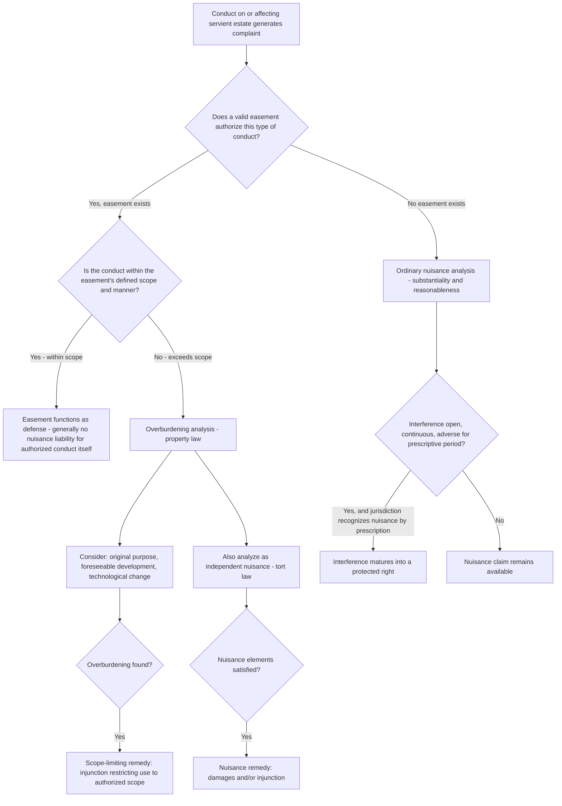

## Interaction Between Nuisance and Easement Rights

### Overview

Nuisance and easement law are conceptually distinct but frequently intersect: an easement holder's exercise of their rights can itself generate a nuisance affecting the servient owner or third parties, an easement can be used defensively to justify conduct that would otherwise be actionable as a nuisance, and disputes over the *scope* of an easement often blur into nuisance-style reasonableness analysis. This topic examines the doctrinal seams where these two bodies of property and tort law meet — a recurring source of litigation wherever a recorded property right (the easement) collides with the common-law duty not to unreasonably interfere with a neighbor's use and enjoyment of land.

---

### Conceptual Distinction as a Starting Point

**Easements**

- An easement is a nonpossessory property interest granting the holder (dominant estate) a right to use land owned by another (servient estate) for a specified purpose — access, utility lines, drainage, light and air, conservation restrictions, and so on.
- Easements are created by express grant, implication, necessity, prescription, or estoppel, and their scope is fixed (though not always precisely) by the instrument creating them, by the circumstances of an implied easement, or by the historical pattern of use for a prescriptive easement.

**Nuisance**

- Nuisance, as covered elsewhere in this chapter, is a tort doctrine addressing unreasonable interference with the use and enjoyment of land, independent of any specific grant of rights — it applies by default to any landowner's or possessor's conduct, easement holder or not.

**The Key Tension**

- Holding a valid easement does not, by itself, immunize the holder from nuisance liability for the *manner* in which the easement is exercised. An easement defines *that* a use is permitted and generally *what kind* of use is permitted; it does not automatically authorize an unreasonable, negligent, or excessive manner of exercising that use that independently satisfies the elements of nuisance.

---

### Easement Exercise as a Source of Nuisance Liability

**General Rule: Reasonable Exercise Required**

- The dominant estate holder must exercise easement rights in a manner that is reasonable and does not impose an unreasonable burden on the servient estate beyond what the easement's terms and purpose contemplate. Restatement (Third) of Property (Servitudes) § 4.10 provides that unless the terms of the servitude (easement) determine otherwise, the manner, frequency, and intensity of use may change over time to take advantage of developments in technology and to accommodate normal development of the dominant estate, but not so as to impose an unreasonable burden on the servient estate.
- If the manner of exercise (excessive noise, traffic volume far beyond original contemplation, hours of use, intensity of use) exceeds what the easement's scope reasonably permits *and* independently satisfies the substantiality/unreasonableness elements of nuisance, the servient owner (or an affected third party) may have both a scope-of-easement claim and a nuisance claim.

**Overburdening/Overuse as the Doctrinal Bridge**

- "Overburdening" the servient estate — using an easement beyond its intended scope or in a manner and intensity not contemplated at creation — is the primary doctrinal concept connecting easement scope disputes to nuisance-style reasoning. Courts assessing overburdening often examine factors functionally similar to nuisance's reasonableness balancing: the nature and purpose of the original grant, changes in use over time, technological developments, and the burden imposed relative to what was reasonably anticipated.
- A classic fact pattern: an easement granted for "ingress and egress" to serve a single residence is later used to access a newly built 50-unit subdivision. Even if literally "ingress and egress" continues, the dramatically increased traffic volume, noise, and wear may both overburden the easement (a property-law claim, potentially limiting the easement's use to something closer to its original scope) and constitute a nuisance to the servient owner or nearby residents (a tort claim allowing damages or injunctive relief).

**Third Parties Affected by Easement Use**

- Nuisance claims arising from easement exercise are not limited to the servient owner — neighboring landowners who are not party to the easement at all can bring nuisance claims against the dominant estate holder if the manner of use unreasonably interferes with their separate use and enjoyment (e.g., a private road easement used for heavy trucking generating noise and dust affecting homes along the route, not just the servient parcel itself).

---

### Easement as a Defense to Nuisance

**Express Authorization Within Scope**

- Where an easement expressly authorizes a particular use (e.g., a recorded easement permitting operation of a specific type of facility, or an avigation easement permitting aircraft overflight noise), the easement functions as a defense to a nuisance claim *for conduct within the easement's defined scope*, because the servient owner (or their predecessor) affirmatively granted the right to engage in that conduct — conceptually similar to consent as a defense in tort law generally.
- Avigation easements are a prominent real-world example: airports and municipalities frequently acquire avigation easements over land near runways specifically to establish a legal right to generate aircraft noise and overflight that would otherwise support a nuisance or inverse condemnation claim, following the logic of cases like *United States v. Causby*, 328 U.S. 256 (1946) (recognizing that low-altitude overflights can constitute a taking of an air easement over private land, which prompted the subsequent practice of acquiring avigation easements defensively).

**Scope Limits on the Defense**

- The defense holds only within the easement's actual scope — an easement authorizing a specific use does not authorize an unreasonably excessive or negligently conducted version of that use. An avigation easement permitting overflight at a certain altitude and frequency does not necessarily immunize negligent, excessively low, or off-pattern flights that exceed the easement's terms.
- Similarly, a utility easement authorizing power lines does not necessarily immunize the utility from nuisance liability for unrelated harms (e.g., excessive vegetation clearing beyond the easement's reasonable maintenance needs, or stray voltage issues) that go beyond what the easement's grant reasonably contemplated.

---

### Prescriptive Easements and Nuisance: A Doctrinal Overlap

**Nuisance by Prescription**

- In some jurisdictions, a nuisance maintained openly, notoriously, continuously, and adversely for the statutory prescriptive period can itself ripen into a prescriptive *right* to continue the interference — structurally, this converts what would otherwise be an ongoing nuisance into something resembling a prescriptive easement to maintain the offending condition.
- This is analytically close to (and sometimes explicitly analyzed as) the acquisition of a prescriptive easement, since both doctrines require open, continuous, adverse use for the statutory period, and both result in the "wrongful" conduct becoming a legally protected property right that runs with the land.
- Not all jurisdictions recognize nuisance by prescription, and courts that do apply it narrowly, often requiring the nuisance to have been continuously and consistently objectionable (not merely intermittent or variable in intensity) throughout the prescriptive period, since a change in degree or character can restart the clock.

---

### Light, Air, and View Easements — A Special Interaction Point

- At common law, there is generally no inherent right to light, air, or view absent an express easement — a landowner ordinarily cannot maintain a nuisance claim merely because a neighbor's new construction blocks sunlight or view (the traditional "ancient lights" doctrine was rejected in most U.S. jurisdictions).
- Where an express easement for light, air, or view has been created (increasingly common through solar access easements enacted under state solar rights statutes, or negotiated view easements in planned developments), interference with that easement is analyzed as a property rights violation (breach of the easement) rather than, or in addition to, a nuisance claim — illustrating how an easement can create a legal right (freedom from obstruction) that nuisance law alone does not provide.
- [Inference] Because solar access and view easement statutes and their interaction with nuisance principles vary significantly by state, and because this is a comparatively less-litigated area than traditional overburdening or avigation easement disputes, the precise doctrinal treatment in a specific jurisdiction should be verified rather than assumed to follow a uniform national pattern.

---

### Comparison Table

| Scenario | Governing Framework | Typical Claim |
| --- | --- | --- |
| Easement holder uses right within its scope, servient owner objects to inherent character of authorized use | Easement as defense (consent-like) | No nuisance liability if truly within scope |
| Easement holder exceeds scope (increased intensity, changed use, expanded traffic) | Overburdening (property law) + nuisance (tort law) | Both claims may be available |
| Easement use harms a third party outside the servient/dominant relationship | Nuisance (tort law) primarily | Nuisance claim by affected third party |
| No easement exists, but interference has continued openly for the prescriptive period | Nuisance by prescription (where recognized) | Interference becomes a protected right |
| Express light/air/view easement exists and is obstructed | Breach of easement (property law) | Property claim, distinct from ordinary nuisance |

---

### Analytical Framework (svg_diagram)

---

### Practical Example

A rural parcel is burdened by a recorded 20-foot-wide easement granting the neighboring parcel "a right of ingress and egress for agricultural purposes." Over 30 years, the dominant estate is subdivided and developed into a 40-home residential community, and the easement road is now used for daily residential traffic, school buses, and delivery trucks at volumes far exceeding anything contemplated by the original agricultural-access grant.

- **Overburdening claim**: The servient owner may argue the easement's scope — "agricultural purposes" — does not encompass dense residential traffic, and seek to limit the easement's use to something consistent with its original agricultural purpose, or seek compensation/relocation given the dramatically changed character of use.
- **Nuisance claim**: Independent of the scope question, the servient owner (and potentially other neighbors along the road) may bring a nuisance claim based on the volume, noise, dust, and safety impact of the traffic — arguing that even if some increased use is within the easement's evolving scope under Restatement § 4.10's technological-change principle, the intensity now unreasonably burdens the servient estate.
- **Likely outcome structure**: A court might find the easement's scope has not been technically exceeded in kind (ingress/egress remains the use), but that the *intensity* of use constitutes both an overburdening (limiting future intensification) and, if sufficiently severe, an independent nuisance warranting damages or a negotiated resolution (e.g., relocation of the easement, contribution to road maintenance, or use restrictions by time of day) — echoing the equitable, cost-allocating approach seen in cases like *Spur Industries* for analogous land-use-conflict problems.

---

### Key Points

- Holding a valid easement does not categorically immunize the holder from nuisance liability — the manner, intensity, and character of the easement's exercise must remain reasonable, and conduct exceeding the easement's scope can trigger both an overburdening claim (property law) and a nuisance claim (tort law) simultaneously.
- Restatement (Third) of Property (Servitudes) § 4.10 permits reasonable evolution of an easement's manner and intensity of use over time (accommodating technological change and normal development) but not to the point of imposing an unreasonable burden on the servient estate — language that closely parallels nuisance's reasonableness balancing.
- Easements can function as a defense to nuisance for conduct genuinely within their scope (illustrated by avigation easements addressing aircraft overflight liability post-*Causby*), but the defense does not extend to conduct exceeding the easement's authorized manner or intensity.
- Nuisance by prescription and prescriptive easements share nearly identical elements (open, continuous, adverse use for the statutory period), and in jurisdictions recognizing the former, a long-maintained nuisance can effectively convert into a protected property right functionally equivalent to an easement.
- [Inference] Because overburdening doctrine, nuisance-by-prescription recognition, and the treatment of light/air/view easements all vary meaningfully across states, and because fact patterns combining easement scope disputes with nuisance claims are highly fact-sensitive, practitioners should expect significant jurisdiction-specific variation rather than a single uniform national rule governing this intersection.

---

### Related Topics

- Overburdening and Misuse of Easements: Scope Limitation Remedies
- Restatement (Third) of Property (Servitudes) § 4.10 and Evolving Easement Use
- Avigation Easements and *United States v. Causby*
- Prescriptive Easements: Elements and Overlap with Nuisance by Prescription
- Solar Access and View Easement Statutes
- Private Nuisance Doctrine: Elements and Reasonableness Balancing
- Termination and Modification of Easements (Abandonment, Merger, Changed Conditions)
- Servient Estate Owner's Rights and Remedies Against Easement Misuse