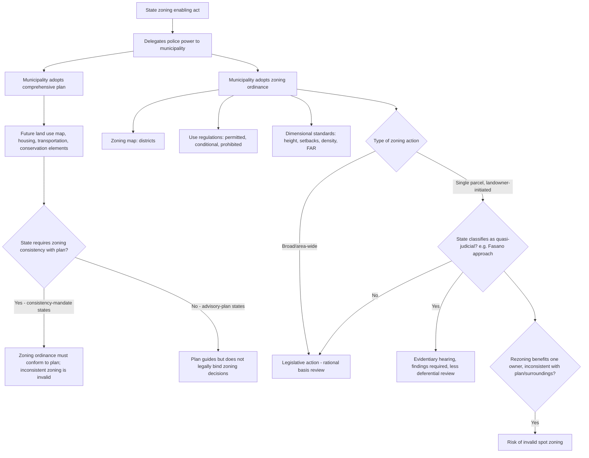

## Zoning Ordinances and Comprehensive Plans

### Overview

Zoning ordinances and comprehensive plans are the two foundational instruments of local land use regulation in the United States. The comprehensive plan (also called a general plan or master plan) is a long-range, policy-level document articulating a municipality's goals for future growth, land use patterns, infrastructure, and community character. The zoning ordinance is the legally binding regulatory instrument that implements those goals by dividing the municipality into districts and prescribing permitted uses, densities, and dimensional standards within each. Understanding their relationship — plan as policy blueprint, ordinance as enforceable law, and the contested question of how tightly the latter must track the former — is foundational to all subsequent land use regulation topics.

---

### The Comprehensive Plan

**Function and Content**

- A comprehensive plan typically addresses: land use (a future land use map designating areas for residential, commercial, industrial, and open space use), transportation/circulation, housing (often including affordable housing goals), public facilities and infrastructure, conservation and open space, and, in many states, additional mandated elements (e.g., noise, safety/hazard mitigation, environmental justice).
- The plan is prospective and general — expressed in policy language, goals, and maps rather than parcel-specific, enforceable rules. It is meant to guide, not directly regulate, land use decisions.

**Legal Status: Advisory vs. Mandatory**

- States diverge significantly on whether a comprehensive plan is merely advisory or legally binding on subsequent zoning decisions. This split is one of the most consequential doctrinal variables in American land use law:
  - **"Planning enabling" states requiring consistency**: A substantial number of states (led historically by California, Oregon, and Florida) require zoning ordinances and individual land use decisions to be **consistent** with the comprehensive plan, making the plan a legally enforceable constraint — a zoning decision inconsistent with the plan can be invalidated in court.
  - **States treating the plan as advisory only**: Other states follow the traditional model under the Standard State Zoning Enabling Act (SZEA, 1920s model legislation), where the plan is a policy guide that zoning should give "due consideration" to, but zoning need not strictly conform, and inconsistency alone does not invalidate a zoning action.
- [Inference] Because this consistency requirement is one of the most jurisdiction-dependent variables in land use law, and because states have modified their enabling acts at different times and to different degrees since the 1920s model legislation, practitioners must confirm the specific state's current statutory consistency requirement rather than assume either the mandatory or advisory model applies.

**Adoption Process**

- Comprehensive plans are typically adopted (and periodically updated, often on a mandated cycle in consistency-requiring states) by the local legislative body after planning commission review and public hearings, frequently with state-level review or certification requirements in states with strong consistency mandates (e.g., Oregon's statewide land use planning program under Senate Bill 100, administered through the Land Conservation and Development Commission).

---

### The Zoning Ordinance

**Source of Authority: Enabling Legislation**

- Municipalities possess no inherent zoning power; zoning authority is delegated by the state through a **zoning enabling act**, tracing back to the Standard State Zoning Enabling Act (SZEA) promulgated by the U.S. Department of Commerce in 1922, which became the template adopted (with local variation) by nearly all states.
- The enabling act typically authorizes municipalities to regulate: height, bulk, and placement of buildings; density of population; and the location and use of buildings, structures, and land for specified purposes — the core toolkit of conventional Euclidean zoning.

**Constitutional Foundation**

- *Village of Euclid v. Ambler Realty Co.*, 272 U.S. 365 (1926), upheld comprehensive zoning against a substantive due process challenge, establishing that zoning is a valid exercise of police power so long as it bears a rational relationship to legitimate public health, safety, and welfare objectives — the foundational case giving zoning its enduring nickname, "Euclidean zoning," referring to the cumulative, use-segregated district structure the ordinance in that case employed.
- The rational basis standard from *Euclid* remains the default standard of review for facial and as-applied substantive due process challenges to zoning classifications, though heightened scrutiny applies where a zoning ordinance implicates a fundamental right or suspect classification, or under specific doctrines like regulatory takings or exactions (*Nollan*/*Dolan*).

**Core Structural Components**

- **Zoning map**: divides the jurisdiction into geographic districts (residential, commercial, industrial, agricultural, mixed-use, special/overlay districts).
- **Use regulations**: specify permitted uses, conditional/special uses (requiring discretionary approval), and prohibited uses within each district.
- **Dimensional/bulk standards**: setbacks, height limits, lot coverage, floor-area ratio (FAR), minimum lot size, density limits (units per acre).
- **Administrative provisions**: procedures for variances, special/conditional use permits, rezonings (map amendments), and text amendments, along with the roles of the zoning board of adjustment/appeals, planning commission, and legislative body.

**Cumulative (Euclidean) vs. Non-Cumulative Zoning**

- **Cumulative zoning**: higher-intensity-protected districts (e.g., single-family residential) exclude lower uses, but lower-protected districts (e.g., industrial) permit all "higher" uses as well, creating a hierarchy where residential uses are allowed nearly everywhere while industrial uses are confined to industrial zones — the traditional Euclidean structure.
- **Non-cumulative (exclusive-use) zoning**: each district permits only its designated use category, excluding others entirely (e.g., an industrial district that excludes residential use even though residential is traditionally "higher" in the Euclidean hierarchy) — increasingly common in modern ordinances seeking genuine use separation (e.g., preserving industrial land from residential encroachment and resulting nuisance/right-to-operate conflicts).

---

### Zoning Amendments: Legislative vs. Quasi-Judicial Classification

**Why the Classification Matters**

- Whether a specific zoning action (particularly a rezoning) is characterized as **legislative** or **quasi-judicial** significantly affects the applicable procedure and standard of judicial review.
- **Legislative actions** (e.g., adoption of the original ordinance, broad text amendments, area-wide rezonings) are reviewed deferentially — courts apply something close to the *Euclid* rational basis standard, and legislative bodies need not provide the procedural protections (individualized notice, evidentiary hearing rights) required for adjudicative actions.
- **Quasi-judicial actions** (e.g., a rezoning of a single, specific parcel at the request of an individual landowner, in some states' characterization) may require more individualized due process protections — notice to affected neighbors, an evidentiary hearing, and a decision supported by findings — and are reviewed with less deference, sometimes for substantial evidence rather than mere rationality.
- States vary considerably on how they classify spot or single-parcel rezonings; some treat all rezonings as legislative regardless of parcel-specific character, while others (following the influential Oregon Supreme Court decision in *Fasano v. Board of County Commissioners of Washington County*, 507 P.2d 23 (Or. 1973)) treat parcel-specific rezonings as quasi-judicial, requiring the local government to justify the change against the comprehensive plan and existing conditions with something closer to an evidentiary record.

**"Spot Zoning" as a Related Limiting Doctrine**

- Spot zoning refers to a rezoning of a small parcel that benefits an individual landowner in a manner inconsistent with the comprehensive plan and out of harmony with the surrounding area's use pattern — courts in many jurisdictions will invalidate spot zoning as arbitrary or as an impermissible special favor, particularly in consistency-requiring states where the plan-inconsistency itself supplies the invalidating defect.
- Not every small-parcel or single-owner rezoning is invalid spot zoning; courts typically examine whether the rezoning serves a legitimate public purpose consistent with the plan and surrounding character, versus purely private benefit disconnected from any such purpose.

---

### Relationship and Interaction Diagram (svg_diagram)

---

### Practical Example

A city's comprehensive plan, last updated five years ago, designates a 40-acre parcel on the city's edge as "future low-density residential" on the future land use map, consistent with the surrounding single-family neighborhood. A developer petitions for a rezoning of just that parcel to a high-density multifamily and commercial classification.

- **In a consistency-mandate state** (e.g., California, Florida, Oregon): The rezoning petition would likely require either (a) demonstrating consistency with the existing plan designation (difficult, given the plan specifies low-density residential), or (b) a concurrent comprehensive plan amendment changing the future land use designation for that parcel *before or simultaneously with* the rezoning — since zoning inconsistent with the plan is subject to invalidation. The plan amendment itself may trigger additional public process and, in some states, state agency review.
- **In an advisory-plan state**: The city council could approve the rezoning notwithstanding the plan's low-density designation, so long as the decision survives rational basis review and is not successfully challenged as impermissible spot zoning — the plan's designation is persuasive but not legally dispositive.
- **Quasi-judicial classification consequence**: If the state follows the *Fasano* approach, the developer/city must be prepared to justify the rezoning with findings addressing the plan, the character of the surrounding area, and public need — a materially heavier procedural and evidentiary burden than a purely legislative, rational-basis rezoning would require.
- **Spot zoning risk**: Because the rezoning affects a single parcel, benefits one landowner, and (at least initially) conflicts with the surrounding low-density pattern and the plan designation, it presents a textbook fact pattern for a spot zoning challenge by neighboring residents, regardless of which state's consistency and legislative/quasi-judicial rules apply.

---

### Key Points

- The comprehensive plan is a long-range policy document; the zoning ordinance is the enforceable regulatory instrument — their legal relationship (whether zoning must be *consistent* with the plan or merely give it "due consideration") is one of the most significant, state-dependent variables in American land use law.
- Zoning authority is delegated, not inherent, tracing to the 1920s Standard State Zoning Enabling Act and validated against constitutional challenge by *Village of Euclid v. Ambler Realty Co.* (1926) under a rational basis standard.
- Whether a specific rezoning is treated as legislative (deferential rational-basis review) or quasi-judicial (evidentiary hearing, findings, less deferential review) significantly affects both procedure and the standard of judicial review, with states split on the classification approach (illustrated by Oregon's *Fasano* quasi-judicial model versus states treating all rezonings as legislative).
- Spot zoning doctrine functions as a judicial check on parcel-specific rezonings that primarily benefit an individual landowner in a manner disconnected from the comprehensive plan and surrounding area character.
- [Inference] Given substantial state-to-state variation in consistency requirements, legislative/quasi-judicial classification, and the specific mandated elements of comprehensive plans, general statements about "how zoning works" should be treated as describing common structural patterns rather than a uniform national rule, and confirmed against the specific state's enabling act and case law for any actual transaction or dispute.

---

### Related Topics

- *Village of Euclid v. Ambler Realty Co.* and the Constitutional Foundations of Zoning
- Plan Consistency Requirements: California, Oregon, and Florida Models
- *Fasano v. Board of County Commissioners* and Quasi-Judicial Rezoning Review
- Spot Zoning: Elements and Judicial Invalidation Standards
- Variances, Special/Conditional Use Permits, and Administrative Zoning Relief
- Cumulative vs. Non-Cumulative (Exclusive-Use) Zoning Structures
- Euclidean vs. Form-Based and Performance Zoning Alternatives
- Oregon's Statewide Land Use Planning Program (Senate Bill 100)