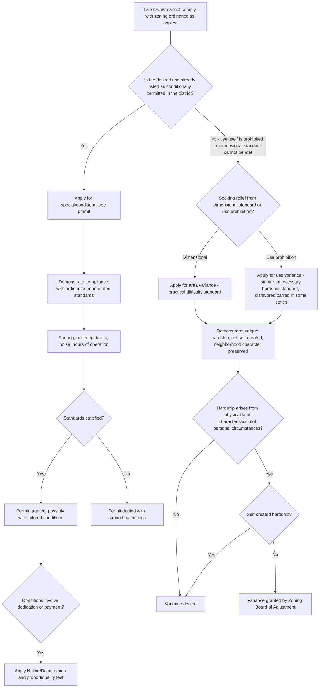

## Variances and Special Use Permits

### Overview

Variances and special use permits (also called conditional use permits) are the two principal administrative mechanisms by which a landowner can obtain relief from a zoning ordinance's literal requirements without amending the ordinance itself. Both are decided by an administrative body — typically a zoning board of adjustment/appeals (for variances) or the planning commission/board (for special/conditional uses) — rather than through the legislative rezoning process. They serve fundamentally different functions: a variance excuses noncompliance with a *dimensional or use restriction* due to unique hardship, while a special use permit authorizes a *use the ordinance already contemplates* as appropriate for the district, subject to case-specific conditions ensuring compatibility.

---

### Variances

**Function and Rationale**

- A variance is administrative relief from the strict, literal application of a zoning ordinance's dimensional or use requirements, granted where compliance would cause unnecessary hardship or practical difficulty peculiar to the specific property, and where granting relief will not undermine the ordinance's underlying purpose or harm the surrounding neighborhood.
- Variances exist as a "safety valve" to prevent zoning ordinances — necessarily drafted in general terms to apply across many parcels — from working an unconstitutional or inequitable result on an atypical lot (e.g., an oddly shaped, undersized, or topographically constrained parcel that cannot reasonably comply with standard setback or lot-size requirements).

**Area (Dimensional) Variances vs. Use Variances**

- **Area/dimensional variance**: relief from bulk, setback, height, lot coverage, or similar dimensional standards, while the underlying use remains one permitted in the district (e.g., permitting a home to be built five feet into the required side-yard setback due to an unusually narrow lot).
- **Use variance**: relief permitting a use of land otherwise prohibited in the district entirely (e.g., permitting a commercial use on a residentially-zoned lot).
- This distinction matters significantly: use variances are subject to a substantially higher burden of proof in most jurisdictions and are disfavored (some states prohibit use variances altogether, treating any change in permitted use as properly the subject of rezoning rather than administrative variance relief), because a use variance functions much closer to a de facto rezoning of a single parcel than a dimensional variance does.

**The Traditional "Unnecessary Hardship" Standard**

- Most zoning enabling acts and ordinances require the applicant to demonstrate:
  1. **Unique/unnecessary hardship** peculiar to the property (not shared generally by other properties in the district) — often requiring that the hardship arise from the physical characteristics of the land itself (shape, size, topography, or other unique conditions) rather than personal circumstances of the owner or self-created difficulty.
  2. **No reasonable use without the variance** (in the strictest use-variance formulations) or **practical difficulty** in complying with the dimensional standard (a lower bar typically applied to area variances) — some jurisdictions distinguish an "unnecessary hardship" standard for use variances from a lesser "practical difficulties" standard for area variances.
  3. **The variance will not alter the essential character of the neighborhood** or be contrary to the public interest.
  4. **The hardship is not self-created** — a hardship the owner created themselves (e.g., by voluntarily subdividing a lot into an substandard parcel) generally cannot support a variance.

**Procedural Framework**

- Variance applications are typically heard by a **Zoning Board of Adjustment (ZBA)** or **Board of Zoning Appeals (BZA)**, a quasi-judicial administrative body distinct from the legislative body and planning commission, following notice to neighboring property owners and a public hearing.
- Board decisions must generally be supported by specific findings addressing each element of the hardship standard; a denial or grant lacking adequate findings is vulnerable to reversal on judicial review (typically via a writ of certiorari or similar record-review proceeding, rather than a trial de novo).
- Judicial review of variance decisions is typically deferential (substantial evidence or arbitrary-and-capricious standard), reflecting the quasi-judicial, fact-intensive nature of the determination.

---

### Special Use Permits (Conditional Use Permits)

**Function and Rationale**

- A special or conditional use permit authorizes a use that the zoning ordinance itself identifies as potentially appropriate within a district, but which — due to its scale, intensity, or potential impact — requires case-by-case review to ensure compatibility with the surrounding area, subject to conditions tailored to the specific site and proposal.
- Unlike a variance (relief from what the ordinance prohibits), a special use permit implements what the ordinance already contemplates — the ordinance text itself lists the use as a conditionally permitted use in that district, subject to obtaining the permit.
- Common examples: religious institutions, schools, hospitals, gas stations, group homes, cell towers, and certain agricultural or extractive uses in residential or mixed-use districts — uses generally recognized as legitimate and needed within a community but with impacts (traffic, noise, scale) that warrant individualized review rather than as-of-right approval.

**Standard of Review and Findings**

- Because the ordinance already designates the use as potentially appropriate, courts and boards typically apply a presumption that the use is compatible with the district, subject to the applicant satisfying specific, ordinance-enumerated standards (e.g., adequate parking, buffering/landscaping, traffic impact, hours of operation, noise mitigation).
- The reviewing body's discretion is meaningfully narrower than pure legislative discretion — many jurisdictions require that a conditional use permit be granted if the applicant satisfies the ordinance's objective standards, with denial requiring specific findings that the standards are not met or that the use would create an undue adverse impact despite conditions — as opposed to variance denial, which can rest more squarely on a failure to prove hardship.
- Conditions attached to a special use permit approval must satisfy the same essential-nexus/rough-proportionality principles applicable to exactions generally (*Nollan v. California Coastal Commission*, *Dolan v. City of Tigard*) where the condition amounts to a dedication of property or a payment — conditions must be reasonably related to mitigating the specific impacts of the proposed use.

**Distinguishing Special Use Permits from Variances**

| Feature | Variance | Special/Conditional Use Permit |
| --- | --- | --- |
| What is being relieved/authorized | Excuses noncompliance with a dimensional or use restriction | Authorizes a use the ordinance already lists as conditionally appropriate |
| Underlying premise | The restriction, if literally applied, causes unique hardship | The use is presumptively compatible, subject to site-specific conditions |
| Standard | Unnecessary hardship / practical difficulty, uniqueness, no self-created hardship | Compliance with ordinance-enumerated standards (parking, buffering, traffic, etc.) |
| Typical deciding body | Zoning Board of Adjustment/Appeals | Planning Commission or Board (sometimes also ZBA, depending on ordinance) |
| Disfavored subtype | Use variances (some states prohibit entirely) | N/A — conditional uses are affirmatively contemplated by the ordinance |
| Conceptual analogy | Individualized exception/excuse | Individualized implementation of a pre-approved category |

---

### Common Pitfalls and Doctrinal Traps

**Self-Created Hardship**

- A landowner who purchases property already subject to a zoning restriction, or who creates a nonconformity through their own voluntary act (e.g., subdividing a conforming lot into two substandard lots), generally cannot rely on the resulting hardship to obtain a variance — courts widely hold that hardship must be inherent in the land, not manufactured by the owner's own conduct.

**"Personal Hardship" vs. "Property Hardship"**

- Hardship tied to the owner's personal circumstances (financial need, family situation, business preference) generally does not satisfy the variance standard, which requires hardship arising from the physical characteristics of the land itself — a frequently litigated distinction, since applicants often frame genuinely personal hardship in property-related language to fit the standard.

**Use Variance as De Facto Spot Zoning**

- Because a use variance permits an entirely different use than the district allows, granting one for a single parcel raises concerns functionally similar to spot zoning — an individualized administrative decision effectively rezoning one parcel without the legislative process, public plan-consistency review, or area-wide impact analysis that a formal rezoning would require. This concern is a significant part of why many jurisdictions apply a stricter standard to (or outright prohibit) use variances.

**Conditions Exceeding Permissible Scope**

- Special use permit conditions that are not reasonably related to mitigating the specific proposed use's impacts — or that function as a disguised exaction unrelated to the development's actual effects — risk invalidation under *Nollan*/*Dolan* takings principles if they require dedication of property, easements, or payment in lieu.

---

### Analytical Framework (svg_diagram)

---

### Practical Example

A landowner in a single-family residential district owns an unusually narrow, wedge-shaped lot inherited from a decades-old subdivision plat, making compliance with the ordinance's standard 15-foot side-yard setback impossible for any reasonably sized home. Separately, a church in the same district wishes to build a new sanctuary, a use listed in the ordinance as conditionally permitted in residential districts subject to standards addressing traffic, parking, and buffering.

- **The narrow lot situation**: This is a classic area variance fact pattern — the hardship (inability to build a reasonably sized home while complying with setbacks) arises from the lot's physical shape, predates the current owner's acquisition (assuming they did not create the narrow shape themselves), and a variance permitting a reduced setback would not alter the neighborhood's essential residential character. The owner would apply to the Zoning Board of Adjustment, demonstrating uniqueness, non-self-created hardship, and neighborhood compatibility.
- **The church situation**: Because the ordinance already lists religious institutions as a conditionally permitted use in the district, the church applies for a special use permit rather than a variance — the review focuses not on hardship but on whether the specific proposal (traffic generated by services, parking adequacy, buffering from adjacent homes) satisfies the ordinance's enumerated conditional-use standards. If the planning commission wishes to condition approval on the church dedicating a strip of land for a public sidewalk, that condition must satisfy *Nollan*/*Dolan*'s nexus and proportionality requirements connecting the dedication to the traffic/pedestrian impacts the new sanctuary actually generates.
- **A use variance contrast**: If a third landowner in the same district — with no unusual lot characteristics — sought permission to operate a full commercial retail store (a use nowhere contemplated as appropriate for the residential district, even conditionally), this would require a use variance, subject to the strictest standard (or categorical prohibition, depending on the state), precisely because it most closely resembles an individualized, administrative rezoning of a single parcel.

---

### Key Points

- Variances excuse noncompliance with existing restrictions based on property-specific hardship; special use permits authorize uses the ordinance already contemplates as appropriate, subject to case-specific compatibility conditions — the two serve structurally different functions despite both being individualized, non-legislative zoning relief mechanisms.
- The area/use variance distinction carries significant doctrinal weight: use variances face a stricter standard (or outright prohibition in some states) because they most closely resemble an unauthorized, individualized rezoning.
- The "unnecessary hardship" / "practical difficulty" standard requires hardship rooted in the physical characteristics of the land, not the owner's personal circumstances, and the hardship must not be self-created by the owner's own voluntary conduct.
- Special use permit conditions must be reasonably tailored to the specific impacts of the proposed use, and conditions involving property dedication or payment are independently subject to *Nollan*/*Dolan* takings scrutiny.
- [Inference] Because zoning enabling acts, the precise variance standard (unnecessary hardship vs. practical difficulty), and whether use variances are permitted at all vary meaningfully from state to state, the specific procedural and substantive requirements described here should be confirmed against the applicable state statute and local ordinance rather than treated as uniform nationwide.

---

### Related Topics

- Nonconforming Uses and Structures: Vested Rights and Amortization
- *Nollan v. California Coastal Commission* and *Dolan v. City of Tigard*: Exactions Analysis
- Zoning Ordinances and Comprehensive Plans: Structural Relationship
- Spot Zoning and the Legislative/Quasi-Judicial Rezoning Distinction
- Judicial Review Standards for Administrative Zoning Board Decisions
- Self-Created Hardship and the Merger Doctrine in Variance Law
- Floating Zones and Planned Unit Developments (PUDs) as Alternative Flexibility Tools
- Religious Land Use and Institutionalized Persons Act (RLUIPA) and Conditional Use Permits for Religious Institutions