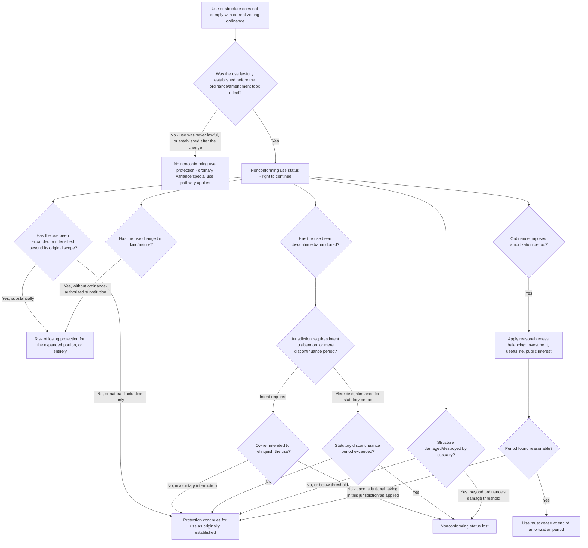

## Nonconforming Uses

### Overview

A nonconforming use is a use of land or a structure that was lawfully established before the enactment or amendment of a zoning ordinance, but which does not comply with the ordinance's requirements as subsequently adopted or changed. Nonconforming use doctrine addresses the central tension between two competing land use policy goals: protecting the vested reliance interests of landowners who lawfully established their use before the law changed, and allowing zoning to progressively achieve its planning goals by eventually eliminating uses inconsistent with the current regulatory scheme. This doctrine is sometimes summarized as the law's attempt to be "fair to the past" without permanently "handcuffing the future."

---

### Foundational Principle: Protection of Vested Rights

**Constitutional Basis**

- Nonconforming use protection rests fundamentally on due process and takings principles: retroactively prohibiting a lawfully established use without compensation or a reasonable transition period would raise serious constitutional concerns, since the landowner made an investment-backed decision in reliance on the law as it existed at the time.
- Nearly all zoning enabling acts and ordinances explicitly grandfather (protect) uses that were lawful when established, allowing them to continue despite subsequent nonconformity — this is a near-universal feature of American zoning law, distinguishing it from a pure prospective-only regulatory regime that would require full compliance from all properties immediately.

**Definitional Requirements**

- To qualify for nonconforming use protection, the use generally must have been:
  1. **Lawful when established** — the use complied with all applicable regulations (zoning and otherwise) at the time it began; a use that was already illegal when started (e.g., built without required permits) does not become a protected nonconforming use merely because zoning later changed.
  2. **Actually established/in existence** — mere intent to use land in a certain way, or preliminary steps short of actual commencement, is generally insufficient; the use must have been genuinely commenced (some jurisdictions require substantial construction or actual operational use, not merely obtaining a permit).
  3. **Continuous** — the use must not have been abandoned or discontinued for a legally significant period (addressed further below).

---

### Types of Nonconformities

- **Nonconforming use**: the underlying activity/use of the land itself does not conform (e.g., a commercial use in an area later rezoned residential-only).
- **Nonconforming structure**: the building's dimensional characteristics (height, setback, lot coverage) do not conform, even though the use itself may be entirely permitted (e.g., a residence built before setback requirements increased, now sitting closer to the lot line than currently allowed).
- **Nonconforming lot**: the parcel itself does not meet current minimum lot size or dimensional requirements, independent of any structure or use issue (e.g., a lot smaller than the current minimum, created before the minimum was established or increased).

---

### Doctrinal Limits: Expansion, Change, Abandonment, and Amortization

**Prohibition on Expansion/Intensification**

- The general rule is that nonconforming uses may **continue** but generally may **not be expanded, enlarged, or intensified** beyond their scope at the time the use became nonconforming — the protection is a right to continue the status quo, not a right to grow the nonconformity.
- Courts examine the nature, character, and scope of the use as it existed at the critical date, and expansion beyond that established scope typically loses protection for the expanded portion (and, in some jurisdictions, can jeopardize the entire nonconforming use status if the expansion is substantial).
- What constitutes impermissible "expansion" versus permissible "natural development" or ordinary business fluctuation within the existing use is frequently litigated and fact-intensive — courts often distinguish between a mere increase in the volume or intensity of an unchanged activity (sometimes permitted as natural growth) and an actual change in the kind or nature of the activity (generally not permitted).

**Prohibition on Change of Use**

- A nonconforming use generally cannot be changed to a different, even if arguably similar or "no more objectionable," nonconforming use without losing protection — most ordinances and courts require any change to be to a conforming use, or in some jurisdictions, permit change only to a use of equal or lesser nonconformity/impact under a specific ordinance provision authorizing such substitution.
- This restriction reflects the theory that nonconforming use protection is narrowly tied to the *specific* use that was lawfully established, not a general license to operate any nonconforming activity on the site indefinitely.

**Abandonment/Discontinuance**

- If a nonconforming use is abandoned or discontinued for a period specified by the ordinance (commonly ranging from six months to two years, varying by jurisdiction and ordinance), the nonconforming use status is typically lost, and the property must thereafter conform to current zoning.
- Jurisdictions differ on whether abandonment requires **intent** to abandon (a subjective test, requiring some showing the owner intended to relinquish the nonconforming right, not merely a period of non-use, which might result from circumstances like fire damage, renovation, or economic downturn) or whether **mere discontinuance for the statutory period** is sufficient regardless of intent (an objective test). This distinction is frequently outcome-determinative in litigated abandonment disputes.
- Involuntary interruption (e.g., destruction by fire, flood, or other casualty) is often treated more leniently than voluntary cessation, with many ordinances providing a specific rebuilding period following casualty loss before nonconforming status is deemed lost, though ordinances vary on the precise length of this window and whether reconstruction must replicate the exact prior footprint/use.

**Amortization: Forced Termination Over Time**

- Amortization is a distinct and more aggressive tool: rather than merely restricting expansion or requiring eventual voluntary discontinuance, an amortization provision sets a **fixed period of time** after which a nonconforming use must cease entirely, regardless of continued operation, on the theory that the owner has had a reasonable opportunity to recoup their investment during the amortization period.
- The seminal case upholding amortization against a takings/due process challenge is generally traced to *City of Los Angeles v. Gage*, 274 P.2d 34 (Cal. Ct. App. 1954), and the doctrine has been broadly (though not universally) accepted by state courts since, typically subject to a **reasonableness** requirement — courts assess whether the amortization period is reasonable in light of the nature of the use, the investment involved, and the useful life of any improvements, balancing the public interest in eliminating the nonconformity against the private hardship of forced closure.
- A minority of jurisdictions have rejected amortization as an unconstitutional taking without compensation, reasoning that forcing a lawfully established use to cease — even after a "reasonable" period — deprives the owner of an existing property right without the compensation the Takings Clause requires, unlike ordinary restrictions on future development which merely limit prospective rights.
- [Inference] Because amortization's constitutional validity, the factors courts weigh in assessing "reasonableness," and the typical length of amortization periods (which can range from months for signage to many years for buildings) all vary significantly by state and by the nature of the nonconforming use at issue, any application of amortization doctrine to a specific fact pattern requires confirming the current law of the controlling jurisdiction.

---

### Reconstruction After Damage or Destruction

- Most ordinances address what happens when a nonconforming structure is damaged or destroyed by casualty (fire, storm, etc.), typically drawing a line based on the percentage of value destroyed (e.g., "if damage exceeds 50% of replacement value, reconstruction must conform to current requirements; if less, the owner may rebuild the nonconforming structure as it was").
- This casualty-based termination is analytically distinct from abandonment (voluntary non-use) and from amortization (a deliberate legislative timetable) — it reflects a judgment that substantial physical destruction is an appropriate, less controversial trigger point for requiring conformity, since the investment-backed structure no longer exists to protect.

---

### Nonconforming Use vs. Related Concepts

| Concept | Trigger | Owner's Position |
| --- | --- | --- |
| Nonconforming use | Use predates zoning change, use itself doesn't conform | Protected right to continue, cannot expand/change |
| Variance | Use/dimension violates current ordinance from the start | Must affirmatively prove hardship to obtain relief |
| Special/conditional use | Use requires case-specific approval under current ordinance | Must satisfy ordinance-enumerated standards |
| Amortization | Legislatively fixed time limit imposed on existing nonconforming use | Right to continue expires on a schedule, regardless of hardship |

---

### Analytical Framework (svg_diagram)

---

### Practical Example

A small auto repair shop has operated continuously on a parcel since 1985, when the area was zoned commercial. In 2005, the city rezoned the area residential to encourage neighborhood redevelopment, but the shop continued operating as a protected nonconforming use. In 2020, the owner added a new bay to the building to service larger commercial trucks, roughly doubling the shop's footprint and adding a new category of heavy-vehicle service the shop had not previously performed. In 2023, a fire destroyed 60% of the structure's value.

- **Initial nonconforming status (1985–2005)**: The auto repair use was lawfully established under the original commercial zoning and became nonconforming only upon the 2005 rezoning — clearly qualifying for protection as a use lawfully established before the ordinance change.
- **2020 expansion analysis**: Doubling the footprint and adding heavy-vehicle service likely constitutes both an impermissible **expansion** (increased physical footprint and scope) and a potential **change in the nature of the use** (heavy-truck servicing versus standard auto repair) — this addition would likely not receive nonconforming use protection and could expose the owner to enforcement action requiring removal of the new bay or cessation of the truck-servicing activity, even though the original 1985 auto repair use remains protected.
- **2023 fire and reconstruction**: If the applicable ordinance sets a 50% damage threshold for requiring conformity upon reconstruction, the 60% destruction here would likely require the owner to rebuild in conformity with current (residential) zoning rather than reconstructing the nonconforming auto repair use — effectively terminating the nonconforming use through the casualty-based mechanism, independent of any abandonment or amortization analysis.
- **If the fire had been less severe (e.g., 30% damage)**: The owner would likely be permitted to restore the original, pre-2020-expansion nonconforming use (the lawfully protected 1985 scope), but not the 2020 unauthorized expansion, since that addition was never validly protected in the first place.

---

### Key Points

- Nonconforming use doctrine protects uses lawfully established before a zoning change took effect, reflecting due process and reliance-interest concerns, but the protection is narrowly limited to continuation of the use *as it existed* — expansion, intensification beyond natural fluctuation, and change in the nature of the use generally fall outside the protection.
- Abandonment/discontinuance doctrine turns critically on whether the jurisdiction requires subjective intent to abandon or applies an objective discontinuance-period test, a distinction that is frequently outcome-determinative in litigated disputes.
- Amortization — a fixed, legislatively-set termination date for a nonconforming use — remains a contested and jurisdiction-dependent tool, generally upheld subject to a reasonableness balancing test but rejected outright as an uncompensated taking in a minority of states.
- Casualty-based reconstruction limits (commonly keyed to a percentage-of-value-destroyed threshold) provide an independent, non-abandonment, non-amortization pathway by which nonconforming use protection can be lost.
- [Inference] Because the precise definitions of "expansion," the abandonment intent/discontinuance-period split, amortization's constitutional status, and casualty reconstruction thresholds are all governed by state and local law with meaningful cross-jurisdictional variation, any specific nonconforming use dispute requires close reference to the controlling ordinance's actual text and the relevant state's case law rather than reliance on these general doctrinal patterns alone.

---

### Related Topics

- Variances and Special Use Permits: Distinguishing Nonconforming Use Protection from Affirmative Relief
- Amortization of Nonconforming Uses and *City of Los Angeles v. Gage*
- Regulatory Takings Doctrine and Vested Rights in Land Use
- Zoning Ordinances and Comprehensive Plans: Structural Relationship
- Vested Rights Doctrine and Permit-Based Development Approvals
- Abandonment Standards: Subjective Intent vs. Objective Discontinuance Tests
- Casualty Loss and Reconstruction Rights for Nonconforming Structures
- Spot Zoning and Legislative Rezoning as Alternatives to Amortization