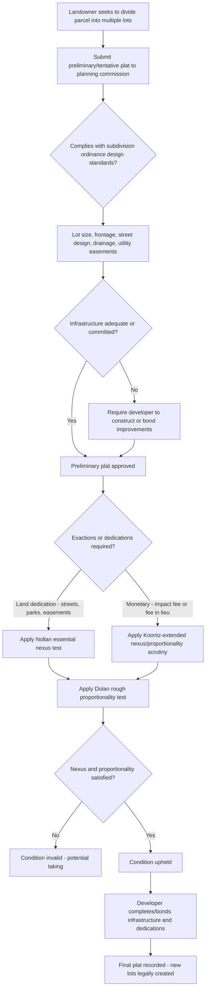

## Subdivision Regulations

### Overview

Subdivision regulations govern the process by which a single parcel of land is divided into two or more lots, typically for the purpose of sale, lease, or separate development. While zoning regulates *how* land may be used, subdivision regulation governs *how land is divided and platted* — controlling lot configuration, infrastructure adequacy, and the dedication of land for public purposes at the moment new parcels are created. Subdivision control is distinct from, but works alongside, zoning as a core tool of local land use regulation, and is often the point at which a municipality extracts infrastructure improvements and public land dedications from a developer as a condition of approval.

---

### Legal Authority and Purpose

**Source of Authority**

- Like zoning, subdivision control authority is not inherent in local government but is delegated by the state through enabling legislation — commonly modeled on the Standard City Planning Enabling Act (SCPEA), 1928 model legislation promulgated alongside the Standard State Zoning Enabling Act (SZEA), which together formed the template for much of 20th-century American land use law.
- Subdivision review is typically administered by the local **planning commission** (rather than the zoning board of adjustment, which handles variances) and results in either approval of a final recorded subdivision **plat** (map) or denial/conditional approval requiring modifications.

**Core Purposes**

- Ensuring new lots have adequate access (frontage on a public or approved private street), proper lot configuration, and compliance with minimum dimensional standards.
- Ensuring adequate public infrastructure — streets, drainage, water, sewer, utilities — either exists or will be provided concurrent with development, preventing the classic problem of "leapfrog" development outpacing infrastructure capacity.
- Facilitating dedication of land or payment of fees for public purposes generated by the new development — parks, schools, roads — connected to subdivision review through exactions and impact fee mechanisms (addressed below).
- Establishing a permanent, recorded public record (the plat) of lot boundaries, easements, and dedicated areas, providing title certainty for future purchasers and eliminating metes-and-bounds ambiguity in newly created parcels.

---

### The Subdivision Approval Process

**Preliminary (Tentative) Plat and Final Plat**

- Most jurisdictions employ a two-stage review process: a **preliminary (or tentative) plat**, reviewed by the planning commission for conceptual compliance with subdivision standards, infrastructure requirements, and any applicable comprehensive plan, followed by a **final plat**, which incorporates any required revisions and, upon approval, is recorded in the land records — the final plat is the document that legally creates the new lots.
- Between preliminary and final approval, developers typically must complete or bond for required infrastructure improvements (streets, utilities, drainage), since final plat approval and recording generally require either completed improvements or a financial guarantee (performance bond, letter of credit, or escrow) ensuring their completion.

**Design Standards**

- Subdivision ordinances typically prescribe: minimum lot size and frontage (often coordinated with the underlying zoning district's dimensional requirements), street design standards (width, grade, cul-de-sac length, connectivity requirements), stormwater management, utility easement provision, and sometimes lot orientation (e.g., solar access considerations) or open space set-asides.

**Vesting and the Timing Problem**

- A significant and recurring issue is **when** development rights "vest" — i.e., become fixed against subsequent changes in zoning or subdivision requirements. Approaches vary substantially by state: some jurisdictions recognize vesting only upon substantial construction in good-faith reliance on a validly issued permit (the traditional common-law rule), while others recognize vesting earlier, upon preliminary plat approval, submission of a complete application, or through a statutory vested rights framework.
- This timing question matters enormously in practice: a developer who has invested significant preliminary design and engineering costs, but not yet broken ground, may or may not be protected against an intervening zoning change or moratorium, depending entirely on the jurisdiction's vesting rule.

---

### Exactions and Dedications in the Subdivision Context

**Mandatory Dedications**

- Subdivision ordinances commonly require developers to dedicate land for streets, utility easements, and sometimes parks or school sites as a condition of plat approval — a longstanding and generally well-accepted practice where the dedication directly serves the new subdivision itself (e.g., internal streets).

**In-Lieu Fees and Impact Fees**

- Where dedicating actual land within the subdivision is impractical (e.g., a small subdivision too small to meaningfully contribute a park), many ordinances allow or require a **fee in lieu of dedication**, and more broadly, jurisdictions increasingly impose **impact fees** — one-time charges assessed on new development to fund the proportional share of infrastructure capacity (roads, schools, parks, water/sewer) the new development requires.

**Constitutional Constraints: Nollan/Dolan Applied to Subdivision Exactions**

- Subdivision exactions are subject to the same essential-nexus and rough-proportionality framework established in *Nollan v. California Coastal Commission*, 483 U.S. 825 (1987), and *Dolan v. City of Tigard*, 512 U.S. 374 (1994) — a dedication or fee condition must have an essential nexus to a legitimate government interest connected to the development's impact, and must be roughly proportional in nature and extent to that impact.
- *Koontz v. St. Johns River Water Management District*, 570 U.S. 595 (2013), extended *Nollan*/*Dolan* scrutiny to **monetary exactions** (not just land dedications) and to situations where a permit is **denied** because the applicant declined to agree to an exaction, closing a potential loophole where agencies might have argued the framework applied only to granted permits with attached conditions, not to denials predicated on a rejected condition.
- [Inference] Because *Koontz*'s extension of heightened scrutiny to monetary exactions and permit denials remains a comparatively recent development relative to the foundational *Nollan*/*Dolan* line, and because lower courts continue to work out its precise application to broad-based, legislatively formulaic impact fee schedules (as opposed to individualized, ad hoc permit conditions), the exact boundary between routine impact fee ordinances (generally reviewed more deferentially) and individualized exactions subject to full *Nollan*/*Dolan*/*Koontz* scrutiny is an area of ongoing doctrinal development that should be checked against current case law in the relevant jurisdiction.

---

### Subdivision Regulation vs. Zoning — Structural Comparison

| Feature | Zoning | Subdivision Regulation |
| --- | --- | --- |
| What it controls | Permitted use and dimensional standards for land as configured | The process of dividing land into new lots |
| Reviewing body | Zoning board (variances), planning commission/legislative body (rezonings) | Planning commission (plat approval) |
| Key document | Zoning ordinance and map | Subdivision ordinance and recorded plat |
| Typical trigger | Any use or development on existing lots | Creation of two or more new lots from one |
| Infrastructure role | Indirect (density limits affect infrastructure demand) | Direct (requires or bonds infrastructure concurrent with platting) |
| Common exaction context | Conditional use permit conditions | Plat approval dedications and impact fees |

---

### Special Mechanisms: PUDs and Cluster Subdivisions

**Planned Unit Developments (PUDs)**

- A PUD is a hybrid zoning/subdivision tool allowing a developer to propose an integrated development plan for a larger tract, often permitting flexibility from standard lot-by-lot dimensional requirements (varied lot sizes, mixed uses, clustered housing) in exchange for enhanced design review, open space set-asides, and a legislatively or administratively approved master plan governing the whole tract.
- PUDs are typically approved through a combined rezoning-and-subdivision-plan process, blending legislative zoning approval with the site-specific detail more characteristic of subdivision review.

**Cluster/Conservation Subdivisions**

- Cluster subdivision ordinances permit smaller individual lot sizes than conventional zoning would allow, in exchange for preserving a proportional amount of the tract as permanently protected open space (often through a conservation easement held by a land trust or the municipality) — achieving the same overall density as conventional subdivision while concentrating development and preserving contiguous open space, rather than spreading uniform-sized lots across the entire tract.

---

### Analytical Framework (svg_diagram)

---

### Practical Example

A developer proposes to subdivide a 30-acre parcel into 60 single-family lots. The planning commission's review identifies that the development will require a new internal street network, generate additional traffic on an adjacent county road, and increase demand on the local elementary school.

- **Internal infrastructure**: The developer is required to construct and dedicate the internal street network and utility easements serving the new lots — a straightforward, well-accepted dedication requirement directly tied to the subdivision's own internal functioning, unlikely to raise serious *Nollan*/*Dolan* concerns given the direct, proportional connection between the new lots and the streets serving them.
- **Off-site road improvement**: If the county conditions approval on the developer widening a segment of the adjacent county road to accommodate the traffic increase, this condition must satisfy *Dolan*'s rough proportionality requirement — the county would need to show the required improvement is roughly proportional to the traffic impact this specific subdivision generates, not simply require full-cost improvements addressing a broader county-wide traffic problem unrelated to this development's actual share.
- **School impact fee**: If the jurisdiction imposes a standardized, formula-based school impact fee applicable to all new residential subdivisions county-wide (calculated per-lot based on average student generation rates), this is more likely reviewed under a more deferential standard applicable to generally-applicable legislative fee schedules, though the precise doctrinal boundary here remains an evolving area following *Koontz*, and developers increasingly challenge such fees using *Koontz*-based nexus/proportionality arguments.
- **Cluster alternative**: If the underlying zoning permits a cluster/conservation subdivision option, the developer might instead propose 60 lots on smaller individual footprints, preserving 10 of the 30 acres as permanently protected open space (potentially via a conservation easement) — achieving the same lot count while reducing per-lot infrastructure footprint and potentially easing some exaction negotiations tied to open space and stormwater management.

---

### Key Points

- Subdivision regulation controls the division of land into new lots and the infrastructure and dedications accompanying that division, operating alongside but distinct from zoning's use-and-dimension regulation of land as already configured.
- The preliminary/final plat process, and the jurisdiction-specific rule governing when development rights vest against subsequent regulatory change, are critical practical variables affecting developer risk throughout the subdivision timeline.
- Subdivision exactions and impact fees are subject to the *Nollan*/*Dolan* essential-nexus/rough-proportionality framework, extended by *Koontz v. St. Johns River Water Management District* to monetary exactions and to permit denials predicated on a rejected condition.
- PUDs and cluster/conservation subdivisions represent flexible alternatives to conventional lot-by-lot subdivision, trading dimensional flexibility for enhanced design review or permanent open space preservation.
- [Inference] Because vesting rules, the precise scope of *Koontz*'s application to broad-based impact fee schedules, and subdivision ordinance design standards all vary considerably by state and even by individual municipality, general statements about subdivision approval timing and exaction validity should be verified against the specific jurisdiction's current enabling act, ordinance, and controlling case law before being relied upon in an actual transaction.

---

### Related Topics

- *Nollan v. California Coastal Commission* and *Dolan v. City of Tigard*: Exactions Analysis
- *Koontz v. St. Johns River Water Management District* and Monetary Exaction Scrutiny
- Vested Rights Doctrine and Development Approval Timing
- Zoning Ordinances and Comprehensive Plans: Structural Relationship
- Planned Unit Developments (PUDs) and Master Plan Approval Processes
- Cluster/Conservation Subdivisions and Open Space Preservation Mechanisms
- Impact Fees and Proportional Infrastructure Cost Allocation
- Land Trusts and Stewardship of Subdivision-Dedicated Conservation Easements