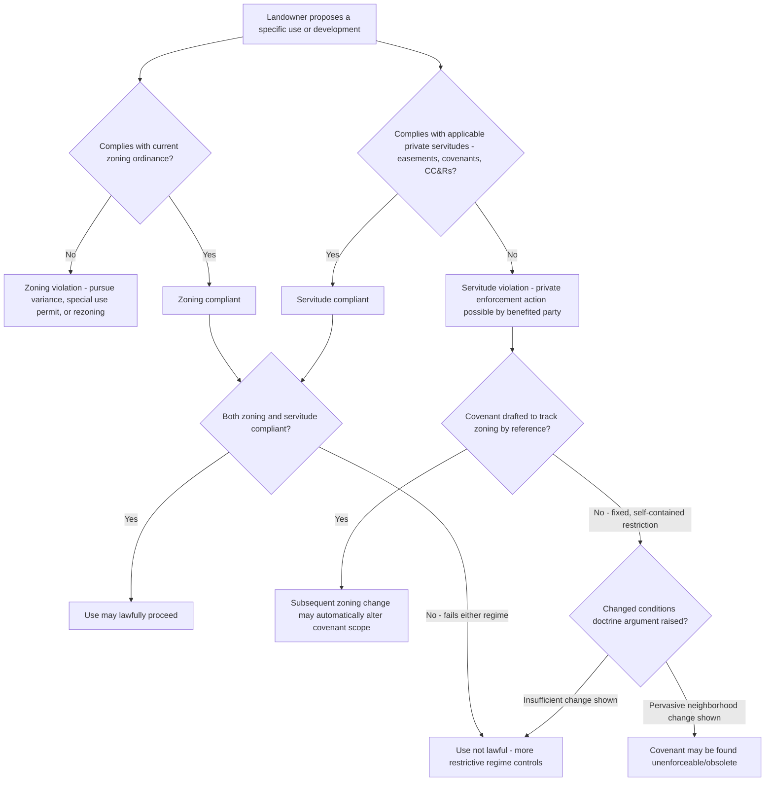

## Interaction of Zoning with Easements and Servitudes

### Overview

Zoning and private servitudes (easements, real covenants, and equitable servitudes) operate as two independent, overlapping systems of land use control — one public and regulatory, the other private and contractual. A landowner's actual use of land is constrained by both simultaneously, and the two systems do not always align: a use may be permitted by zoning yet prohibited by a private servitude, or permitted by a servitude yet prohibited by zoning. Understanding how courts resolve conflicts between these systems, and how each can affect the other's validity or enforceability, is essential to a complete picture of land use regulation.

---

### Conceptual Framework: Two Independent Systems

**Public Law (Zoning)**

- Zoning is a governmental exercise of police power, uniform within each district, publicly enacted through legislative process, and enforceable by the municipality through code enforcement, injunctive relief, or criminal/civil penalties.
- Zoning sets a *floor and ceiling* of permissible use at the district level — what the community, acting through its police power, has determined is acceptable land use in that area.

**Private Law (Easements, Covenants, Equitable Servitudes)**

- Servitudes are privately created, contractual or grant-based restrictions or rights, negotiated between specific parties (though they can run with the land to bind successors), enforceable by the private parties holding the benefit (dominant estate holders, covenant beneficiaries, homeowners' associations) rather than by the government.
- Servitudes are typically parcel-specific or subdivision-specific rather than uniform across a zoning district, and often impose *more restrictive* limitations than zoning requires (though they can also grant *affirmative rights*, like an easement, that zoning does not itself create).

**The Governing Principle: Independent, Cumulative Application**

- The near-universal rule is that zoning and private servitudes operate **independently and cumulatively** — a landowner must comply with *both*. Zoning compliance does not excuse violation of a private restrictive covenant, and conversely, having private authorization (an easement or covenant permitting a use) does not excuse noncompliance with zoning.
- This means the **more restrictive** of the two regimes effectively controls in any given situation: if zoning permits a duplex but a subdivision's restrictive covenants limit lots to single-family detached homes, the covenant controls (assuming it is otherwise valid and enforceable) even though zoning would allow more.

---

### Zoning Compliance Does Not Validate a Servitude Violation

**Restrictive Covenants More Restrictive Than Zoning**

- Homeowners' associations and subdivision developers frequently impose restrictive covenants (recorded as part of a declaration of covenants, conditions, and restrictions, or CC&Rs) that are more restrictive than the underlying zoning — minimum home size requirements exceeding zoning minimums, architectural review requirements, prohibitions on certain uses zoning would otherwise permit (home businesses, fencing types, accessory dwelling units), or density limits below the zoning-permitted maximum.
- A landowner cannot successfully defend against a covenant enforcement action by showing their proposed use complies with zoning — the covenant, as a separate private law obligation, must be independently satisfied (subject to the covenant's own validity requirements: proper creation, running with the land, no violation of public policy or the Fair Housing Act, and not having been abandoned or waived through non-enforcement).

**Zoning Variances Do Not Override Private Covenants**

- Obtaining a zoning variance permitting, for example, a reduced setback does not extinguish or override a private covenant imposing a stricter setback requirement — the variance addresses only the landowner's public law obligation; the private covenant remains independently enforceable by any party with standing to enforce it (typically other lot owners in the subdivision or the homeowners' association).

---

### Zoning Non-Compliance Not Excused by Servitude Authorization

**Conversely**

- An easement or covenant that *authorizes* a particular use does not exempt the use from zoning compliance. A recorded easement permitting a commercial use on a residentially-zoned parcel does not itself make that use lawful under zoning — the landowner would still need to obtain a rezoning, variance, or conditional use permit (as applicable) to lawfully conduct the use, regardless of the private authorization's validity as between the parties to the easement.
- This distinction matters practically in easement drafting and due diligence: the existence of a broadly worded easement does not itself confirm that the contemplated use is zoning-compliant, and title/zoning due diligence must be conducted separately.

---

### Points of Genuine Interaction: Where Zoning Affects Servitude Validity or Vice Versa

**Zoning Changes and Covenant Obsolescence**

- Courts in some jurisdictions recognize that a **changed conditions** doctrine can render a private restrictive covenant unenforceable where the character of the neighborhood has changed so substantially (sometimes evidenced by, or occurring alongside, a zoning change) that enforcing the original covenant would no longer serve its original purpose and would work an inequity on the burdened owner.
- This is distinct from, but sometimes intertwined with, zoning changes: a rezoning of surrounding parcels to commercial use, for example, might be cited as evidence supporting a changed-conditions argument to invalidate a residential-only covenant — though courts generally require the changed conditions to be pervasive throughout the restricted area, not merely at its edges, and a zoning change alone is not automatically sufficient to establish changed conditions for covenant purposes.

**Servitudes Referencing or Incorporating Zoning**

- Some restrictive covenants are drafted to track or incorporate zoning by reference (e.g., "no use other than as permitted under the R-1 zoning classification as it may be amended from time to time") — in such cases, a subsequent zoning change can automatically alter the scope of the private covenant as well, since the covenant's substantive content is defined by reference to the (mutable) zoning classification rather than fixed independently.
- This drafting approach is comparatively less common than fixed, self-contained restrictions, but where used, it creates a genuine mechanism by which public zoning changes directly alter private servitude obligations — a notable exception to the general independence principle.

**Conservation Easements and Zoning Overlays**

- Conservation easements (addressed in the "Conservation and Environmental Easements" chapter) frequently operate alongside zoning overlay districts serving similar protective purposes (e.g., agricultural preservation zoning, conservation subdivision overlays) — the two can be complementary (a conservation easement providing perpetual, privately-enforced protection layered atop a zoning overlay that could theoretically be legislatively amended or repealed) or can create redundant/overlapping restriction sets requiring careful coordination in drafting to avoid conflicting requirements.

**Zoning's Effect on Easement Scope (Overburdening Analysis)**

- As discussed in the easement/nuisance interaction context, courts assessing whether an easement's use has been impermissibly expanded ("overburdened") sometimes consider the zoning classification and permitted density of the dominant estate as relevant evidence of what intensity of use was reasonably foreseeable at the time the easement was created — a zoning change permitting significantly higher density on the dominant estate can be cited (though not necessarily conclusively) as supporting an argument that increased easement use should be considered part of the "normal development" contemplated by Restatement (Third) of Property (Servitudes) § 4.10, or conversely, opposing owners may argue the zoning classification at the time of grant defines the relevant baseline against which later intensification should be measured.

---

### Standing and Enforcement Differences

| Feature | Zoning | Private Servitude |
| --- | --- | --- |
| Who enforces | Municipality (code enforcement, injunctive/penal action) | Private parties with standing (dominant estate holder, HOA, benefited lot owners) |
| Basis of authority | Police power, delegated by state enabling act | Contract/property law (grant, covenant, or implied servitude) |
| Uniformity | Applies uniformly within a zoning district | Often parcel- or subdivision-specific, individually negotiated or declared |
| Amendment mechanism | Legislative process (ordinance amendment, rezoning) | Private amendment per the servitude's own terms (often requiring supermajority lot owner consent for CC&Rs) |
| Can be waived by non-enforcement | Generally no defense to municipal enforcement (though laches/equitable estoppel arguments exist in limited circumstances) | Yes — private servitudes can be lost through abandonment, waiver, or acquiescence from a pattern of non-enforcement |

---

### Analytical Framework (svg_diagram)

---

### Practical Example

A subdivision's recorded CC&Rs, adopted in 1978, restrict all lots to "single-family detached residential use only, no home occupations of any kind." The current zoning ordinance for the district permits single-family residential use and, since a 2015 amendment, also permits accessory dwelling units (ADUs) and limited home-based businesses as of right. A lot owner wishes to build an ADU and operate a small home consulting business from it.

- **Zoning compliance alone is insufficient**: Even though both the ADU and the home business are now zoning-compliant as of right under current zoning, this does not override the CC&Rs' independent, more restrictive private prohibition — the owner cannot rely on zoning compliance as a defense to a CC&R enforcement action brought by the HOA or other benefited lot owners.
- **Changed conditions argument**: The owner might attempt to argue that the neighborhood's character has changed substantially since 1978 (e.g., if the surrounding area has significantly redeveloped or transitioned) such that the CC&R restriction is obsolete — but this argument requires evidence of pervasive changed conditions throughout the restricted subdivision itself, not merely that zoning law has since liberalized elsewhere; a zoning amendment permitting ADUs city-wide, standing alone, is unlikely to be sufficient evidence of the kind of neighborhood-specific changed conditions courts typically require to invalidate a covenant.
- **Practical resolution**: Absent a successful changed-conditions argument or an amendment to the CC&Rs (typically requiring a supermajority vote of lot owners under most declarations), the owner's most viable path is a private one — seeking a CC&R amendment or an individual waiver/variance from the HOA — since the zoning liberalization, however favorable, does not itself resolve the private law obstacle.

---

### Key Points

- Zoning and private servitudes are independent, cumulative regimes — compliance with one does not excuse noncompliance with the other, and the more restrictive of the two effectively governs actual permitted use.
- Private covenants can impose limitations stricter than zoning (commonly seen in HOA-governed subdivisions), and courts generally require independent satisfaction of both, subject to each regime's own separate defenses and validity requirements.
- Genuine interaction points exist primarily where covenants are drafted to reference zoning classifications directly (making them mutable alongside zoning changes), where changed-conditions doctrine is invoked (sometimes citing zoning changes as evidence, though rarely as sufficient alone), and where zoning-permitted density on a dominant estate informs overburdening analysis for an adjoining easement.
- Enforcement mechanisms and defenses differ significantly: zoning is municipally enforced with limited waiver/estoppel defenses, while private servitudes are enforced by benefited private parties and are subject to a broader range of equitable defenses including abandonment, waiver, and acquiescence.
- [Inference] Because the changed-conditions doctrine's precise evidentiary threshold, the enforceability of covenants that facially conflict with fair housing or other public policy constraints, and the treatment of covenants referencing zoning by incorporation all vary by state, the interaction analysis here describes general structural patterns that should be verified against the specific jurisdiction's current covenant and zoning case law for any actual dispute.

---

### Related Topics

- Restrictive Covenants and Equitable Servitudes: Creation, Running with the Land, and Enforcement
- Changed Conditions Doctrine and Covenant Obsolescence
- Overburdening and Misuse of Easements: Scope Limitation Remedies
- Homeowners' Associations: Governance, CC&R Amendment, and Enforcement Powers
- Zoning Ordinances and Comprehensive Plans: Structural Relationship
- Fair Housing Act Constraints on Restrictive Covenants and Zoning
- Conservation Easements and Complementary Zoning Overlay Districts
- Abandonment, Waiver, and Acquiescence as Defenses to Covenant Enforcement