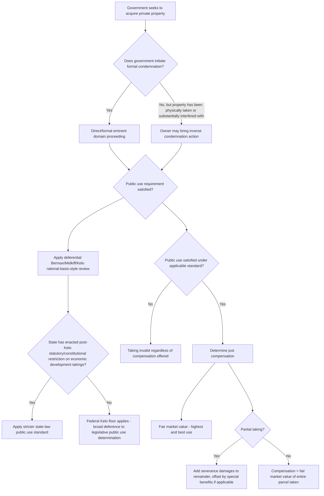

## Constitutional Basis for Eminent Domain

### Overview

Eminent domain is the sovereign power of government to take private property for public use, subject to the payment of just compensation. Unlike zoning or regulatory restrictions, which limit how property may be used without transferring title, eminent domain effects an actual, formal transfer of ownership (or a lesser property interest, such as an easement) from the private owner to the government or its designated grantee. This topic addresses the constitutional source and structure of that power — where it comes from, what constraints the Constitution imposes on its exercise, and how those constraints have been construed by the courts.

---

### The Takings Clause: Textual Foundation

**Fifth Amendment**

- The Takings Clause provides: "nor shall private property be taken for public use, without just compensation." This clause is the final clause of the Fifth Amendment, following the Due Process Clause, and textually operates as a **limitation** on an already-existing power rather than an affirmative grant of power — the power of eminent domain itself is understood as an inherent attribute of sovereignty, and the Fifth Amendment does not create it but constrains its exercise.
- Three distinct requirements are embedded in the clause's text: (1) the taking must be for **public use**; (2) **just compensation** must be paid; and (3) the compensation requirement applies specifically to "private property" — meaning the government's authority to take property at all is presupposed, with the constitutional focus on the conditions under which that taking is permissible.

**Incorporation Against the States**

- The Takings Clause originally applied only to the federal government. It was incorporated against the states through the Fourteenth Amendment's Due Process Clause in *Chicago, Burlington & Quincy Railroad Co. v. City of Chicago*, 166 U.S. 226 (1897), which held that a state's taking of private property without just compensation violates due process — making the just compensation requirement binding on state and local governments as well as the federal government, notwithstanding the Fifth Amendment's original application only to federal action.

---

### The Inherent Sovereign Power Doctrine

**Eminent Domain as Attribute of Sovereignty, Not a Delegated Grant**

- Unlike the enumerated powers of Congress (e.g., the Commerce Clause) or the police power delegated to states through their own constitutions and to municipalities through enabling legislation, eminent domain is generally understood as an inherent power possessed by any sovereign government — it does not require an affirmative constitutional grant to exist, and the Takings Clause functions purely as a restraint on its exercise, not its source.
- State governments possess their own inherent eminent domain power under state sovereignty principles, exercised subject to both the federal Takings Clause (via incorporation) and typically a parallel (sometimes more protective) state constitutional takings provision.
- Local governments, public utilities, railroads, and certain private entities exercising a public function (subject to specific statutory delegation) may be granted eminent domain authority by the state legislature, since these entities do not possess the inherent sovereign power themselves and require an affirmative delegation to exercise it.

---

### The Public Use Requirement

**Historical Narrow View**

- Early and mid-20th-century doctrine tended toward requiring that condemned property be put to genuine use *by* the public (a highway, a public building, a park) or at least made available for public use in a direct, literal sense.

**Expansion to "Public Purpose"**

- *Berman v. Parker*, 348 U.S. 26 (1954), significantly broadened the public use standard, upholding the use of eminent domain for urban renewal/slum clearance even though condemned property was subsequently transferred to private redevelopers, on the theory that eliminating blight served a broader public purpose and that courts should defer substantially to legislative judgments about what constitutes a public purpose.
- *Hawaii Housing Authority v. Midkiff*, 467 U.S. 229 (1984), extended this deference further, upholding a Hawaii land reform statute that condemned land from a concentrated group of large landowners and redistributed fee title to existing lessees, holding that redressing perceived oligopoly-driven land use market distortions constituted a valid public purpose, notwithstanding the direct transfer of condemned property from one private party to another.

**Kelo v. City of New London: The Modern Flashpoint**

- *Kelo v. City of New London*, 545 U.S. 469 (2005), is the most consequential and controversial modern public use case: the Supreme Court, 5–4, upheld the City of New London's use of eminent domain to condemn non-blighted private homes as part of an integrated economic development plan, transferring the land to private developers for a mixed-use commercial project intended to generate jobs and tax revenue, holding that economic development itself constitutes a valid "public use" under the highly deferential rational-basis-style review established in *Berman* and *Midkiff*.
- *Kelo* provoked substantial public and legislative backlash: in the years following the decision, a large majority of U.S. states enacted statutory or state constitutional reforms restricting the use of eminent domain for private economic development purposes, in many cases providing significantly more protection against economic-development takings than the federal Constitution, as interpreted by *Kelo*, requires.
- [Inference] Because the precise scope of state-level *Kelo* reforms (which range from narrow, blight-focused limitations to broad prohibitions on transferring condemned property to private parties) varies considerably by state and has continued to be litigated and amended since 2005, the actual practical availability of economic-development takings in any given state should be confirmed against that state's current constitutional and statutory eminent domain framework, since it may be substantially more restrictive than the federal constitutional floor established by *Kelo*.

**Justice Kennedy's Concurrence and Rational Basis Review**

- Justice Kennedy's concurrence in *Kelo* suggested that a more searching (though still deferential) review might be appropriate where a taking appears to primarily favor a specific, identifiable private beneficiary — a middle-ground position that has been cited by some lower courts, though the *Kelo* majority opinion itself applied a broadly deferential standard to the city's comprehensive development plan as a whole.

---

### The Just Compensation Requirement

**"Fair Market Value" Standard**

- The dominant measure of just compensation is **fair market value** at the time of the taking — what a willing buyer would pay a willing seller, neither being under compulsion to buy or sell, with the property being put to its highest and best use (including reasonably probable future uses, not merely its current use).
- This standard has been criticized (though not displaced) as systematically undercompensating condemnees for genuinely subjective or non-market value (attachment to a longtime home or family business, relocation costs and disruption, goodwill in some jurisdictions for a taken business) — most jurisdictions supplement fair market value with statutory relocation assistance payments (e.g., under the federal Uniform Relocation Assistance and Real Property Acquisition Policies Act for federally-funded projects) rather than altering the constitutional fair-market-value baseline itself.

**Partial Takings and Severance Damages**

- Where only a portion of a parcel is condemned, just compensation typically includes not only the value of the portion taken but also **severance damages** — the diminution in value to the remaining (uncondemned) portion caused by the taking (e.g., loss of access, awkward remaining lot configuration, proximity to a newly constructed highway) — offset in some jurisdictions by any special benefits the remaining property receives from the project.

---

### Eminent Domain vs. Regulatory Takings — A Foundational Distinction

| Feature | Eminent Domain (Direct/Physical Taking) | Regulatory Taking |
| --- | --- | --- |
| Mechanism | Formal condemnation proceeding, title transfers | Regulation restricts use without formal condemnation |
| Government intent | Deliberate, affirmative acquisition | Often regulatory purpose unrelated to acquiring property |
| Compensation process | Built into the condemnation proceeding itself | Requires separate "inverse condemnation" or takings litigation by owner |
| Governing framework | Public use (*Kelo*/*Berman*/*Midkiff*) and just compensation (fair market value) | *Penn Central* balancing, *Lucas* categorical rule, *Nollan*/*Dolan* exactions |
| Owner's procedural posture | Defendant in condemnation action | Plaintiff must affirmatively sue (inverse condemnation) |

---

### Procedural Mechanics: Condemnation vs. Inverse Condemnation

**Direct Condemnation**

- The government initiates a formal legal proceeding, files a condemnation petition/complaint, and (in most jurisdictions) must first attempt good-faith negotiation for voluntary purchase before resorting to condemnation; many states also require a formal finding of public use/necessity, sometimes through a separate administrative or quasi-judicial "declaration of taking" process.
- Some jurisdictions permit "quick take" procedures allowing the government to take possession and begin using the property before final compensation is judicially determined, depositing an estimated amount with the court pending final valuation.

**Inverse Condemnation**

- Where the government has physically taken or so substantially interfered with property that a taking has effectively occurred, but has not initiated formal condemnation proceedings, the property owner may bring an **inverse condemnation** action, compelling the government to pay just compensation for a taking that has already occurred as a practical matter (this is the procedural vehicle through which most regulatory takings claims, discussed in a separate topic, are actually litigated).

---

### Analytical Framework (svg_diagram)

---

### Practical Example

A city wishes to assemble a several-block area of a downtown district — including some blighted properties and some well-maintained private homes and small businesses — to transfer to a private developer for a mixed-use redevelopment project projected to create jobs and increase the tax base.

- **Public use analysis**: Under the federal *Kelo* standard, this economic development rationale, pursued through a comprehensive, legislatively-adopted development plan (rather than an ad hoc, single-parcel transfer to benefit one private party), would likely satisfy the deferential federal public use requirement, even for the non-blighted properties within the project area, following *Kelo*'s specific holding on nearly identical facts.
- **State law overlay**: If the state has enacted post-*Kelo* eminent domain reform legislation prohibiting the use of eminent domain for economic development purposes absent a finding of blight on the specific parcel, the city would need to separately establish blight (parcel-by-parcel, in stricter statutory schemes) for the non-blighted homes and businesses, and might be unable to condemn them at all if the state's reform is sufficiently protective — illustrating how the practical outcome depends far more on state law than on the federal constitutional floor.
- **Compensation**: For any properties validly condemned, affected owners would be entitled to fair market value based on highest and best use (which might, notably, already reflect some enhancement from the anticipated redevelopment, subject to valuation rules addressing project-influence on value), plus relocation assistance under applicable state or federal relocation statutes, and severance damages for any owners losing only a portion of a larger holding.

---

### Key Points

- Eminent domain is an inherent sovereign power, not a power created by the Fifth Amendment; the Takings Clause instead constrains its exercise through the public use and just compensation requirements, applied to the states via Fourteenth Amendment incorporation (*Chicago, Burlington & Quincy R.R. v. City of Chicago*).
- The public use requirement has been progressively broadened from a literal "use by the public" standard toward a highly deferential "public purpose" standard, culminating in *Kelo v. City of New London*'s controversial extension to economic development takings — a decision that triggered widespread state-level statutory and constitutional reform providing protection beyond the federal constitutional minimum.
- Just compensation is measured by fair market value at the time of taking (based on highest and best use), supplemented in partial-taking cases by severance damages to the remainder parcel.
- The procedural distinction between direct condemnation (government-initiated) and inverse condemnation (owner-initiated, alleging a taking has already occurred) is foundational to understanding how eminent domain and regulatory takings claims are actually litigated.
- [Inference] Because the majority of U.S. states have enacted eminent domain reforms since *Kelo* that are more protective of property owners than the federal constitutional floor, and because these state-level frameworks vary considerably in scope and strength, the practical public use standard actually governing a specific taking is very likely to be the state-law standard rather than the more permissive federal *Kelo* baseline, and should be confirmed against current state law rather than assumed to track *Kelo* directly.

---

### Related Topics

- *Kelo v. City of New London* and Post-*Kelo* State Eminent Domain Reform
- Regulatory Takings Doctrine: *Penn Central*, *Lucas*, and the Parcel-as-a-Whole Rule
- Inverse Condemnation Procedure and Owner-Initiated Takings Claims
- Just Compensation Valuation: Fair Market Value, Severance Damages, and Relocation Assistance
- Exactions and the *Nollan*/*Dolan*/*Koontz* Framework
- *Berman v. Parker* and *Hawaii Housing Authority v. Midkiff*: The Public Purpose Doctrine's Origins
- Blight Designation and Urban Renewal Takings
- Physical vs. Regulatory Takings: Doctrinal and Procedural Distinctions