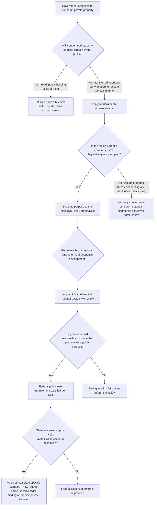

## The Public Use Requirement

### Overview

The public use requirement is the textual condition in the Fifth Amendment's Takings Clause limiting the exercise of eminent domain to takings "for public use." Of the Takings Clause's two operative constraints — public use and just compensation — public use has proven the more doctrinally contested, since it asks courts to police the *purpose* for which government may exercise its condemnation power, a question with significant separation-of-powers and federalism implications given the traditional judicial deference to legislative judgments about public benefit. This topic traces the doctrine's evolution from a narrow "use by the public" conception to the highly deferential "public purpose" standard that governs today, and the significant state-level legislative response that followed its most controversial modern application.

---

### Three Historical Conceptions of "Public Use"

**1. Narrow "Actual Use by the Public" Standard**

- The earliest and most restrictive conception required that condemned property actually be used by the general public in a direct, literal sense — a public road, a public building, a public utility corridor available to all — with the defining feature being that members of the public retained a legal right of access to or use of the condemned property itself.
- This narrow view substantially constrained the range of permissible takings, excluding transfers to private parties even where a broader public benefit might result.

**2. "Public Advantage" or "Public Benefit" Standard**

- A somewhat broader intermediate conception recognized that a taking could serve public use even without direct public access, so long as the resulting use conferred a general public advantage or benefit — for example, condemning land for a private railroad, where the public benefits from transportation service even though the railroad itself is privately owned and operated, and the public has no independent legal right to use the specific parcel taken beyond using railroad services generally.

**3. "Public Purpose" Standard (Modern, Dominant View)**

- The modern, dominant standard asks only whether the taking serves a legitimate **public purpose**, evaluated with substantial judicial deference to the condemning authority's legislative judgment — the property need not be used *by* the public at all, and can be transferred directly to a private party, so long as the overall purpose animating the taking (economic development, blight removal, land reform) is one the legislature could reasonably conclude serves the public interest.
- This is the standard that has generated the most significant controversy, since it collapses much of the distinction between "public use" and the broader "public welfare" purposes that justify the police power generally, raising the question of whether the public use requirement retains meaningful independent constraining force at all.

---

### Foundational Supreme Court Cases

**Berman v. Parker (1954)**

- *Berman v. Parker*, 348 U.S. 26 (1954), addressed a District of Columbia urban renewal program condemning an entire blighted area — including a specific, non-blighted department store within the project boundaries — for redevelopment, with condemned land subsequently transferred to private redevelopers.
- The Supreme Court unanimously upheld the taking, articulating a highly deferential standard: "the legislature, not the judiciary, is the main guardian of the public needs to be served by social legislation," and holding that once the legislature has determined an area is blighted and redevelopment serves the public interest, courts should not second-guess parcel-by-parcel whether every individual property within the project needed to be included — the comprehensive plan as a whole, not each constituent taking, is the relevant unit of public use analysis.
- *Berman* established both the broadened "public purpose" standard and the principle that courts evaluate the taking's purpose at the level of the overall government plan, not the individual property.

**Hawaii Housing Authority v. Midkiff (1984)**

- *Hawaii Housing Authority v. Midkiff*, 467 U.S. 229 (1984), addressed a Hawaii statute designed to break up a concentrated pattern of land ownership (a small number of landowners held title to a large majority of the state's land, leasing it to homeowners on long-term ground leases) by condemning fee title from landlords and transferring it directly to existing tenant-lessees.
- The Supreme Court unanimously upheld the statute, holding that regulating oligopoly and redistributing fee ownership to redress a perceived land market distortion constituted a valid public purpose — notably, this was a direct, private-party-to-private-party transfer with no intervening public use or ownership whatsoever, and the Court nonetheless applied the same highly deferential rational-basis-style review as in *Berman*, holding that "it is only the taking's purpose, and not its mechanics," that matters for public use analysis.

**Kelo v. City of New London (2005)**

- *Kelo v. City of New London*, 545 U.S. 469 (2005), is the case that brought the public purpose standard's full implications into sharp public focus: the City of New London condemned a group of private homes — none blighted, several well-maintained, including one owner's family home she had lived in her entire life — as part of a comprehensive, integrated economic development plan, transferring the land to private developers for a mixed-use commercial and office project intended to complement an adjacent Pfizer research facility and generate jobs and tax revenue.
- The Supreme Court, 5–4, upheld the taking, holding that economic development is a traditional and long-accepted function of government falling within the broad concept of public purpose recognized in *Berman* and *Midkiff*, and declining to adopt a categorical rule excluding economic development, or a heightened "reasonable certainty" standard for the public benefits actually materializing, from public use analysis.
- Justice O'Connor's dissent argued the decision effectively erased the distinction between "public" and "private" use altogether, warning that any property could now be taken and transferred to another private owner so long as the new owner put it to more economically productive use, since replacing a private owner with another private owner who generates more taxes or jobs describes virtually any private-to-private transfer imaginable.
- Justice Thomas's separate dissent argued for returning to something closer to the original, narrower "use by the public" conception, criticizing the public purpose standard as having no textual grounding in the Fifth Amendment's actual language.
- Justice Kennedy's concurrence, providing the fifth vote for the majority, suggested that a taking which on its face appears to primarily benefit a particular, identifiable private party (rather than being part of a genuinely comprehensive, unbiased development plan) might warrant a more searching form of rational basis review — a position not adopted by the majority opinion but subsequently cited by some lower courts and commentators as a potential doctrinal limiting principle.

---

### The Post-*Kelo* State Legislative Response

**Scale and Character of the Reaction**

- *Kelo* provoked an unusually broad and rapid bipartisan legislative reaction: the large majority of U.S. states enacted eminent domain reform legislation or state constitutional amendments in the years following the decision, restricting the use of eminent domain for economic development purposes to varying degrees.

**Range of Reform Approaches**

- **Blight-limitation reforms**: Some states restricted economic-development-motivated takings to genuinely blighted properties, requiring parcel-specific (rather than area-wide) blight findings.
- **Categorical prohibitions**: Other states enacted broader prohibitions on transferring condemned property to private parties for economic development purposes at all, subject to narrow exceptions (public utilities, common carriers).
- **Heightened procedural/evidentiary requirements**: Some reforms did not categorically prohibit economic development takings but imposed heightened judicial review, public use findings, or compensation requirements (e.g., above-fair-market-value compensation for owner-occupied residences) specifically for such takings.
- **No substantive change**: A minority of states made few or no substantive changes, leaving the *Kelo* federal floor as the operative practical standard.

**Doctrinal Significance**

- [Inference] Because the specific content and continued judicial interpretation of these post-*Kelo* state reforms vary considerably and have continued to develop since 2005, the practical public use standard actually applicable in any given state is very likely to diverge meaningfully from the federal *Kelo* floor, and this state-specific layer — not the federal constitutional minimum — typically governs whether a proposed economic development taking is actually lawful in practice.

---

### The Level-of-Generality Question: Individual Parcel vs. Comprehensive Plan

- A recurring doctrinal theme across *Berman*, *Midkiff*, and *Kelo* is that courts evaluate public use at the level of the government's **overall plan or program**, not by scrutinizing whether the taking of each individual, specific parcel was independently necessary or beneficial — a non-blighted store (*Berman*) or a well-maintained home (*Kelo*) can be validly condemned as part of a broader project even though, viewed in complete isolation, that specific parcel's inclusion might seem unnecessary to achieving the project's public purpose.
- This plan-level framing is central to why the public purpose standard operates so deferentially: it prevents courts from second-guessing individual inclusion/exclusion decisions within an otherwise legitimate, comprehensively-adopted public project, while simultaneously drawing criticism (echoed in the *Kelo* dissents) for making it very difficult for an individual condemnee to challenge their specific taking even where they can show no unique public benefit flows from including their particular parcel.

---

### Analytical Framework (svg_diagram)

---

### Practical Example

A state agency proposes to condemn a mixed group of parcels — a working farm, two single-family homes, and a small strip mall, none blighted — within a designated corridor to construct a public highway interchange, with adjacent parcels beyond the interchange footprint itself planned for transfer to a private logistics company to build a distribution center, justified as complementary economic development expected to follow from improved highway access.

- **The interchange parcels**: Condemnation of land actually needed for the highway interchange itself satisfies even the narrowest historical public use conception — direct use by the public (or a public transportation function) is squarely present, and this portion would be valid public use under any standard, including pre-*Berman* doctrine.
- **The distribution center parcels**: Condemnation of the additional parcels for transfer to the private logistics company presents a *Kelo*-type economic development taking — under the federal constitutional floor, this would likely be upheld as part of a comprehensive plan combining infrastructure and economic development purposes, assuming a genuine, non-pretextual comprehensive planning process (as opposed to an ad hoc favor to one specific company, which might trigger Justice Kennedy's concurrence-based concern).
- **State law override**: If the state has enacted a post-*Kelo* prohibition on transferring condemned property to private parties for economic development absent a parcel-specific blight finding, the distribution center parcels — none blighted — could not lawfully be condemned under state law, even though the federal Constitution as interpreted by *Kelo* would permit it; the agency would need to acquire those parcels through voluntary purchase rather than eminent domain.
- **Illustrates the core lesson**: The federal *Kelo* standard functions today primarily as a ceiling on how protective public use doctrine *must* be, not as a description of how protective it actually *is* in most states — the operative practical standard is overwhelmingly a matter of state constitutional and statutory law layered atop (and often well above) the federal floor.

---

### Key Points

- The public use requirement has evolved from a narrow "use by the public" standard through a "public advantage" intermediate conception to today's dominant, highly deferential "public purpose" standard, under which direct transfer of condemned property to another private party is constitutionally permissible so long as a legitimate public purpose animates the overall plan.
- *Berman v. Parker* and *Hawaii Housing Authority v. Midkiff* established the modern deferential framework and the principle that courts evaluate public use at the level of the government's comprehensive plan rather than parcel-by-parcel; *Kelo v. City of New London* extended this framework to economic development takings specifically, provoking the most significant state-level eminent domain legislative reform movement in modern U.S. history.
- The scale of the post-*Kelo* state reform movement means the federal constitutional public use floor is, in practice, frequently not the controlling standard — state constitutional and statutory reforms in the large majority of states impose meaningfully stricter requirements, particularly for economic-development-motivated takings.
- Justice Kennedy's *Kelo* concurrence, while not adopted by the majority, has been cited as a potential doctrinal foothold for heightened scrutiny where a taking appears to primarily and directly benefit one identifiable private party rather than serving a genuinely comprehensive public plan.
- [Inference] Because state-level public use standards vary so significantly in both scope and continuing judicial interpretation since 2005, and because the practical availability of economic development takings is now overwhelmingly governed by state rather than federal law, any analysis of whether a specific proposed taking satisfies the public use requirement should prioritize confirming the current, controlling state constitutional and statutory framework over relying on the federal *Kelo* standard alone.

---

### Related Topics

- Constitutional Basis for Eminent Domain: Sovereign Power and the Fifth Amendment
- Post-*Kelo* State Eminent Domain Reform: Blight-Limitation, Prohibition, and Procedural Models
- *Berman v. Parker* and *Hawaii Housing Authority v. Midkiff*: Foundational Public Purpose Cases
- Just Compensation Valuation: Fair Market Value, Severance Damages, and Relocation Assistance
- Blight Designation Standards and Parcel-Specific vs. Area-Wide Findings
- Inverse Condemnation Procedure and Owner-Initiated Takings Claims
- Regulatory Takings Doctrine: *Penn Central* and *Lucas*
- Justice Kennedy's *Kelo* Concurrence and Heightened Scrutiny for Identifiable Private Beneficiaries