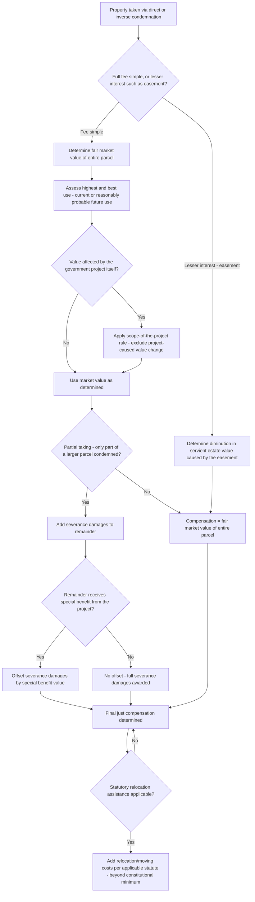

## Just Compensation Principles

### Overview

The Fifth Amendment's Takings Clause requires that private property taken for public use be accompanied by "just compensation." While the public use requirement addresses *whether* government may take property, just compensation addresses *how much* it must pay when it does. The core constitutional standard — fair market value — sounds deceptively simple but generates substantial doctrinal complexity in application: how to value unique properties, how to handle partial takings, how to treat project-related value changes, and how far compensation extends beyond the bare market price of the land itself.

---

### The Fair Market Value Standard

**Core Definition**

- Just compensation is measured by the property's **fair market value** at the time of the taking — the price a willing buyer would pay a willing seller, neither under compulsion to complete the transaction, with the property assumed to be exposed to the market for a reasonable period.
- This is an objective, market-based standard, not a subjective valuation of the property's worth to the particular owner — the Supreme Court has consistently held that the constitutional measure looks to market value, not to the owner's personal or sentimental attachment to the property.

**Highest and Best Use**

- Fair market value is assessed based on the property's **highest and best use** — not necessarily its current, actual use, but the most valuable use to which the property could reasonably and legally be put, considering physical adaptability, legal permissibility (zoning), and market demand.
- A property currently used for a lower-value purpose (e.g., a single-family home on land realistically suited and zoned for commercial redevelopment) may be valued at its higher commercial potential if that potential use is reasonably probable, not merely speculative — this "reasonable probability" standard is frequently litigated, since owners have an incentive to argue for speculative higher uses while condemning authorities have an incentive to limit valuation to current, conservative use.

**Timing of Valuation**

- Valuation is generally fixed as of the date of taking (which, depending on the jurisdiction's procedure, may be the filing of the condemnation action, the date of a "quick take" deposit, or the date possession transfers) — this timing matters because property values can fluctuate significantly during the often-lengthy condemnation litigation process, and the valuation date determines which market conditions apply.

---

### The "Project Influence" or "Scope of the Project" Rule

**The Core Problem**

- Government projects frequently affect the value of property within and near the project area before the actual taking occurs — a planned highway, for example, may depress the value of homes directly in its path (due to public knowledge of the impending condemnation) or inflate the value of adjacent land expected to benefit from improved access.

**The Rule**

- Under the widely applied "scope of the project" or "project influence" rule, just compensation excludes value changes (increases or decreases) attributable to the public project itself, for property that was within the reasonably foreseeable scope of the project from the outset — the owner is entitled to the value the property would have had absent the project's influence, not an artificially depressed value reflecting the government's own advance planning, nor an artificially inflated value reflecting anticipated project benefits that have not yet occurred.
- This rule prevents both government underpayment (condemning blighted-by-announcement property at its now-depressed value) and owner windfall (demanding compensation reflecting speculative future value the project itself will create).

---

### Partial Takings: Severance Damages and Special Benefits

**Severance Damages**

- Where only a portion of a larger parcel is condemned, just compensation includes not only the fair market value of the portion actually taken, but also **severance damages** — compensation for the diminution in value to the *remaining* (uncondemned) portion of the parcel caused by the taking itself (e.g., loss of road frontage or access, creation of an oddly shaped or unusable remainder, severance of the parcel from water rights or utility access, proximity effects from a newly constructed highway or facility).
- Severance damages are calculated by comparing the value of the remainder parcel immediately before the taking (as part of the whole) to its value immediately after the taking (standing alone, subject to the taking's effects).

**Special (or Offsetting) Benefits**

- Conversely, where the remaining parcel receives a **special benefit** from the project — distinct from the general benefit conferred on the broader community (e.g., a remainder parcel gaining valuable new highway frontage/access from the very road project that took part of the original tract) — many jurisdictions allow this special benefit to be offset against severance damages, and in some jurisdictions against the compensation for the portion taken as well, though jurisdictions vary on the precise offsetting rules and on distinguishing "special" from merely "general" community-wide benefits (which are generally not offsettable).

---

### What Just Compensation Does and Does Not Cover

**Covered (Constitutionally Required)**

- Fair market value of the property interest taken (fee simple, easement, leasehold, or other interest, valued according to the specific interest actually condemned).
- Severance damages to the remainder in partial takings, net of any offsettable special benefits.

**Generally Not Covered by the Constitutional Minimum (But Often Addressed by Statute)**

- **Relocation costs and business disruption**: The cost of physically moving, lost customer goodwill, and business interruption are generally not part of the constitutionally required fair market value measure, though most jurisdictions provide **statutory relocation assistance** (in the U.S., federally-funded projects are governed by the Uniform Relocation Assistance and Real Property Acquisition Policies Act, and many states have parallel or supplementary relocation assistance statutes) as a matter of legislative grace rather than constitutional command.
- **Owner's subjective/sentimental value**: Personal attachment to a long-held family home, ancestral farm, or business location is explicitly excluded from the fair-market-value standard, a frequent point of criticism from property rights advocates and a recurring theme in public reaction to prominent eminent domain cases (including *Kelo*).
- **Business goodwill**: Traditionally excluded from compensation in the majority of jurisdictions (on the theory that goodwill attaches to the business, not the real property being condemned), though a significant minority of states have enacted statutes specifically allowing goodwill compensation for displaced businesses under defined conditions.
- **Attorneys' fees and litigation costs**: Generally not compensable as part of just compensation itself absent a specific statutory fee-shifting provision (some states and the federal Uniform Relocation Act provide limited fee-shifting in certain circumstances, particularly where the condemning authority abandons the action or the final award substantially exceeds the government's initial offer).

---

### Compensation for Partial Regulatory Interests (Easements) Taken by Eminent Domain

- Where government condemns a lesser interest than fee simple — most commonly an easement (e.g., a utility, drainage, or avigation easement) — compensation is measured by the diminution in the servient estate's value caused by the imposition of the easement, not the easement's abstract value in isolation, since the underlying fee owner retains all rights not encumbered by the easement.
- This valuation approach connects directly to the avigation easement practice discussed in the nuisance/easement interaction context: government agencies acquiring avigation easements to preclude future nuisance or inverse condemnation claims for aircraft overflight must compensate landowners for the diminution in value the easement imposes, generally assessed as the difference between the property's value unencumbered and its value subject to the overflight easement.

---

### The Procedural Path to Compensation: Direct vs. Inverse Condemnation

- In a **direct condemnation** proceeding, compensation is determined as part of the litigation the government itself initiates, often with a court-appointed commission, jury, or judicial valuation proceeding determining the final award, sometimes preceded by a "quick take" deposit of the government's good-faith estimate allowing immediate possession while final valuation proceeds.
- In an **inverse condemnation** action (where the government has not formally condemned but has taken property as a practical matter — whether through physical occupation or, in the regulatory takings context, sufficiently severe restriction), the property owner bears the burden of initiating suit and proving both that a taking occurred and its value, and may additionally be entitled to interest accruing from the date of the taking to the date of judgment, compensating for the delay inherent in the inverse condemnation process itself.

---

### Analytical Framework (svg_diagram)

---

### Practical Example

A state department of transportation condemns a strip of frontage land from a 10-acre commercial parcel to widen an adjacent highway, taking 2 acres and leaving an 8-acre remainder. The taking eliminates the property's only existing curb cut, though the project also constructs a new signalized intersection near the remainder that will substantially improve visibility and access once complete. The owner operated a retail business on the taken 2 acres.

- **Fair market value of the taken portion**: Valued based on highest and best use — likely commercial, consistent with the existing use and surrounding zoning — as of the date of taking, without regard to any value change caused by public knowledge of the impending highway project itself (scope-of-the-project rule).
- **Severance damages**: The remaining 8 acres, now lacking direct highway access due to the eliminated curb cut, has likely suffered a diminution in value — the owner is entitled to severance damages measuring the difference between the remainder's value as part of the original, fully-accessible 10-acre tract versus its diminished value as a landlocked or access-constrained remainder.
- **Special benefit offset**: If the new signalized intersection provides the remainder with materially better access than the original curb cut once construction is complete, the state may argue this constitutes a special benefit properly offsettable against the severance damages — a fact-intensive valuation dispute likely to be central to the litigation, turning on whether the new access is genuinely comparable or superior, and whether it's properly characterized as "special" to this parcel versus a general benefit shared by numerous properties along the corridor.
- **What is likely excluded from compensation**: The business's lost goodwill from relocating (absent a specific state statute allowing goodwill compensation), the owner's litigation costs (absent statutory fee-shifting), and any sentimental or subjective value attached to the original location — though the owner may separately be entitled to statutory relocation assistance payments covering actual moving expenses, distinct from and in addition to the constitutional just compensation award itself.

---

### Key Points

- Just compensation is constitutionally measured by fair market value at the time of taking, based on the property's highest and best use, without regard to the owner's subjective or sentimental attachment to the property.
- The scope-of-the-project rule excludes value changes caused by the government project itself, preventing both artificial undercompensation (condemning property at a project-depressed value) and owner windfalls (demanding compensation for project-created value increases).
- Partial takings require severance damages for diminution in value to the uncondemned remainder, potentially offset by special benefits the remainder receives from the project, distinguished from general, non-offsettable community-wide benefits.
- Relocation costs, business goodwill, and litigation expenses generally fall outside the constitutional just compensation minimum and are addressed, if at all, through separate statutory relocation assistance and fee-shifting provisions rather than the fair-market-value standard itself.
- [Inference] Because the treatment of business goodwill compensation, the precise rules for offsetting special benefits, and the specific procedural mechanics of valuation (including which date governs and what interest accrues in inverse condemnation actions) vary meaningfully by state, the compensation principles described here represent the general constitutional and majority-rule framework, and the applicable state's specific statutory and case law should be confirmed for any actual valuation dispute.

---

### Related Topics

- Constitutional Basis for Eminent Domain: Sovereign Power and the Fifth Amendment
- The Public Use Requirement and *Kelo v. City of New London*
- Inverse Condemnation Procedure and Owner-Initiated Takings Claims
- Regulatory Takings Doctrine: *Penn Central* and *Lucas* Compensation Consequences
- Uniform Relocation Assistance and Real Property Acquisition Policies Act
- Business Goodwill Compensation in Eminent Domain: State Statutory Variations
- Avigation Easements and Compensation for Partial Property Interests
- Scope-of-the-Project Rule and Pre-Condemnation Value Blight