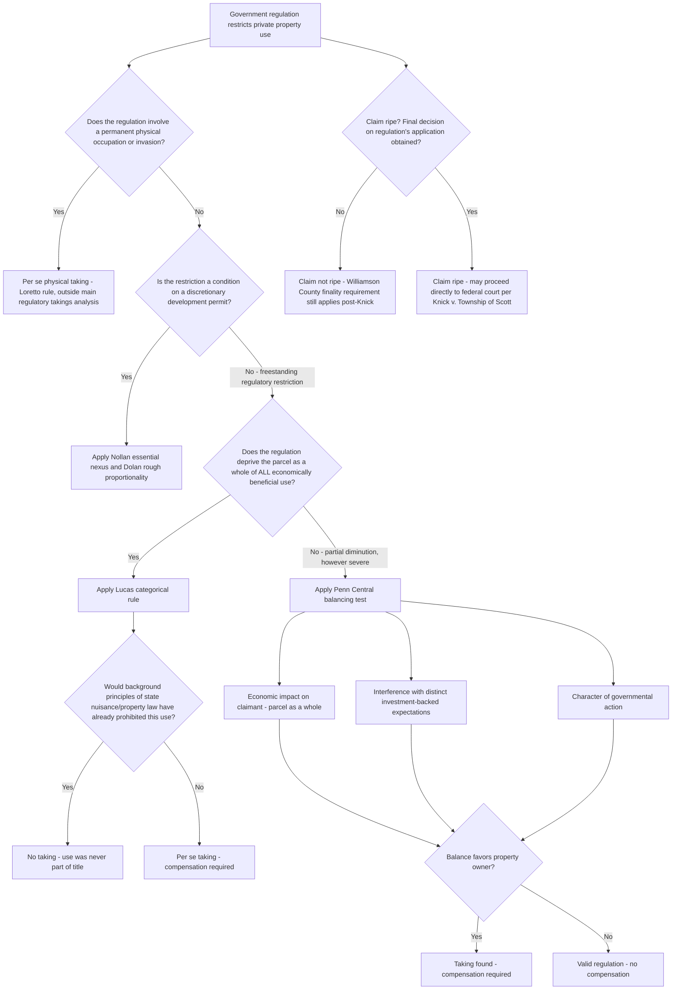

## Regulatory Takings Doctrine

### Overview

Regulatory takings doctrine addresses the point at which a government regulation restricting the use of private property becomes so burdensome that it must be treated as a "taking" under the Fifth Amendment, requiring just compensation, even though the government has not physically occupied or formally condemned the property. This doctrine sits at the intersection of the Takings Clause and the police power: government routinely regulates land use through zoning, environmental law, and other restrictions without triggering compensation, but the Supreme Court has long recognized that regulation "if it goes too far" crosses into taking territory. This topic surveys the doctrinal frameworks courts use to locate that line.

---

### Foundational Principle: Pennsylvania Coal Co. v. Mahon

- *Pennsylvania Coal Co. v. Mahon*, 260 U.S. 393 (1922), is the origin point of regulatory takings doctrine. Justice Holmes's majority opinion held that a Pennsylvania statute prohibiting coal mining that caused subsidence damage to surface structures, as applied to a coal company that had reserved mining rights (and expressly disclaimed liability for subsidence) when it sold the surface estate, went "too far" and effectively destroyed the coal company's property interest, requiring compensation.
- Holmes's famous formulation — that "while property may be regulated to a certain extent, if regulation goes too far it will be recognized as a taking" — established that regulation is not categorically exempt from takings analysis simply because it operates through the police power rather than formal condemnation, while simultaneously declining to specify precisely where that line falls, a vagueness that has generated nearly a century of subsequent doctrinal refinement.
- Justice Brandeis's dissent argued that the regulation was a valid exercise of police power addressing a public safety hazard (subsidence) and that diminution in property value alone, however substantial, should not automatically trigger compensation for a legitimate health-and-safety regulation — a tension between Holmes's and Brandeis's positions that continues to animate the doctrine's structure today.

---

### The Penn Central Balancing Test

**Penn Central Transportation Co. v. New York City (1978)**

- *Penn Central Transportation Co. v. New York City*, 438 U.S. 104 (1978), is the foundational modern case establishing the multi-factor balancing test that governs the majority of regulatory takings claims — those not falling into the categorical rules discussed below.
- The case involved New York City's landmarks preservation law, which prevented Penn Central from constructing a large office tower above Grand Central Terminal (a designated historic landmark), significantly restricting the site's development potential. The Court held the landmarks law did not effect a taking.

**The Three (Non-Exhaustive) Factors**

1. **Economic impact of the regulation on the claimant** — the degree of diminution in the property's value caused by the regulation, though the Court has emphasized this factor alone (even a very substantial diminution) is not dispositive; total economic wipeout implicates the separate *Lucas* categorical rule (below), while partial diminution, however severe, is analyzed under *Penn Central*'s balancing approach.
2. **Extent of interference with distinct investment-backed expectations** — whether the regulation interferes with expectations the owner reasonably formed based on the property's status and legal environment at the time of acquisition or investment; a regulation consistent with restrictions already in place or reasonably foreseeable at the time of purchase weighs against a takings finding, since the owner cannot claim to have reasonably expected a use the pre-existing regulatory landscape did not support.
3. **Character of the governmental action** — whether the regulation resembles a physical invasion or appropriation of property (more likely to be found a taking) versus a general regulatory scheme adjusting the benefits and burdens of economic life to promote the common good (less likely to be found a taking, reflecting greater judicial deference to broadly applicable, non-discriminatory regulatory programs).

**"Parcel as a Whole" Rule**

- *Penn Central* and later *Tahoe-Sierra Preservation Council v. Tahoe Regional Planning Agency*, 535 U.S. 302 (2002), establish that courts evaluate economic impact by reference to the parcel **as a whole**, not by isolating and focusing solely on the specific restricted stick in the bundle of property rights (e.g., in *Penn Central*, the unused air rights above the terminal) — a rule with significant practical consequences, since focusing on the whole parcel rather than an artificially segmented portion of it makes a *Lucas*-style total-wipeout finding considerably harder to establish in most partial-restriction cases.
- *Tahoe-Sierra* specifically addressed and rejected "conceptual severance" of time as well as physical segments — holding that a temporary development moratorium (there, roughly 32 months while a regional planning agency formulated a land use plan) is analyzed under *Penn Central*'s balancing test rather than treated as a *per se* taking merely because it eliminated all economic use of the property during the moratorium period, since a moratorium's temporary character means the property's value is not permanently destroyed when evaluated as part of the owner's total ownership period.

---

### The Lucas Categorical (Per Se) Rule

**Lucas v. South Carolina Coastal Council (1992)**

- *Lucas v. South Carolina Coastal Council*, 505 U.S. 1003 (1992), carved out a narrow categorical exception to the *Penn Central* balancing approach: where a regulation deprives land of **all economically beneficial use**, it constitutes a *per se* (automatic) taking requiring compensation, without any need for the fact-intensive *Penn Central* balancing.
- The case involved a South Carolina coastal setback statute that, as applied, prohibited the plaintiff from constructing any permanent habitable structure on two beachfront lots he had purchased, effectively (according to the trial court's finding) rendering the lots valueless for any economically beneficial use.

**The Background Principles Exception**

- *Lucas* itself carved out an important limitation on its own categorical rule: no compensation is required, even for a total economic wipeout, if the prohibited use was **never actually part of the owner's title to begin with** — that is, if state background principles of property law (nuisance law, or other longstanding common-law or statutory limitations on land use inherent in the state's property law system) already would have prohibited the use, then the regulation does not "take" anything the owner ever actually possessed.
- This background principles inquiry requires courts to examine what the state's *property and nuisance law*, not the challenged regulation itself, would have allowed absent the new statute — a regulation that merely codifies pre-existing common-law nuisance principles restricting a harmful use does not trigger *Lucas* liability, even if it eliminates all economic value, because the owner's title never included the right to engage in the prohibited use in the first place.
- [Inference] Because the background principles inquiry requires a state-specific analysis of that state's nuisance and property law as it existed independent of the challenged regulation, and because courts have applied this inquiry with varying rigor since 1992, the practical availability of the background principles defense in any given *Lucas* case depends heavily on the specific state's common law and cannot be assumed to track a uniform national standard.

**Narrow Practical Scope**

- Because of the "parcel as a whole" rule (discussed above) and the difficulty of proving a truly *total* elimination of economic value (as opposed to merely severe diminution), *Lucas* claims succeed relatively rarely in practice — most regulatory takings claims, even those involving substantial value loss, are litigated under the *Penn Central* balancing test rather than the *Lucas* categorical rule.

---

### Exactions: A Related but Distinct Framework

**Nollan and Dolan**

- *Nollan v. California Coastal Commission*, 483 U.S. 825 (1987), and *Dolan v. City of Tigard*, 512 U.S. 374 (1994), address a related but analytically distinct category: conditions government attaches to a discretionary development permit (exactions), rather than freestanding regulatory restrictions.
- *Nollan* requires an **essential nexus** between the permit condition and a legitimate government interest connected to the proposed development's impact; *Dolan* additionally requires **rough proportionality** between the nature and extent of the required dedication/condition and the impact of the proposed development.
- *Koontz v. St. Johns River Water Management District*, 570 U.S. 595 (2013), extended this framework to monetary exactions and to permit denials predicated on an applicant's refusal to accept a proposed condition, closing a potential loophole in the *Nollan*/*Dolan* framework's applicability.

---

### Ripeness and Procedural Hurdles

**Historical Finality/Exhaustion Requirements**

- Regulatory takings claims have historically been subject to significant procedural hurdles before reaching federal court, rooted in *Williamson County Regional Planning Commission v. Hamilton Bank*, 473 U.S. 172 (1985), which required a claimant to (1) obtain a final decision from the relevant land use authority regarding the application of the regulation to the property, and (2) seek and be denied compensation through available state procedures, before a federal takings claim would be considered ripe.

**Knick v. Township of Scott: Eliminating the State-Litigation Requirement**

- *Knick v. Township of Scott*, 588 U.S. 180 (2019), overruled *Williamson County*'s state-litigation exhaustion requirement, holding that a property owner may bring a federal takings claim under 42 U.S.C. § 1983 directly in federal court without first having to litigate and be denied compensation in state court — the Court held that a taking occurs (and the constitutional violation is complete) at the moment government takes property without just compensation, not only after the owner has unsuccessfully sought compensation through available state procedures.
- The **finality** requirement (obtaining a definitive decision on how the regulation applies to the specific property, including exhausting reasonable variance/administrative relief opportunities) remains in place after *Knick* — only the separate state-litigation exhaustion requirement was eliminated, meaning claimants must still generally obtain a final, definitive application decision before a regulatory takings claim is ripe for adjudication in any forum.

---

### Comparative Framework Summary

| Framework | Trigger | Test | Compensation if Established |
| --- | --- | --- | --- |
| *Penn Central* balancing | Partial regulatory restriction, most common scenario | Multi-factor: economic impact, investment-backed expectations, character of government action | Yes, if balance favors owner |
| *Lucas* categorical rule | Total elimination of economically beneficial use | Per se taking, unless background principles exception applies | Yes, automatically (absent background principles defense) |
| *Nollan*/*Dolan*/*Koontz* exactions | Condition attached to discretionary permit approval or denial | Essential nexus + rough proportionality | Condition invalid if test fails; compensation/permit relief follows |
| Physical takings (outside this topic's regulatory focus) | Direct physical occupation or invasion | Per se taking (*Loretto v. Teleprompter*) | Yes, automatically |

---

### Analytical Framework (svg_diagram)

---

### Practical Example

A coastal county adopts a new ordinance imposing a 200-foot no-build setback from the mean high tide line, citing erosion and storm-surge risk. A landowner's undeveloped beachfront lot is entirely within the new setback zone, rendering it impossible to build any structure on the parcel at all. A second landowner, whose adjacent, larger parcel is only partially within the setback zone, can still build a somewhat smaller home than originally planned on the buildable remainder.

- **First landowner (total restriction)**: Because the ordinance eliminates all economically beneficial use of this specific parcel, this presents a *Lucas* categorical taking claim. The county's strongest defense is the background principles exception — arguing that state common-law nuisance or public trust doctrine principles regarding coastal erosion hazards would have prohibited this construction regardless of the new ordinance; if that defense fails, compensation is required essentially as a matter of course, without further balancing.
- **Second landowner (partial restriction)**: Because a smaller home remains buildable on the remainder, and the parcel retains economic value even if diminished, this claim is analyzed under *Penn Central*'s balancing test evaluating the parcel as a whole — considering the degree of value diminution, whether the owner's investment-backed expectations reasonably anticipated coastal regulation given the well-known trend of increasing coastal setback requirements, and whether the ordinance resembles a physical appropriation or a general regulatory program addressing legitimate public safety concerns (likely weighing toward the latter, more deferential characterization).
- **Ripeness for both**: Both landowners would generally need to obtain a final decision on how the ordinance applies to their specific parcels (including seeking any available variance) before either claim is ripe — but following *Knick*, neither landowner would be required to first litigate a state-law compensation claim and be denied before proceeding directly to federal court.

---

### Key Points

- Regulatory takings doctrine traces to *Pennsylvania Coal v. Mahon*'s recognition that regulation "if it goes too far" becomes a taking, but the Supreme Court has never established a single unified test — instead applying the fact-intensive *Penn Central* balancing test to most partial restrictions and the categorical *Lucas* per se rule to total economic wipeouts.
- The "parcel as a whole" rule (*Penn Central*, reaffirmed in *Tahoe-Sierra*) prevents claimants from conceptually severing either a specific stick in the property-rights bundle or a specific time period to manufacture an artificial total wipeout, making *Lucas* claims comparatively rare relative to *Penn Central* balancing claims in practice.
- *Lucas*'s background principles exception means even a total economic wipeout is not compensable if the prohibited use was never actually within the owner's title under pre-existing state nuisance and property law — a state-specific inquiry independent of the challenged regulation itself.
- *Knick v. Township of Scott* (2019) eliminated the requirement that a claimant first litigate and be denied compensation in state court before bringing a federal takings claim, though the separate finality requirement (obtaining a definitive decision on the regulation's application to the specific property) remains in place.
- [Inference] Because *Penn Central*'s multi-factor balancing test is inherently fact-intensive and does not specify precise weights for its three factors, and because the background principles exception under *Lucas* requires state-specific common-law analysis, predicting the outcome of a specific regulatory takings claim requires close attention to the applicable jurisdiction's case law and the particular factual record, rather than mechanical application of the doctrinal framework alone.

---

### Related Topics

- *Pennsylvania Coal Co. v. Mahon* and the Origins of Regulatory Takings Doctrine
- *Penn Central* Balancing Test: Economic Impact, Investment-Backed Expectations, Character of Government Action
- *Lucas v. South Carolina Coastal Council* and the Background Principles Exception
- *Tahoe-Sierra Preservation Council* and Temporary Moratoria
- Exactions: *Nollan*, *Dolan*, and *Koontz* Framework
- *Knick v. Township of Scott* and the Elimination of State-Litigation Ripeness Requirements
- Constitutional Basis for Eminent Domain and the Public Use Requirement
- Just Compensation Principles: Fair Market Value and Severance Damages